--- 
title: "Quantitative Methods 1, ZHAW"
author: "Jürgen Degenfellner"
date: "2024-11-26"
output:
  pdf_document: default
  word_document: default
documentclass: book
bibliography:
- book.bib
- packages.bib
url: https://jdegenfellner.github.io/Script_QM1_ZHAW/
description: |
  Script Quantitative Methods 1, ZHAW,
link-citations: true
github-repo: jdegenfellner/Script_QM1_ZHAW
site: bookdown::bookdown_site
---

<!-- Cover image is difficult. template.tex in progress, hard to get it right -->

# Introduction

This script is a collection of notes and exercises for the course "Quantitative Methods 1" (Codename for: Statistical foundations) at [ZHAW](https://www.zhaw.ch/en/university/) in Winterthur, Switzerland. 
It is permanently evolving and the [github repository](https://github.com/jdegenfellner/Script_QM1_ZHAW) is public. 

The **vision** is to write this script in **collaboration with students**. If you find any errors, have suggestions, or want to contribute, feel free to contact me. 
Which (online) content (video, book, blog...) helped you understand the topic at hand better? We should link those resources in the script!

The **goal** of this script is to provide a starting point for further reading and learning. It should function as an initial start to get you going. We are all learners.

Feel free to use any content for your own purposes.

At the end of each chapter, you will find a list of exercises. Last year's exam will be uploaded in time in the respective Moodle folder to help you prepare. 

The most important lessons you'll learn are not part of the final exam: Intellectual honesty and humility.

A lot of content relevant for this course can be found in the [ZHAW_teaching](https://github.com/jdegenfellner/ZHAW_Teaching) folder, 
which contains many R scripts (among other stuff).

We will focus a lot on descriptive statistics and basic concepts as it is a very important part of understanding data. 
Statistical modeling will be covered later.

One thing to consider for health sciences with respect to quantitative methods is the following: We do not *have* to use quantitative methods for each and every 
question arising in applied research (physiotherapy, midwifery, nursing, occupational therapy). Small sample sizes (e.g., n=10) often do not warrant the use of inferential 
statistics or estimation or at least make it considerably harder to answer the question at hand. 
*If* one decides to answer questions in a statistical way, we are bound to the rules of the game. 

GPT4o and Github Copilot where used for writing this script.

## Books I can (highly) recommend:

- (Free, looks nice at first glance) [Introduction to Probability](https://ia803404.us.archive.org/6/items/introduction-to-probability-joseph-k.-blitzstein-jessica-hwang/Introduction%20to%20Probability-Joseph%20K.%20Blitzstein%2C%20Jessica%20Hwang.pdf)
- [Statistical Rethinking](https://xcelab.net/rm/), YouTube-Playlist: [Statistical Rethinking 2023](https://youtu.be/FdnMWdICdRs?si=q2py5QVY_L299hEa)
- (Free) [Understanding Regression Analysis: A Conditional Distribution Approach](https://vdoc.pub/documents/understanding-regression-analysis-a-conditional-distribution-approach-84oqjr8sqva0)
- [Data Analysis Using Regression and Multilevel/Hierarchical Models](http://www.stat.columbia.edu/~gelman/arm/)
- (Free) [Doing Bayesian Data Analysis](https://nyu-cdsc.github.io/learningr/assets/kruschke_bayesian_in_R.pdf)
- [Applied Regression Analysis and Generalized Linear Models](https://us.sagepub.com/en-us/nam/applied-regression-analysis-and-generalized-linear-models/book237254)

These books are well-written, approachable, and not overly technical.

For more theoretically advanced approaches, I can recommend:

- (Free) [Bayesian Data Analysis](http://www.stat.columbia.edu/~gelman/book/)
- (Free) [Elements of Statistical Learning](https://web.stanford.edu/~hastie/ElemStatLearn/)
- (Free) [Unterstanding Advanced Statistical Methods](https://students.aiu.edu/submissions/profiles/resources/onlineBook/y6z7i8_t4q6Z9_advanced%20statistics.pdf)

## 

In this course, we use [R](https://www.r-project.org/) as our main tool for data analysis. R is a free software environment for statistical computing and graphics. 
It compiles and runs on a wide variety of UNIX platforms, Windows, and MacOS. 

You may want to give Hadley Wickham's book a try:

- (Free) [R for Data Science](https://r4ds.had.co.nz/)

Especially, the chapter on [exploratory data analysis](https://r4ds.hadley.nz/eda#introduction) is very helpful.

This free book seems also very helpful for beginners:

 - (Free) [R for non-programmers R4NP](https://bookdown.org/daniel_dauber_io/r4np_book/)

Further resources:

[(Example) Introduction to R](https://www.youtube.com/watch?v=V8eKsto3Ug&t=140s)

In this video, many basic commands are explained. There are many more R introductions. 
My tip: Watch the beginning of a few different ones and see which explanations work best for you individually.

[Overview of introductory resources](https://cran.r-project.org/other-docs.html)


## Additional Tools

Currently I use a combination of [Github Copilot](https://github.com/features/copilot) (paid), [GPT4o](https://chatgpt.com/) (paid), and [RStudio](https://posit.co/download/rstudio-desktop/) for writing code and this script. You can use Github Copilot directly in RStudio to make code suggestions, which is often increasing productivity. I can highly recommend using these tools in combination. GPT4o can process images as well, which is a game changer.
As far as I know, there is no self-debugging version of GPT4o in combination with RStudio available yet (in the style of AutoGPT or similar approaches). Maybe, we'll work on that soon as a side project. For the more technically inclined among you, 
you can also use VSCode with the Github Copilot extension to write your R-Code.

Large Language Models (LLM) like GPT4o enable you to write/adapt code using natural language. Among other tasks, they help you create complicated, aesthetic plots. Very often, debugging attempts get stuck. They are far from perfect yet, but an impressive feat of engineering.

## Workflow suggestion

You could use RStudio to write and execute your code. In the global options of RStudio (below), you can add your github copilot account. Additionally, you can have your GPT4o(1) window open and copy-paste images of your plots or code in order to achieve your current objective.


<!--chapter:end:index.Rmd-->

# Probability {#probs}

Probability is a measure of the likelihood that an event will occur. Probability is quantified as a number between 0 and 1 (or 0 to 100%), 
where 0 indicates impossibility and 1 indicates certainty, although we will see later that a [probability of 0](https://stats.stackexchange.com/questions/273382/how-can-the-probability-of-each-point-be-zero-in-continuous-random-variable) does not necessarily mean that such an event can never occur. 
The higher the probability of an event, the more likely it is that the event will occur. 

**Why is probability important in our field of study (applied health sciences)?**

Quantative research methods (often a code name for statistics) use probability theory to make statements about a larger 
population or a data generating process (DGP), as it should be more appropriately called.

In observational studies, we often make statements about associations between variables.

In experimental studies (e.g., a randomized controlled trial), we often try to make statements about the effect of an intervention on a 
certain outcome - for instance if a therapy lowers [pain](https://jamanetwork.com/journals/jama/fullarticle/2794765) by at least 1 point better compared to usual therapies.

Probability theory has its roots in gambling and betting. [Blaise Pascal](https://en.wikipedia.org/wiki/Blaise_Pascal) wrote a letter to [Pierre de Fermat](https://en.wikipedia.org/wiki/Pierre_de_Fermat) in 1654 when a 
French essayist Antoine Gombaud, intrigued by gambling, sought to solve "the problem of points," 
first posed by Luca Paccioli in 1494. The problem asked how to fairly divide the winnings if a game is interrupted before 
its conclusion. Gombaud approached mathematician Blaise Pascal, who collaborated with Pierre de Fermat. Together, they laid 
the groundwork for modern probability theory. Fermat’s method involved listing all possible outcomes and calculating each player’s 
chance of winning, while Pascal developed a backward induction algorithm to assign probabilities. Their work revolutionized mathematics
and influenced fields like economics and actuarial science.

Philosophically speaking, we could distinguish between two flavors of probability: Probabilities for events that are repeatable respectively have already happened, and probabilities for events that haven't happened yet.

An example for a repeatable event is getting a 6 when throwing a fair die. We can do this experiment right now by fetching a die and throwing it.

An example for the latter is the probability of a patient dying within the next 5 years after a certain diagnosis. 
It is hard to argue that this experiment would be repeatable under (almost) identical conditions since every patient is different whereas the dice are typically much more similar.
Here, we could at least put forward that other similar patients have a certain proportion of dying within 5 years.

There are of course events that have not happend ever before, like the creation of artificial general intelligence ([AGI](https://en.wikipedia.org/wiki/Artificial_general_intelligence)). 
Nevertheless, one can still try to assign probabilities [when](https://research.aimultiple.com/artificial-general-intelligence-singularity-timing/) such an event would happen.

## Frequentist vs. Bayesian statistics

There are two main schools of thought in statistics: Frequentist and Bayesian. Often one hears that there is a "war" [between the two](https://www.youtube.com/watch?v=8wVq5aGzSqY&t=22s&ab_channel=VeryNormal).

It is *not* our place to say which one is better. Both have their strengths and weaknesses and are used in different contexts.

I would consider the rapant misuse of [p-values](https://www.sciencedirect.com/science/article/abs/pii/S0037196308000620?via%3Dihub) and the 
cookbook-like application of frequentist statistics as a weakness of this approach (in its widely used form at least). 
Of course, this is not the method's fault but the fault of the user.

Bayesian statistics is often considered more intuitive and flexible. It is also more computationally demanding and requires prior knowledge which is argued to be subjective.
Computation time is sometimes still an issue in comparison for instance in regression modelling when using an end user laptop.
It is also argued that for large sample size frequentist and Bayesian statistics converge to the same result.

There are very smart proponents on both sides and we will try to use and contrast both techniques throughout this script whenever convenient.

Especially one of the early eminent statisticians, [Ronald Fisher](https://en.wikipedia.org/wiki/Ronald_Fisher), was an oponent of Bayesian statistics, 
or as he called it: ["inverse probability"](https://errorstatistics.com/wp-content/uploads/2016/02/fisher-1930-inverse-probability.pdf).

The only thing we are interested in is the practical application of both methods in the field of applied health sciences. 
How well can we describe data and make predictions, how well can we learn from data in our field?

### Frequentist statistics

Frequentist statistics is based on the idea that [probability](https://en.wikipedia.org/wiki/Frequentist_probability) is the long-run 
frequency of events. For instance, if I throw a fair die 1000 times, the frequency of getting a 3 is (approximately) $\frac{1}{6}$. In the limit, 
if I throw the die infinitely many times, the frequency of getting a 3 will converge to $\frac{1}{6}$. In mathematical notation, we would write 

\[
\mathbb{P}(\text{getting a 3}) = \lim_{n \to \infty} \frac{\text{Number of 3s in } n \text{ throws}}{n} = \frac{1}{6},
\]

where \(\mathbb{P}\) is the probability measure which we will define more formally later (see [Exercise 1](#exercise1)).

More genereally, in frequentist statistics, we are looking for a fixed but unknown parameter from an underlying data generating process (DGP). 
In the dice example, the process of repeatedly throwing the die is the data generating process.
Basically, we could estimate the parameter of interest arbitrarily well by reapeated drawing from the DGP if we had enough data. 

**Example**: Throw your (fair or unfair) die often enough and you will get a good estimate of the probability of getting a 3.

**Example**: We could try to estimate the mean birth weight of all babies from smoking parents born in Switzerland in 2022. 
We would draw a (random) sample of birthweights and calculate the mean. With a sample large enough, we could estimate this parameter fairly well.
With all birthweights, we would know the true mean of the population of interest (for that year alone).

### Bayesian statistics

Bayesian statistics, on the other hand, is based on the idea that [probability](https://en.wikipedia.org/wiki/Bayesian_probability) is a measure of our uncertainty about an event or a parameter.
Here, we use *prior* (i.e., before/outside of our experiment) knowledge about a parameter and update this knowledge with new data using the famous Bayes' theorem:

$$
p(\theta | \text{data}) = \frac{p(\text{data} | \theta) \cdot p(\theta)}{p(\text{data})},
$$

where:

- \( p(\theta | \text{data}) \) is the **posterior probability**: the updated probability of the parameter \( \theta \) given the observed data.

- \( p(\text{data} | \theta) \) is the **likelihood**: the probability of observing the data given a certain value of the parameter \( \theta \).

- \( p(\theta) \) is the **prior probability**: the initial belief about the parameter \( \theta \) before seeing the data.

- \( p(\text{data}) \) is the **marginal likelihood** or **evidence**: the probability of observing the data under all possible parameter values.

#### Example in applied health sciences (physiotherapy) {#example1_physio}

Suppose you're a physiotherapist trying to estimate the probability that a new therapy improves the mobility of patients with chronic back pain (Improvement Yes/No). 
You already have some prior knowledge (based on previous studies or expert opinions) that suggests the therapy works for 30% of patients. 
This is your **prior knowledge**: \( \theta = 0.30 \), where \( \theta \) is the probability that the therapy is effective.
Your colleagues are not convinced and argue that the probability is 40%.
Now, you run a small trial with 50 patients and observe that 22 of them showed a clinically relevant improvement in mobility (self-reported from the patient). 
This new data (the result of the trial) *updates* your belief about the effectiveness of the therapy.
Using Bayes' theorem ([Exercise 2](#exercise2)), you combine the prior knowledge \( \theta = 0.30 \) with the likelihood of the new data \( p(\text{data} | \theta) \), and you calculate 
the **posterior probability**, \( p(\theta | \text{data}) \), which reflects your updated belief about the effectiveness of the therapy after observing the trial data.
We could assign the probability of $\theta = 0.3$ or $\theta = 0.4$ equally: $p(\theta = 0.3) = p(\theta = 0.4) = 0.5.$ 

Bayesian analysis allows you to update your estimates as new evidence becomes available, providing a flexible framework for decision-making in health sciences.

## Foundations of probability theory
We need to know some basic concepts of probability theory in order to dive in deeper. We will try to introduce them playfully and find formality as we go along.
As stated above, in the frequentist sense, we are interested in the long-run frequency of events. How often does an event occur if we repeat the random experiment many times?

**[Eureka](https://en.wikipedia.org/wiki/Eureka_(word))?**

Let's imagine we are in a research department with 1000 researches all trying to answer the same question: 
Does the new physiotherapy work (e.g., reduce pain by 1 point better than the usual treatment)? Let's assume (unrealistically) that they are all working on this one question and they are not
talking about their experiments or their research methodology to each other (assumption of independence). The statistician in the department has calculated 
(due to the variability of such treatment effects in the relevant population and theoretical considerations)
that even under the assumption of the therapy is not working *at all* - **which we will assume for the time being** - , one would see an effect just *by chance* in 4% of the study results.

What would be considered a discovery under these cicumstances?

We now conduct an experiment. All 1000 ressearches are conducting a study with 50 patients to answer the same question. This is our random experiment (instead of throwing dice). 
Instead of throwing a fair die, we do a round of "research" with 1000 researchers. You as observer
give the assignment to the researchers and come back as soon as all 1000 researeches have finished their experiments. Again, the are not taking to each other and we can 
(unrealistically) assume that their results will be not influenced by each other.


Now we could ask different questions:

### Questions about the 1000 researcher-experiment (among many others): {#Questions_about_the_1000-researcher_experiment}

1. If you had to bet, how many experiments showed a treatment effect if you assume that the therapy is not working at all?
2. If you get 137 results showing a treatment effect, would you be surprised? Would you reject the assumption, that the therapy is not working at all? Why?
3. How many experiments (would you expect) showed a treatment effect if you assume that the therapy is "working" (positive result by chance) in 12% (instead of 4%) of the patients?
4. Assuming that you have 47 results showing a treatment effect and your marketing lead is asking you to write a press release stating that 47 
out of 50 studies showed a treatment effect. What is the problem?
5. Assuming one very motivated researcher has tested 65 (secondary) hypotheses in her experiments and found 4 results that are difficult to explain by chance alone. What is the problem?
6. Suppose there are many large research departments in the world with 1000 researchers. How strongly would the number of positive results vary between these large departments?

We will try to answer these questions [below](#Answers_Questions_about_the_1000-researcher_experiment).

First, it seems intuitive that Probability *within* an experiment should add up *if* the events are **disjoint**. 
The event $A_1=$ "only researcher 45 gets a positive result" and $A_2=$ "only researcher 897 gets a positive result" are mutually exclusive. 
If only researcher 45 finds an effect, then researcher 897 does not find an effect and vice versa. They cannot happen at the same time within that one 
experiment. Hence, the two events are said to be disjoint.
If we add up the probabilities of all mutually exclusive events, we should get 1, or 100%. 
We say that the probability of all elementary events (called $\omega$) sums to 1. Let's look at a [Venn diagram](https://en.wikipedia.org/wiki/Venn_diagram) to illustrate the concept of being mutually exclusive (disjoint).

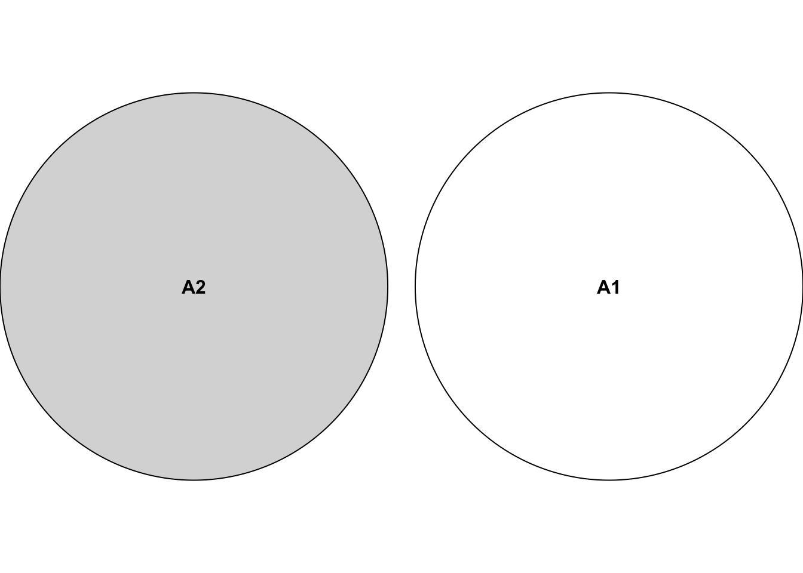

Again, this refers to being mutually exclusive within our 1000-researcher experiment. 
Both events cannot happen at the same time in this context, so we assign $0$ to the event that both occur simultaneously: $\mathbb{P}(A_1 \cap A_2)=0$. The $\cap$-Symbol refers to all elementary events 
that are in both [sets](https://en.wikipedia.org/wiki/Set_(mathematics)). In our case we have the sets 


$$A_1 = \{ (\dots ,R_{45} = pos, \dots ,R_{897} = neg, \dots) \}$$ 

$$and$$ 

$$A_2 = \{ (\dots ,R_{45} = neg, \dots , R_{897} = pos, \dots) \}.$$


An example of **non-disjoint** events (within our 1000-researcher experiment) would be the event $A_1=$ "only researcher 45 gets a positive result" and
the event $A_3=$ "only researcher 45 or only reasearcher 67 gets a positive result".
Which researchers got a positive result in both events? The answer is: Researcher 45. Hence, the two events are said to be non-mutually exclusive. We can't just
add up the probabilities (of events $A_1$ and $A_3$) here, since we would count the probability of researcher 45 twice.
The sets look like this: 

$$A_1 = \{ (\dots ,R_{45} = pos, \dots) \}$$ 

$$and$$ 

$$A_3 = \{ (\dots ,R_{45} = pos, \dots), (\dots ,R_{67} = pos, \dots) \}.$$

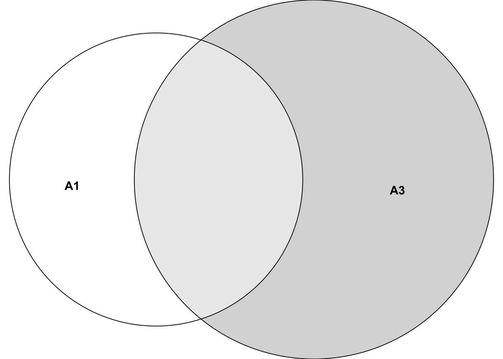

How many elementary events are in the set of all possible outcomes of our 1000-researcher experiment? For every researcher, there are two possible outcomes: positive or negative result. 
Hence, we have $2 \cdot 2 \cdot 2 \cdots = 2^{1000}$ elementary events in our set of all possible outcomes. 
This is a very large number ($\sim 10^{300}$) - more than there are particles in the universe ($\sim 10^{80}$).

We call the set of all elementary events $\Omega$ (the Greek letter Omega): 
$$\Omega = \{ \omega_1, \omega_2, \cdots, \omega_{2^{1000}} \}.$$

Note, that **we collect elementary events to form events** like we just did for event $A_3$.

Note, that the **$2^{1000}$ elementary events in the 1000 researcher experiment are also disjoint**. Why? For every elementary event, 
certain researchers found something and others did not. The combinations are all different from each other. Hence, 
all the elementary events cannot happen at the same time within that one experiment. All of them are disjoint. 

The probability of the event "" (nothing occurred) should be zero ($\mathbb{P}(\emptyset)=0$), were "" denotes 
the event that no researcher gets a positive or negative result ( = $\emptyset$, the so-called empty set). 
This is impossible due to the design of the experiment.
We would therefore define this probability as zero and (if we can count the number of different outcomes) 
this event can indeed *never* happen.

Obviously, the probability of an event should at a mininum be zero and at a maximum be one: 

$$0 \le \mathbb{P}(A) \le 1.$$ 

### Axioms of probability theory {#axioms_of_probability_theory}

We can summarize these informally stated properties more formally ([Kolmogorov's axioms](https://altexploit.wordpress.com/wp-content/uploads/2017/07/a-n-kolmogorov-foundations-of-the-theory-of-probability-chelsea-pub-co-1960.pdf)):

\begin{align}
1. &\ \mathbb{P}(\emptyset) = 0 \text{: Probability of the "impossible" event should be zero.}\\
2. &\ \mathbb{P}(\Omega) = 1 \text{: Probability, that any outcome occurs in our random experiment.}\\
3. &\ \text{If } A_1, A_2,... \text{ pairwise disjoint: } \mathbb{P}\left(\bigcup_{i=1}^{\infty} A_i\right) = \sum_{i=1}^{\infty} \mathbb{P}(A_i)
\end{align}

The $\infty$-symbol in **axiom 3** comes into play if we are dealing with (potentially) infinitely many events. 
For instance, we could ask for the number of researchers we need to look at until we see the first 
positive result ([geometric distribution](https://en.wikipedia.org/wiki/Geometric_distribution)). 
We could find the first positive result in the first researcher, or the second, etc. There is no upper limit. 

As concrete example for law 3 in our example, we can put the following:
\begin{align}
\scriptsize \mathbb{P}(\text{"(only) researchers 34, 56 and 777 get a pos. result" or "(only) researchers 1 and 5 get a pos. results"}) =\\
\scriptsize \mathbb{P}(\text{"(only) researchers 34, 56 and 777 get a pos. result"}) + \mathbb{P}(\text{"(only) researchers 1 and 5 get a pos. results"})
\end{align}

Since the researchers are working independently from each other, we can simply multiply the probabilities of their individual positive or negative results in 
our larger 1000-researcher experiment. For example, for the first probability there are exactly 3 positive results (=effect found) and 997 negative results (=no effect found).
This can be calculated as:
$0.04 \cdot 0.04 \cdot 0.04 \cdot \underbrace{0.96 \cdots 0.96}_{\text{997 times}} = 0.04^3 \cdot 0.96^{997}$, which yields a very small number ($1.350826 \cdot 10^{-22}$) 
since we are fixating on specific researchers to find the effect. 
If we relax the question to the *number of researchers* that find an effect,
we get much larger numbers. We say, the number $X$ of positive results under $H_0$ (there is no true effect)) for a positive effect is **binomially distributed**: $X \sim Bin(n=1000, p=0.04)$. 
The YouTube-channel [3Blue1Brown](https://www.youtube.com/@3blue1brown) is highly recommended in general. You should watch this 
[video](https://www.youtube.com/watch?v=8idr1WZ1A7Q&ab_channel=3Blue1Brown) on the binomial distribution to get a clearer picture. 
This [video](https://www.youtube.com/watch?v=WWv0RUxDfbs&ab_channel=KhanAcademy) from [KhanAcademy](https://www.youtube.com/@khanacademy) could also be helpful.
In our example, the probability that exactly 3 researchers find an effect is $\binom{1000}{3} \cdot 0.04^3 \cdot 0.96^{997} = 2.244627 \cdot 10^{-14}$. 
Still small, but much higher than before. Of course, the commands in R can be found easily via Google or your favourite large language model (LLM): 
"Give me the commands for the binomial distribution in R and a nice example too".
Note that the sum of all elementary events (all possible outcomes) indeed adds up to 1 in our 1000-researcher-experiment: $\sum_{i=0}^{1000} \binom{1000}{i}0.04^i 0.96^{1000-i} = 1$


``` r
sum(dbinom(0:1000, prob = 0.04, size = 1000))
```

```
## [1] 1
```

``` r
sum(dbinom(0:80, prob = 0.04, size = 1000))
```

```
## [1] 1
```

``` r
# = 1 since the other probabilities are very small
```

As we will see later, **axiom 1** above does not mean, that the event can never occur. 
For every continuous random variable (e.g. with a [normal](https://en.wikipedia.org/wiki/Normal_distribution) 
or a [uniform distribution](https://en.wikipedia.org/wiki/Continuous_uniform_distribution)), the probability of a single point is zero.
This [video](https://www.youtube.com/watch?v=ZA4JkHKZM50&list=PLIhj5_pQwhMQfGZNQZREjDdJRt0t0sn51&index=10&ab_channel=3Blue1Brown) could help.

**Axiom 2** is always true. Some result *has* to occur in our random experiment. 
What is $\Omega$ again? In our countable case of researchers, $\Omega = \{ \omega_1, \omega_2, \cdots, \omega_{2^{1000}} \}$ would be the set of all possible outcomes if we let 1000 researchers conduct the experiment. 
Each researcher can either find an effect or not. Hence, we have $2^{1000}$ possible outcomes of our 1000-researcher experiment. This is a *very* large number. Adding up all
these probabilities would sum to 1 according to axiom 3. Combining different elementary events $\omega$ from the whole collection of possible outcomes $\Omega$
gives us "events" like the ones we used above ($A_1, A_2, A_3$).

Note that there is a **difference between the elementary experiment of the individual researcher (finding an effect or not) and the whole experiment** of 
1000 researchers we are looking at (simultaneously).
Do not make the mistake to add the single probabilities of finding an effect (under $H_0$) of 0.04 to get the probability of finding an effect in the whole experiment: 
This would result in: $1000 \cdot 0.04 = 40 > 1$, which is hardly a probability anymore. 

This leads us to the concept of independence of events.

### Independence of events
Two events $A$ and $B$ are independent if the occurrence of one event does not affect the occurrence of the other event. In plain English, 
the probability of event $A$ happening is the same whether event $B$ happens or not. Mathematically, we can write this as:

$$\mathbb{P}(A \cap B) = \mathbb{P}(A) \cdot \mathbb{P}(B)$$ or equivalently: 
$$\mathbb{P}(A | B) = \mathbb{P}(A).$$

A simple **example in our context**: 
The probability of researcher 45 finding an effect (event A) is the same whether researcher 67 finds 
an effect (event B) or not since they are not communicating with each other.
This is the reason why we just multiplied the probabilities of the individual researchers finding 
an effect/not finding an effect to get the probability of the whole elementary event of the 
1000-researcher experiment.

Above, we used the very important concept of **conditional probability**. 
The probability of event $A$ *given* that event $B$ has occurred (not necessarily chronologically different!) is denoted as 

$$\mathbb{P}(A | B) = \frac{\mathbb{P}(A \cap B)}{\mathbb{P}(B)}.$$ 

This [video](https://www.youtube.com/watch?v=ibINrxJLvlM&ab_channel=Dr.TreforBazett) explains it well.

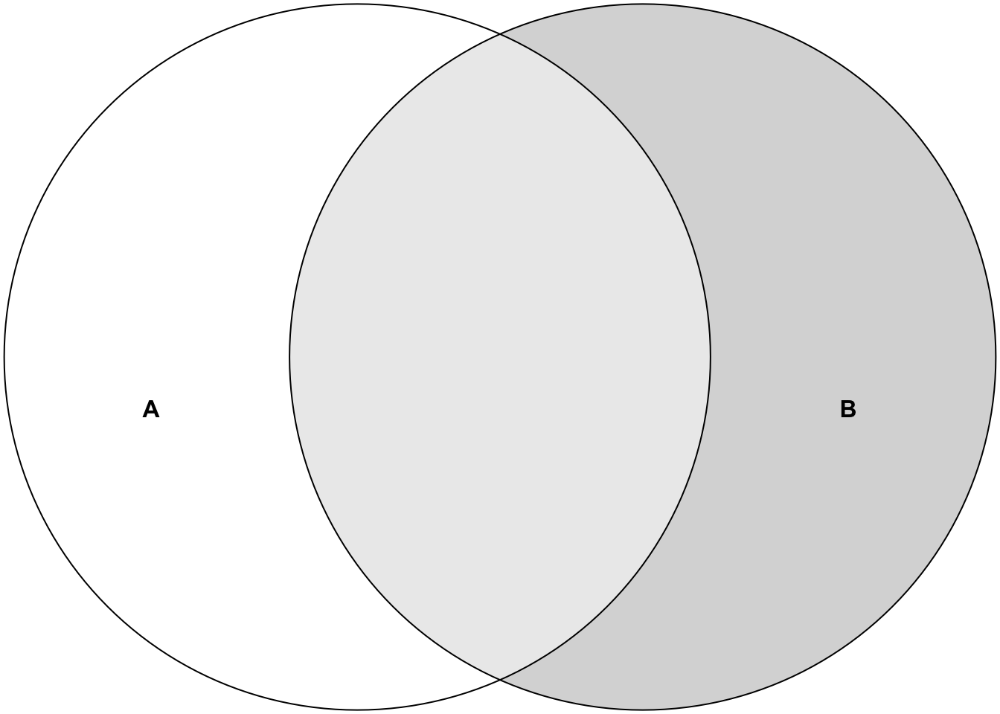

For the probability of event A, we are now *only* interested in the light-grey area with respect to the whole area of event B 
since event B is our reference frame now (as opposed to the whole space $\Omega$ before).
Note that even if the probability of event A changes when B has happend, B could still have no *causal* effect on A. They could have a common cause, for instance.

**Example in our context**: 
Let's assume researchers 45 and 67 would not be independent. We would for instance find that the probability of 45 is higher than 4% if we knew that 67 found the effect. 
This does not necessarily mean that researcher 67 causes researcher 45 to find an effect. It could
might as well be that their statistical training was very similar and they both made the same mistake in their analysis.


### Difference between independence and disjointness

There are four possible scenarios when considering two events:

**Example 1: disjoint but not independent**

- Event A: Patient receives treatment A.
- Event B: Patient receives treatment B (or is in the control group).

These two events, A and B, are disjoint because a patient cannot receive both treatments at the same time. 
If a patient receives treatment A, he/she cannot receive treatment B (and vice versa), meaning the events cannot occur together in this setting. Thus,  $P(A \cap B) = 0$.
However, these events are not independent, because the probability of receiving one treatment depends on not receiving the other. 
In this setup, if the patient received treatment A, the probability of receiving treatment B is zero: $\mathbb{P}(B|A) = 0$. 
The probability of the patient receiving therapy B could be 50% (if randomized): $\mathbb{P}(B) = 0.5$. Hence, they are dependent.

**Example 2: independent but not disjoint**

- Event A: The patient shows a treatment effect during a study.
- Event B: The patient wins the lottery during the study.

These two events are independent because the probability of a patient showing a treatment effect is not influenced by whether they win the lottery or not 
(at least if we assume that lottery participants do not have different properties compared to non-lottery particiants that are conducive to showing a treatment effect). 
Also, the probability of winning the lottery is not influenced by whether the patient shows a treatment effect or not. We would probably see a surge
in volunteers in our studies.
The events are unrelated: one depends on the treatment, while the other is purely a matter of luck.
However, these events are not disjoint because both can happen at the same time. 
A patient could experience the treatment effect and also win the lottery during the study. Thus,  $P(A \cap B) \neq 0$ , meaning both events can occur together.

**Example 3: neither independent nor disjoint**

- Event A: The patient shows a treatment effect during a study.
- Event B: The patient is a heavily motivated and self-sufficient. 

These two events are neither independent nor disjoint. The patient's motivation could influence the treatment effect (if for instance home exercises 
are part of the therapy), making the events dependent.
However, the patient's motivation is not mutually exclusive with the treatment effect: The patient can be heavily motivated and show a 
treatment effect at the same time.
Hence, the events are not disjoint either. They can occur together.

**Example 4: independent and disjoint** 

See [Exercise 4](#exercise4).


### Answers to questions about the 1000 researcher-experiment (among many others): {#Answers_Questions_about_the_1000-researcher_experiment}
Maybe, we can already answer some of the [questions from above](#Questions_about_the_1000-researcher_experiment) using what we have learned so far.

**For the first question** we would probably bet on the maximum probability of the binomial distribution. The number of positive experiments out of $1000$ has to be between $0$ and $1000$.
Each one of them has $0.04$ probability of happening. With R, we quickly calculate the maximum probability:


``` r
# Calculate the maximum probability using binomial distribution
n <- 1000  # number of researchers
p <- 0.04  # probability of a treatment effect for each researcher

# Calculate the probabilities for each possible number of positive results
probs <- dbinom(0:n, size = n, prob = p)

# Find the number of experiments with the highest probability
# index of the maximum probability starting with 1
max_prob_number <- which.max(probs)

# Show the result
max_prob_number - 1 # since we started with 0
```

```
## [1] 40
```

``` r
# 40 is the most likely number of positive results
dbinom(39:41, size = 1000, prob = 0.04)
```

```
## [1] 0.06417798 0.06424483 0.06267788
```
Now, let’s visualize the binomial distribution for this case using base R syntax:


``` r
# Plot the binomial distribution
plot(0:n, probs, type = "h", lwd = 2, col = "blue",
     xlab = "Number of positive results",
     ylab = "Probability",
     xlim = c(0, 100),
     main = "Binomial distribution for treatment effect 
     (yes/no) in 1000 researchers")
abline(v = max_prob_number - 1, col = "red", lwd = 2, lty = 2)
```

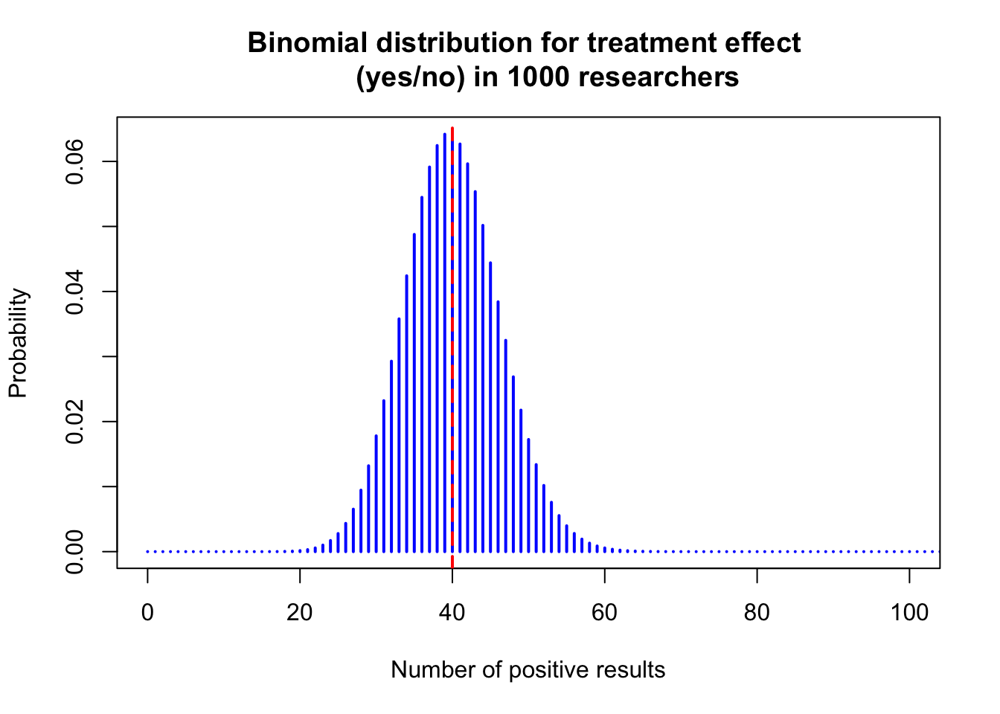

Note, this form of distribution looks like a bell curve, aka a [normal distribution](https://en.wikipedia.org/wiki/Normal_distribution), 
probably the most important distribution in statistics. One can [show formally](https://www.m-hikari.com/imf/imf-2017/9-12-2017/p/baguiIMF9-12-2017.pdf) that the binomial distribution converges to the normal distribution under certain conditions.
So, if we would only have one shot to predict the number of researches reporting a treatment effect under the assumption that no treatment exists, we would bet on 40.
This guess would also not be too bad considering the whole range (0 to 1000) since we can expect the number of successes above, let's say, 65 and below, let's say, 15 to be very unlikely.

``` r
sum(dbinom(0:14, size = 1000, prob = 0.04)) # prob of 14 or less
```

```
## [1] 1.384829e-06
```

``` r
sum(dbinom(66:1000, size = 1000, prob = 0.04)) # prob of 66 or more
```

```
## [1] 7.160623e-05
```

``` r
sum(dbinom(15:65, size = 1000, prob = 0.04)) # prob of 15 to 65
```

```
## [1] 0.999927
```

We can easily draw from a binomial distribution in R. 
We now do the 1000-researcher experiment 10000 times and look at 
the histogram of the number of positive results:


``` r
library(ggplot2)
# Simulate data
data <- rbinom(10000, size = 1000, prob = 0.04)
ggplot(data.frame(value = data), aes(x = as.factor(value))) +
  geom_bar(color = "blue", fill = "blue", width = 0.8) +
  geom_vline(xintercept = as.character(1000 * 0.04),
             linetype = "dashed", color = "red") +
  labs(title = "Bar Plot of 10000 1000-researcher Experiments",
       x = "Number of Effects Found", y = "Count") +
  theme_minimal() +
  theme(plot.title = element_text(hjust = 0.5))
```

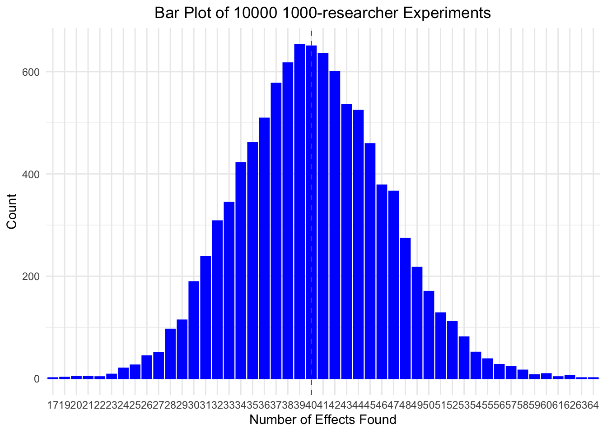

As you can see, the realized number of found effects matches well the theoretical probabilites
given by the binomial distribution. Note, that not necessarily 40 is the most often found number of effects
among 1000 researchers, but we are very close.

**The second question** [above](#Questions_about_the_1000-researcher_experiment) 
asked about observing 137 positively reporting researchers. 
We can calculate the probability of observing 137 or more positive results using the [binomial distribution](https://en.wikipedia.org/wiki/Binomial_distribution)
(plug into the formula): 
$\mathbb{P}(\text{observing 137 or more}) = \sum_{i=137}^{1000} \binom{1000}{i}0.04^i (1-0.04)^{1000-i}$:

``` r
# Calculate the probability of observing 137 or more positive results
# (using the complement rule)
1 - sum(dbinom(0:136, size = 1000, prob = 0.04))
```

```
## [1] 5.551115e-16
```

``` r
# Compare to winning the Swiss lottery
(1 / 31474716) / (1 - sum(dbinom(0:136, size = 1000, prob = 0.04)))
```

```
## [1] 57234507
```

57 million times less likely than winning the Swiss lottery. If this event would happen, we would probably reject the assumption that the therapy is not working at all.

In the calculation above, we used the [complement rule](https://en.wikipedia.org/wiki/Complement_(set_theory)) to calculate the probability of 
observing 137 or more positive results: $1 - \mathbb{P}(\text{observing 136 or less})$. 

In general, for an event $A$: 

$$\mathbb{P}(A^C) = 1 - \mathbb{P}(A),$$ 


``` r
library(ggplot2)
plot <- ggplot() +
  geom_rect(aes(xmin = -5, xmax = 5, ymin = -5, ymax = 5),
            fill = "lightgray", color = "black", linewidth = 1) +
  geom_point(aes(x = 0, y = 0), color = "black",
             size = 60, shape = 21, fill = "skyblue") +
  annotate("text", x = 0, y = 0, label = "A", size = 6) +
  annotate("text", x = -4.5, y = 4.5, label = "Ω", size = 6, hjust = 0) +
  annotate("text", x = -3, y = -3, label = "A^C", parse = TRUE, size = 6) +
  coord_fixed() +
  theme_void()
print(plot)
```

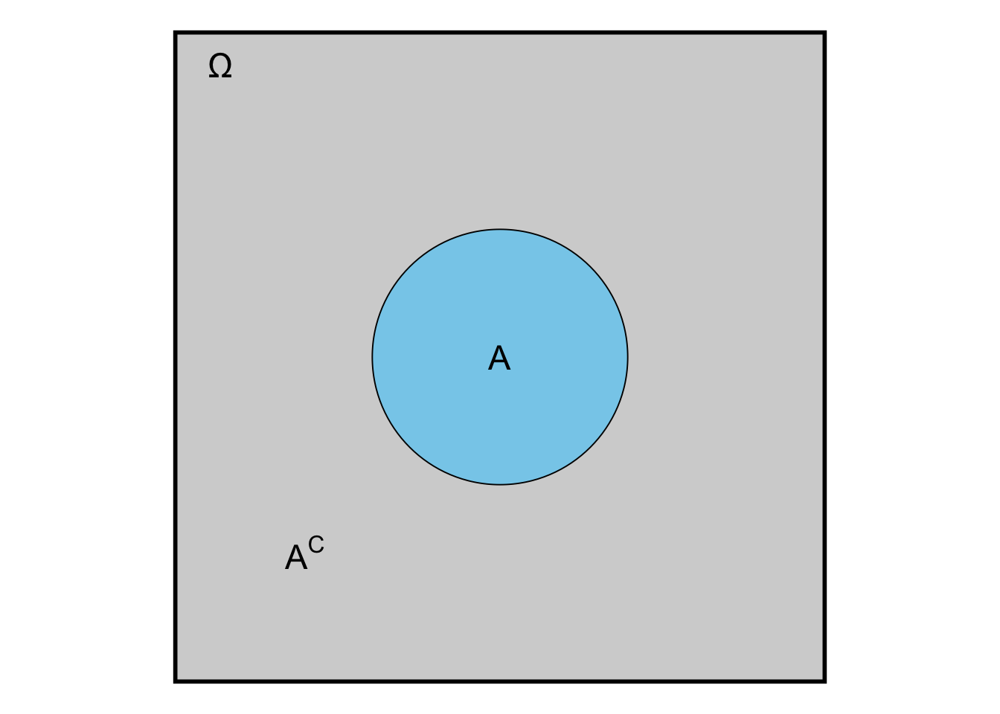

where $A^C$ comprises all elementary events that are not in $A$. In our case, the compliment of observing 136 or less is observing 137 or more and vice versa:
$\mathbb{P}(0, \dots, 136) = 1 - \mathbb{P}((0, \dots, 136)^C) = 1 - \mathbb{P}(137, \dots, 1000)$.

**The third question** [above](#Questions_about_the_1000-researcher_experiment)
asked about the expected number of positive results if the therapy is working in 12% of the patients.
As you can probably guess by now: We would guess $1000 \times 0.12 = 120$ positive results.
This is the so-called **[expected value](https://en.wikipedia.org/wiki/Expected_value)** $\mathbb{E}(X)$ of the [binomial distribution](https://en.wikipedia.org/wiki/Binomial_distribution). 
It is not always the maximum probability (the so-called [mode](https://en.wikipedia.org/wiki/Mode_(statistics))) of the distribution though:
Consider a binomial distribution \( \text{Bin}(10, 0.77) \):

- The **mean** is \( \mathbb{E}(X) = 10 \times 0.77 = 7.7 \). This number is not an integer and we can therefore not calculate the density at this point.
- The **[mode](https://en.wikipedia.org/wiki/Mode_(statistics))** is 8:


``` r
library(tidyverse)
data.frame(x = 0:10,
           p_x = dbinom(0:10, 10, 0.77)) %>%
  filter(x %in% c(7, 8, 9))
```

```
##   x       p_x
## 1 7 0.2343149
## 2 8 0.2941670
## 3 9 0.2188489
```

**The fourth question** [above](#Questions_about_the_1000-researcher_experiment)
asked about the problem of writing a press release stating that 47 out of 50 studies showed a treatment effect.
Well, this would be scientific fraud and a case of [survivorship bias](https://en.wikipedia.org/wiki/Survivorship_bias#:~:text=Survivorship%20bias%20or%20survival%20bias,conclusions%20because%20of%20incomplete%20data.).
You only look at the studies that showed a treatment effect and ignore the ones that did not or you restrict the number of studies to a certain number lower than the true number.
This is also relevant in [finance](https://www.investopedia.com/terms/s/survivorship-bias-risk.asp#:~:text=This%20risk%20arises%20from%20focusing,or%20removed%20from%20performance%20data.).
You may want to read this excellent [article](https://journals.plos.org/plosmedicine/article?id=10.1371/journal.pmed.0020124) by John Ioannidis for a humbling big-picture of how relevant published results can be.

**The fifth question** [above](#Questions_about_the_1000-researcher_experiment)
asked about the problem of [multiple testing](https://en.wikipedia.org/wiki/Multiple_comparisons_problem) and related to the previous question. 
If you test many hypotheses, you will find some "significant" results by chance alone.
One could also call the practice of testing many hypotheses to find "significant" ones [p-hacking](https://en.wikipedia.org/wiki/Data_dredging). 
This should be absolutely avoided. Unfornately, it is still common practice in many fields. Often it happens unconsciously.
Example: If you test 100 hypotheses simultaneously at a significance level of 4%, you would expect 4 "significant" results by chance alone. 
If you report those 4 results as legitimate finding, you are p-hacking. When reading a scientific article, watch out for large amounts of p-values and 
their (over-)interpretation as "significant" (relevant) or "non-significant" (not relevant). 
This [article](https://www.tandfonline.com/doi/full/10.1080/00031305.2019.1583913) is recommendable to get away from a too strict dichotomous interpretation of research results.

**The sixth question** [above](#Questions_about_the_1000-researcher_experiment)
asked about the variation of positive results between large research departments. This demands the very important concept of [variance](https://en.wikipedia.org/wiki/Variance): 
The expected quadratic deviation from the mean: $\mathbb{V}ar(X) = \mathbb{E} \{ (\mathbb{E}(X) - X)^2 \}$. In simple terms: 
How much does the number of positive results vary around the mean of 40 on average?
See also [Exercise 5](#exercise5). Maybe this [video](https://www.youtube.com/watch?v=SzZ6GpcfoQY) helps as well.

### Addition of probabilities {#addition_of_probabilities}
[Above](#axioms_of_probability_theory) in axiom 3, we stated that the probability of the union of pairwise disjoint events is the sum of the 
probabilities of the individual events.
What if the events are not disjoint? For simplicity, let's consider only 2 researchers (doing 2 parallel experiments) and define event $A_1$ as "researcher 1 finds an effect" and 
$A_2$ as "researcher 2 finds an effect".
What is the probability that at least one of the researchers finds an effect?
Our event space 
$\Omega = \{ (R1pos, R2pos), (R1pos, R2neg), (R1neg, R2pos), (R1neg, R2neg) \}.$

$\sum_{\omega_i} \mathbb{P}(\omega_i) = 0.04^2 + 0.04 \times 0.96 + 0.96 \times 0.04 + 0.96^2 = 1$

$A_1 \cup A_2 = \{ (R1pos, R2pos), (R1pos, R2neg), (R1neg, R2pos)\}$

$A_1 = \{ (R1pos, R2pos), (R1pos, R2neg)\}$

$A_2 = \{ (R1pos, R2pos), (R1neg, R2pos)\}$

$\mathbb{P}(A_1) = 0.04^2 + 0.04 \times 0.96$ (First researcher finds an effect or both find an effect)

$\mathbb{P}(A_2) = 0.04^2 + 0.96 \times 0.04$ (Second researcher finds an effect or both find an effect)

In, general, we can write the [probability of the union of two events](https://en.wikipedia.org/wiki/Probability#Not_(necessarily)_mutually_exclusive_events) as:
$\mathbb{P}(A_1 \cup A_2) = \mathbb{P}(A_1) + \mathbb{P}(A_2) - \mathbb{P}(A_1 \cap A_2)$

Put in the values:
$0.04^2 + 0.04 \times 0.96 +$
$0.04^2 + 0.96 \times 0.04 - 0.04^2=$
$0.04^2 + 0.04 \times 0.96 + 0.96 \times 0.04. = 0.0784$.

Or simpler with the **complement rule**:

$\mathbb{P}(A_1 \cup A_2) = 1 - \mathbb{P}(\text{neither }A_1 \text{ nor }A_2) = 1-0.96^2 = 0.0784$.

See also [Exercise 6](#exercise6).

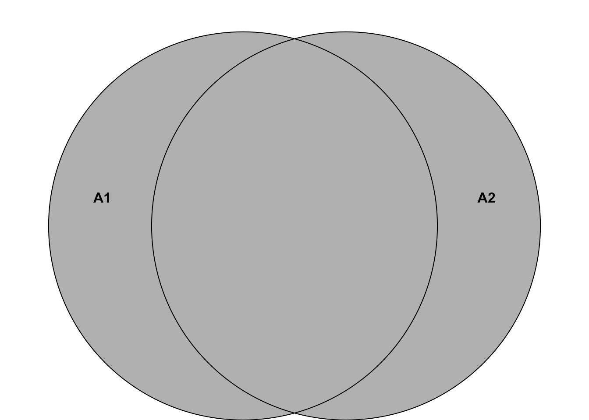

Here is another helpful depiction of the situation:


```{=html}
<div class="grViz html-widget html-fill-item" id="htmlwidget-0fe93f32e555750c1da4" style="width:672px;height:480px;"></div>
<script type="application/json" data-for="htmlwidget-0fe93f32e555750c1da4">{"x":{"diagram":"\ndigraph {\n  graph [layout = dot, rankdir = TB]\n  \n  # Nodes\n  A [label = \"Researcher 1: Finds effect\", shape = box]\n  B [label = \"Researcher 1: No effect\", shape = box]\n  C [label = \"Researcher 2: Finds effect\", shape = box]\n  D [label = \"Researcher 2: No effect\", shape = box]\n  E [label = \"Researcher 2: Finds effect\", shape = box]\n  F [label = \"Researcher 2: No effect\", shape = box]\n  \n  # Paths\n  A -> C [label = \"Effect found\"]\n  A -> D [label = \"No effect\"]\n  B -> E [label = \"Effect found\"]\n  B -> F [label = \"No effect\"]\n}\n","config":{"engine":"dot","options":null}},"evals":[],"jsHooks":[]}</script>
```

So, the probability of at least one researcher finding an effect is the sum of the probabilities of the individual researchers finding an effect minus
the probability of both finding an effect, which is the same as that both or exactly one of them finds an effect.

We can also visualize the 4 disjoint elementary events 
$$\Omega = \{ (R1pos, R2pos), (R1pos, R2neg), (R1neg, R2pos), (R1neg, R2neg) \}$$ 
in a [Venn diagram](https://en.wikipedia.org/wiki/Venn_diagram). The probabilites of these
4 events in the event space $\Omega$ must add up to 1 since they are disjoint and one of them has to happen. There is no "room" left.

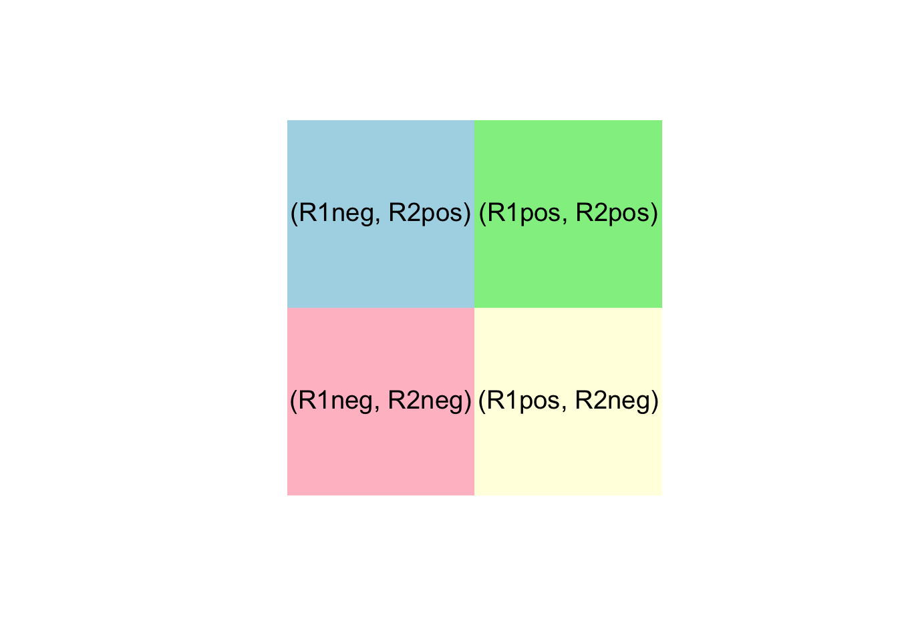

### Probabilities for health science {#probabilities_for_health_sciences}

We have learned a lot so far: The axioms of probability theory, the difference between independence and disjointness, and the addition of probabilities.

**How does probability theory fit into the big picture of statistics for health sciences?**

In many health-related studies, we want to perform one or more of the following tasks: 

- Estimate proportions (e.g., the proportion of patients with lower back pain. How big is the problem from a public health perspective?),
- Test hypotheses (e.g., whether a new therapy is superior to the standard therapy. How sure can we be that the new therapy is better? 
What is the probability that the treatment effect is between x and y points on some scale?),
- Estimate therapy effects (e.g., the effect of a new therapy on pain reduction: 
  How many points does the pain decrease? How is the pain reduction distributed? 
  Are there outliers and why? Are there participants that to not benefit from the therapy?)

In all such cases, probability theory is the established tool to answer questions that are afflicted with uncertainty. Would there be no variation in results/effects, 
we would probably argue differently. In our world, probability theory is the tool to **quantify uncertainty**.

We can always ask ourselves: Where is this entity (proportion, effect, etc.) with which frequency/probability?

### Discrete vs. continuous probability distributions {#discrete_vs_continuous_probability_distributions}
As one of the most prominent examples of a discrete distribution, we have already seen 
the [binomial distribution](https://en.wikipedia.org/wiki/Binomial_distribution) in our 1000-researcher-experiment.
A special case of it is the [Bernoulli distribution](https://en.wikipedia.org/wiki/Bernoulli_distribution), 
where you only throw the coin once or let one researcher conduct the experiment.

As an example of a continuous distribution we have mentioned the [normal distribution](https://en.wikipedia.org/wiki/Normal_distribution) above. 
It is the most important distribution in statistics for reasons that become increasingly clear as we go along. 
One of them is the [central limit theorem](https://en.wikipedia.org/wiki/Central_limit_theorem) which we have already mentioned in the 
introduction slides. Feel free to watch this [video](https://www.youtube.com/watch?v=zeJD6dqJ5lo&t=28s&ab_channel=3Blue1Brown). 
The theorem states that, under appropriate conditions, the distribution of a normalized version of the sample 
mean ($\bar{X} = \frac{1}{n}\sum_{i=1}^{n} X_i$) converges to a standard normal distribution. 
By this theorem, we can link **any** distribution to the normal distribution.

Discrete or continuous, the **goal** is the same: We want to now **where** the realization 
of my **[random variable](https://www.youtube.com/watch?v=Y9nsL69CwbU&t=18s&ab_channel=VeryNormal)** 
lands **with what probability** when I do the experiment?
How often will I get heads?

- How often will the researcher find an effect?

- With what probability will I get a pain-score reduction of at least 1 point in this patient in front of me given his/her 
  characteristics and history?

- When looking at ZHAW students, female, soccer lovers; what kind of hourly intense sports activity 
can I expect and does that differ from other groups?

#### Discrete probability distrubtions are used when we can count the outcomes, which includes infinitely many. {#discrete_probability_distributions}
Some examples of [discrete probability distributions](https://en.wikipedia.org/wiki/Probability_distribution#Discrete_probability_distribution) are:

- **[Bernoulli distribution](https://en.wikipedia.org/wiki/Bernoulli_distribution)**: A single trial with two outcomes (e.g., find an effect or do not find an effect).
- **[Binomial distribution](https://en.wikipedia.org/wiki/Binomial_distribution)**: The number of successes in a fixed number of trials (e.g., the number of false effects found among 1000 researchers).
- **[Poisson distribution](https://en.wikipedia.org/wiki/Poisson_distribution)**: The number of events in a fixed interval of time or space.
- **[Geometric distribution](https://en.wikipedia.org/wiki/Geometric_distribution)**: The number of trials until the first success. This number has no upper limit.

We always assign probabilites to the countable outcomes of these distributions, like in the example of the binomial distribution when 
we throw the dice 20 times and are interested in the number of 3s:


``` r
# Define parameters for the binomial distribution
x_values <- 0:20
probabilities <- dbinom(x_values, size = 20, prob = 1 / 6)

# Plot the binomial distribution with styling
plot(x_values, probabilities, type = "h", lwd = 2, col = "blue",
     xlab = "X", ylab = "Probability",
     main = "Binomial Probability Distribution (n = 20, p = 1/6)")

# Add points for clarity
points(x_values, probabilities, pch = 19, col = "red")
```

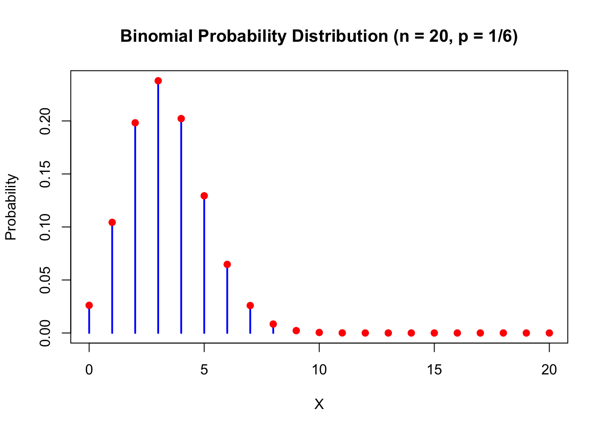

Each outcome has a probability $>0$ assigned to it. The sum of all probabilities is 1: $\sum_{i \in \text{Possible outcomes}} \mathbb{P}(X=i) = 1$.
For every event, we just add the probabilities of the elementary outcomes that are in the event:

$\mathbb{P}(X \in (3,8,9,14)) = \mathbb{P}(X = 3) + \mathbb{P}(X = 8) + \mathbb{P}(X = 9) + \mathbb{P}(X = 14)$.
This principle is true for all discrete probability distributions. Rather simple and elegant:

$$\sum_{i} \mathbb{P}(X = x_i) = 1,$$

where $X$ ist the [random variable]((https://www.youtube.com/watch?v=Y9nsL69CwbU&t=18s&ab_channel=VeryNormal)) (which takes values $x_i$ when the random experiment is conducted) and $x_i$ are the possible outcomes of $X$.

We could **invent our own discrete probability distribution** instantly (see also [Exercise 8](#exercise8)), we'll call it the MSc-ZHAW-distribution:

Let $X \in \mathbb{Z}$. Every whole number gets the following probability:
$\mathbb{P}(X=0) = 0.1$ and for $x_i \neq 0$: $\mathbb{P}(X = x_i) = 0.2^{|x_i|}$. 
The sum of all probabilities is: $\sum_{x_i \in \mathbb{Z}} \mathbb{P}(X=x_i) = \mathbb{P}(X=0) + 2 \cdot \sum_{i \in \mathbb{N}} 0.2^i = 
0.1 + 2 \cdot \frac{0.2}{1-0.2} = 0.6$. Hence, we need to divide every probability by 0.6 to get in sum 1.
The final definition is then:

$\mathbb{P}(X=0) = \frac{1}{6}$ and for $x_i \neq 0$: $\mathbb{P}(X = x_i) = \frac{5}{3} 0.2^{|x_i|}$. 


``` r
# Define the probability function
P <- function(X) {
  if (X == 0) {
    return(1 / 6)
  } else {
    return((5 / 3) * (0.2^abs(X)))
  }
}

# Create a sequence of X values from -10 to 10
x_values <- -10:10

# Compute the probabilities for each X value
probabilities <- sapply(x_values, P)

# Plot the probabilities
plot(x_values, probabilities, type = "h", lwd = 2, col = "blue",
     xlab = "X", ylab = "Probability",
     main = "MSc-ZHAW Probability Distribution of X from -10 to 10")

# Add points for clarity
points(x_values, probabilities, pch = 19, col = "red")
```

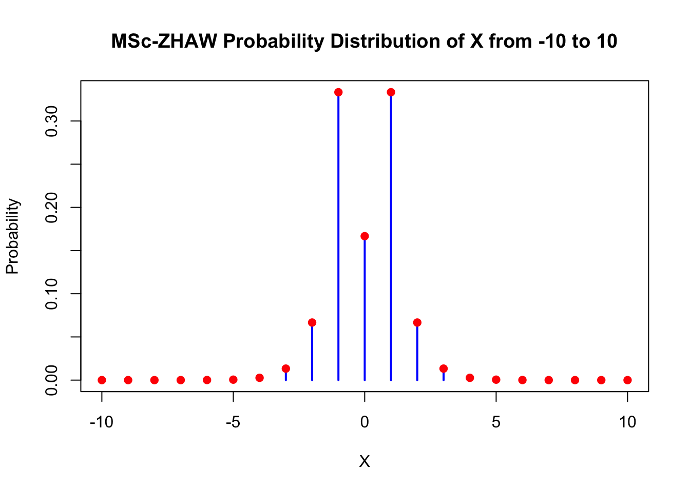

``` r
# Check if it sums to 1 (approximately):
x_values <- -1000:1000
sum(sapply(x_values, P))
```

```
## [1] 1
```

Deviations from zero ($\pm 1$) are highly likely with this distribution. The probability of $X=0$ is also rather high with $\frac{1}{6}$.
Larger deviations from zero are less likely and go exponentially towards zero (very fast). So we would expect almost never to see values outside
of $\pm 10$. This does of course not mean that we will never see them. Do the experiment often enough and you will see them with 
probability 1 (see [Exercise 10](#exercise10)).


``` r
x_values <- setdiff(-1000:1000, -10:10) # exclude values from -10 to 10
sum(sapply(x_values, P))
```

```
## [1] 8.533333e-08
```

**Expectation $\mathbb{E}(X)$ of a discrete random variable**: The expectation of a discrete random variable $X$ is defined as:

$$\mu = \mathbb{E}(X) = \sum x_i \cdot \mathbb{P}(X = x_i),$$

a weighted sum of possible values $x_i$ with their respsective probabilities $\mathbb{P}(X = x_i)$.

The term "expectation" is probably somewhat misleading. It is not necessarily the value we "expect to see" when we do the experiment. For instance,
the expected value of a Bernoulli distribution is: $\mu = \mathbb{E}(X) = 0 \cdot (1-p) + 1 \cdot p = p$, which could be $0.5$. The individual outcomes are $0$ and $1$, 
and not $0.5$. But $0.5$ would be the mean of the outcomes of many experiments.

The expectation can be interpreted as the [center of mass](https://mathcenter.oxford.emory.edu/site/math117/expectedValueAndCenterOfMass/) 
of the distribution. It is the value that the distribution "balances" around.

Maybe this [video](https://www.youtube.com/watch?v=KLs_7b7SKi4) helps too.

The cool thing is that we can learn the true (but unknown) expectation of a distribution by the sample mean. The more samples we collect, the closer we will be.
This is (roughly) the statement of the [law of large numbers](https://en.wikipedia.org/wiki/Law_of_large_numbers): 

$$\bar{X}_n \rightarrow \mu = \mathbb{E}(X) \quad \text{as} \quad n \rightarrow \infty.$$

See [here](https://github.com/jdegenfellner/ZHAW_Teaching/blob/main/Law_of_Large_Numbers_Dice_animation.R) for an animated example of this law.

**Remember**: The sample mean $\bar{x} = \frac{1}{n} \sum_{i=1}^n x_i$ is a (really good) **estimator** for the expectation $\mu = \mathbb{E}(X)$ of a distribution. 
This is true for discrete and continuous distributions. 

The **variance of a discrete random variable** is defined as:

$$\mathbb{V}ar(X) = \mathbb{E} \{ (\mathbb{E}(X) - X)^2 \} = \sum_i (\mathbb{E}(X) - x_i)^2 \mathbb{P}(X = x_i),$$

the expected squared deviation from the mean. It is a measure of how much the values of the random variable differ from the mean.
$(\mathbb{E}(X) - x_i)^2$ quantifies the deviation from the mean. We weight this deviation with the probability of such 
a deviation happening. So a large deviation results only in a large variance if it is likely to happen. 


**Remember**: The sample variance $s^2 = \frac{1}{n-1} \sum_{i=1}^n (x_i - \bar{x})^2$ is a so-called **estimator** 
for the variance $\mathbb{V}ar(X)$ of a distribution.
This is true for discrete and continuous distributions. 

A more natural interpretation of variability is the **standard deviation**: 

$$\sigma = \sqrt{\mathbb{V}ar(X)},$$

since it's on the same scale as X (e.g. $m^2$ or $kg$).

#### Continuous probability distributions are used when we cannot count the outcomes. {#continuous_probability_distributions}
The most famous continuous probability distribution is the 
[normal distribution](https://en.wikipedia.org/wiki/Normal_distribution).
This [video](https://www.youtube.com/watch?v=k5sbE1_MDwU&ab_channel=VeryNormal) 
about probability distributions in general might be helpful.

``` r
# Load necessary library
if (!require(pacman)) install.packages("pacman")
```

```
## Loading required package: pacman
```

``` r
pacman::p_load(ggplot2) # Installs and loads the package at the same time

# Define parameters for the normal distribution
mu <- 0    # Mean
sigma <- 1 # Standard deviation

# Define the limits for the area to be shaded
a <- -2  # Lower bound
b <- -1   # Upper bound

# Create a sequence of x values to evaluate the PDF
x_vals <- seq(mu - 4 * sigma, mu + 4 * sigma, length.out = 1000)

# Compute the corresponding density values using dnorm
y_vals <- dnorm(x_vals, mean = mu, sd = sigma)

# Create a data frame for plotting
df <- data.frame(x = x_vals, density = y_vals)

# Create a subset of the data for shading the area between a and b
df_shaded <- df[df$x >= a & df$x <= b, ]

# Plot the normal density and shade the area between a and b
ggplot(df, aes(x = x, y = density)) +
  geom_line(color = "blue", linewidth = 1) +  # Use linewidth instead of size
  geom_ribbon(data = df_shaded, aes(ymin = 0, ymax = density),
              fill = "blue", alpha = 0.3) +  # Shaded area
  ggtitle(paste("Standard Normal Distribution: 
  N(", mu, ", ", sigma^2, ")", sep = "")) +
  xlab("X") +
  ylab("Density") +
  theme_minimal() +
  geom_vline(xintercept = mu, color = "red", linetype = "dashed") +
  annotate("text", x = mu + 0.2, y = max(y_vals) / 2,
           label = paste("E(X) =", mu), color = "red") +
  geom_vline(xintercept = a, color = "black", linetype = "dashed") +
  geom_vline(xintercept = b, color = "black", linetype = "dashed") +
  annotate("text", x = a - 0.2, y = max(y_vals) / 4,
           label = paste("a =", a), color = "black") +
  annotate("text", x = b + 0.2, y = max(y_vals) / 4,
           label = paste("b =", b), color = "black") +
  theme(plot.title = element_text(hjust = 0.5))
```

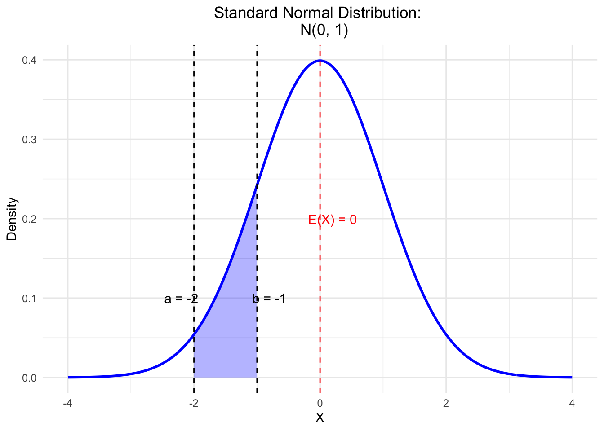

Here, like in any other "nice" continuous distribution, the area under the curve is 1: 

$$\int_{-\infty}^{\infty} f(x) dx = 1.$$

The probability of a single point is zero ($\mathbb{P}(\{ x_i \}) = 0$).
In any continuous distribution, we use the area under the curve to calculate probabilities. The probability of $X$ being between $a$ and $b$ is the area under the curve (blue shade) between $a$ and $b$: 
$\mathbb{P}(X \in (a,b))$. Note that the area over a single point would be zero and therefore the probability of a single point is zero.

The graph above is called a [probability density function](https://en.wikipedia.org/wiki/Probability_density_function) (PDF). 
Over every point, we express the probability by the height of the curve.
See [exercise 3](#exercise3_descriptive_stats) in the next chapter for a practical example for what we will use this in research.

**Expectation $\mathbb{E}(X)$ of a continuous random variable**: The expectation of a continuous random variable $X$ is defined as:

$$\mu = \mathbb{E}(X) = \int x \cdot f(x) dx,$$

where $x$ are the possible values of $X$ and $f(x)$ is the probability density function of $X$.

**Variance of a continuous random variable**: The variance of a continuous random variable $X$ is defined as:

$$\mathbb{V}ar(X) = \mathbb{E} \{ (\mathbb{E}(X) - X)^2 \} = \int (\mathbb{E}(X) - x)^2 f(x) dx.$$

A more natural interpretation of variability is the **standard deviation**: 

$$\sigma = \sqrt{\mathbb{V}ar(X)},$$

since it's on the same scale as X.

**Example:** Normally distributed Ages of ZHAW students: $\mu = 24$, $\sigma = 3$. For the normal distribution, 
this means that approx. 68% of the students are between $(24-3=)21$ and $(24+3=)27$ years old.
You might want to keep [this picture](https://en.wikipedia.org/wiki/Normal_distribution#/media/File:Standard_deviation_diagram_micro.svg)
or [this one](https://mathbitsnotebook.com/Algebra2/Statistics/normalstandard.jpg) in mind.
So, with just the parameters we have instant information where the values are and where new values 
drawn from the same distribution are likely to be.


### Examples of prominent probability distributions used in health sciences {#prominent_probability_distributions_in_health_sciences}

The first 2 are absolutely essential.

 - The most important one is, as mentioned above, the [normal distribution](https://en.wikipedia.org/wiki/Normal_distribution). 
   It is often used to model the distribution of many variables in health sciences, e.g., blood pressure, weight, height, etc.
   Normality is also a common assumption in many statistical tests and models. This is the reason why you will find many statements like
   "we have checked normality using the Shapiro-Wilk test" (Which I would not recommend) in scientific articles.
   Normal distribution theory is very aesthetic and one is sometimes lead to believe that this is the *normal* state of nature, which is
   not the case. See also the [history](https://en.wikipedia.org/wiki/Normal_distribution#History) of the normal distribution. 
   A common use of the normal distribution is in [linear regression](https://en.wikipedia.org/wiki/Linear_regression), 
   where the errors and the conditional distribution of the modeled variable are assumed to be normally distributed. 
   We will deal with this in QM2.

- The [binomial distribution](https://en.wikipedia.org/wiki/Binomial_distribution) ($X \sim B(n, p)$) is used to model the number of successes in a fixed number of trials. 
  For example, the number of patients that respond to a therapy in a fixed number of patients.
  A special case of it is the [Bernoulli distribution](https://en.wikipedia.org/wiki/Bernoulli_distribution), 
  which is used to model a single trial with two outcomes (throw the coin once; $X \sim B(1,p)$).

- [Logistic Distribution](https://en.wikipedia.org/wiki/Logistic_distribution). Underpins logistic regression models, 
   which are used to predict binary outcomes (e.g., the presence or absence of a disease).

- [Poisson distribution](https://en.wikipedia.org/wiki/Poisson_distribution). Used to model the number of events in a fixed interval of time or space. 
  For example, the number of patients arriving at an emergency department in a fixed time interval.
  Maybe you want to watch this [video](https://www.youtube.com/watch?v=jmqZG6roVqU&ab_channel=jbstatistics).

- [Exponential distribution](https://en.wikipedia.org/wiki/Exponential_distribution). 
   For instance used in survival analysis to model the time until an event (e.g. refrigerator stops working) occurs.
  This [video](https://www.youtube.com/watch?v=2kg1O0j1J9c&ab_channel=zedstatistics) might be interesting.

- [Student's t-distribution](https://en.wikipedia.org/wiki/Student%27s_t-distribution) (small "t" please) generalizes 
  the standard normal distribution. Like the latter, it is symmetric around zero and bell-shaped, but 
  has [fatter tails](https://en.wikipedia.org/wiki/Fat-tailed_distribution) (compared to the normal distribution), i.e.,
  "extreme" values are more likely. It is a very well known distribution underlying the [t-test](https://en.wikipedia.org/wiki/Student%27s_t-test).
  See [Exercise 12](#exercise12) for a practical example.
  This [video](https://www.youtube.com/watch?v=Uv6nGIgZMVw&ab_channel=jbstatistics) might be interesting.

There are infinitely (!) many more [distributions](https://en.wikipedia.org/wiki/List_of_probability_distributions).

**Our goal is to learn**: How can we describe (the distribution of) what we see in our data? 
How can we make predictions? How can we make decisions based on our data?
Probability theory and statistics are (for us) a very large tool box to answer these questions. 
They are unfortunately not magic and cannot turn uncertainty into certainty.

## Exercises

Difficulty levels of exercises: 
**E**: easy, 
**M**: intermediate, 
**D**: difficult

### [M] Exercise 1 - Throwing a die very often {#exercise1}
- Use your favourite large language model (LLM) to create an R-Script to simulate throwing a fair die 1000 times.
- Try to run the script. If it does not run, try to debug it using the LLM. 
- Once, the script runs, let the LLM explain the code and outputs ("Please explain this script in detail...").
- Plot the frequency of each number (1-6) (after 1000 throws) and compare it to the theoretical probability of getting each number ($\frac{1}{6}$).
- Plot the relative frequency of 3s on the y-axis and the number of throws on the x-axis. This should give a converging pattern towards $y=\frac{1}{6}$.
- Which law of probability theory is illustrated by this simulation?

### [D] Exercise 2 - Bayes-teaser {#exercise2}
Use Bayes' theorem to calculate the posterior probability of the therapy's effectiveness in the physiotherapy example above ([Example](#example1_physio)).
For simplicity, let's just test two $\theta$-values: 0.3 (as in the previous study) and 0.4. We assign 50% in the prior knowledge that the parameter 
$\theta=0.3$, and 50% to $\theta=0.4$ since we trust our colleagues as well.

### [E] Exercise 3 - Find journals {#exercise3}
**Note: This is among the most important exercises of the course:**
Use Google or your favourite search engine to find scientific journals in *your* field (physiotherapy, midwifery, nursing, etc.). 
Look at the latest articles. We are interested in articles that used statistics (no qualitative studies). 

- What was the research question? What where they trying to find out/confirm? Write down at least 10 research questions!
- Which statistical *methods* were used? Write down at least 10 methods!
- Was prior/external knowledge - before the actual model was estimated - used in any of the analysis?
- Where the results presented in a dichotomous way; meaning, was there a "significant"/"non-significant" result or not?

### [M] Exercise 4 -  Independent and disjoint {#exercise4} 

Look at the definitions above and try to come up with examples for independent and disjoint events in your field of study.

- Is this possible? 
- Why or why not? 
- What would that imply? 
- Draw a Venn diagram if possible!

### [M] Exercise 5 - Variance {#exercise5}

- Simulate the number of positive results (found an effect even though there is none) in our 1000-researcher-experiment under the assumption that the therapy is not working at all ($p=0.04$).
- Do this experiment in  10,000 times and visualize the results in a histogram.
- How often do you get 65 or more positive results? How often do you get 15 or less positive results?
- Can you find the limits of a 90% interval around the mean (of 40) - using the so-called [quantiles](https://en.wikipedia.org/wiki/Quantile) - for the number of positive results?
- What is the theoretical variance for our experiment?
- How can you estimate this theoretical (and in reality: unknown) variance from the 10,000 simulations?

### [E] Exercise 6 - Three researchers {#exercise6}
Above in [Addition of probabilites](#addition_of_probabilities) we went through in detail the case of 2 researchers finding an effect. 
Let's now consider 3 researchers simulatenously conducting the experiment.

- What does the event space $\Omega$ look like?
- Which elementary events are in the set of all possible outcomes of our 3-researcher experiment and how many are there?
- Draw the corresponding binary tree for this experiment.
- Which elementary events are in the following event: "Researcher 3 finds a positive effect"?
- Are the events "only researcher 1 finds an effect" and "only researcher 3 finds an effect" disjoint and/or independent?

### [E] Exercise 7 - Conditional probability {#exercise7}
Let's consider again the 2 reasearcher situation from above ([Addition of probabilites](#addition_of_probabilities)).

$\Omega = \{ (R1pos, R2pos), (R1pos, R2neg), (R1neg, R2pos), (R1neg, R2neg) \}$. 

- What is the probability that researcher 1 finds an effect given that researcher 2 found an effect?

### [E] Exercise 8 - Invent a discrete probability distribution {#exercise8}

- Invent your own discrete probability distribution.
- What is the expected value of your distribution?
- What is the variance of your distribution?
- Think of something in the real world that could be modeled by your distribution.

### [E] Exercise 9 - Continuous probability distributions {#exercise9}

- Invent your own continuous probability distribution.
- What is the expected value of your distribution?
- What is the variance of your distribution?
- Think of something in the real world that could be modeled by your distribution.

Hint: You can use simple shapes for the densitiy function defined by lines. And you can use simulation to answer questions about expected value and variance.

### [M] Exercise 10 - MSc-ZHAW-distribution {#exercise10}

 - Create sufficiently many random numbers (sample) from the MSc-ZHAW-distribution (see [above](#discrete_probability_distributions)) 
   and see if you can produce values outside of $\pm 6$.
 - What is the mode of this distribution and how could we estimate it from the sample?
 - What is the [interquantile range](https://en.wikipedia.org/wiki/Interquartile_range) of this distribution and how could we estimate it from the sample? 

### [M] Exercise 11 - Independence and disjointness for dice events {#exercise11}

Find examples of dice events when throwing a die once that are:

- Not independent and not disjoint.
- Not independent but disjoint.
- Independent but not disjoint.

### [D] Exercise 12 - Student's t-distribution {#exercise12}
Let's look at a [paper](https://www.sciencedirect.com/science/article/pii/S0954611112002958#aep-abstract-id3), 
where the t-distribution is used (in the background). The aim of the study was to assess the efficacy of pulmonary 
rehabilitation in addition to regular chest physiotherapy in non cystic fibrosis bronchiectasis.
Table 1 describes the patient characteristics in both groups.
Table 2 shows the primary endpoint (incremental shuttle walk test - ISWT) at baseline and follow-up time points.
[Figure 2](https://ars.els-cdn.com/content/image/1-s2.0-S0954611112002958-gr2_lrg.jpg) shows the outcomes 
at baseline, 8 weeks and 20 weeks for both groups.)
They want to find out if the ISWT is different between the two groups.
(Note, that an arbitrary threshold for the p-value of 0.05 is used to decide if the groups 
are "significantly" different. One should [avoid](https://www.tandfonline.com/doi/full/10.1080/00031305.2019.1583913) these formulations.
There is no reason not to use a different threshold (like 4.3%).)
**The standardized difference of the group means is t-distributed**. This case is a bit more complex than the simple ones, 
since we have different sample sizes (15 vs. 12) and different variances in the groups. The statistics software will take care of this
and use the so-called [Welch's t-test](https://en.wikipedia.org/wiki/Welch%27s_t-test).

- What do you think about the baseline values for ISWT in the two groups?
- What is the number in brackets next to the ISWT-values?
- According to the article, the data is normally distributed. 
  Draw 3 probability density functions of normal distributions in one graph with the respective parameters
  for baseline, 8 weeks and 20 weeks for both groups. Make two graphs, one for each group.
- According to the text, [Figure 2](https://ars.els-cdn.com/content/image/1-s2.0-S0954611112002958-gr2_lrg.jpg) shows the means 
  $\pm$ standard errors ($SE = \frac{s}{\sqrt{n}}$) of the ISWT at baseline, 8 weeks and 20 weeks for both groups. Look at Figure 2, a. 
  Does this match the description for instance at 8 weeks in the acappella+pulmonary group? Do the bars make sense?
- Now, let's simulate the differences at week 8 (ISWT) using the parameters given: Group sizes, 15 and 12, 
  means ($338.7$ and $344.2$) and standard deviations ($42.2$ and $115.5$).
  Draw a histogram of the simulated differences.
  Calculate the 1.5% and 98.5% quantiles of the differences.

## Solutions
Solutions for this chapter can be found [here](https://github.com/jdegenfellner/Script_QM1_ZHAW/tree/main/Solutions_to_Exercises/2_Probability).

<!--chapter:end:02-probs.Rmd-->

# Descriptive statistics

There are a myriad sources (books, websites, videos) explaining the concepts of [descriptive statistics](https://en.wikipedia.org/wiki/Descriptive_statistics). 
We do not need to reiterate everything here. You can go through these sources to get started:

- [R for non-programmers](https://bookdown.org/daniel_dauber_io/r4np_book/descriptive-statistics.html)
- [Science direct](https://www.sciencedirect.com/topics/social-sciences/descriptive-statistics)
- [Descriptive statistics](https://journals.lww.com/ijam/fulltext/2018/04010/descriptive_statistics.7.aspx)

The goal is to describe data in a meaningful and honest way. 
We **summarize** data to make them **more easily digestable** for us humans to answer questions like 

- Where are the data points **located**? 
  These questions are answered (at least attempted) by the location measures such as 
  [mean](https://en.wikipedia.org/wiki/Mean), [median](https://en.wikipedia.org/wiki/Median), and [mode](https://en.wikipedia.org/wiki/Mode_(statistics)).
- How widely are they spread? How much do they **vary**?
  These questions are answered by the dispersion measures such as [variance](https://en.wikipedia.org/wiki/Variance), 
  [standard deviation](https://en.wikipedia.org/wiki/Standard_deviation) (root of the variance), 
  [interquantile range](https://en.wikipedia.org/wiki/Interquartile_range#:~:text=The%20IQR%20of%20a%20set,a%20median%20calculated%20as%20follows.&text=The%20second%20quartile%20Q2%20is%20the%20same%20as%20the%20ordinary%20median.) 
  or just the [range](https://en.wikipedia.org/wiki/Range_(statistics)); or even [Gini's mean difference](https://www.dss.uniroma1.it/RePec/mtn/articoli/2003-2-8.pdf).
- Are there any **outliers** (rare data points that are far away from the rest [@westfall2020, p. 405].) and why?
  This is a bit more complicated.

## Example: Descriptive statistics in health sciences {#example_study1_physio}

These are birds-eye views on the data. Let's look at a paper which was recently published in the 
[Journal of Physiotherapy](https://www.sciencedirect.com/journal/journal-of-physiotherapy) in order to get a running start:

[Patients with worse disability respond best to cognitive functional therapy for chronic low back pain: a pre-planned secondary analysis of a randomised trial](https://www.sciencedirect.com/science/article/pii/S183695532400081X?via%3Dihub)

(This should be open access.)

The research question was "Do five baseline moderators identify patients with chronic low back pain who respond best to cognitive 
functional therapy (CFT) when compared with usual care?".

In **Table 2** of the paper, the authors present the baseline characteristics of the patients stratified by the treatment group (ususal care vs CFT).
We find absolute numbers, percentages, means, and standard deviations for the continuous variables, medians, and interquartile ranges for the ordinal variables.
This should give an idea of the sample. In the population paradigm of statistics, we draw a [sample](https://en.wikipedia.org/wiki/Sampling_(statistics)) from 
the [population](https://en.wikipedia.org/wiki/Statistical_population) of interest and try to make inferences about the population. We want to learn
more about the population respectively that data generating process (DGP) producing the data [@westfall2020, pp. 6-8]. How did the data come about?
Note that this **sample varies everytime we draw from the population**. 
We can either imagine an infinitely large population or a finite one (e.g. population of Switzerland).

Often, variables in a study are (approximately) normally distributed. 
We can then efficiently summarize the variable with its mean and standard deviation (location and scale parameter) as is done 
in the paper for *Age* in years for instance. We do not want to present p-values in such an overview table since we merely *describe* data instead of
making inferences about the population or the DGP.
It is by no means given that *age* has to be normally distributed in our sample. We could easily have a sample with many young people and few elderly ones.
This would result in a (positively) [*skewed*](https://en.wikipedia.org/wiki/Skewness) distribution. Having many elderly people and few young ones would 
result in a negatively skewed distribution of course.

## Univarate vs. bivariate statisics 
One can distinguish between [univariate](https://en.wikipedia.org/wiki/Univariate_analysis) and [bivariate](https://en.wikipedia.org/wiki/Bivariate_analysis) statistics.
In univariate statistics, we look at **one variable at a time**, for instance *Age* in the example above, 
where we could draw a [boxplot](https://en.wikipedia.org/wiki/Box_plot) or a [histogram](https://en.wikipedia.org/wiki/Histogram). 
Table 2 in the paper is a good example of univariate statistics. We are not so much interested in the relationship between variables.

In bivariate statistics, we look at **two variables simultaneously**. 
An example could be a [scatter plot](https://en.wikipedia.org/wiki/Scatter_plot) of *Age* and *Cognitive flexibility*, 
where we would possible find a falling relationship ([example in the wild](https://pmc.ncbi.nlm.nih.gov/articles/PMC4906299/figure/FI00674-1/), this would actually be a line plot, not a scatter plot).
We are interested in the relationship between the two variables. How do they change (covary) together?

[Multivariate statistics](https://en.wikipedia.org/wiki/Multivariate_statistics) is the next step, where we look at more than two variables *at the same time*.

## The histogram
One way to visualize the distribution of a continuous variable is the [histogram](https://en.wikipedia.org/wiki/Histogram). 
This [video](https://www.youtube.com/watch?v=gSEYtAjuZ-Y&ab_channel=KhanAcademy) might be helpful to cover the basics.
I recommend plotting the histogram with a [boxplot](https://en.wikipedia.org/wiki/Box_plot) below; this helps
to visualize the raw data points as well.

``` r
library(pacman)
p_load(tidyverse)

set.seed(4433) # to get the same plot every time

# Generate normally distributed sample
x <- rnorm(10000, mean = 23.4, sd = 5.6)
df <- data.frame(values = x)

p2 <- ggplot(df, aes(x = values)) +
  geom_histogram(aes(y = after_stat(density)),
                 bins = 30, alpha = 0.7, color = "darkgrey") +
  geom_density(aes(y = after_stat(density)), color = "blue", linewidth = 1) +
  geom_boxplot(aes(y = -0.01, x = values),
               width = 0.02, position = position_nudge(y = -0.00)) +
  geom_point(aes(y = -0.01),
             position = position_jitter(width = 0.002, height = 0.01),
             size = 1, alpha = 0.05) +
  ggtitle("Histogram with density plot and boxplot below") +
  theme(plot.title = element_text(hjust = 0.5))
p2
```

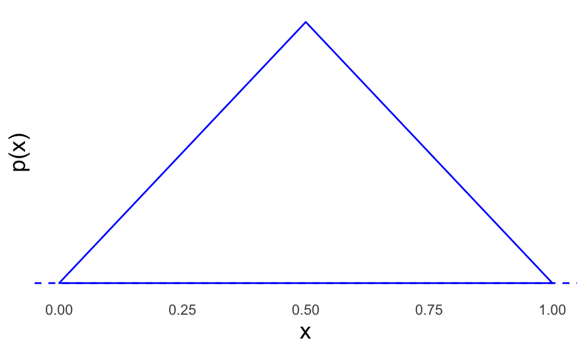

Some researchers would discard the values below 10 and above 40 as outliers, but we know here
that the data points are perfectly legitimate. 
One important thing we should be aware of in connection with small sample sizes is
variability. Let's create not $10000$ samples of a normally distributed variable, but only $25$ samples:

``` r
# Generate normally distributed sample
set.seed(1245) # to get the same plot every time
x <- rnorm(25, mean = 23.4, sd = 5.6)
df <- data.frame(values = x)

p2 <- ggplot(df, aes(x = values)) +
  geom_histogram(aes(y = after_stat(density)),
                 bins = 30, alpha = 0.7, color = "darkgrey") +
  geom_density(aes(y = after_stat(density)), color = "blue", linewidth = 1) +
  geom_boxplot(aes(y = -0.01, x = values), width = 0.02,
               position = position_nudge(y = -0.00)) +
  geom_point(aes(y = -0.01),
             position = position_jitter(width = 0.002, height = 0.01),
             size = 1, alpha = 0.05) +
  ggtitle("Histogram with density plot and boxplot below") +
  theme(plot.title = element_text(hjust = 0.5))
p2
```

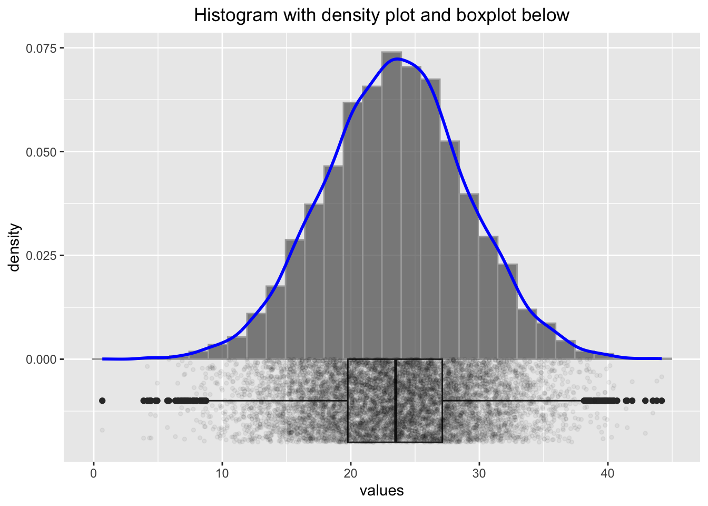

We *know* (in this case) that these values come from a normal distribution with a mean 
of $23.4$ and a standard deviation of $5.6$. Let's *estimate* the parameters ($\mu$, $\sigma$) from the sample
and use the often but not recommended Shapiro-wilk test for normality:

``` r
# Estimate mean and standard deviation
mean(x) # or
```

```
## [1] 20.6017
```

``` r
1 / length(x) * sum(x)
```

```
## [1] 20.6017
```

``` r
sd(x) # or
```

```
## [1] 4.622042
```

``` r
sqrt(1 / (length(x) - 1) * sum((x - mean(x))^2))
```

```
## [1] 4.622042
```

``` r
shapiro.test(x)
```

```
## 
## 	Shapiro-Wilk normality test
## 
## data:  x
## W = 0.95059, p-value = 0.2585
```

Firstly, the histogram looks rather differently when using a different [seed](https://r-coder.com/set-seed-r/). Secondly, we would probability
not be able to tell if the data stems from a normal distribution. Thirdly, the sample mean and standard deviation
are not all that bad estimators for the true (but unknown) mean and standard deviation. Nicely enough,
the Shapiro test would not reject the null hypothesis of normality in this case.

Let's try the Shapiro test with a t-distribution with 3 degrees of freedom, which is not normal:

``` r
set.seed(1245) # to get the same plot every time
x <- rt(25, df = 3) # random numbers from t-distribution
df <- data.frame(values = x)

p2 <- ggplot(df, aes(x = values)) +
  geom_histogram(aes(y = after_stat(density)),
                 bins = 30, alpha = 0.7, color = "darkgrey") +
  geom_density(aes(y = after_stat(density)), color = "blue", linewidth = 1) +
  geom_boxplot(aes(y = -0.01, x = values), width = 0.02,
               position = position_nudge(y = -0.00)) +
  geom_point(aes(y = -0.01),
             position = position_jitter(width = 0.002, height = 0.01),
             size = 1, alpha = 0.05) +
  ggtitle("Histogram with density plot and boxplot below") +
  theme(plot.title = element_text(hjust = 0.5))
p2
```

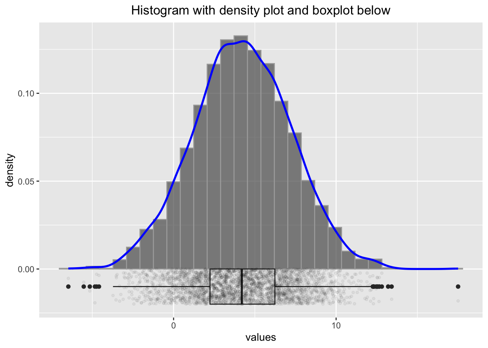

``` r
shapiro.test(x)
```

```
## 
## 	Shapiro-Wilk normality test
## 
## data:  x
## W = 0.95827, p-value = 0.3811
```

Some researchers would argue, that the distribution is normal (since the p-value is rather large), 
but we know it is not. We will be cautious with such ugly rule of thumbs. 
We will instead use [Q-Q plots](https://en.wikipedia.org/wiki/Q%E2%80%93Q_plot) and histograms to decide if a variable is normally distributed.

### Example in the wild

We will try to catch a histogram in the *wild* (= in a research paper): We find one 
[here](https://bmjopen.bmj.com/content/bmjopen/9/4/e023341.full.pdf). 
[Figure 1](https://bmjopen.bmj.com/content/bmjopen/9/4/e023341/F1.large.jpg) shows a histogram of the
the foot posture index (FPI-6) scores from the participants (3217 healthy children aged 3 to 15).
"The FPI score may range from −12 (highly supinated) to +12 (highly pronated)".
There are a few things to note here:

- Acccording to the Methods-section: 
"Testing for normality using a Kolmogorov-Smirnov test, 
found non-normal distribution of all data...".
Especially the BMI could be asymmetrically distributed, or also age. Unfortunately, we do not have
histograms or boxplots for these variables. Nevertheless, the authors present the mean and standard deviation
for these variables which implies (when not reading the methods section) that the data is (at least sufficiently)
normally distributed.
- Strictly speaking, an FPI score cannot be normally distributed since it takes discrete values which are bounded 
between -12 and 12 (normal distribution can take values between $-\infty$ and $\infty$). But that should not be a problem with so many levels of an ordered categorical variable. 
It should be a sufficient approximation. 
- "The FPI was analysed as continuous data, rather than as z-score data". 
[z-scores are standardized scores](https://www.youtube.com/watch?v=5S-Zfa-vOXs&ab_channel=KhanAcademy):
$$Z = \frac{X - \mu_X}{\sigma_X}$$ 
Doing this for the FPI scores would give (FPI right, see Table 1):
$$z_i = \frac{FPI_i - \overline{FPI}}{SD(FPI)} = \frac{FPI_i - 4.20}{3.00}$$
$\overline{FPI}$ ist the arithmetic mean of the FPI scores, $SD(FPI)$ the standard deviation of the FPI scores.
$\mu_X$ is the expectation of X and $\sigma_X$ the standard deviation of X. 
So we measure not in FPI units anymore, but in **standard deviations from the mean** which makes 
it easier to compare different variables with each other. If we would only center the data and 
define $FPI_{center} = FPI_i - \overline{FPI}$, we would interpret the values in FPI units, but
the mean would be 0. Hence an $FPI_{center}$-value of 2 would mean that the FPI score is 2 units above the mean.
A **nice property of the normal distribution** is: If X is normally distributed ($X \sim N(\mu, \sigma$)), 
then the z-scores are standard normally distributed ($Z \sim N(0,1$)). 
See [Exercise 4](#exercise4_descriptive_stats). Of course *both*, z-scores as well as FPI scores are 
considered "continuous" (in this context).

- With so many obsvervations ($n=3217$), how would a truly normal distribution with the parameters
$FPI \sim N(4.20, 3.00)$ look like? We can simulate this with the following code:

``` r
set.seed(8345) # to get the same plot every time
x <- rnorm(3217, mean = 4.20, sd = 3.00)
df <- data.frame(values = x)

p2 <- ggplot(df, aes(x = values)) +
  geom_histogram(aes(y = after_stat(density)),
                 bins = 30, alpha = 0.7, color = "darkgrey") +
  geom_density(aes(y = after_stat(density)), color = "blue", linewidth = 1) +
  geom_boxplot(aes(y = -0.01, x = values), width = 0.02,
               position = position_nudge(y = -0.00)) +
  geom_point(aes(y = -0.01),
             position = position_jitter(width = 0.002, height = 0.01),
             size = 1, alpha = 0.05) +
  ggtitle("Histogram with density plot and boxplot below") +
  theme(plot.title = element_text(hjust = 0.5))
p2
```

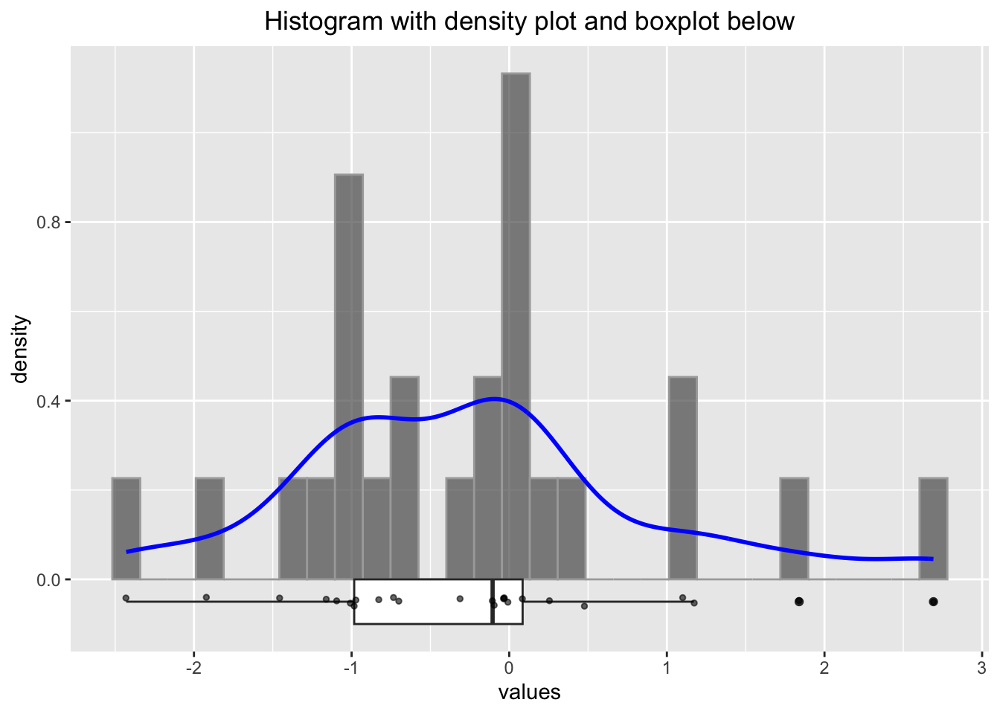

Comparing these histograms (using different seed-values), we could assume that for truly normally distributed
FPI scores, the histogram might look smoother than the one in Figure 1 in the paper. Especially the values around 6
seem to deviate from the normal distribution.

## Correlation
The [correlation](https://en.wikipedia.org/wiki/Correlation) between two variables is a measure 
of the strength and direction of the **linear** relationship between them. It does **not** (directly)
measure other kinds of relationships (for instance monotonic or polynomial). 
See also [Anscombe's quartet](https://en.wikipedia.org/wiki/Anscombe%27s_quartet).

Correlation is often denoted by the Greek letter 

$$\rho = \frac{\text{Cov}(X, Y)}{\sigma_X \sigma_Y}$$
for the population parameter (the true but unknown) 

where:

- \( \text{Cov}(X, Y) \) is the covariance between variables \( X \) and \( Y \),

- \( \sigma_X \) and \( \sigma_Y \) are the population standard deviations of \( X \) and \( Y \), respectively.


and 

$$r = \frac{\sum (X_i - \bar{X})(Y_i - \bar{Y})}{\sqrt{\sum (X_i - \bar{X})^2 \sum (Y_i - \bar{Y})^2}}$$ 

for the sample estimate.

**Remember: We use $r$ to estimate $\rho$ using the sample.**

The correlation coefficient can take values between -1 and 1.

- A value of 1 indicates a perfect positive linear relationship between the variables.

- A value of -1 indicates a perfect negative linear relationship between the variables.

See [here](https://en.wikipedia.org/wiki/Correlation#/media/File:Correlation_examples2.svg) and 
[here](https://en.wikipedia.org/wiki/Correlation#/media/File:Pearson_Correlation_Coefficient_and_associated_scatterplots.png)
for a nice illustration. Study this in detail. A correlation of $\pm 1$ just means that the data points lie on a straight line.
It does not say anything about the steepness of the line.

You can watch these videos to get a better understanding of the concept:

- [StatQuest - correlation](https://www.youtube.com/watch?v=xZ_z8KWkhXE&ab_channel=StatQuestwithJoshStarmer)

- [StatQuest - covariance](https://www.youtube.com/watch?v=qtaqvPAeEJY&ab_channel=StatQuestwithJoshStarmer)

- [Animated correlation](https://www.youtube.com/watch?v=rijqfllOq6g&ab_channel=3-MinuteDataScience)

Correlation is an often (over-)used measure in research. 
It is important to note that 
[correlation does not imply causation](https://en.wikipedia.org/wiki/Correlation_does_not_imply_causation).
For instance, 
[chocolate consumption is positively correlated with the number of Nobel laureates](https://www.sciencedirect.com/science/article/pii/S2590291120300711) in a country.
This does - unfortunately - not mean that eating chocolate makes you smarter.

One thing many of us think when they see a high correlation is that if we know the value of one variable,
we can predict the value of the other variable. This is not necessarily true. 
This [section](https://en.wikipedia.org/wiki/Pearson_correlation_coefficient#Interpretation) explains why.
Study the visualization [here](https://en.wikipedia.org/wiki/Pearson_correlation_coefficient#/media/File:Pearson_correlation_and_prediction_intervals.svg).
It depicts the reduction of the prediction interval for Y given X as the correlation 
increases (assuming that the variables are jointly normally distributed). **How much smaller is the interval where my next observation of Y
will fall if I know the value of X?** As you can see, this curve is relatively flat in the beginning, meaning, on an individual level,
the correlation does not tell us much about the value of Y given X. 
Of course with correlation 1, we can predict the value of Y perfectly, but even with a correlation of 0.5 
(which is considered high in many areas), the prediction interval for Y is only 13% smaller.

One often reads that the two variables used for calculation of a 
[Pearson correlation coefficient](https://en.wikipedia.org/wiki/Pearson_correlation_coefficient) should be normally distributed.
This is not necessary, at least not for descriptive purposes. The correlation coefficient is a measure of the linear relationship
and we can think of an example with skewed data where the correlation coefficient is still meaningful:

``` r
# Load required libraries
library(ggplot2)
library(ggExtra)

# Set seed for reproducibility
set.seed(1234)

# Parameters
n <- 200  # Sample size
beta <- 0.7  # Desired beta

# Generate left-skewed variable x (negative exponential distribution)
x <- -rexp(n, rate = 1)

# Generate correlated left-skewed variable y
error <- rnorm(n, mean = 0, sd = 2)
y <- beta * x + error

# Create a data frame
data <- data.frame(x = x, y = y)

# Create scatterplot with marginal histograms and trendline
p <- ggplot(data, aes(x = x, y = y)) +
  geom_point(alpha = 0.5, color = "blue") +
  geom_smooth(method = "lm", color = "red", se = FALSE) +
  labs(title = "Scatterplot with Left-Skewed x and y and Trendline",
       x = "Left-Skewed x", y = "y") +
  theme_minimal()

# Add marginal histograms using ggExtra
ggExtra::ggMarginal(p, type = "histogram", fill = "lightblue", color = "black")
```

```
## `geom_smooth()` using formula = 'y ~ x'
## `geom_smooth()` using formula = 'y ~ x'
## `geom_smooth()` using formula = 'y ~ x'
```

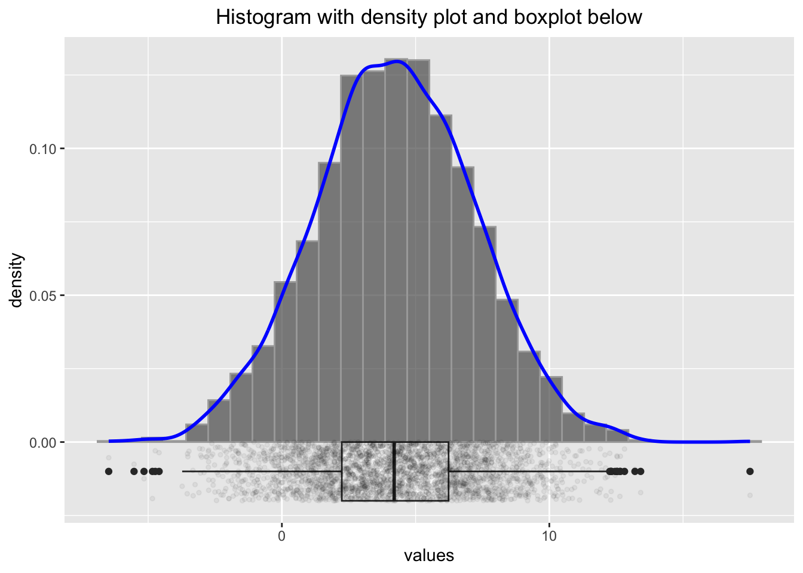

*If* X and Y are bivariate normally distributed, then one can use the variable 
$t = r \sqrt{\frac{n-2}{1-r^2}}$ as test statistic for the null hypothesis (next chapter) $H_0: \rho = 0$.
Note: It is not sufficient for X and Y to be individually normally distributed in order to 
be [jointly normally distributed](https://en.wikipedia.org/wiki/Multivariate_normal_distribution#Bivariate_case).

### Example in the wild
Let's again visit the previous [paper](https://bmjopen.bmj.com/content/9/4/e023341).
In the results, correlations are presented in a dichotomous way with regards to p-values, 
which should be [avoided](https://www.tandfonline.com/doi/full/10.1080/00031305.2019.1583913). 
We will expand on this in the next chapter. For large sample sizes, even small (true) correlations will be "significant",
especially, if one decides to use an arbitrary threshold for the p-values like $0.05$. There is not much information
in this fact. I would argue that all p-values for such large sample sizes and larger correlations do not carry much information.
See also [Exercise 5](#exercise5_descriptive_stats).


**That was all nice, what could go wrong?**

(The sample) Correlation (coefficient) is based (see the formula above) on the artihmetic mean $\bar{X}$ 
(capital X since we are talking about the 
[random variable](https://www.youtube.com/watch?v=Y9nsL69CwbU&ab_channel=VeryNormal) which is realised when 
the $X_i$ have materialized into the $x_i$) and sample standard deviation $s$. 

The sample mean is not robust against outliers. A single large value can distort the mean arbitrarily much.
Hence, the correlation coefficient is not robust against outliers. Let's see this in action:

``` r
# Load necessary libraries
library(ggplot2)
library(ggpubr)

# Set seed for reproducibility
set.seed(123)

# Parameters
n <- 100  # Sample size
rho <- 0.75  # Desired correlation

# Generate bivariate normal data with specified correlation
x <- rnorm(n)
y <- rho * x + sqrt(1 - rho^2) * rnorm(n)

# Store original data
data_original <- data.frame(x = x, y = y)

# Function to create scatterplot with trend line and correlation
create_plot <- function(data, title) {
  ggplot(data, aes(x = x, y = y)) +
    geom_point(alpha = 0.6, color = "blue") +
    geom_smooth(method = "lm", se = FALSE, color = "red") +
    labs(title = title, subtitle = paste("Correlation:",
                                         round(cor(data$x, data$y), 2))) +
    theme_minimal() +
    theme(plot.title = element_text(hjust = 0.5))  # Center the title
}

# Original scatterplot
p_original <- create_plot(data_original, "Original Data")

# Add outlier in x
data_outlier_x <- data_original
data_outlier_x$x[n] <- max(x) + 5  # Extreme value in x
p_outlier_x <- create_plot(data_outlier_x, "Outlier in X")

# Add outlier in both x and y
data_outlier_xy <- data_original
data_outlier_xy$x[n] <- max(x) + 5  # Extreme value in x
data_outlier_xy$y[n] <- max(y) + 5  # Extreme value in y
p_outlier_xy <- create_plot(data_outlier_xy, "Outlier in Both X and Y")

# Add outlier in y
data_outlier_y <- data_original
data_outlier_y$y[n] <- max(y) + 5  # Extreme value in y
p_outlier_y <- create_plot(data_outlier_y, "Outlier in Y")

# Arrange plots using ggarrange
ggarrange(p_original, p_outlier_x, p_outlier_xy, p_outlier_y,
          labels = c("A", "B", "C", "D"),
          ncol = 2, nrow = 2)
```

```
## `geom_smooth()` using formula = 'y ~ x'
## `geom_smooth()` using formula = 'y ~ x'
## `geom_smooth()` using formula = 'y ~ x'
## `geom_smooth()` using formula = 'y ~ x'
```

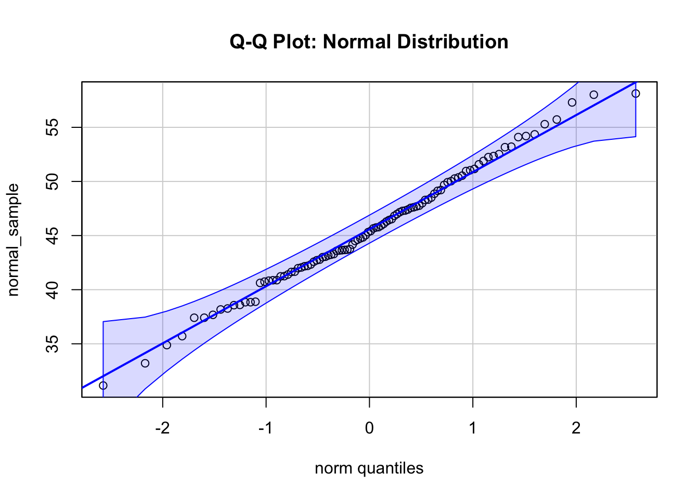

- A: $r=0.71$ for the original data. 

- B: When we add an outlier in x, $r$ decreases to $0.44$ and the trendline is notably shifted. 

  The reason for the smaller correlation is that the outlier is above the mean of the x values and below 
  the mean of the y values and therefore adds negatively to the covariance which is the numberator 
  in the formula for $r$. The denominator is non-negative.

- C: When we add an outlier in both $x$ and $y$, $r$ stays relatively stable. 
 (At least in this case: We could also add, e.g., an outlier above the y mean and below the x mean.)
  The reason is that the outlier is above the mean of the x values and above the mean of the y values, 
  so it adds positively to the covariance. Also, the outlier is in line with the trend of the data.
  We could ask, what happend in this data point? Was another scale used for instance?

- D: When we add an outlier in $y$, the $r$ decreases to 0.48. 
  The reason for the smaller correlation is that the outlier is above the mean of the y values 
  and below the mean of the x values and therefore adds negatively to the covariance.

- We could also ask why the trend lines (created with simple linear regression) change the way they do. 
  We will come to this later in our courses. 
  Please look at this [really cool animation](https://github.com/jdegenfellner/ZHAW_Teaching/blob/main/Correlation_Outliers_around_the_clock.R).
  This is the simulation of the regression line when an outlier with distance 8 to the center is introduced and wanders around the clock.

## Exercises

Difficulty levels of exercises: 
**E**: easy, 
**M**: intermediate, 
**D**: difficult

### [D] Exercise 1 - Recreate table with fake data
 - Create fake data for the study mentioned [above](#example_study1_physio) in R.
 - Recreate Table 2 of the paper mentioned [above](#example_study1_physio) with fake data in R (using GPT, the R package *gtsummary* and other useful packages). 
   This is rather helpful later on in your master thesis.
 - Try to export the table to Excel and Word.

### [E] Exercise 2 - Outliers and estimates
Let's assume we know that the *Cognitive flexibility* is normally distributed with a mean of 60 and a standard deviation of 7.4 (Table 1): $CognFlex \sim N(60,7.4)$.

- Draw a sample of 165 persons from this distribution and calculate the mean and standard deviation of the sample. 
  How good is the estimate of the true (and in this case: known) mean and standard deviation?
- Let's replace some of the data points with outliers. Change the score of 5 persons with to impossible CognFlex score of 100. 
  Calculate the mean and standard deviation of the sample. How do the estimates change?
- When we try to estimate the location of our *Cognitive flexibility* distribution with the median, 
  how many outliers of what magnitude are necessary to disturb the estimate by 5 points? 

### [E] Exercise 3 - Recreating data in Table 2 {#exercise3_descriptive_stats}
We assume that *age* in both groups is normally distributed with a mean of 48 (47) years 
and a standard deviation of 16 (15) years: 

$Age_{UsualCare} \sim Normal(\mu = 48, \sigma = 16)$ and 

$Age_{CFT} \sim Normal(\mu = 47,\sigma = 15)$.

- Under these assumptions, what is the probability, that we would see a person of age 60 or older in a new sample (in either group)?
- What is the probability, that we would see a person of age 18 or younger in a new sample?
- Give a 99% interval for the age in CFT, 
  where we would expect a new person drawn from the same population.

Let's assume *Sex* is binomially distributed with a probability of $p = 0.59$ for both groups.

- What is the probability, that we would see a woman as the next recruited person in the *Usual care* group?
- What is the probability, that we would see no man in a sample of 10 persons in the *CFT* group?
- Sometimes you want balanced samples. How many patients would we need to recruit to get at least 45 women with a probability of at least 90%. 
  (We could solve this with simulation.) 

### [E] Exercise 4 - Z-scores {#exercise4_descriptive_stats}

- Show with a simulation that the z-scores are standard normally distributed if the original variable is normally distributed.
- Try different parameter values for $\mu$ and $\sigma$ and plot the histogram of the z-scores.
- Optional: Try to prove this mathematically.

### [M] Exercise 5 - Correlation {#exercise5_descriptive_stats}
The following R-code creates correlated samples with a (true) correlation $\rho$:

``` r
set.seed(1234)
n <- 1000
rho <- 0.5
x <- rnorm(n)
y <- rho * x + sqrt(1 - rho^2) * rnorm(n)
cor(x, y)
```

```
## [1] 0.541743
```
- Try different values for $\rho$ and $n$ and plot the scatterplot of $x$ and $y$.
- Execute the code above 1000 times and save the correlation coefficient in a vector. 
- Calculate the sample quantiles and interquantile range of the simulated correlation coefficients.
  What do you observe with respect to variability?
- Plot the histogram of the simulated correlation coefficients. 

### [M] Exercise 6 - Bike parking locations in Switzerland
- Download the data from the 
  [bike parking locations](https://opentransportdata.swiss/en/dataset/bike-parking) json-file
  and execute the following code to see an interactive map of the bike parking locations in 
  Switzerland (adapt file path if necessary):


``` r
library(pacman)
p_load(jsonlite, tidyverse, leaflet)

bike <- fromJSON("./DATA/bike_parking.json")

# Extract the "features" data frame
features <- bike$features

# Extract and flatten geometry (coordinates)
coordinates <- do.call(rbind, lapply(features$geometry$coordinates, as.numeric))
colnames(coordinates) <- c("longitude", "latitude")

bike_data <- cbind(coordinates, features$properties)
head(bike_data)
```

```
##   longitude latitude                  name stopPlaceUic stopPlaceSloid
## 1  8.902417 47.48863 Veloparking überdacht      8506013             NA
## 2  8.902425 47.48814 Veloparking überdacht      8506013             NA
## 3  8.902277 47.48854 Veloparking überdacht      8506013             NA
## 4  8.050095 47.39113 Veloparking überdacht      8502113             NA
## 5  8.050337 47.39128           Velostation      8502113             NA
## 6  7.278020 47.04381 Veloparking überdacht      8504404             NA
##   source.name                            source.id category  subCategory
## 1       prail 2f767602-03fd-49e1-bca6-7fa60e9df655  parking bike_parking
## 2       prail 4d98b698-cd5b-4b40-abb4-004827e26e5b  parking bike_parking
## 3       prail 75dc4e71-5aec-4d58-b4f4-ef815f8f5f40  parking bike_parking
## 4       prail 51585d0e-ea2a-4763-a4e7-669b89f24f0b  parking bike_parking
## 5       prail 9caf1c56-5cac-423b-912a-5e551b4c69a5  parking bike_parking
## 6       prail 3e7aa3c8-4245-488b-9f00-b44ee0d8b79a  parking bike_parking
##   address_discriminatorType address_city address_postalCode capacity
## 1                   Address       Aadorf               8355       48
## 2                   Address       Aadorf               8355       48
## 3                   Address       Aadorf               8355       80
## 4                   Address        Aarau               5000      186
## 5                   Address        Aarau               5000      230
## 6                   Address      Aarberg               3270       72
##   properties_bookingSystem
## 1         {'type': 'NOVA'}
## 2         {'type': 'NOVA'}
## 3         {'type': 'NOVA'}
## 4         {'type': 'NOVA'}
## 5         {'type': 'NOVA'}
## 6         {'type': 'NOVA'}
##                                                                                                                                                                                                   properties_capacities
## 1  [{'categoryType': 'STANDARD', 'total': 48}, {'categoryType': 'DISABLED_PARKING_SPACE', 'total': 0}, {'categoryType': 'RESERVABLE_PARKING_SPACE', 'total': 0}, {'categoryType': 'WITH_CHARGING_STATION', 'total': 0}]
## 2  [{'categoryType': 'STANDARD', 'total': 48}, {'categoryType': 'DISABLED_PARKING_SPACE', 'total': 0}, {'categoryType': 'RESERVABLE_PARKING_SPACE', 'total': 0}, {'categoryType': 'WITH_CHARGING_STATION', 'total': 0}]
## 3  [{'categoryType': 'STANDARD', 'total': 80}, {'categoryType': 'DISABLED_PARKING_SPACE', 'total': 0}, {'categoryType': 'RESERVABLE_PARKING_SPACE', 'total': 0}, {'categoryType': 'WITH_CHARGING_STATION', 'total': 0}]
## 4 [{'categoryType': 'STANDARD', 'total': 186}, {'categoryType': 'DISABLED_PARKING_SPACE', 'total': 0}, {'categoryType': 'RESERVABLE_PARKING_SPACE', 'total': 0}, {'categoryType': 'WITH_CHARGING_STATION', 'total': 0}]
## 5 [{'categoryType': 'STANDARD', 'total': 230}, {'categoryType': 'DISABLED_PARKING_SPACE', 'total': 0}, {'categoryType': 'RESERVABLE_PARKING_SPACE', 'total': 0}, {'categoryType': 'WITH_CHARGING_STATION', 'total': 0}]
## 6  [{'categoryType': 'STANDARD', 'total': 72}, {'categoryType': 'DISABLED_PARKING_SPACE', 'total': 0}, {'categoryType': 'RESERVABLE_PARKING_SPACE', 'total': 0}, {'categoryType': 'WITH_CHARGING_STATION', 'total': 0}]
##   properties_operator properties_parkingFacilityCategory
## 1                 SBB                               BIKE
## 2            Sonstige                               BIKE
## 3                 SBB                               BIKE
## 4            Sonstige                               BIKE
## 5            Sonstige                               BIKE
## 6                 SBB                               BIKE
##   properties_parkingFacilityType
## 1           BIKE_PARKING_COVERED
## 2           BIKE_PARKING_COVERED
## 3           BIKE_PARKING_COVERED
## 4           BIKE_PARKING_COVERED
## 5                   BIKE_STATION
## 6           BIKE_PARKING_COVERED
##                                                                                                                                                                                                                                                                                                                                                                                                                                                                                                                                                                                                                                                                                                                   properties_bikeFacilityTraits
## 1                                                                                                                                                                                                                                                                                                                                                                                                                                                                                                                                                                                                                                                                                                                                          <NA>
## 2                                                                                                                                                                                                                                                                                                                                                                                                                                                                                                                                                                                                                                                                                                                                          <NA>
## 3                                                                                                                                                                                                                                                                                                                                                                                                                                                                                                                                                                                                                                                                                                                                          <NA>
## 4                                                                                                                                                                                                                                                                                                                                                                                                                                                                                                                                                        [{'bikeFacilityTraitId': '74de7b37-e6ce-43cb-a5bb-6283a6e87d5b', 'bikeFacilityTraitNameI18n': {'de': 'Doppelstock', 'en': ' Double level', 'it': ' Due piani', 'fr': ' Deux étages'}}]
## 5 [{'bikeFacilityTraitId': '552fd1ef-bbc7-4eb7-8ef4-12901aff5250', 'bikeFacilityTraitNameI18n': {'de': '24h-Zugang mit velocity.ch', 'en': ' 24h access with velocity.ch', 'it': ' Accesso 24 ore su 24 con velocity.ch', 'fr': ' Accès 24h/24 avec velocity.ch'}}, {'bikeFacilityTraitId': '74de7b37-e6ce-43cb-a5bb-6283a6e87d5b', 'bikeFacilityTraitNameI18n': {'de': 'Doppelstock', 'en': ' Double level', 'it': ' Due piani', 'fr': ' Deux étages'}}, {'bikeFacilityTraitId': 'ef596249-6ff8-4484-b30f-91fb1a93588e', 'bikeFacilityTraitNameI18n': {'de': 'Self-Service-Reparaturwerkzeuge', 'en': ' Self-service repair tools', 'it': ' Attrezzi per riparazioni self-service', 'fr': ' Outils en libre-service pour réparer les vélos'}}]
## 6                                                                                                                                                                                                                                                                                                                                                                                                                                                                                                                                                                                                                                                                                                                                          <NA>
##                                                                                      openingHours
## 1                                                                                            <NA>
## 2                                                                                            <NA>
## 3                                                                                            <NA>
## 4                                                                                            <NA>
## 5 [{'slots': [{'weekdayFrom': 'Mo', 'weekdayTo': 'Su', 'timeFrom': '00:00', 'timeTo': '23:59'}]}]
## 6                                                                                            <NA>
##   address_streetName address_houseNumber
## 1               <NA>                <NA>
## 2               <NA>                <NA>
## 3               <NA>                <NA>
## 4               <NA>                <NA>
## 5       Bahnhofplatz                  3a
## 6               <NA>                <NA>
##                                                                                                                                 properties_operationTime
## 1                                                                                                                                                   <NA>
## 2                                                                                                                                                   <NA>
## 3                                                                                                                                                   <NA>
## 4                                                                                                                                                   <NA>
## 5 {'operatingFrom': '00:00:00', 'operatingTo': '00:00:00', 'daysOfWeek': ['MONDAY', 'TUESDAY', 'WEDNESDAY', 'THURSDAY', 'FRIDAY', 'SATURDAY', 'SUNDAY']}
## 6                                                                                                                                                   <NA>
##   properties_pricingModel
## 1                    <NA>
## 2                    <NA>
## 3                    <NA>
## 4                    <NA>
## 5                    <NA>
## 6                    <NA>
```

``` r
bike_cleaned <- bike_data %>%
  dplyr::select(longitude, latitude, name,
                address_city, address_postalCode, capacity, properties_operator)
head(bike_cleaned)
```

```
##   longitude latitude                  name address_city address_postalCode
## 1  8.902417 47.48863 Veloparking überdacht       Aadorf               8355
## 2  8.902425 47.48814 Veloparking überdacht       Aadorf               8355
## 3  8.902277 47.48854 Veloparking überdacht       Aadorf               8355
## 4  8.050095 47.39113 Veloparking überdacht        Aarau               5000
## 5  8.050337 47.39128           Velostation        Aarau               5000
## 6  7.278020 47.04381 Veloparking überdacht      Aarberg               3270
##   capacity properties_operator
## 1       48                 SBB
## 2       48            Sonstige
## 3       80                 SBB
## 4      186            Sonstige
## 5      230            Sonstige
## 6       72                 SBB
```

``` r
# Create an interactive map
# Check the structure of capacity
str(bike_cleaned$capacity)
```

```
##  chr [1:1394] "48" "48" "80" "186" "230" "72" "22" "45" "53" "44" "120" ...
```

``` r
# Convert capacity to numeric
bike_cleaned$capacity <- as.numeric(bike_cleaned$capacity)

# Check for warnings
if (any(is.na(bike_cleaned$capacity))) {
  warning("Some capacities could not be converted to numeric. 
  Non-numeric values have been set to NA.")
}

# Retry the map creation
leaflet(bike_cleaned) %>%
  addTiles() %>%  # Add OpenStreetMap tiles
  addCircleMarkers(
    ~longitude, ~latitude,
    popup = ~paste(
      "<strong>Name:</strong>", name,
      "<br><strong>City:</strong>", address_city,
      "<br><strong>Capacity:</strong>", capacity,
      "<br><strong>Operator:</strong>", properties_operator
    ),
    radius = ~log(capacity + 1) * 2,  # Radius scaled by capacity
    color = ~ifelse(properties_operator == "SBB", "blue", "red"),
    fillOpacity = 0.7
  ) %>%
  addLegend("bottomright", colors = c("blue", "red"),
            labels = c("SBB", "Other Operators"),
            title = "Operators")
```

```{=html}
<div class="leaflet html-widget html-fill-item" id="htmlwidget-5ab607460029bffd9d7a" style="width:672px;height:480px;"></div>
<script type="application/json" data-for="htmlwidget-5ab607460029bffd9d7a">{"x":{"options":{"crs":{"crsClass":"L.CRS.EPSG3857","code":null,"proj4def":null,"projectedBounds":null,"options":{}}},"calls":[{"method":"addTiles","args":["https://{s}.tile.openstreetmap.org/{z}/{x}/{y}.png",null,null,{"minZoom":0,"maxZoom":18,"tileSize":256,"subdomains":"abc","errorTileUrl":"","tms":false,"noWrap":false,"zoomOffset":0,"zoomReverse":false,"opacity":1,"zIndex":1,"detectRetina":false,"attribution":"&copy; <a href=\"https://openstreetmap.org/copyright/\">OpenStreetMap<\/a>,  <a href=\"https://opendatacommons.org/licenses/odbl/\">ODbL<\/a>"}]},{"method":"addCircleMarkers","args":[[47.4886314,47.4881418,47.4885437,47.3911284,47.391281,47.0438113,47.044772,47.3197162,47.320483,47.335587,47.467474,47.27535,47.27474,46.31638,46.3173,46.31643,46.31724,46.527358,46.4757241,46.4759093,46.8763841,46.8774168,46.8756165,47.193972,47.621174,47.374621,47.374621,47.374049,47.550507,47.550677,47.550343,47.550677,47.550507,47.593508,47.593814,47.5937961,47.593753,45.9017,45.901518,46.199626,47.510246,47.521726,47.520974,46.20872,47.44193,47.44193,46.69797,47.0496041,47.0494617,47.0485607,47.436656,47.436603,47.436553,46.9794859,47.2467701,46.88437,47.195623,47.195581,47.194993,47.182777,47.182824,47.188458,47.188244,47.2010736,47.47537,47.4752,47.47494,47.47521,47.0103932,47.587902,47.587963,47.186011,45.8469641,47.1537806,47.0401682,47.537261,47.548635,47.5463,47.545769,47.546861,47.548676,47.5705193,47.569806,47.33675,47.357354,47.35709,47.3688691,47.3686483,47.40973,47.2677378,47.2677378,46.81696,46.81698,47.208814,47.209078,46.111241,46.1959232,46.19598,46.1956365,46.1944038,46.1960854,47.2041499,47.2470846,47.582112,47.582112,47.67348,46.94993,46.948798,46.949778,46.949987,46.949503,46.948923,46.949003,46.950161,46.950641,46.949246,46.9482,46.949249,46.948644,46.948183,46.948351,46.949343,46.93715,46.937642,46.9437285,46.9441364,46.9437967,46.9431441,46.1754147,46.966736,46.96633,46.96679,46.966786,46.967894,46.966794,47.194891,47.194891,47.4987,46.930006,46.25129,46.25144,46.351402,46.3511264,47.1327627,47.131794,47.132736,47.133637,47.133369,47.131794,47.133039,47.15839,47.1520765,47.3573258,47.3573068,47.437163,47.437163,47.2879782,47.49308,47.2236427,46.3802146,47.3150796,46.077789,46.269993,46.269956,47.32607,47.3046616,47.305131,47.640853,46.38568,46.38519,46.38562,46.38508,46.900074,46.900099,46.31932,46.31927,46.31893,46.32027,46.31942,46.31894,46.31941,46.3203,47.2614341,47.262081,47.2614341,47.47545,47.48128,47.481157,47.480186,47.479743,47.4803599,47.479743,47.481403,47.123462,47.123539,46.9989563,46.999061,47.269556,47.269556,47.271616,47.0933677,47.45293,47.45341,47.45293,47.16849,47.1675055,47.408836,47.47948,47.5224189,47.522296,47.52369,47.522245,47.137997,47.138033,47.061518,47.060618,47.061645,47.06071,47.060502,47.06069,47.06057,47.060584,47.54945,46.44773,46.547099,46.547741,46.547528,46.547721,47.55618,47.35916,47.36026,46.152481,46.152481,45.9027371,45.9027237,46.1867994,46.2236794,46.2248294,47.178619,47.178619,47.182582,47.182582,47.182582,46.2423134,46.9674,46.18822,46.12692,46.57064,47.099026,46.7104,46.71022,46.71022,46.196813,46.1966395,46.1968762,46.74903,46.8548065,46.8526489,46.8541993,46.8550504,46.8527757,46.8534792,46.855082,46.442816,46.44298,46.060874,46.2228168,46.2120067,46.967729,46.967729,46.177661,46.51287,46.317701,46.317701,46.317701,46.83536,46.82886,46.82885,47.038638,47.038604,46.60631,46.6061,46.60612,46.75101,47.335046,47.40474,47.24061,47.17563,47.4556,47.34284,46.81865,47.051831,46.6965,46.69678,46.816,46.81593,47.66683,46.719123,47.21826,47.21846,47.21826,47.36179,47.36227,47.482199,47.4826853,47.449171,46.94644,47.685543,47.34459,47.40633,47.40668,47.40412,47.4042369,47.421184,47.419974,47.420583,47.42145,47.420018,47.419879,47.420914,47.553083,46.86857,46.86839,46.86839,47.4891494,47.3736259,47.3735114,47.575192,47.575852,47.576074,47.11907,47.11907,47.4003849,47.4003046,46.851128,46.851182,47.453482,47.0838491,47.0838491,46.65706,46.65706,46.60995,46.61,47.425011,47.425609,47.426646,47.426299,47.31502,47.31502,47.31507,47.31433,47.31433,47.31459,47.572698,47.5727099,47.544225,47.5329733,47.4984466,47.4982696,47.520503,47.070812,47.0786291,46.948214,46.9483163,47.0331519,46.993442,46.74645,47.55147,47.30588,47.569865,47.2296819,46.8206164,46.8198269,46.821022,47.1317687,47.645556,47.4614749,47.461523,47.4615232,46.915155,46.915397,46.84478,46.84471,46.4750215,46.4750215,47.66125,46.40052,46.400458,46.397848,46.16897,46.483515,47.3855276,47.3847274,47.3850018,47.3850306,47.57692,47.2391384,47.692105,47.333136,46.888616,46.888616,46.889687,47.4158,47.4158,46.9014382,46.9021332,47.0962881,46.998994,47.5584998,47.5586095,47.5601876,47.30072,47.502037,46.80422,46.8022,46.80241,47.507524,47.5078033,47.506526,47.5074741,46.95092,46.30637,46.30638,47.2134866,47.465889,47.466257,46.2003015,46.2208451,46.2008219,46.2097422,46.2104095,46.2029761,46.1994738,46.2020387,46.1981737,46.1999191,46.2309,46.1928682,46.2098308,47.015356,46.210342,46.2568323,46.2566352,47.313622,47.120559,47.1206405,46.174142,46.174142,46.174048,46.4206394,47.39868,47.39868,47.03948,47.549405,47.548768,47.549405,47.33529,47.33529,47.474053,47.474095,47.473869,47.47383,46.17917,46.17917,46.899222,46.6664941,47.41196,46.1875404,46.1731948,46.1792227,46.80588,46.806458,46.80653,46.49694,46.75904,47.189147,47.188837,47.188464,47.189147,47.188837,46.011169,46.83197,46.83198,46.83167,46.93386,46.93427,47.474673,47.474673,47.608603,47.33046,47.33005,47.33005,47.3286162,46.71499,46.2162,46.48114,46.48118,46.81684,46.27125,46.2633432,46.85451,46.72765,46.36277,46.90837,46.81505,46.2229454,46.2411,46.24121,46.2990326,46.50881,46.2876277,46.2876277,46.52684,46.51491,46.51485,46.51485,46.78268,46.3075894,46.249948,46.2501036,46.22076,46.31516,46.57678,46.22133,47.47683,47.047491,47.2986,47.411239,47.410439,47.410103,47.3892156,47.389241,47.56477,47.56399,46.73488,47.28194,47.28168,47.28198,47.1884735,47.1877309,47.1876508,47.1880733,47.188848,47.188848,47.187226,47.54513,47.54516,47.0492,47.04914,47.04914,47.0492,47.05004,47.299175,47.299175,47.2226477,47.1677013,47.1645746,47.428516,47.26123,47.26139,47.26139,47.26198,47.26198,47.25849,47.493448,47.169646,47.169199,47.173836,47.173292,47.581827,47.388289,47.58205,47.58205,47.4082778,47.4089148,47.408562,47.091445,47.5476101,47.5479516,47.467256,47.467545,47.2305081,47.2300562,47.2304309,47.5382914,47.538517,47.566547,47.02535,47.217623,47.572253,47.571975,47.238373,47.332461,47.332461,47.4526982,46.97577,46.97479,46.988798,47.59541,46.819263,46.819432,47.32403,47.4329,47.581394,47.448158,47.448787,47.441674,47.22013,47.599899,47.600588,47.609285,47.458086,47.337636,47.336709,47.324797,46.880126,46.880464,47.52467,47.652386,47.652862,47.642448,47.649524,47.302819,47.642976,47.32705,47.31898,47.082997,47.083707,47.084167,47.190133,46.039686,46.039679,46.1737783,46.1868864,46.187946,46.187415,46.1874124,46.1872209,46.187946,47.056545,46.9670475,47.629112,47.217494,47.2159969,47.2172196,47.2164397,47.2175302,47.2162153,47.2164135,47.2165417,47.217952,46.938858,46.939772,46.939745,46.938828,47.68337,46.067676,47.392428,47.392413,47.418284,46.901598,46.51734,46.516667,46.516731,47.470726,46.441152,46.82869,46.82851,47.179023,47.179481,47.626321,47.626312,47.390992,47.390963,47.39104,46.31172,46.31172,46.31183,47.486257,47.08396,46.92426,46.9283874,47.052948,46.172168,46.1721722,47.057869,47.057655,46.70791,46.96512,46.0046242,46.007538,46.0045311,46.0046263,47.44496,47.21695,47.38522,46.50379,47.050369,47.0476,47.050318,47.048666,47.050384,47.048619,47.048264,47.047907,47.048064,47.047009,47.048679,47.054309,47.0774838,47.0774838,47.0767139,47.0765581,47.0774838,47.0764684,47.0635502,47.0632113,47.0730799,46.251239,46.251226,47.414401,46.017158,47.0042548,47.0042548,47.23862,47.038645,47.038859,47.644329,47.2526755,47.2537168,47.673593,47.673593,46.088891,45.9321435,47.58313,47.58313,47.63169,46.10543,46.10544,47.56655,47.56655,47.53331,46.78897,47.049954,47.044722,47.045833,47.2697968,47.2688019,47.2698843,45.9554145,47.568368,47.0536102,45.868375,45.8683696,47.067667,47.24431,46.0950997,46.095075,47.00996,47.5616422,46.25583,46.43556,46.43718,46.43552,46.43694,46.43547,46.43645,46.511013,46.510865,46.511405,46.511535,46.511013,46.510865,47.474411,47.2443147,46.66822,47.28108,47.28108,47.28019,47.2250567,47.1178514,47.58817,47.58817,47.588174,47.54777,47.02108,47.0213797,47.02143,47.0211,47.513302,46.873097,47.633423,47.632172,46.9368916,47.26543,47.26543,47.26534,47.2769835,47.277122,47.2769835,46.924877,46.925354,46.925636,47.533231,47.533476,47.09902,47.3707805,47.368893,47.3696708,47.3708908,47.1927803,47.065188,46.99671,46.996827,46.996852,46.98415,46.893799,47.45077,47.68269,46.76584,46.98553,46.98553,47.270304,47.270304,47.48809,47.478368,47.122546,46.925993,47.510908,47.512117,47.506198,46.954962,47.138907,47.1387408,46.384145,46.384991,46.3841151,46.3841151,46.3848742,47.553451,47.30547,47.30547,47.356274,47.1555847,47.155288,47.155507,47.27943,47.27632,47.27632,47.323325,47.323339,47.1673282,47.1667713,47.1660011,46.914481,47.5061443,47.5066445,47.5074457,47.28587,47.28587,47.28491,47.28552,47.28509,47.353228,47.35325,47.34891,47.34891,47.43082,47.429315,47.55196,47.61455,46.956448,47.45523,47.45492,47.45644,47.407291,46.5429,46.54309,46.5432,46.81897,46.81939,46.82024,46.82021,46.303297,46.303145,47.2029108,47.2027324,47.3680314,47.3672837,47.3663655,47.516094,47.171801,46.1786035,46.1786035,47.42085,47.42044,46.1443866,47.5230779,47.5230336,47.5225282,47.522595,47.530642,46.49366,46.51064,46.15118,47.604107,47.604107,47.441363,47.2251421,47.2242299,46.30602,46.30658,46.306,47.4990839,47.498752,47.392882,47.392882,47.23507,47.436889,47.43665,47.43618,47.43798,47.1727394,47.1727394,47.2416431,47.2413698,46.1258374,47.569915,47.12581,46.536684,46.536395,46.536588,46.537624,46.537008,47.5297216,47.467726,47.5514031,47.551428,47.5457763,46.175111,46.175117,47.208986,47.5353351,46.17251,47.6006358,47.444949,47.4451419,47.4449167,46.124655,46.124655,47.251895,46.4629834,46.4629834,47.564218,47.565965,47.564194,46.69324,46.6928,46.69288,46.69368,46.69406,46.69376,47.1047367,47.477948,47.478016,47.475472,47.475433,47.475767,47.475615,47.088185,47.088332,47.0907849,47.3063,47.306784,47.3063,47.141895,47.141895,47.142499,46.89914,46.898841,47.565398,47.453595,47.453536,47.4254,47.403378,47.30766,47.30701,47.286683,47.26108,47.26004,46.93439,47.259276,47.259276,47.259276,47.260665,47.32158,45.90616,46.059279,47.3939704,47.3937229,47.241591,46.30927,45.935606,46.158512,46.158375,47.0446008,47.0446779,47.0452477,47.0454467,47.0462888,46.65862,46.65862,46.21408,46.14948,47.038035,47.6997286,47.1581751,47.451653,47.6667,47.679498,47.399277,47.39971,47.39893,47.39899,47.2249283,47.2251231,47.2251744,46.863019,46.863117,46.863135,47.497945,47.0187845,47.0187438,47.0188501,47.37077,47.5001211,47.1763994,47.0417765,47.0419924,46.9502515,46.9499368,46.99633,46.99633,47.3839459,47.0260173,47.200692,47.200417,47.200692,47.1158938,47.116117,47.4650574,47.3456992,47.536138,47.535944,47.1251889,47.1829817,47.1826718,47.1825228,47.1825228,47.610697,46.29268,46.292603,46.292603,46.29292,46.29191,46.29205,47.519306,46.920273,46.920331,47.1885504,46.22691,46.22765,46.22678,46.22676,46.22768,46.22675,46.22675,46.22764,46.22679,47.46209,47.50535,47.204497,47.207162,47.204497,47.203445,47.204497,47.203445,47.208661,47.209217,47.206982,47.206982,47.195378,47.19538,47.480943,47.480723,45.8499052,45.8499052,47.240561,47.240764,47.240764,47.63471,47.63552,47.01509,47.664709,47.664425,47.353692,47.5421,47.542163,47.542162,47.50125,47.65626,47.65591,47.65625,47.65575,47.0476972,47.0481779,47.195342,47.188126,47.188185,47.188277,47.490031,47.5419149,47.541735,47.1801228,47.39782,47.396266,47.39781,47.3963837,47.396266,47.422815,47.4237764,47.423359,47.4246242,47.4241479,47.434472,47.403866,47.40367,47.15185,47.15151,46.1424689,47.687304,46.2516,46.25134,46.21602,46.21595,46.21587,46.21591,46.21617,46.4823191,46.4825167,46.4823191,46.4824796,46.4824796,47.111898,47.36782,47.058646,47.058922,47.059229,47.059076,47.37118,47.53904,47.1721806,47.171675,47.1693007,47.171317,47.170497,47.1696289,47.5093,46.8824625,47.653942,47.653216,47.659668,47.21954,46.0571402,46.0571277,47.446038,46.17748,46.17748,47.569738,47.29643,46.1901755,46.1914352,46.368813,46.893331,46.893539,46.904479,46.7558262,46.7537876,46.7558063,46.755422,46.7557233,46.7538921,46.7545195,46.755967,46.7549467,47.52148,46.45555,47.663131,47.36597,47.0716454,46.921958,47.4376102,47.49166,47.492085,46.30921,46.30921,47.11441,47.09383,47.2358819,47.2594117,47.2590581,47.1139411,47.39073,47.37968,47.352546,47.350198,47.351891,47.351259,47.351297,46.794182,46.794812,46.794151,47.585929,47.2241409,47.2243392,47.43663,46.1091356,46.71219,46.13842,46.2223,46.2805186,46.2803193,46.2787911,46.27961,46.46251,46.46387,46.46301,46.46294,46.4644,46.46299,46.46344,46.463,46.46275,46.46283,46.1671754,46.72095,46.72084,46.39813,46.39807,46.29327,46.29337,46.29346,46.2935,46.29451,46.33691,46.3369,47.2287067,47.2298802,47.098893,47.1078035,47.272519,47.1197914,47.1199661,47.1200404,47.411763,47.41183,47.411763,47.320017,47.231744,47.34133,47.1838996,47.0570157,47.45962,47.45962,47.3192473,47.317466,47.317611,47.319289,46.841842,46.841036,46.841159,46.841159,47.5258692,47.5260919,47.41756,47.41554,47.415666,47.1519235,47.1519235,47.46239,47.29716,47.49986,47.49917,47.5021403,47.502189,47.5011126,47.50143,47.4993889,47.4987787,47.501584,47.5017505,47.4869711,47.4880005,47.489987,47.5165332,47.506435,47.3488364,47.055794,47.055561,46.915364,46.91538,46.91538,46.915346,46.871747,47.4459,47.105203,47.105125,46.7825,46.7814138,46.78115,46.80065,46.900034,46.900026,47.136117,47.2884492,47.2880446,46.9998165,47.0028695,47.0001634,47.0025766,46.9998165,47.0001505,47.33746,47.17382,47.173336,47.173014,47.17345,47.173602,47.173448,47.174156,47.173077,47.173501,47.180178,47.180772,47.180772,47.156594,47.147616,47.147616,47.167552,47.174172,47.17391,47.42037,47.42087,47.42136,47.39177,47.39173,47.39106,47.39217,47.363386,47.36415,47.363712,47.44999,47.38491,47.38549,47.38535,47.38552,47.38511,47.37957,47.37792,47.378029,47.37841,47.3794,47.38509,47.41174,47.41189,47.41214,47.41854,47.41896,47.41899,47.38509,47.36608,47.36747,47.36644,47.35041,47.35119,47.35041,47.34995,47.37119,47.37119,47.39316,47.34796,47.57023,47.433857,47.4338874],[8.902417,8.902424699999999,8.902277399999999,8.0500951,8.050337000000001,7.2780199,7.2788507,7.9087092,7.907875,8.766499,7.602816,8.446109999999999,8.4445,6.96341,6.96358,6.96334,6.96351,8.608468,6.3994879,6.4003063,8.631494099999999,8.631110899999999,8.630953999999999,8.822684799999999,9.266257,9.556692999999999,9.556692999999999,9.556139,9.300959000000001,9.301804000000001,9.303245,9.301804000000001,9.300959000000001,8.675739,8.677300000000001,8.677311599999999,8.677287,6.121197,6.120641,6.237951,9.433407000000001,9.423643999999999,9.425445,7.27119,9.252520000000001,9.252520000000001,6.51902,8.5499127,8.548299999999999,8.5506694,9.641489999999999,9.64142,9.641439999999999,6.8776572,8.6443818,7.04061,8.523768,8.522531000000001,8.522600000000001,8.517295000000001,8.516664,8.517830999999999,8.517495,8.7277308,8.306620000000001,8.307180000000001,8.30607,8.306380000000001,9.5043144,8.295768000000001,8.296099,8.2800815,9.004849999999999,8.316863,7.2608344,7.609531,7.5905015,7.588522,7.591793,7.591816,7.5905694,7.5729386,7.572102,7.24756,8.43777,8.437860000000001,8.877730700000001,8.878079400000001,9.068659999999999,8.202071800000001,8.202071800000001,7.10594,7.10558,7.507197,7.508028,5.826039,9.0295048,9.030111,9.0292446,9.0281713,9.029821099999999,9.009061600000001,8.3654042,9.174172,9.174172,9.021812000000001,7.441133,7.436986,7.440426,7.440708,7.440633,7.436141,7.436636,7.440772,7.440737,7.437421,7.43634,7.436814,7.439537,7.440927,7.440537,7.440382,7.394582,7.395884,7.4070811,7.4064029,7.4063412,7.4067261,6.0613075,7.463746,7.464224,7.464509,7.463906,7.46516,7.464745,7.4276,7.4276,9.02092,6.811902,7.00136,7.00128,8.974379000000001,8.974444,7.2440335,7.241647,7.243758,7.2410787,7.242564,7.241647,7.243602,7.294398,9.0299406,8.437793599999999,8.4379475,8.216945000000001,8.216945000000001,8.198809900000001,9.24254,8.842905200000001,8.906637399999999,8.184581400000001,6.416008,6.365975,6.366315,8.468170000000001,8.315660299999999,8.315253999999999,9.212609,6.85446,6.85461,6.85372,6.85407,7.698131,7.698225,7.98699,7.98697,7.98899,7.98867,7.98998,7.98934,7.9899,7.98826,7.957736,7.9573504,7.957736,9.03471,9.03102,8.210115999999999,8.209344,8.20786,8.208349800000001,8.20786,8.210366,7.278721,7.278523,8.609857099999999,8.610078,8.824225,8.824225,8.822089,8.3558036,8.437609999999999,8.437010000000001,8.437609999999999,9.4785,9.4787929,7.847854,7.02978,8.537774499999999,8.537602,8.537808999999999,8.537191,7.371998,7.370845,7.620545,7.622733,7.620967,7.62039,7.619784,7.62199,7.62071,7.623196,9.149839999999999,6.87791,6.551831,6.551521,6.552144,6.552639,9.084289999999999,9.075229999999999,9.07512,8.942183999999999,8.942183999999999,8.978813000000001,8.9786933,6.1281201,9.0417705,9.041541199999999,8.458162,8.458162,8.471221,8.471221,8.471221,6.1472506,6.81297,7.23975,7.12675,6.81528,6.825052,6.56795,6.56865,6.56818,6.1953856,6.1990554,6.1948692,7.00102,9.529165799999999,9.5282488,9.5285998,9.5294648,9.528457,9.5272217,9.5300613,6.895672,6.895672,6.582864,6.0959399,6.1726076,6.849283,6.849283,6.0815928,6.67826,6.1881459,6.1881459,6.1881459,6.96052,6.95734,6.95742,7.022939,7.023021,6.52328,6.52335,6.52335,7.03456,7.290929,7.12369,7.34183,7.06866,7.05558,7.31779,6.9773,7.039441,6.47813,6.47803,6.88908,6.88909,8.61406,6.399452,7.618263,7.618655,7.618263,7.34823,7.3514,8.459341999999999,8.459084199999999,7.838045,9.02511,8.752724000000001,9.07841,8.404199999999999,8.40457,8.40568,8.406527000000001,8.620443,8.619103000000001,8.619455,8.620473,8.619621,8.619059999999999,8.619604000000001,8.752965,7.0116,7.01125,7.01125,7.6108746,8.235383799999999,8.2348366,8.256363,8.256035000000001,8.256328999999999,7.338157,7.338157,8.6226225,8.6226979,7.189549,7.190054,7.603576,8.3423721,8.3423721,6.55235,6.55235,6.81112,6.81115,8.686002,8.687756,8.68699,8.686885999999999,7.79945,7.79945,7.7989,7.79816,7.79816,7.79819,8.515752000000001,8.515676900000001,9.382365,7.9895322,8.8637982,8.863811,8.586726000000001,8.282166800000001,8.276794799999999,7.7470686,7.7471111,9.077015400000001,8.062250000000001,6.60794,9.226089999999999,8.591430000000001,9.085966000000001,8.242416199999999,8.6505951,8.6510152,8.650042600000001,8.322915399999999,8.876046000000001,8.959224799999999,8.957739,8.9577388,7.93625,7.93626,6.84391,6.84371,6.4267823,6.4267823,8.819100000000001,6.594892,6.594835,6.5770728,7.02555,8.790229,8.7497962,8.751021,8.750630900000001,8.750860599999999,8.944190000000001,8.783270399999999,8.646188,8.923226,7.319032,7.319032,7.310718,9.18905,9.18905,8.6241693,8.625031999999999,9.3482538,7.205962,8.897421599999999,8.8975822,8.8992202,7.43055,7.719256,7.1513,7.15072,7.15105,8.013501,8.013691700000001,8.012606999999999,8.013290599999999,7.15333,7.74824,7.74836,8.265091999999999,7.847464,7.848011,6.1644509,6.1454148,6.1321136,6.1410619,6.141189,6.1366141,6.1506282,6.1334859,6.1404135,6.142018,6.11057,6.1508397,6.1409641,6.853091,6.141336,6.1545033,6.1540258,8.915528,8.394165599999999,8.3942598,9.004217000000001,9.004217000000001,9.003071,6.2697819,8.42005,8.42005,9.071770000000001,8.523866999999999,8.524323000000001,8.523866999999999,7.2088,7.2088,9.466557999999999,9.467834,9.466405999999999,9.467803999999999,8.865731,8.865731,6.781361,8.588960699999999,9.252230000000001,6.1255743,6.1296475,6.1288132,6.64065,6.642395,6.64244,6.72212,6.89445,7.399224,7.397708,7.398382,7.399224,7.397708,6.175812,7.06657,7.06644,7.06552,7.50557,7.505668,8.9161489,8.9161489,8.29243,7.84356,7.84403,7.84403,8.1759789,6.47455,7.30463,6.77839,6.77838,6.78633,6.94869,6.1608909,6.98549,6.58071,6.87951,7.07488,7.15561,6.1446971,6.98583,6.98567,6.1690046,6.78599,6.1631487,6.1631487,6.603126,6.65873,6.65924,6.65882,7.06172,6.1808335,6.1474051,6.1469783,6.09412,6.91606,6.53086,6.06558,9.25184,6.875058,8.446249999999999,9.628485,9.627936999999999,9.627357999999999,8.2074818,8.2081081,8.684799999999999,8.685219999999999,6.87012,8.61314,8.612819999999999,8.61307,7.7012534,7.7009722,7.7008751,7.7013346,7.70123,7.70123,7.700712,8.695130000000001,8.695169999999999,7.54495,7.5449,7.5449,7.54495,7.54537,8.840756000000001,8.840756000000001,8.2521124,8.2880389,8.2985679,8.167368,8.59601,8.59737,8.59737,8.596030000000001,8.596030000000001,8.59057,9.462785,8.449619,8.449978,8.449332999999999,8.450208999999999,8.512851,8.126340000000001,8.974819999999999,8.974819999999999,8.7230332,8.722799200000001,8.7226114,8.462897999999999,8.845646800000001,8.845769799999999,7.786694,7.787018,8.834509000000001,8.8347699,8.8344495,7.7235289,7.723024,8.41863,7.23488,9.023165000000001,9.169205,9.169006,8.8142397,8.805141000000001,8.805141000000001,8.7055021,7.19321,7.19276,7.199739,9.317589,7.575572,7.574761,8.54823,8.35446,8.25061,8.583767999999999,8.58413,8.568676999999999,8.466139999999999,8.226430000000001,8.227176,8.240216999999999,8.774662599999999,8.026554000000001,8.026327,8.019131,7.621273,7.620674,9.2021,9.179114,9.167605999999999,9.162435,9.181562,7.942226,9.196672,8.575939999999999,8.58071,8.432971,8.433641,8.433801000000001,8.852226999999999,8.9321453,8.9321181,6.1299383,6.1249524,6.125802,6.1258368,6.1250674,6.1256353,6.125802,7.066118,9.5548362,9.246187000000001,7.7855901,7.7826987,7.7853262,7.7835194,7.7852753,7.7830641,7.7821287,7.7825874,7.7845095,7.784883,7.7835251,7.783514,7.7848793,8.66225,6.304023,7.85608,7.856044,7.502089,7.241039,6.62819,6.630612,6.630695,7.759919,8.83954,7.01137,7.01153,7.366987,7.366271,9.189812,9.189848,8.17099,8.170795,8.169681000000001,7.64304,7.64289,7.64309,7.729569,7.13555,8.9969,9.0018767,8.257071,8.803889,8.801669199999999,6.746433,6.745602,6.84219,9.03895,8.9464223,8.9463744,8.947223299999999,8.946411899999999,8.214949000000001,7.582962,9.07192,6.69048,8.310568,8.309798000000001,8.309934999999999,8.309524,8.309377,8.311743999999999,8.309547999999999,8.30965,8.30955,8.309756,8.309469999999999,8.335673,7.3053892,7.3053892,7.3061372,7.3068979,7.3053892,7.306168,7.5808028,7.5806978,7.2968739,6.328371,6.328243,8.234982,6.621592,9.5289723,9.5289723,7.27574,8.182831999999999,8.182483,8.914493999999999,8.693927199999999,8.691845499999999,9.05242,9.05242,6.507951,8.974285099999999,9.060420000000001,9.060420000000001,8.5571,7.08043,7.08018,9.106350000000001,9.106350000000001,9.06973,7.096,8.382873999999999,8.373411000000001,8.375329000000001,8.6437863,8.6467981,8.6435838,8.9487471,8.352477,9.4180385,8.9779544,8.977863899999999,8.409038000000001,8.457380000000001,8.928511200000001,8.928556800000001,9.08103,7.8337483,6.95495,6.91036,6.90971,6.91035,6.91017,6.91042,6.90994,6.492806,6.494059,6.493003,6.492969,6.492806,6.494059,9.414764999999999,8.2241021,6.80268,7.3815,7.3815,7.38139,8.388488300000001,9.1727334,9.01554,9.01554,9.015552,7.909963,7.45264,7.4525369,7.452355,7.45265,7.617859,7.559619,9.227323999999999,9.235223,7.1363972,7.832,7.832,7.83258,8.339191,8.339248700000001,8.339191,7.114982,7.11605,7.115681,7.647999,7.647135,9.07009,8.6835363,8.686880199999999,8.6860856,8.683918,7.9772339,9.059404000000001,6.93706,6.933881,6.937221,6.903547,7.300223,8.33084,8.62494,7.0645,9.05875,9.05875,7.694523,7.694523,8.503577999999999,8.48901,9.062290000000001,7.377375,8.370419999999999,8.367499,8.380103,6.721698,8.138121999999999,8.138344200000001,6.234892,6.236693,6.2352569,6.2352569,6.2369574,9.270111999999999,7.77167,7.77167,8.047898,8.1140417,8.113896,8.113953499999999,8.578519999999999,8.57776,8.57776,9.571094,9.571078,8.4042104,8.404363999999999,8.404530599999999,7.36237,8.7595577,8.759211499999999,8.7599471,7.71111,7.71111,7.71044,7.7107,7.70948,7.907387,7.907392,7.897,7.897,8.561911,8.561753,9.062139999999999,8.723879999999999,7.48142,8.38869,8.387259999999999,8.402200000000001,8.214579000000001,6.83804,6.83816,6.83825,6.94028,6.93928,6.94056,6.94061,6.42509,6.424798,8.777598100000001,8.779650999999999,8.783888900000001,8.784277400000001,8.7863369,8.646877,7.340595,5.9998511,5.9998511,7.07983,7.07947,5.960916,7.6908689,7.690827,7.6915016,7.6922952,7.7097,6.7655,6.65917,8.887578,8.543621,8.543621,8.819535699999999,8.8183048,8.8170576,7.80114,7.80058,7.80121,8.794252,8.7947472,9.587363,9.587363,7.22687,8.472910000000001,8.473330000000001,8.47254,8.4709,8.9820397,8.9820397,7.9684537,7.9689352,6.2673422,8.327665,6.92548,6.579456,6.57844,6.579237,6.579902,6.580374,8.752026300000001,9.590392,7.7927051,7.792908,7.7681095,8.885960000000001,8.886030999999999,8.7066432,8.788633000000001,7.21799,8.277570300000001,8.7959739,8.7960764,8.7966601,8.924673,8.924673,7.814791,6.3368144,6.3368144,9.379254,9.379263,9.379892,6.91153,6.9114,6.91153,6.91234,6.91168,6.91242,8.3738267,9.504365999999999,9.504345000000001,9.489326999999999,9.489433,9.491173,9.491161999999999,8.249616,8.2490215,8.272949799999999,7.879643,7.879388,7.879643,8.431174,8.431174,8.430507,7.545106,7.545351,8.374093999999999,8.532840999999999,8.532804,7.850556,8.127865,8.55504,8.55475,9.536149,8.853569999999999,8.8561,9.013640000000001,8.856323,8.856323,8.856323,8.853066,7.98337,6.700736,6.375618,8.8543138,8.8541454,9.502126000000001,7.57788,6.636204,8.969384,8.969206,9.445467900000001,9.445198899999999,9.444649999999999,9.444030400000001,9.445288100000001,6.51745,6.51745,6.03722,7.17364,8.143049,8.634414100000001,9.0437359,8.167327,8.770210000000001,8.687581,8.448368,8.44828,8.447570000000001,8.447010000000001,8.944444900000001,8.9439742,8.9429059,7.252594,7.253645,7.253809,8.411867000000001,7.4983748,7.4983088,7.4984576,8.00013,8.811704199999999,8.938465900000001,7.3849894,7.3865827,8.014666500000001,8.014412699999999,9.0776,9.0776,8.6596092,8.6323598,7.456063,7.456486,7.456063,8.1958682,8.194677,8.7603299,8.158792999999999,8.7383197,8.739025099999999,9.493617800000001,8.900222599999999,8.9001948,8.901993900000001,8.901993900000001,9.167994,7.53327,7.533923,7.533923,7.53318,7.53149,7.53378,8.240543000000001,7.726167,7.726071,8.397413,7.35968,7.35899,7.35914,7.35849,7.35909,7.3594,7.35895,7.35889,7.35928,9.00066,9.248849999999999,7.544359,7.531763,7.544359,7.543431,7.544359,7.543431,7.521827,7.521516,7.531667,7.531683,7.169032,7.16903,9.536930999999999,9.534896,8.943801000000001,8.943801000000001,8.7211547,8.722018,8.722018,8.788819999999999,8.788629999999999,6.983111,8.981163,8.980793,8.932587,7.949803,7.949833,7.95003,9.441504999999999,8.855187000000001,8.85458,8.854760000000001,8.855650000000001,8.607098799999999,8.6068503,8.478298000000001,8.479872,8.479666999999999,8.479867,8.447215999999999,7.9487359,7.949267,8.0744861,8.59676,8.596147,8.59676,8.595798,8.596147,9.367938000000001,9.3692411,9.3686869,9.371253599999999,9.3694863,9.3938737,9.301944000000001,9.30133,7.00161,6.99994,6.0873401,8.731069,7.41976,7.41972,7.00205,7.00213,7.00206,7.00213,7.00207,6.4554102,6.4561636,6.4554102,6.4555594,6.4555594,7.300972,7.16553,7.339268,7.338855,7.339316,7.339168,8.081486,9.18379,8.0966918,8.097168999999999,8.099652000000001,8.097507,8.097745,8.099166500000001,9.024900000000001,7.5807448,9.139643,9.139467,9.132770000000001,7.20103,8.9305346,8.9305457,7.887627,8.85088,8.85088,8.757768,8.56451,6.1924362,6.2045093,6.481106,7.351886,7.351861,7.357019,7.6286266,7.6311177,7.6284908,7.6293035,7.6287778,7.6298979,7.6290068,7.6286427,7.6284432,9.032959999999999,6.85973,9.110068,7.9040294,9.4799784,7.845571,8.843716300000001,8.252634,8.253772,7.69997,7.70004,7.19632,7.15667,8.753519900000001,8.6782333,8.6794282,9.2553655,8.43458,8.43023,8.715899,8.718918,8.715843,8.718448,8.718278,7.582615,7.582483,7.582392,9.33986,8.981505,8.980361,9.13139,5.9668996,6.37086,7.03836,6.07583,6.1654973,6.1656244,6.166296,6.1660371,6.84363,6.84182,6.84264,6.8429,6.84204,6.84303,6.84409,6.84446,6.84302,6.84482,6.1871722,6.96086,6.9603,6.92695,6.92695,7.88061,7.88127,7.88102,7.88205,7.88202,6.898,6.89785,8.6753673,8.674854699999999,8.516768000000001,8.319676899999999,8.913518,9.3133024,9.3124973,9.311915900000001,8.594113800000001,8.593773000000001,8.594113800000001,7.963396,7.655811,7.86849,8.0183207,8.1013967,8.31635,8.31625,8.7910307,8.793187,8.791942000000001,8.791069,7.569133,7.569034,7.568639,7.568639,8.7757474,8.775758700000001,8.848755199999999,8.163504,8.162890000000001,7.5558073,7.5558073,9.04011,8.59868,8.72255,8.72278,8.7255571,8.724323699999999,8.723573099999999,8.72498,8.7510762,8.7507594,8.769622200000001,8.76975,8.7671112,8.766552900000001,8.709716999999999,8.760885999999999,8.681165,8.2693885,8.078521,8.079776000000001,7.564329,7.564239,7.564239,7.564415,7.280344,8.35819,7.663674,7.663149,6.63836,6.6420472,6.64191,6.74697,7.662777,7.662909,9.059998999999999,7.9428189,7.942323,7.4618421,7.4634136,7.4617918,7.4632151,7.4618421,7.4617778,8.56986,8.514657,8.513676,8.515801,8.514011999999999,8.515948,8.515922,8.514628,8.51595,8.514035,8.486249000000001,8.485377,8.485377,8.512483,8.509871,8.509871,8.516724,8.506406999999999,8.506404,8.50883,8.508150000000001,8.507339999999999,8.48804,8.487450000000001,8.48962,8.489269999999999,8.531146,8.531176,8.531012,8.56335,8.51674,8.517709999999999,8.517910000000001,8.51754,8.51732,8.53717,8.541399999999999,8.535917,8.54078,8.537509999999999,8.517289999999999,8.54237,8.5427,8.546810000000001,8.54514,8.54458,8.54494,8.517289999999999,8.550179999999999,8.54768,8.54809,8.561809999999999,8.560689999999999,8.56183,8.561769999999999,8.52317,8.52317,8.52904,8.532999999999999,8.468024,7.530778,7.530844],[7.783640596221253,7.783640596221253,8.788898309344878,10.46221723370917,10.88483542104359,8.580918882296782,6.270988431858299,7.65728279297819,7.977968093128549,7.613324979540639,9.591581091193483,9.719624808723344,7.16703787691222,3.58351893845611,7.427144133408616,6.089044875446846,5.666426688112432,4.795790545596741,5.545177444479562,5.666426688112432,10.21189094780116,5.129898714923073,7.110696122978827,6.182084906716632,6.437751649736401,6.182084906716632,9.524347869595513,7.427144133408616,6.089044875446846,5.545177444479562,8.348774539791274,9.591581091193483,9.591581091193483,5.888877958332881,5.888877958332881,5.545177444479562,8.788898309344878,11.05090587826357,7.427144133408616,11.27670933866749,9.688374172917182,8.014666370464942,4.605170185988092,5.780743515792329,4.795790545596741,7.427144133408616,5.129898714923073,6.99301512293296,5.888877958332881,6.437751649736401,6.591673732008658,6.089044875446846,6.734591659972948,5.666426688112432,8.086102535669101,7.863651265448651,9.230241033682519,9.750394646402302,9.897519780756337,6.734591659972948,6.734591659972948,5.41610040220442,6.734591659972948,5.129898714923073,5.545177444479562,12.79718986907042,10.36356710058417,9.021719013033699,11.02685749232996,9.750394646402302,6.802394763324311,3.891820298110626,5.41610040220442,6.99301512293296,4.605170185988092,6.089044875446846,14.77541847816208,13.1612782745699,9.897519780756337,10.50454685609326,12.60523795148981,11.41422052949775,8.155074887811439,5.545177444479562,5.129898714923073,7.16703787691222,7.427144133408616,7.427144133408616,5.129898714923073,6.734591659972948,5.545177444479562,4.158883083359671,4.158883083359671,7.052721049232323,8.086102535669101,4.394449154672439,5.129898714923073,9.454775637424682,11.85917828677979,7.65728279297819,7.65728279297819,8.317766166719343,4.795790545596741,8.254268770090183,3.891820298110626,4.969813299576001,10.03455967362985,9.897519780756337,11.98792285461314,4.795790545596741,10.7963254030355,9.750394646402302,7.863651265448651,5.129898714923073,8.221747728346623,9.230241033682519,12.79718986907042,11.41422052949775,12.08526566736476,11.41422052949775,8.221747728346623,10.60660981611815,7.783640596221253,5.888877958332881,7.052721049232323,6.734591659972948,5.41610040220442,4.795790545596741,6.591673732008658,8.525359754082631,9.230241033682519,8.661466680572662,10.00789261189092,9.980865173557472,6.089044875446846,6.089044875446846,7.863651265448651,4.795790545596741,4.795790545596741,6.867974408970293,5.545177444479562,6.867974408970293,7.427144133408616,12.01270631920347,12.26245297896628,4.969813299576001,12.46096289515696,11.72157244693173,5.545177444479562,11.72157244693173,8.409385238781931,5.278114659230517,5.129898714923073,7.16703787691222,9.591581091193483,4.795790545596741,4.795790545596741,5.545177444479562,8.120886021092838,3.58351893845611,4.795790545596741,6.437751649736401,3.218875824868201,3.218875824868201,9.021719013033699,8.348774539791274,8.687610843707368,8.221747728346623,6.516193076042964,6.931471805599453,7.221835825288449,7.427144133408616,7.783640596221253,5.666426688112432,7.427144133408616,6.867974408970293,9.591581091193483,8.014666370464942,4.795790545596741,6.089044875446846,7.221835825288449,6.089044875446846,4.795790545596741,4.394449154672439,4.394449154672439,5.129898714923073,5.129898714923073,9.419060402624668,6.089044875446846,6.089044875446846,11.09815216979044,4.605170185988092,11.12904081464539,8.580918882296782,4.158883083359671,6.356107660695892,5.888877958332881,8.37930948405285,4.158883083359671,9.591581091193483,5.545177444479562,5.888877958332881,6.664409020350408,6.516193076042964,9.021719013033699,9.230241033682519,4.795790545596741,3.58351893845611,10.03455967362985,10.28332711300532,6.734591659972948,8.496990484098719,6.664409020350408,6.867974408970293,7.863651265448651,9.230241033682519,7.863651265448651,11.34664653434299,10.60660981611815,11.09815216979044,5.545177444479562,5.545177444479562,8.155074887811439,3.58351893845611,4.158883083359671,4.795790545596741,4.605170185988092,4.158883083359671,5.666426688112432,6.867974408970293,6.867974408970293,8.37930948405285,5.666426688112432,6.867974408970293,6.089044875446846,7.940583827104244,5.545177444479562,9.454775637424682,11.08252709031685,3.58351893845611,3.891820298110626,3.891820298110626,9.419060402624668,5.129898714923073,5.129898714923073,4.158883083359671,6.182084906716632,5.129898714923073,7.700295203420117,4.795790545596741,6.931471805599453,4.795790545596741,10.64601995827682,6.270988431858299,8.525359754082631,7.16703787691222,7.783640596221253,7.221835825288449,11.90648666857557,6.182084906716632,8.014666370464942,8.788898309344878,7.522400231387125,7.613324979540639,6.734591659972948,7.783640596221253,6.734591659972948,10.37477161168151,4.158883083359671,5.129898714923073,8.286269452783065,3.218875824868201,5.780743515792329,8.348774539791274,5.888877958332881,4.795790545596741,5.780743515792329,5.129898714923073,4.158883083359671,6.089044875446846,4.795790545596741,5.129898714923073,5.545177444479562,5.129898714923073,5.545177444479562,7.902487437162855,3.218875824868201,4.605170185988092,4.795790545596741,5.888877958332881,6.437751649736401,4.605170185988092,4.158883083359671,4.394449154672439,4.394449154672439,5.129898714923073,8.348774539791274,5.41610040220442,4.795790545596741,6.664409020350408,8.788898309344878,7.700295203420117,9.419060402624668,8.286269452783065,3.218875824868201,4.795790545596741,3.891820298110626,8.580918882296782,6.867974408970293,8.050703381470299,6.867974408970293,8.788898309344878,6.99301512293296,7.427144133408616,10.778143459633,8.580918882296782,7.475339236566737,7.427144133408616,8.525359754082631,9.230241033682519,4.158883083359671,4.795790545596741,4.605170185988092,4.795790545596741,8.738895704934043,6.867974408970293,7.863651265448651,7.377758908227873,8.221747728346623,4.605170185988092,5.41610040220442,5.666426688112432,8.861633597686627,9.591581091193483,5.41610040220442,9.994424547528229,5.129898714923073,8.221747728346623,4.394449154672439,4.795790545596741,2.772588722239781,3.58351893845611,5.545177444479562,6.867974408970293,10.51499074405556,8.60813018640834,11.34664653434299,5.129898714923073,6.089044875446846,5.888877958332881,4.605170185988092,5.888877958332881,6.089044875446846,8.37930948405285,3.218875824868201,8.788898309344878,3.891820298110626,8.286269452783065,9.780698256443507,6.99301512293296,9.021719013033699,6.99301512293296,6.437751649736401,4.394449154672439,5.666426688112432,5.888877958332881,5.545177444479562,7.783640596221253,7.863651265448651,8.661466680572662,5.41610040220442,6.664409020350408,3.58351893845611,8.525359754082631,8.885302512980633,6.437751649736401,8.221747728346623,4.795790545596741,7.427144133408616,7.940583827104244,6.089044875446846,5.666426688112432,6.591673732008658,4.158883083359671,4.394449154672439,4.394449154672439,6.591673732008658,7.427144133408616,4.394449154672439,4.394449154672439,3.891820298110626,6.734591659972948,10.06087584278487,7.940583827104244,9.230241033682519,6.516193076042964,6.802394763324311,6.437751649736401,3.891820298110626,8.286269452783065,6.664409020350408,5.545177444479562,8.317766166719343,6.089044875446846,7.613324979540639,6.089044875446846,8.661466680572662,4.605170185988092,10.50454685609326,5.129898714923073,9.672563813902956,6.089044875446846,7.824046010856292,8.221747728346623,9.326878188224134,8.221747728346623,8.788898309344878,6.516193076042964,8.837681215593197,4.795790545596741,3.891820298110626,4.394449154672439,6.089044875446846,5.278114659230517,9.750394646402302,8.977272739464279,10.55622931846103,8.050703381470299,8.738895704934043,10.00789261189092,11.61628497996089,8.348774539791274,6.437751649736401,7.613324979540639,7.65728279297819,7.783640596221253,10.39699406253165,7.327123292259293,10.00789261189092,5.278114659230517,11.61628497996089,4.969813299576001,6.437751649736401,5.545177444479562,4.394449154672439,9.149421957006766,5.888877958332881,7.940583827104244,4.605170185988092,9.780698256443507,5.545177444479562,10.22397557671309,7.902487437162855,5.666426688112432,4.394449154672439,5.129898714923073,4.158883083359671,5.888877958332881,7.863651265448651,5.888877958332881,7.613324979540639,7.221835825288449,5.545177444479562,8.738895704934043,6.089044875446846,5.991464547107982,11.41422052949775,13.47630498919191,10.95292710386302,8.317766166719343,4.158883083359671,6.734591659972948,4.158883083359671,6.089044875446846,6.270988431858299,11.12904081464539,5.129898714923073,6.867974408970293,4.795790545596741,6.270988431858299,4.795790545596741,6.089044875446846,6.664409020350408,4.605170185988092,8.348774539791274,6.089044875446846,7.221835825288449,3.58351893845611,7.427144133408616,6.089044875446846,4.795790545596741,8.014666370464942,5.41610040220442,4.158883083359671,5.41610040220442,3.891820298110626,3.218875824868201,5.278114659230517,5.129898714923073,4.969813299576001,4.795790545596741,3.891820298110626,4.394449154672439,5.780743515792329,6.591673732008658,7.863651265448651,3.218875824868201,3.891820298110626,6.734591659972948,4.158883083359671,5.780743515792329,3.58351893845611,8.221747728346623,5.666426688112432,2.772588722239781,4.969813299576001,4.394449154672439,5.545177444479562,4.795790545596741,6.734591659972948,6.270988431858299,3.58351893845611,5.129898714923073,5.129898714923073,6.734591659972948,3.58351893845611,8.221747728346623,7.110696122978827,8.788898309344878,9.558246986223059,5.666426688112432,9.021719013033699,6.734591659972948,7.65728279297819,4.394449154672439,6.516193076042964,6.089044875446846,6.591673732008658,4.795790545596741,9.719624808723344,9.382695764458287,6.437751649736401,8.155074887811439,8.155074887811439,7.700295203420117,9.210340371976184,8.580918882296782,6.867974408970293,4.394449154672439,8.468213009194519,4.795790545596741,7.427144133408616,7.65728279297819,6.182084906716632,7.65728279297819,5.129898714923073,5.991464547107982,4.795790545596741,8.221747728346623,9.382695764458287,6.089044875446846,5.545177444479562,6.270988431858299,6.734591659972948,7.327123292259293,6.182084906716632,6.182084906716632,7.221835825288449,6.182084906716632,9.382695764458287,8.221747728346623,5.888877958332881,5.129898714923073,7.824046010856292,7.377758908227873,6.99301512293296,4.795790545596741,9.269457976459272,8.788898309344878,4.394449154672439,5.888877958332881,9.230241033682519,9.810549556876859,10.28332711300532,6.931471805599453,6.867974408970293,7.427144133408616,7.863651265448651,6.591673732008658,6.437751649736401,5.545177444479562,7.824046010856292,9.591581091193483,3.891820298110626,6.591673732008658,8.086102535669101,8.086102535669101,6.802394763324311,6.867974408970293,10.18750040161352,7.427144133408616,5.545177444479562,7.863651265448651,6.516193076042964,6.089044875446846,8.580918882296782,7.427144133408616,8.885302512980633,8.050703381470299,6.867974408970293,5.666426688112432,8.525359754082631,6.99301512293296,5.888877958332881,6.089044875446846,11.27670933866749,11.03490579292941,7.052721049232323,9.210340371976184,8.014666370464942,6.867974408970293,8.37930948405285,6.99301512293296,6.437751649736401,4.158883083359671,6.664409020350408,6.99301512293296,4.795790545596741,5.129898714923073,8.525359754082631,3.218875824868201,7.427144133408616,11.25524222738127,13.77714491913073,8.221747728346623,7.221835825288449,6.437751649736401,9.149421957006766,8.977272739464279,6.664409020350408,4.394449154672439,6.734591659972948,6.089044875446846,7.427144133408616,11.27670933866749,7.940583827104244,9.507180382212729,7.327123292259293,6.437751649736401,9.149421957006766,7.783640596221253,6.437751649736401,8.221747728346623,9.750394646402302,8.687610843707368,5.129898714923073,3.891820298110626,4.795790545596741,4.795790545596741,8.580918882296782,10.52538037780977,7.863651265448651,9.382695764458287,4.605170185988092,8.63497622707262,3.891820298110626,4.605170185988092,3.58351893845611,4.605170185988092,7.427144133408616,7.221835825288449,3.891820298110626,10.60660981611815,9.021719013033699,12.62346961830583,7.783640596221253,4.394449154672439,5.545177444479562,9.210340371976184,4.795790545596741,5.545177444479562,5.129898714923073,5.129898714923073,6.664409020350408,2.772588722239781,3.891820298110626,4.394449154672439,5.888877958332881,4.795790545596741,10.39699406253165,7.824046010856292,6.089044875446846,9.128696382935672,7.613324979540639,7.221835825288449,6.089044875446846,6.182084906716632,9.382695764458287,9.953467484841148,9.345657668923812,7.65728279297819,8.120886021092838,10.9861228866811,3.58351893845611,7.427144133408616,3.218875824868201,12.08526566736476,9.210340371976184,5.41610040220442,5.666426688112432,9.149421957006766,10.13780840444046,10.23598762483351,5.666426688112432,9.911654115202522,7.783640596221253,4.795790545596741,6.99301512293296,3.218875824868201,3.218875824868201,7.427144133408616,3.218875824868201,4.795790545596741,8.086102535669101,4.394449154672439,9.953467484841148,7.65728279297819,6.437751649736401,8.661466680572662,8.63497622707262,3.218875824868201,4.605170185988092,4.795790545596741,7.427144133408616,5.666426688112432,5.41610040220442,9.269457976459272,6.734591659972948,8.977272739464279,4.394449154672439,5.129898714923073,6.516193076042964,5.545177444479562,5.666426688112432,3.891820298110626,4.795790545596741,6.089044875446846,5.666426688112432,6.437751649736401,6.089044875446846,4.795790545596741,6.437751649736401,8.788898309344878,10.03455967362985,4.795790545596741,10.75979470708092,4.158883083359671,3.218875824868201,4.795790545596741,11.55530464644531,5.780743515792329,5.129898714923073,5.129898714923073,3.58351893845611,6.089044875446846,3.58351893845611,4.394449154672439,7.700295203420117,5.41610040220442,8.764053269347762,7.568379267836522,7.613324979540639,6.734591659972948,7.221835825288449,3.58351893845611,7.427144133408616,5.129898714923073,7.427144133408616,4.795790545596741,5.129898714923073,4.158883083359671,5.129898714923073,9.688374172917182,6.664409020350408,7.613324979540639,4.795790545596741,5.129898714923073,9.021719013033699,9.591581091193483,6.437751649736401,8.525359754082631,6.516193076042964,5.129898714923073,6.182084906716632,5.129898714923073,6.089044875446846,6.867974408970293,5.545177444479562,6.867974408970293,10.60660981611815,9.021719013033699,6.867974408970293,8.788898309344878,9.128696382935672,8.221747728346623,10.25979742984615,9.230241033682519,9.897519780756337,9.624368710744834,6.089044875446846,10.16280872996893,6.664409020350408,7.863651265448651,8.738895704934043,10.03455967362985,4.394449154672439,8.254268770090183,7.522400231387125,8.661466680572662,6.437751649736401,4.394449154672439,3.58351893845611,5.888877958332881,7.783640596221253,9.591581091193483,6.664409020350408,9.065198986306513,5.888877958332881,6.437751649736401,4.394449154672439,7.613324979540639,5.129898714923073,7.783640596221253,10.03455967362985,7.475339236566737,6.867974408970293,10.25979742984615,7.863651265448651,8.409385238781931,5.545177444479562,6.089044875446846,6.089044875446846,7.522400231387125,6.089044875446846,5.666426688112432,6.437751649736401,6.867974408970293,6.089044875446846,5.545177444479562,7.783640596221253,4.394449154672439,5.666426688112432,5.666426688112432,6.867974408970293,4.158883083359671,6.867974408970293,6.734591659972948,9.591581091193483,8.086102535669101,5.129898714923073,6.089044875446846,7.221835825288449,7.427144133408616,12.85621054536919,13.18882691949956,4.158883083359671,5.41610040220442,4.605170185988092,6.089044875446846,4.795790545596741,8.086102535669101,9.54136924893133,8.580918882296782,8.977272739464279,5.129898714923073,8.120886021092838,5.991464547107982,7.427144133408616,5.545177444479562,5.41610040220442,5.129898714923073,5.666426688112432,6.867974408970293,3.218875824868201,3.218875824868201,9.149421957006766,7.16703787691222,9.107753783201082,6.734591659972948,9.230241033682519,6.437751649736401,4.795790545596741,4.158883083359671,7.221835825288449,5.129898714923073,6.089044875446846,3.218875824868201,6.591673732008658,6.089044875446846,7.613324979540639,11.98792285461314,6.664409020350408,6.089044875446846,5.545177444479562,4.795790545596741,10.25979742984615,5.888877958332881,7.110696122978827,10.75979470708092,10.3409679900763,6.089044875446846,5.129898714923073,5.129898714923073,7.783640596221253,7.427144133408616,3.58351893845611,8.014666370464942,4.795790545596741,10.35229946514766,6.089044875446846,8.221747728346623,7.427144133408616,5.545177444479562,6.356107660695892,8.317766166719343,9.230241033682519,4.394449154672439,6.867974408970293,3.891820298110626,7.427144133408616,4.969813299576001,5.129898714923073,5.666426688112432,6.867974408970293,5.888877958332881,10.28332711300532,10.13780840444046,10.50454685609326,6.664409020350408,5.780743515792329,2.772588722239781,8.317766166719343,8.221747728346623,3.891820298110626,6.802394763324311,7.275172319452771,7.427144133408616,5.666426688112432,5.129898714923073,5.888877958332881,5.666426688112432,7.613324979540639,6.867974408970293,10.3409679900763,12.03718642899247,4.158883083359671,4.795790545596741,6.182084906716632,4.795790545596741,4.795790545596741,6.356107660695892,7.052721049232323,5.129898714923073,4.795790545596741,7.613324979540639,5.129898714923073,5.545177444479562,6.867974408970293,6.867974408970293,5.129898714923073,5.41610040220442,6.867974408970293,8.014666370464942,5.666426688112432,6.089044875446846,8.885302512980633,5.888877958332881,7.940583827104244,7.427144133408616,8.813438494528507,4.795790545596741,5.666426688112432,6.664409020350408,3.891820298110626,9.021719013033699,6.516193076042964,6.089044875446846,5.545177444479562,6.516193076042964,8.221747728346623,4.605170185988092,6.089044875446846,9.19023970026918,7.863651265448651,8.713417653379183,8.221747728346623,4.394449154672439,6.437751649736401,6.867974408970293,6.867974408970293,5.666426688112432,6.734591659972948,3.218875824868201,6.437751649736401,5.545177444479562,8.661466680572662,5.888877958332881,10.16280872996893,5.278114659230517,8.348774539791274,3.891820298110626,5.991464547107982,5.888877958332881,6.270988431858299,5.888877958332881,11.39418697301081,6.931471805599453,6.182084906716632,5.129898714923073,6.802394763324311,8.221747728346623,7.613324979540639,6.437751649736401,5.666426688112432,4.969813299576001,8.580918882296782,6.270988431858299,6.867974408970293,5.888877958332881,3.58351893845611,6.664409020350408,6.089044875446846,5.780743515792329,5.545177444479562,8.788898309344878,6.089044875446846,7.427144133408616,9.719624808723344,9.230241033682519,10.52538037780977,5.888877958332881,3.58351893845611,7.522400231387125,10.32957194784703,8.050703381470299,6.437751649736401,5.129898714923073,4.394449154672439,8.788898309344878,10.7963254030355,6.867974408970293,6.089044875446846,10.75055681536833,7.522400231387125,6.664409020350408,7.824046010856292,9.624368710744834,4.605170185988092,5.41610040220442,5.888877958332881,8.738895704934043,8.37930948405285,10.96959386698131,6.99301512293296,6.089044875446846,6.437751649736401,9.230241033682519,7.940583827104244,6.089044875446846,8.788898309344878,6.591673732008658,7.275172319452771,5.129898714923073,6.182084906716632,7.275172319452771,8.221747728346623,8.525359754082631,7.275172319452771,7.613324979540639,6.437751649736401,5.41610040220442,8.661466680572662,4.795790545596741,6.089044875446846,10.61653539480241,3.891820298110626,6.867974408970293,8.580918882296782,8.050703381470299,7.65728279297819,6.089044875446846,2.772588722239781,4.795790545596741,6.867974408970293,4.394449154672439,4.795790545596741,5.41610040220442,6.516193076042964,4.394449154672439,8.738895704934043,8.788898309344878,8.014666370464942,4.394449154672439,6.99301512293296,7.327123292259293,5.666426688112432,6.664409020350408,9.065198986306513,9.230241033682519,7.221835825288449,8.286269452783065,8.908694592507015,7.700295203420117,8.885302512980633,4.605170185988092,6.437751649736401,9.210340371976184,6.182084906716632,6.182084906716632,6.182084906716632,7.783640596221253,4.394449154672439,8.661466680572662,4.795790545596741,9.230241033682519,12.22293467900536,9.591581091193483,5.666426688112432,5.545177444479562,11.72157244693173,5.666426688112432,8.580918882296782,10.9020769071314,9.780698256443507,9.382695764458287,4.795790545596741,7.863651265448651,3.218875824868201,4.795790545596741,3.891820298110626,5.129898714923073,4.158883083359671,4.158883083359671,4.394449154672439,5.780743515792329,3.891820298110626,4.605170185988092,3.891820298110626,5.129898714923073,6.270988431858299,3.58351893845611,3.58351893845611,5.129898714923073,10.39699406253165,4.605170185988092,3.891820298110626,7.613324979540639,5.888877958332881,9.558246986223059,9.021719013033699,8.788898309344878,8.788898309344878,6.99301512293296,7.427144133408616,12.5419768637166,8.837681215593197,11.09815216979044,4.795790545596741,6.734591659972948,5.545177444479562,3.58351893845611,7.522400231387125,6.089044875446846,4.795790545596741,4.795790545596741,6.516193076042964,6.182084906716632,4.605170185988092,8.221747728346623,7.427144133408616,9.953467484841148,7.377758908227873,7.863651265448651,7.16703787691222,5.129898714923073,4.795790545596741,8.014666370464942,12.92605891384134,7.052721049232323,11.98792285461314,4.394449154672439,9.149421957006766,9.953467484841148,6.089044875446846,9.780698256443507,6.591673732008658,4.795790545596741,5.129898714923073,4.394449154672439,6.089044875446846,7.427144133408616,9.591581091193483,7.522400231387125,11.05090587826357,3.218875824868201,7.275172319452771,4.394449154672439,7.221835825288449,8.317766166719343,7.863651265448651,6.437751649736401,5.888877958332881,9.897519780756337,7.221835825288449,10.16280872996893,12.28837126825129,8.713417653379183,4.605170185988092,10.60660981611815,8.788898309344878,6.089044875446846,7.427144133408616,7.221835825288449,10.75979470708092,8.580918882296782,9.591581091193483,3.218875824868201,3.218875824868201,5.41610040220442,6.437751649736401,5.545177444479562,6.089044875446846,9.524347869595513,6.089044875446846,7.65728279297819,9.688374172917182,6.516193076042964,5.129898714923073,6.734591659972948,7.327123292259293,7.221835825288449,7.783640596221253,4.394449154672439,8.468213009194519,7.427144133408616,3.891820298110626,3.891820298110626,4.394449154672439,4.394449154672439,5.780743515792329,7.863651265448651,8.221747728346623,6.437751649736401,9.688374172917182,5.129898714923073,5.129898714923073,8.348774539791274,10.96959386698131,6.516193076042964,5.545177444479562,7.221835825288449,7.783640596221253,7.522400231387125,8.120886021092838,6.867974408970293,6.867974408970293,5.545177444479562,3.58351893845611,9.454775637424682,5.129898714923073,7.863651265448651,3.891820298110626,10.84106999854457,9.825309771472105,9.591581091193483,4.795790545596741,7.475339236566737,9.967213243416673,8.788898309344878,7.427144133408616,7.427144133408616,8.37930948405285,5.888877958332881,7.824046010856292,8.014666370464942,7.940583827104244,8.525359754082631,4.795790545596741,7.863651265448651,7.613324979540639,5.129898714923073,13.37172189413672,9.230241033682519,10.03455967362985,11.41422052949775,13.12206133179315,13.36672189153255,7.427144133408616,8.348774539791274,6.734591659972948,7.522400231387125,8.348774539791274,8.580918882296782,5.888877958332881,8.050703381470299,5.545177444479562,8.931816237309167,7.940583827104244,6.516193076042964,6.99301512293296,5.666426688112432,6.089044875446846,6.089044875446846,6.089044875446846,6.516193076042964,7.16703787691222,5.666426688112432,6.867974408970293,9.230241033682519,4.795790545596741,9.230241033682519,4.394449154672439,4.394449154672439,8.580918882296782,9.591581091193483,8.525359754082631,4.795790545596741,6.356107660695892,8.348774539791274,7.221835825288449,8.580918882296782,4.795790545596741,4.394449154672439,5.666426688112432,7.221835825288449,7.863651265448651,10.64601995827682,9.780698256443507,6.931471805599453,9.574983485564092,9.382695764458287,3.891820298110626,6.089044875446846,5.888877958332881,3.58351893845611,4.795790545596741,4.795790545596741,4.795790545596741,4.795790545596741,6.182084906716632,7.16703787691222,7.427144133408616,8.580918882296782,6.591673732008658,10.39699406253165,4.795790545596741,9.454775637424682,9.780698256443507,6.089044875446846,7.783640596221253,8.788898309344878,8.525359754082631,10.39699406253165,10.82329210371008,8.409385238781931,9.953467484841148,10.39699406253165,10.35229946514766,8.788898309344878,14.75676742599343,9.750394646402302,9.021719013033699,11.98792285461314,8.580918882296782,8.221747728346623,11.41422052949775,7.221835825288449,8.525359754082631,7.863651265448651,7.427144133408616,9.83996185165625,7.221835825288449,10.64601995827682,7.863651265448651,4.394449154672439,7.427144133408616,5.888877958332881,8.348774539791274,5.666426688112432,5.41610040220442,5.545177444479562,4.795790545596741,3.58351893845611,4.969813299576001],null,null,{"interactive":true,"className":"","stroke":true,"color":["blue","red","blue","red","red","blue","blue","red","blue","blue","blue","red","red","red","red","red","red","blue","blue","blue","blue","blue","blue","blue","red","red","red","red","red","red","red","red","red","blue","blue","blue","blue","red","red","red","blue","blue","blue","blue","blue","blue","blue","red","red","blue","red","red","blue","red","red","blue","red","red","blue","blue","blue","blue","blue","red","red","blue","red","red","blue","blue","blue","blue","blue","blue","blue","blue","red","blue","blue","blue","blue","red","blue","red","blue","blue","blue","blue","blue","blue","blue","blue","blue","blue","blue","red","red","blue","red","blue","blue","blue","blue","blue","blue","red","red","red","red","red","red","red","red","red","red","red","red","red","red","red","red","red","blue","blue","red","red","red","red","red","blue","red","blue","blue","blue","blue","blue","blue","blue","red","blue","blue","blue","blue","red","red","red","blue","red","red","red","red","blue","blue","blue","red","red","blue","red","red","blue","blue","red","red","red","red","red","blue","red","blue","blue","blue","blue","red","red","blue","blue","blue","blue","blue","blue","blue","blue","blue","blue","blue","blue","blue","blue","blue","blue","red","blue","blue","red","red","red","blue","red","red","red","red","blue","red","blue","blue","blue","blue","blue","red","blue","blue","blue","blue","blue","blue","blue","blue","blue","red","blue","blue","blue","blue","red","red","red","red","red","blue","blue","blue","blue","blue","blue","blue","red","red","blue","blue","blue","red","red","red","blue","red","blue","blue","blue","red","blue","blue","blue","red","red","red","red","red","red","red","red","red","red","red","blue","blue","red","red","red","red","red","red","blue","blue","blue","blue","blue","blue","blue","red","red","blue","blue","blue","blue","blue","red","blue","blue","blue","red","red","red","blue","blue","blue","blue","blue","blue","blue","blue","blue","blue","red","blue","blue","blue","blue","blue","blue","blue","blue","red","red","red","red","red","red","red","red","red","blue","blue","blue","blue","blue","red","blue","blue","blue","blue","blue","blue","red","red","red","blue","blue","red","red","blue","blue","blue","blue","red","red","blue","blue","blue","blue","blue","blue","blue","blue","blue","blue","blue","blue","blue","red","blue","blue","blue","blue","blue","red","blue","blue","blue","blue","blue","blue","blue","blue","blue","blue","blue","blue","blue","blue","blue","blue","blue","blue","blue","blue","blue","red","red","red","blue","red","red","blue","blue","blue","blue","blue","blue","blue","blue","blue","red","red","red","blue","red","blue","blue","blue","blue","red","blue","blue","red","red","red","blue","red","blue","blue","blue","blue","blue","blue","blue","blue","blue","red","red","blue","red","red","red","red","red","red","blue","red","red","red","red","red","red","blue","blue","blue","blue","blue","blue","blue","red","red","blue","red","red","blue","blue","blue","blue","blue","blue","blue","blue","blue","red","blue","red","red","red","red","blue","blue","blue","red","blue","blue","blue","red","blue","blue","red","blue","blue","blue","blue","blue","red","red","blue","blue","blue","blue","blue","blue","blue","blue","blue","blue","blue","blue","blue","blue","blue","red","red","red","blue","blue","red","blue","red","red","red","blue","blue","blue","blue","blue","blue","red","blue","blue","blue","blue","blue","blue","red","blue","red","red","blue","blue","blue","red","blue","red","blue","red","blue","blue","blue","blue","blue","blue","blue","blue","red","blue","blue","blue","blue","blue","blue","blue","blue","blue","blue","blue","red","blue","blue","red","red","blue","red","blue","red","red","blue","blue","blue","blue","blue","blue","blue","blue","blue","blue","blue","blue","blue","red","red","red","blue","red","blue","blue","blue","blue","blue","red","blue","blue","blue","blue","blue","red","blue","red","red","blue","blue","blue","red","blue","red","blue","blue","blue","red","blue","blue","blue","blue","blue","blue","blue","red","red","red","blue","blue","red","blue","red","blue","blue","blue","red","blue","blue","red","red","blue","red","red","blue","blue","red","red","blue","red","red","red","red","red","red","red","red","red","red","red","red","red","blue","red","blue","blue","blue","red","red","red","blue","blue","blue","blue","blue","red","blue","blue","blue","blue","blue","blue","blue","blue","blue","blue","blue","blue","red","blue","blue","red","blue","blue","blue","blue","blue","blue","blue","blue","blue","blue","blue","blue","blue","red","blue","red","red","red","red","red","red","red","red","blue","red","red","red","red","red","red","blue","blue","blue","red","red","blue","red","red","red","blue","blue","blue","red","blue","red","red","red","red","blue","blue","blue","blue","blue","blue","blue","blue","blue","blue","blue","blue","blue","red","red","red","blue","blue","red","blue","blue","blue","blue","blue","blue","blue","blue","blue","red","red","red","blue","red","red","red","red","red","red","red","red","blue","blue","blue","red","red","red","blue","red","blue","blue","blue","blue","blue","blue","red","blue","blue","blue","blue","blue","blue","blue","blue","blue","blue","blue","blue","red","red","red","blue","red","blue","red","red","blue","red","red","blue","red","red","red","red","red","red","blue","red","blue","blue","red","red","red","blue","blue","blue","blue","blue","blue","blue","blue","red","blue","blue","blue","red","blue","blue","blue","blue","blue","red","red","red","blue","blue","blue","red","red","blue","blue","blue","blue","red","blue","blue","blue","blue","red","blue","red","red","red","blue","blue","blue","blue","blue","blue","red","blue","red","red","blue","blue","blue","blue","red","red","blue","blue","red","red","red","red","red","red","red","blue","blue","blue","blue","blue","blue","red","blue","blue","blue","red","blue","blue","red","blue","blue","blue","blue","red","red","blue","blue","blue","red","blue","blue","blue","blue","red","red","red","blue","blue","blue","blue","blue","red","blue","blue","blue","red","red","red","red","blue","red","blue","blue","blue","blue","blue","red","blue","blue","blue","blue","blue","blue","blue","blue","blue","blue","blue","red","red","blue","blue","blue","blue","blue","blue","blue","blue","blue","blue","blue","blue","red","red","blue","blue","blue","blue","blue","blue","blue","blue","red","blue","blue","blue","red","red","blue","blue","red","red","blue","red","red","blue","red","blue","red","red","blue","red","red","blue","blue","blue","blue","red","blue","red","blue","red","blue","blue","blue","blue","blue","blue","blue","blue","red","red","red","blue","blue","blue","red","blue","blue","red","blue","blue","red","blue","blue","blue","blue","blue","blue","blue","blue","red","blue","blue","blue","blue","blue","blue","red","blue","red","blue","red","blue","blue","blue","blue","blue","blue","blue","red","blue","blue","blue","blue","red","red","red","red","red","blue","blue","red","red","red","red","blue","red","red","blue","red","red","blue","red","blue","blue","blue","blue","blue","red","blue","red","red","red","blue","blue","blue","blue","red","blue","blue","blue","blue","blue","blue","blue","blue","blue","red","red","blue","red","red","red","blue","red","blue","blue","blue","blue","blue","red","blue","blue","blue","blue","blue","blue","blue","red","red","red","red","red","red","red","red","red","red","red","red","red","blue","blue","red","blue","blue","blue","blue","blue","blue","blue","blue","blue","blue","blue","blue","blue","red","blue","red","blue","red","blue","blue","blue","red","red","red","red","blue","red","blue","blue","red","red","blue","blue","blue","blue","blue","blue","blue","blue","red","red","red","red","blue","blue","blue","red","blue","red","red","red","red","red","red","red","blue","blue","blue","blue","blue","red","blue","blue","blue","blue","blue","blue","blue","red","red","blue","red","red","red","red","red","red","red","red","blue","red","red","blue","red","red","blue","red","blue","blue","blue","red","red","red","red","red","blue","red","red","red","red","red","blue","red","blue","red","blue","blue","blue","blue","blue","blue","blue","blue","blue","blue","blue","red","red","blue","blue","blue","blue","blue","blue","blue","red","blue","blue","blue","blue","red","blue","blue","blue","red","blue","blue","blue","red","blue","red","red","red","red","blue","red","blue","red","red","red","red","red","red","red","red","red","red","red","blue","blue","blue","blue","blue","blue","blue","blue","red","blue","blue","red","red","red","red","red","blue","blue","blue","blue","red","blue","red","red","red","blue","blue","red","blue","blue","blue","blue","blue","blue","blue","blue","blue","blue","blue","blue","blue","blue","blue","blue","red","red","red","blue","red","blue","red","red","red","red","blue","blue","red","blue","red","blue","red","red","blue","red","red","red","red","red","red","red","red","red","red","red","red","red","red","red","red","blue","blue","red","red","blue","red","red","blue","red","blue","red","red","red","blue","blue","blue","blue"],"weight":5,"opacity":0.5,"fill":true,"fillColor":["blue","red","blue","red","red","blue","blue","red","blue","blue","blue","red","red","red","red","red","red","blue","blue","blue","blue","blue","blue","blue","red","red","red","red","red","red","red","red","red","blue","blue","blue","blue","red","red","red","blue","blue","blue","blue","blue","blue","blue","red","red","blue","red","red","blue","red","red","blue","red","red","blue","blue","blue","blue","blue","red","red","blue","red","red","blue","blue","blue","blue","blue","blue","blue","blue","red","blue","blue","blue","blue","red","blue","red","blue","blue","blue","blue","blue","blue","blue","blue","blue","blue","blue","red","red","blue","red","blue","blue","blue","blue","blue","blue","red","red","red","red","red","red","red","red","red","red","red","red","red","red","red","red","red","blue","blue","red","red","red","red","red","blue","red","blue","blue","blue","blue","blue","blue","blue","red","blue","blue","blue","blue","red","red","red","blue","red","red","red","red","blue","blue","blue","red","red","blue","red","red","blue","blue","red","red","red","red","red","blue","red","blue","blue","blue","blue","red","red","blue","blue","blue","blue","blue","blue","blue","blue","blue","blue","blue","blue","blue","blue","blue","blue","red","blue","blue","red","red","red","blue","red","red","red","red","blue","red","blue","blue","blue","blue","blue","red","blue","blue","blue","blue","blue","blue","blue","blue","blue","red","blue","blue","blue","blue","red","red","red","red","red","blue","blue","blue","blue","blue","blue","blue","red","red","blue","blue","blue","red","red","red","blue","red","blue","blue","blue","red","blue","blue","blue","red","red","red","red","red","red","red","red","red","red","red","blue","blue","red","red","red","red","red","red","blue","blue","blue","blue","blue","blue","blue","red","red","blue","blue","blue","blue","blue","red","blue","blue","blue","red","red","red","blue","blue","blue","blue","blue","blue","blue","blue","blue","blue","red","blue","blue","blue","blue","blue","blue","blue","blue","red","red","red","red","red","red","red","red","red","blue","blue","blue","blue","blue","red","blue","blue","blue","blue","blue","blue","red","red","red","blue","blue","red","red","blue","blue","blue","blue","red","red","blue","blue","blue","blue","blue","blue","blue","blue","blue","blue","blue","blue","blue","red","blue","blue","blue","blue","blue","red","blue","blue","blue","blue","blue","blue","blue","blue","blue","blue","blue","blue","blue","blue","blue","blue","blue","blue","blue","blue","blue","red","red","red","blue","red","red","blue","blue","blue","blue","blue","blue","blue","blue","blue","red","red","red","blue","red","blue","blue","blue","blue","red","blue","blue","red","red","red","blue","red","blue","blue","blue","blue","blue","blue","blue","blue","blue","red","red","blue","red","red","red","red","red","red","blue","red","red","red","red","red","red","blue","blue","blue","blue","blue","blue","blue","red","red","blue","red","red","blue","blue","blue","blue","blue","blue","blue","blue","blue","red","blue","red","red","red","red","blue","blue","blue","red","blue","blue","blue","red","blue","blue","red","blue","blue","blue","blue","blue","red","red","blue","blue","blue","blue","blue","blue","blue","blue","blue","blue","blue","blue","blue","blue","blue","red","red","red","blue","blue","red","blue","red","red","red","blue","blue","blue","blue","blue","blue","red","blue","blue","blue","blue","blue","blue","red","blue","red","red","blue","blue","blue","red","blue","red","blue","red","blue","blue","blue","blue","blue","blue","blue","blue","red","blue","blue","blue","blue","blue","blue","blue","blue","blue","blue","blue","red","blue","blue","red","red","blue","red","blue","red","red","blue","blue","blue","blue","blue","blue","blue","blue","blue","blue","blue","blue","blue","red","red","red","blue","red","blue","blue","blue","blue","blue","red","blue","blue","blue","blue","blue","red","blue","red","red","blue","blue","blue","red","blue","red","blue","blue","blue","red","blue","blue","blue","blue","blue","blue","blue","red","red","red","blue","blue","red","blue","red","blue","blue","blue","red","blue","blue","red","red","blue","red","red","blue","blue","red","red","blue","red","red","red","red","red","red","red","red","red","red","red","red","red","blue","red","blue","blue","blue","red","red","red","blue","blue","blue","blue","blue","red","blue","blue","blue","blue","blue","blue","blue","blue","blue","blue","blue","blue","red","blue","blue","red","blue","blue","blue","blue","blue","blue","blue","blue","blue","blue","blue","blue","blue","red","blue","red","red","red","red","red","red","red","red","blue","red","red","red","red","red","red","blue","blue","blue","red","red","blue","red","red","red","blue","blue","blue","red","blue","red","red","red","red","blue","blue","blue","blue","blue","blue","blue","blue","blue","blue","blue","blue","blue","red","red","red","blue","blue","red","blue","blue","blue","blue","blue","blue","blue","blue","blue","red","red","red","blue","red","red","red","red","red","red","red","red","blue","blue","blue","red","red","red","blue","red","blue","blue","blue","blue","blue","blue","red","blue","blue","blue","blue","blue","blue","blue","blue","blue","blue","blue","blue","red","red","red","blue","red","blue","red","red","blue","red","red","blue","red","red","red","red","red","red","blue","red","blue","blue","red","red","red","blue","blue","blue","blue","blue","blue","blue","blue","red","blue","blue","blue","red","blue","blue","blue","blue","blue","red","red","red","blue","blue","blue","red","red","blue","blue","blue","blue","red","blue","blue","blue","blue","red","blue","red","red","red","blue","blue","blue","blue","blue","blue","red","blue","red","red","blue","blue","blue","blue","red","red","blue","blue","red","red","red","red","red","red","red","blue","blue","blue","blue","blue","blue","red","blue","blue","blue","red","blue","blue","red","blue","blue","blue","blue","red","red","blue","blue","blue","red","blue","blue","blue","blue","red","red","red","blue","blue","blue","blue","blue","red","blue","blue","blue","red","red","red","red","blue","red","blue","blue","blue","blue","blue","red","blue","blue","blue","blue","blue","blue","blue","blue","blue","blue","blue","red","red","blue","blue","blue","blue","blue","blue","blue","blue","blue","blue","blue","blue","red","red","blue","blue","blue","blue","blue","blue","blue","blue","red","blue","blue","blue","red","red","blue","blue","red","red","blue","red","red","blue","red","blue","red","red","blue","red","red","blue","blue","blue","blue","red","blue","red","blue","red","blue","blue","blue","blue","blue","blue","blue","blue","red","red","red","blue","blue","blue","red","blue","blue","red","blue","blue","red","blue","blue","blue","blue","blue","blue","blue","blue","red","blue","blue","blue","blue","blue","blue","red","blue","red","blue","red","blue","blue","blue","blue","blue","blue","blue","red","blue","blue","blue","blue","red","red","red","red","red","blue","blue","red","red","red","red","blue","red","red","blue","red","red","blue","red","blue","blue","blue","blue","blue","red","blue","red","red","red","blue","blue","blue","blue","red","blue","blue","blue","blue","blue","blue","blue","blue","blue","red","red","blue","red","red","red","blue","red","blue","blue","blue","blue","blue","red","blue","blue","blue","blue","blue","blue","blue","red","red","red","red","red","red","red","red","red","red","red","red","red","blue","blue","red","blue","blue","blue","blue","blue","blue","blue","blue","blue","blue","blue","blue","blue","red","blue","red","blue","red","blue","blue","blue","red","red","red","red","blue","red","blue","blue","red","red","blue","blue","blue","blue","blue","blue","blue","blue","red","red","red","red","blue","blue","blue","red","blue","red","red","red","red","red","red","red","blue","blue","blue","blue","blue","red","blue","blue","blue","blue","blue","blue","blue","red","red","blue","red","red","red","red","red","red","red","red","blue","red","red","blue","red","red","blue","red","blue","blue","blue","red","red","red","red","red","blue","red","red","red","red","red","blue","red","blue","red","blue","blue","blue","blue","blue","blue","blue","blue","blue","blue","blue","red","red","blue","blue","blue","blue","blue","blue","blue","red","blue","blue","blue","blue","red","blue","blue","blue","red","blue","blue","blue","red","blue","red","red","red","red","blue","red","blue","red","red","red","red","red","red","red","red","red","red","red","blue","blue","blue","blue","blue","blue","blue","blue","red","blue","blue","red","red","red","red","red","blue","blue","blue","blue","red","blue","red","red","red","blue","blue","red","blue","blue","blue","blue","blue","blue","blue","blue","blue","blue","blue","blue","blue","blue","blue","blue","red","red","red","blue","red","blue","red","red","red","red","blue","blue","red","blue","red","blue","red","red","blue","red","red","red","red","red","red","red","red","red","red","red","red","red","red","red","red","blue","blue","red","red","blue","red","red","blue","red","blue","red","red","red","blue","blue","blue","blue"],"fillOpacity":0.7},null,null,["<strong>Name:<\/strong> Veloparking überdacht <br><strong>City:<\/strong> Aadorf <br><strong>Capacity:<\/strong> 48 <br><strong>Operator:<\/strong> SBB","<strong>Name:<\/strong> Veloparking überdacht <br><strong>City:<\/strong> Aadorf <br><strong>Capacity:<\/strong> 48 <br><strong>Operator:<\/strong> Sonstige","<strong>Name:<\/strong> Veloparking überdacht <br><strong>City:<\/strong> Aadorf <br><strong>Capacity:<\/strong> 80 <br><strong>Operator:<\/strong> SBB","<strong>Name:<\/strong> Veloparking überdacht <br><strong>City:<\/strong> Aarau <br><strong>Capacity:<\/strong> 186 <br><strong>Operator:<\/strong> Sonstige","<strong>Name:<\/strong> Velostation <br><strong>City:<\/strong> Aarau <br><strong>Capacity:<\/strong> 230 <br><strong>Operator:<\/strong> Sonstige","<strong>Name:<\/strong> Veloparking überdacht <br><strong>City:<\/strong> Aarberg <br><strong>Capacity:<\/strong> 72 <br><strong>Operator:<\/strong> SBB","<strong>Name:<\/strong> Veloparking überdacht <br><strong>City:<\/strong> Aarberg <br><strong>Capacity:<\/strong> 22 <br><strong>Operator:<\/strong> SBB","<strong>Name:<\/strong> Veloparking überdacht <br><strong>City:<\/strong> Aarburg-Oftringen <br><strong>Capacity:<\/strong> 45 <br><strong>Operator:<\/strong> Sonstige","<strong>Name:<\/strong> Veloparking überdacht <br><strong>City:<\/strong> Aarburg-Oftringen <br><strong>Capacity:<\/strong> 53 <br><strong>Operator:<\/strong> SBB","<strong>Name:<\/strong> Veloparking überdacht <br><strong>City:<\/strong> Aathal <br><strong>Capacity:<\/strong> 44 <br><strong>Operator:<\/strong> SBB","<strong>Name:<\/strong> Veloparking überdacht <br><strong>City:<\/strong> Aesch BL <br><strong>Capacity:<\/strong> 120 <br><strong>Operator:<\/strong> SBB","<strong>Name:<\/strong> Veloparking überdacht <br><strong>City:<\/strong> Affoltern am Albis <br><strong>Capacity:<\/strong> 128 <br><strong>Operator:<\/strong> Sonstige","<strong>Name:<\/strong> Veloparking überdacht <br><strong>City:<\/strong> Affoltern am Albis <br><strong>Capacity:<\/strong> 35 <br><strong>Operator:<\/strong> Sonstige","<strong>Name:<\/strong> Parking pour les motos <br><strong>City:<\/strong> Aigle <br><strong>Capacity:<\/strong> 5 <br><strong>Operator:<\/strong> Sonstige","<strong>Name:<\/strong> Parking à vélos couvert <br><strong>City:<\/strong> Aigle <br><strong>Capacity:<\/strong> 40 <br><strong>Operator:<\/strong> Sonstige","<strong>Name:<\/strong> Parking à vélos <br><strong>City:<\/strong> Aigle <br><strong>Capacity:<\/strong> 20 <br><strong>Operator:<\/strong> Sonstige","<strong>Name:<\/strong> Parking couvert pour les motos <br><strong>City:<\/strong> Aigle <br><strong>Capacity:<\/strong> 16 <br><strong>Operator:<\/strong> Sonstige","<strong>Name:<\/strong> Parcheggio coperto per bici <br><strong>City:<\/strong> Airolo <br><strong>Capacity:<\/strong> 10 <br><strong>Operator:<\/strong> SBB","<strong>Name:<\/strong> Parking pour les motos <br><strong>City:<\/strong> Allaman <br><strong>Capacity:<\/strong> 15 <br><strong>Operator:<\/strong> SBB","<strong>Name:<\/strong> Parking à vélos couvert <br><strong>City:<\/strong> Allaman <br><strong>Capacity:<\/strong> 16 <br><strong>Operator:<\/strong> SBB","<strong>Name:<\/strong> Veloparking überdacht <br><strong>City:<\/strong> Altdorf UR <br><strong>Capacity:<\/strong> 164 <br><strong>Operator:<\/strong> SBB","<strong>Name:<\/strong> Überdachte Abstellplätze für Zweiräder <br><strong>City:<\/strong> Altdorf UR <br><strong>Capacity:<\/strong> 12 <br><strong>Operator:<\/strong> SBB","<strong>Name:<\/strong> Veloparking überdacht <br><strong>City:<\/strong> Altdorf UR <br><strong>Capacity:<\/strong> 34 <br><strong>Operator:<\/strong> SBB","<strong>Name:<\/strong> Veloparking überdacht <br><strong>City:<\/strong> Altendorf <br><strong>Capacity:<\/strong> 21 <br><strong>Operator:<\/strong> SBB","<strong>Name:<\/strong> Veloparking überdacht <br><strong>City:<\/strong> Altnau <br><strong>Capacity:<\/strong> 24 <br><strong>Operator:<\/strong> Sonstige","<strong>Name:<\/strong> Überdachte Abstellplätze für Zweiräder <br><strong>City:<\/strong> Altstätten SG <br><strong>Capacity:<\/strong> 21 <br><strong>Operator:<\/strong> Sonstige","<strong>Name:<\/strong> Veloparking überdacht <br><strong>City:<\/strong> Altstätten SG <br><strong>Capacity:<\/strong> 116 <br><strong>Operator:<\/strong> Sonstige","<strong>Name:<\/strong> Veloparking überdacht <br><strong>City:<\/strong> Altstätten SG <br><strong>Capacity:<\/strong> 40 <br><strong>Operator:<\/strong> Sonstige","<strong>Name:<\/strong> Überdachte Abstellplätze für Zweiräder <br><strong>City:<\/strong> Amriswil <br><strong>Capacity:<\/strong> 20 <br><strong>Operator:<\/strong> Sonstige","<strong>Name:<\/strong> Überdachte Abstellplätze für Zweiräder <br><strong>City:<\/strong> Amriswil <br><strong>Capacity:<\/strong> 15 <br><strong>Operator:<\/strong> Sonstige","<strong>Name:<\/strong> Veloparking überdacht <br><strong>City:<\/strong> Amriswil <br><strong>Capacity:<\/strong> 64 <br><strong>Operator:<\/strong> Sonstige","<strong>Name:<\/strong> Veloparking überdacht <br><strong>City:<\/strong> Amriswil <br><strong>Capacity:<\/strong> 120 <br><strong>Operator:<\/strong> Sonstige","<strong>Name:<\/strong> Veloparking überdacht <br><strong>City:<\/strong> Amriswil <br><strong>Capacity:<\/strong> 120 <br><strong>Operator:<\/strong> Sonstige","<strong>Name:<\/strong> Veloparking überdacht <br><strong>City:<\/strong> Andelfingen <br><strong>Capacity:<\/strong> 18 <br><strong>Operator:<\/strong> SBB","<strong>Name:<\/strong> Velostation <br><strong>City:<\/strong> Andelfingen <br><strong>Capacity:<\/strong> 18 <br><strong>Operator:<\/strong> SBB","<strong>Name:<\/strong> Überdachte Abstellplätze für Zweiräder <br><strong>City:<\/strong> Andelfingen <br><strong>Capacity:<\/strong> 15 <br><strong>Operator:<\/strong> SBB","<strong>Name:<\/strong> Veloparking überdacht <br><strong>City:<\/strong> Andelfingen <br><strong>Capacity:<\/strong> 80 <br><strong>Operator:<\/strong> SBB","<strong>Name:<\/strong> Veloparking <br><strong>City:<\/strong> Annecy <br><strong>Capacity:<\/strong> 250 <br><strong>Operator:<\/strong> SNCF","<strong>Name:<\/strong> Veloparking <br><strong>City:<\/strong> Annecy <br><strong>Capacity:<\/strong> 40 <br><strong>Operator:<\/strong> SNCF","<strong>Name:<\/strong> Veloparking <br><strong>City:<\/strong> Annemasse <br><strong>Capacity:<\/strong> 280 <br><strong>Operator:<\/strong> SNCF","<strong>Name:<\/strong> Veloparking überdacht <br><strong>City:<\/strong> Arbon <br><strong>Capacity:<\/strong> 126 <br><strong>Operator:<\/strong> SBB","<strong>Name:<\/strong> Veloparking überdacht <br><strong>City:<\/strong> Arbon Seemoosriet <br><strong>Capacity:<\/strong> 54 <br><strong>Operator:<\/strong> SBB","<strong>Name:<\/strong> Veloparking überdacht <br><strong>City:<\/strong> Arbon Seemoosriet <br><strong>Capacity:<\/strong> 9 <br><strong>Operator:<\/strong> SBB","<strong>Name:<\/strong> Parking à vélos couvert <br><strong>City:<\/strong> Ardon <br><strong>Capacity:<\/strong> 17 <br><strong>Operator:<\/strong> SBB","<strong>Name:<\/strong> Überdachte Abstellplätze für Zweiräder <br><strong>City:<\/strong> Arnegg <br><strong>Capacity:<\/strong> 10 <br><strong>Operator:<\/strong> SBB","<strong>Name:<\/strong> Veloparking überdacht <br><strong>City:<\/strong> Arnegg <br><strong>Capacity:<\/strong> 40 <br><strong>Operator:<\/strong> SBB","<strong>Name:<\/strong> Parking à vélos couvert <br><strong>City:<\/strong> Arnex <br><strong>Capacity:<\/strong> 12 <br><strong>Operator:<\/strong> SBB","<strong>Name:<\/strong> Veloparking überdacht <br><strong>City:<\/strong> Arth-Goldau <br><strong>Capacity:<\/strong> 32 <br><strong>Operator:<\/strong> Sonstige","<strong>Name:<\/strong> Veloparking überdacht <br><strong>City:<\/strong> Arth-Goldau <br><strong>Capacity:<\/strong> 18 <br><strong>Operator:<\/strong> Sonstige","<strong>Name:<\/strong> Veloparking überdacht <br><strong>City:<\/strong> Arth-Goldau <br><strong>Capacity:<\/strong> 24 <br><strong>Operator:<\/strong> SBB","<strong>Name:<\/strong> Veloparking überdacht <br><strong>City:<\/strong> Au SG <br><strong>Capacity:<\/strong> 26 <br><strong>Operator:<\/strong> Sonstige","<strong>Name:<\/strong> Velostation <br><strong>City:<\/strong> Au SG <br><strong>Capacity:<\/strong> 20 <br><strong>Operator:<\/strong> Sonstige","<strong>Name:<\/strong> Veloparking überdacht <br><strong>City:<\/strong> Au SG <br><strong>Capacity:<\/strong> 28 <br><strong>Operator:<\/strong> SBB","<strong>Name:<\/strong> Parking à vélos couvert <br><strong>City:<\/strong> Auvernier <br><strong>Capacity:<\/strong> 16 <br><strong>Operator:<\/strong> Sonstige","<strong>Name:<\/strong> Veloparking überdacht <br><strong>City:<\/strong> Au ZH <br><strong>Capacity:<\/strong> 56 <br><strong>Operator:<\/strong> Sonstige","<strong>Name:<\/strong> Parking à vélos couvert <br><strong>City:<\/strong> Avenches <br><strong>Capacity:<\/strong> 50 <br><strong>Operator:<\/strong> SBB","<strong>Name:<\/strong> Veloparking überdacht <br><strong>City:<\/strong> Baar <br><strong>Capacity:<\/strong> 100 <br><strong>Operator:<\/strong> Sonstige","<strong>Name:<\/strong> Veloparking überdacht <br><strong>City:<\/strong> Baar <br><strong>Capacity:<\/strong> 130 <br><strong>Operator:<\/strong> Sonstige","<strong>Name:<\/strong> Veloparking überdacht <br><strong>City:<\/strong> Baar <br><strong>Capacity:<\/strong> 140 <br><strong>Operator:<\/strong> SBB","<strong>Name:<\/strong> Veloparking überdacht <br><strong>City:<\/strong> Baar Lindenpark <br><strong>Capacity:<\/strong> 28 <br><strong>Operator:<\/strong> SBB","<strong>Name:<\/strong> Veloparking überdacht <br><strong>City:<\/strong> Baar Lindenpark <br><strong>Capacity:<\/strong> 28 <br><strong>Operator:<\/strong> SBB","<strong>Name:<\/strong> Veloparking überdacht <br><strong>City:<\/strong> Baar Neufeld <br><strong>Capacity:<\/strong> 14 <br><strong>Operator:<\/strong> SBB","<strong>Name:<\/strong> Veloparking überdacht <br><strong>City:<\/strong> Baar Neufeld <br><strong>Capacity:<\/strong> 28 <br><strong>Operator:<\/strong> SBB","<strong>Name:<\/strong> Veloparking überdacht <br><strong>City:<\/strong> Bäch SZ <br><strong>Capacity:<\/strong> 12 <br><strong>Operator:<\/strong> Sonstige","<strong>Name:<\/strong> Veloparking überdacht <br><strong>City:<\/strong> Baden <br><strong>Capacity:<\/strong> 15 <br><strong>Operator:<\/strong> Sonstige","<strong>Name:<\/strong> Veloparking überdacht <br><strong>City:<\/strong> Baden <br><strong>Capacity:<\/strong> 600 <br><strong>Operator:<\/strong> SBB","<strong>Name:<\/strong> Velostation <br><strong>City:<\/strong> Baden <br><strong>Capacity:<\/strong> 177 <br><strong>Operator:<\/strong> Sonstige","<strong>Name:<\/strong> Veloparking überdacht <br><strong>City:<\/strong> Baden <br><strong>Capacity:<\/strong> 90 <br><strong>Operator:<\/strong> Sonstige","<strong>Name:<\/strong> Veloparking überdacht <br><strong>City:<\/strong> Bad Ragaz <br><strong>Capacity:<\/strong> 247 <br><strong>Operator:<\/strong> SBB","<strong>Name:<\/strong> Veloparking überdacht <br><strong>City:<\/strong> Bad Zurzach <br><strong>Capacity:<\/strong> 130 <br><strong>Operator:<\/strong> SBB","<strong>Name:<\/strong> Veloparking <br><strong>City:<\/strong> Bad Zurzach <br><strong>Capacity:<\/strong> 29 <br><strong>Operator:<\/strong> SBB","<strong>Name:<\/strong> Überdachte Abstellplätze für Zweiräder <br><strong>City:<\/strong> Baldegg <br><strong>Capacity:<\/strong> 6 <br><strong>Operator:<\/strong> SBB","<strong>Name:<\/strong> Parcheggio coperto per bici <br><strong>City:<\/strong> Balerna <br><strong>Capacity:<\/strong> 14 <br><strong>Operator:<\/strong> SBB","<strong>Name:<\/strong> Veloparking überdacht <br><strong>City:<\/strong> Ballwil <br><strong>Capacity:<\/strong> 32 <br><strong>Operator:<\/strong> SBB","<strong>Name:<\/strong> Veloparking überdacht <br><strong>City:<\/strong> Bargen BE <br><strong>Capacity:<\/strong> 9 <br><strong>Operator:<\/strong> SBB","<strong>Name:<\/strong> Veloparking überdacht <br><strong>City:<\/strong> Basel Dreispitz <br><strong>Capacity:<\/strong> 20 <br><strong>Operator:<\/strong> SBB","<strong>Name:<\/strong> Velostation <br><strong>City:<\/strong> Basel SBB <br><strong>Capacity:<\/strong> 1615 <br><strong>Operator:<\/strong> Sonstige","<strong>Name:<\/strong> Veloparking überdacht <br><strong>City:<\/strong> Basel SBB <br><strong>Capacity:<\/strong> 720 <br><strong>Operator:<\/strong> SBB","<strong>Name:<\/strong> Veloparking <br><strong>City:<\/strong> Basel SBB <br><strong>Capacity:<\/strong> 140 <br><strong>Operator:<\/strong> SBB","<strong>Name:<\/strong> Veloparking überdacht <br><strong>City:<\/strong> Basel SBB <br><strong>Capacity:<\/strong> 190 <br><strong>Operator:<\/strong> SBB","<strong>Name:<\/strong> Velostation <br><strong>City:<\/strong> Basel SBB <br><strong>Capacity:<\/strong> 545 <br><strong>Operator:<\/strong> SBB","<strong>Name:<\/strong> Velostation <br><strong>City:<\/strong> Basel St. Johann <br><strong>Capacity:<\/strong> 300 <br><strong>Operator:<\/strong> Sonstige","<strong>Name:<\/strong> Veloparking <br><strong>City:<\/strong> Basel St. Johann <br><strong>Capacity:<\/strong> 58 <br><strong>Operator:<\/strong> SBB","<strong>Name:<\/strong> Parking à vélos couvert <br><strong>City:<\/strong> Bassecourt <br><strong>Capacity:<\/strong> 15 <br><strong>Operator:<\/strong> Sonstige","<strong>Name:<\/strong> Überdachte Abstellplätze für Zweiräder <br><strong>City:<\/strong> Bassersdorf <br><strong>Capacity:<\/strong> 12 <br><strong>Operator:<\/strong> SBB","<strong>Name:<\/strong> Veloparking überdacht <br><strong>City:<\/strong> Bassersdorf <br><strong>Capacity:<\/strong> 35 <br><strong>Operator:<\/strong> SBB","<strong>Name:<\/strong> Überdachte Abstellplätze für Zweiräder <br><strong>City:<\/strong> Bauma <br><strong>Capacity:<\/strong> 40 <br><strong>Operator:<\/strong> SBB","<strong>Name:<\/strong> Veloparking überdacht <br><strong>City:<\/strong> Bauma <br><strong>Capacity:<\/strong> 40 <br><strong>Operator:<\/strong> SBB","<strong>Name:<\/strong> Veloparking überdacht <br><strong>City:<\/strong> Bazenheid <br><strong>Capacity:<\/strong> 12 <br><strong>Operator:<\/strong> SBB","<strong>Name:<\/strong> Veloparking überdacht <br><strong>City:<\/strong> Beinwil am See <br><strong>Capacity:<\/strong> 28 <br><strong>Operator:<\/strong> SBB","<strong>Name:<\/strong> Überdachte Abstellplätze für Zweiräder <br><strong>City:<\/strong> Beinwil am See <br><strong>Capacity:<\/strong> 15 <br><strong>Operator:<\/strong> SBB","<strong>Name:<\/strong> Parking à vélos couvert <br><strong>City:<\/strong> Belfaux CFF <br><strong>Capacity:<\/strong> 7 <br><strong>Operator:<\/strong> SBB","<strong>Name:<\/strong> Parking à vélos couvert <br><strong>City:<\/strong> Belfaux CFF <br><strong>Capacity:<\/strong> 7 <br><strong>Operator:<\/strong> SBB","<strong>Name:<\/strong> Veloparking überdacht <br><strong>City:<\/strong> Bellach <br><strong>Capacity:<\/strong> 33 <br><strong>Operator:<\/strong> SBB","<strong>Name:<\/strong> Veloparking überdacht <br><strong>City:<\/strong> Bellach <br><strong>Capacity:<\/strong> 56 <br><strong>Operator:<\/strong> SBB","<strong>Name:<\/strong> Veloparking <br><strong>City:<\/strong> Bellegarde-sur-Valserine <br><strong>Capacity:<\/strong> 8 <br><strong>Operator:<\/strong> SNCF","<strong>Name:<\/strong> Parcheggi per le moto <br><strong>City:<\/strong> Bellinzona <br><strong>Capacity:<\/strong> 12 <br><strong>Operator:<\/strong> Sonstige","<strong>Name:<\/strong> Velostazione <br><strong>City:<\/strong> Bellinzona <br><strong>Capacity:<\/strong> 112 <br><strong>Operator:<\/strong> SBB","<strong>Name:<\/strong> Parcheggio coperto per bici <br><strong>City:<\/strong> Bellinzona <br><strong>Capacity:<\/strong> 375 <br><strong>Operator:<\/strong> Sonstige","<strong>Name:<\/strong> Parcheggio coperto per bici <br><strong>City:<\/strong> Bellinzona <br><strong>Capacity:<\/strong> 45 <br><strong>Operator:<\/strong> SBB","<strong>Name:<\/strong> Parcheggi coperti per le moto <br><strong>City:<\/strong> Bellinzona <br><strong>Capacity:<\/strong> 45 <br><strong>Operator:<\/strong> SBB","<strong>Name:<\/strong> Veloparking überdacht <br><strong>City:<\/strong> Benken SG <br><strong>Capacity:<\/strong> 63 <br><strong>Operator:<\/strong> SBB","<strong>Name:<\/strong> Überdachte Abstellplätze für Zweiräder <br><strong>City:<\/strong> Benzenschwil <br><strong>Capacity:<\/strong> 10 <br><strong>Operator:<\/strong> SBB","<strong>Name:<\/strong> Veloparking überdacht <br><strong>City:<\/strong> Berg <br><strong>Capacity:<\/strong> 61 <br><strong>Operator:<\/strong> SBB","<strong>Name:<\/strong> Überdachte Abstellplätze für Zweiräder <br><strong>City:<\/strong> Berg <br><strong>Capacity:<\/strong> 6 <br><strong>Operator:<\/strong> SBB","<strong>Name:<\/strong> Veloparking überdacht <br><strong>City:<\/strong> Berlingen <br><strong>Capacity:<\/strong> 11 <br><strong>Operator:<\/strong> Sonstige","<strong>Name:<\/strong> Veloparking <br><strong>City:<\/strong> Bern <br><strong>Capacity:<\/strong> 150 <br><strong>Operator:<\/strong> Sonstige","<strong>Name:<\/strong> Veloparking <br><strong>City:<\/strong> Bern <br><strong>Capacity:<\/strong> 140 <br><strong>Operator:<\/strong> Sonstige","<strong>Name:<\/strong> Veloparking <br><strong>City:<\/strong> Bern <br><strong>Capacity:<\/strong> 400 <br><strong>Operator:<\/strong> Sonstige","<strong>Name:<\/strong> Veloparking überdacht <br><strong>City:<\/strong> Bern <br><strong>Capacity:<\/strong> 10 <br><strong>Operator:<\/strong> Sonstige","<strong>Name:<\/strong> Veloparking <br><strong>City:<\/strong> Bern <br><strong>Capacity:<\/strong> 220 <br><strong>Operator:<\/strong> Sonstige","<strong>Name:<\/strong> Veloparking <br><strong>City:<\/strong> Bern <br><strong>Capacity:<\/strong> 130 <br><strong>Operator:<\/strong> Sonstige","<strong>Name:<\/strong> Abstellplätze für Zweiräder <br><strong>City:<\/strong> Bern <br><strong>Capacity:<\/strong> 50 <br><strong>Operator:<\/strong> Sonstige","<strong>Name:<\/strong> Veloparking <br><strong>City:<\/strong> Bern <br><strong>Capacity:<\/strong> 12 <br><strong>Operator:<\/strong> Sonstige","<strong>Name:<\/strong> Veloparking <br><strong>City:<\/strong> Bern <br><strong>Capacity:<\/strong> 60 <br><strong>Operator:<\/strong> Sonstige","<strong>Name:<\/strong> Veloparking überdacht <br><strong>City:<\/strong> Bern <br><strong>Capacity:<\/strong> 100 <br><strong>Operator:<\/strong> Sonstige","<strong>Name:<\/strong> Velostation <br><strong>City:<\/strong> Bern <br><strong>Capacity:<\/strong> 600 <br><strong>Operator:<\/strong> Sonstige","<strong>Name:<\/strong> Velostation <br><strong>City:<\/strong> Bern <br><strong>Capacity:<\/strong> 300 <br><strong>Operator:<\/strong> Sonstige","<strong>Name:<\/strong> Velostation <br><strong>City:<\/strong> Bern <br><strong>Capacity:<\/strong> 420 <br><strong>Operator:<\/strong> Sonstige","<strong>Name:<\/strong> Veloparking <br><strong>City:<\/strong> Bern <br><strong>Capacity:<\/strong> 300 <br><strong>Operator:<\/strong> Sonstige","<strong>Name:<\/strong> Veloparking <br><strong>City:<\/strong> Bern <br><strong>Capacity:<\/strong> 60 <br><strong>Operator:<\/strong> Sonstige","<strong>Name:<\/strong> Velostation <br><strong>City:<\/strong> Bern <br><strong>Capacity:<\/strong> 200 <br><strong>Operator:<\/strong> Sonstige","<strong>Name:<\/strong> Veloparking überdacht <br><strong>City:<\/strong> Bern Bümpliz Süd <br><strong>Capacity:<\/strong> 48 <br><strong>Operator:<\/strong> SBB","<strong>Name:<\/strong> Veloparking überdacht <br><strong>City:<\/strong> Bern Bümpliz Süd <br><strong>Capacity:<\/strong> 18 <br><strong>Operator:<\/strong> SBB","<strong>Name:<\/strong> Veloparking überdacht <br><strong>City:<\/strong> Bern Europaplatz <br><strong>Capacity:<\/strong> 33 <br><strong>Operator:<\/strong> Sonstige","<strong>Name:<\/strong> Veloparking <br><strong>City:<\/strong> Bern Europaplatz <br><strong>Capacity:<\/strong> 28 <br><strong>Operator:<\/strong> Sonstige","<strong>Name:<\/strong> Veloparking <br><strong>City:<\/strong> Bern Europaplatz <br><strong>Capacity:<\/strong> 14 <br><strong>Operator:<\/strong> Sonstige","<strong>Name:<\/strong> Veloparking <br><strong>City:<\/strong> Bern Europaplatz <br><strong>Capacity:<\/strong> 10 <br><strong>Operator:<\/strong> Sonstige","<strong>Name:<\/strong> Parking à vélos <br><strong>City:<\/strong> Bernex <br><strong>Capacity:<\/strong> 26 <br><strong>Operator:<\/strong> FdP","<strong>Name:<\/strong> Veloparking überdacht <br><strong>City:<\/strong> Bern Wankdorf <br><strong>Capacity:<\/strong> 70 <br><strong>Operator:<\/strong> SBB","<strong>Name:<\/strong> Veloparking <br><strong>City:<\/strong> Bern Wankdorf <br><strong>Capacity:<\/strong> 100 <br><strong>Operator:<\/strong> Sonstige","<strong>Name:<\/strong> Überdachte Abstellplätze für Zweiräder <br><strong>City:<\/strong> Bern Wankdorf <br><strong>Capacity:<\/strong> 75 <br><strong>Operator:<\/strong> SBB","<strong>Name:<\/strong> Veloparking überdacht <br><strong>City:<\/strong> Bern Wankdorf <br><strong>Capacity:<\/strong> 148 <br><strong>Operator:<\/strong> SBB","<strong>Name:<\/strong> Veloparking überdacht <br><strong>City:<\/strong> Bern Wankdorf <br><strong>Capacity:<\/strong> 146 <br><strong>Operator:<\/strong> SBB","<strong>Name:<\/strong> Veloparking <br><strong>City:<\/strong> Bern Wankdorf <br><strong>Capacity:<\/strong> 20 <br><strong>Operator:<\/strong> SBB","<strong>Name:<\/strong> Veloparking überdacht <br><strong>City:<\/strong> Bettlach <br><strong>Capacity:<\/strong> 20 <br><strong>Operator:<\/strong> SBB","<strong>Name:<\/strong> Überdachte Abstellplätze für Zweiräder <br><strong>City:<\/strong> Bettlach <br><strong>Capacity:<\/strong> 50 <br><strong>Operator:<\/strong> SBB","<strong>Name:<\/strong> Veloparking überdacht <br><strong>City:<\/strong> Bettwiesen <br><strong>Capacity:<\/strong> 10 <br><strong>Operator:<\/strong> SBB","<strong>Name:<\/strong> Parking à vélos couvert <br><strong>City:<\/strong> Bevaix <br><strong>Capacity:<\/strong> 10 <br><strong>Operator:<\/strong> Sonstige","<strong>Name:<\/strong> Parking à vélos couvert <br><strong>City:<\/strong> Bex <br><strong>Capacity:<\/strong> 30 <br><strong>Operator:<\/strong> SBB","<strong>Name:<\/strong> Parking couvert pour les motos <br><strong>City:<\/strong> Bex <br><strong>Capacity:<\/strong> 15 <br><strong>Operator:<\/strong> SBB","<strong>Name:<\/strong> Parcheggi coperti per le moto <br><strong>City:<\/strong> Biasca <br><strong>Capacity:<\/strong> 30 <br><strong>Operator:<\/strong> SBB","<strong>Name:<\/strong> Parcheggio coperto per bici <br><strong>City:<\/strong> Biasca <br><strong>Capacity:<\/strong> 40 <br><strong>Operator:<\/strong> SBB","<strong>Name:<\/strong> Velostation <br><strong>City:<\/strong> Biel/Bienne <br><strong>Capacity:<\/strong> 405 <br><strong>Operator:<\/strong> Sonstige","<strong>Name:<\/strong> Veloparking überdacht <br><strong>City:<\/strong> Biel/Bienne <br><strong>Capacity:<\/strong> 459 <br><strong>Operator:<\/strong> Sonstige","<strong>Name:<\/strong> Abstellplätze für Zweiräder <br><strong>City:<\/strong> Biel/Bienne <br><strong>Capacity:<\/strong> 11 <br><strong>Operator:<\/strong> Sonstige","<strong>Name:<\/strong> Veloparking überdacht <br><strong>City:<\/strong> Biel/Bienne <br><strong>Capacity:<\/strong> 507 <br><strong>Operator:<\/strong> SBB","<strong>Name:<\/strong> Abstellplätze für Zweiräder <br><strong>City:<\/strong> Biel/Bienne <br><strong>Capacity:<\/strong> 350 <br><strong>Operator:<\/strong> Sonstige","<strong>Name:<\/strong> Überdachte Abstellplätze für Zweiräder <br><strong>City:<\/strong> Biel/Bienne <br><strong>Capacity:<\/strong> 15 <br><strong>Operator:<\/strong> Sonstige","<strong>Name:<\/strong> Abstellplätze für Zweiräder <br><strong>City:<\/strong> Biel/Bienne <br><strong>Capacity:<\/strong> 350 <br><strong>Operator:<\/strong> Sonstige","<strong>Name:<\/strong> Überdachte Abstellplätze für Zweiräder <br><strong>City:<\/strong> Biel/Bienne Bözingenfeld/Champ <br><strong>Capacity:<\/strong> 66 <br><strong>Operator:<\/strong> Sonstige","<strong>Name:<\/strong> Veloparking überdacht <br><strong>City:<\/strong> Bilten <br><strong>Capacity:<\/strong> 13 <br><strong>Operator:<\/strong> SBB","<strong>Name:<\/strong> Überdachte Abstellplätze für Zweiräder <br><strong>City:<\/strong> Birmensdorf ZH <br><strong>Capacity:<\/strong> 12 <br><strong>Operator:<\/strong> SBB","<strong>Name:<\/strong> Veloparking überdacht <br><strong>City:<\/strong> Birmensdorf ZH <br><strong>Capacity:<\/strong> 35 <br><strong>Operator:<\/strong> SBB","<strong>Name:<\/strong> Veloparking überdacht <br><strong>City:<\/strong> Birr <br><strong>Capacity:<\/strong> 120 <br><strong>Operator:<\/strong> Sonstige","<strong>Name:<\/strong> Überdachte Abstellplätze für Zweiräder <br><strong>City:<\/strong> Birr <br><strong>Capacity:<\/strong> 10 <br><strong>Operator:<\/strong> Sonstige","<strong>Name:<\/strong> Veloparking überdacht <br><strong>City:<\/strong> Birrwil <br><strong>Capacity:<\/strong> 10 <br><strong>Operator:<\/strong> SBB","<strong>Name:<\/strong> Überdachte Abstellplätze für Zweiräder <br><strong>City:<\/strong> Bischofszell Stadt <br><strong>Capacity:<\/strong> 15 <br><strong>Operator:<\/strong> Sonstige","<strong>Name:<\/strong> Veloparking überdacht <br><strong>City:<\/strong> Blumenau <br><strong>Capacity:<\/strong> 57 <br><strong>Operator:<\/strong> Sonstige","<strong>Name:<\/strong> Parcheggio per bici <br><strong>City:<\/strong> Bodio TI <br><strong>Capacity:<\/strong> 5 <br><strong>Operator:<\/strong> SBB","<strong>Name:<\/strong> Veloparking überdacht <br><strong>City:<\/strong> Boniswil <br><strong>Capacity:<\/strong> 10 <br><strong>Operator:<\/strong> SBB","<strong>Name:<\/strong> Veloparking <br><strong>City:<\/strong> Bonneville <br><strong>Capacity:<\/strong> 24 <br><strong>Operator:<\/strong> SNCF","<strong>Name:<\/strong> Veloparking <br><strong>City:<\/strong> Bons-en-Chablais <br><strong>Capacity:<\/strong> 4 <br><strong>Operator:<\/strong> SNCF","<strong>Name:<\/strong> Veloparking <br><strong>City:<\/strong> Bons-en-Chablais <br><strong>Capacity:<\/strong> 4 <br><strong>Operator:<\/strong> SNCF","<strong>Name:<\/strong> Veloparking überdacht <br><strong>City:<\/strong> Bonstetten-Wettswil <br><strong>Capacity:<\/strong> 90 <br><strong>Operator:<\/strong> Sonstige","<strong>Name:<\/strong> Veloparking überdacht <br><strong>City:<\/strong> Boswil-Bünzen <br><strong>Capacity:<\/strong> 64 <br><strong>Operator:<\/strong> Sonstige","<strong>Name:<\/strong> Veloparking überdacht <br><strong>City:<\/strong> Boswil-Bünzen <br><strong>Capacity:<\/strong> 76 <br><strong>Operator:<\/strong> SBB","<strong>Name:<\/strong> Veloparking überdacht <br><strong>City:<\/strong> Bottighofen <br><strong>Capacity:<\/strong> 60 <br><strong>Operator:<\/strong> Sonstige","<strong>Name:<\/strong> Parking à vélos couvert <br><strong>City:<\/strong> Bouveret <br><strong>Capacity:<\/strong> 25 <br><strong>Operator:<\/strong> SBB","<strong>Name:<\/strong> Parking pour les motos <br><strong>City:<\/strong> Bouveret <br><strong>Capacity:<\/strong> 31 <br><strong>Operator:<\/strong> SBB","<strong>Name:<\/strong> Parking à vélos couvert <br><strong>City:<\/strong> Bouveret <br><strong>Capacity:<\/strong> 36 <br><strong>Operator:<\/strong> SBB","<strong>Name:<\/strong> Parking à vélos couvert <br><strong>City:<\/strong> Bouveret <br><strong>Capacity:<\/strong> 40 <br><strong>Operator:<\/strong> SBB","<strong>Name:<\/strong> Veloparking überdacht <br><strong>City:<\/strong> Bowil <br><strong>Capacity:<\/strong> 48 <br><strong>Operator:<\/strong> Sonstige","<strong>Name:<\/strong> Überdachte Abstellplätze für Zweiräder <br><strong>City:<\/strong> Bowil <br><strong>Capacity:<\/strong> 16 <br><strong>Operator:<\/strong> Sonstige","<strong>Name:<\/strong> Veloparking überdacht <br><strong>City:<\/strong> Brig <br><strong>Capacity:<\/strong> 40 <br><strong>Operator:<\/strong> SBB","<strong>Name:<\/strong> Abstellplätze für Zweiräder <br><strong>City:<\/strong> Brig <br><strong>Capacity:<\/strong> 30 <br><strong>Operator:<\/strong> SBB","<strong>Name:<\/strong> Veloparking überdacht <br><strong>City:<\/strong> Brig <br><strong>Capacity:<\/strong> 120 <br><strong>Operator:<\/strong> SBB","<strong>Name:<\/strong> Veloparking überdacht <br><strong>City:<\/strong> Brig <br><strong>Capacity:<\/strong> 54 <br><strong>Operator:<\/strong> SBB","<strong>Name:<\/strong> Überdachte Abstellplätze für Zweiräder <br><strong>City:<\/strong> Brig <br><strong>Capacity:<\/strong> 10 <br><strong>Operator:<\/strong> SBB","<strong>Name:<\/strong> Überdachte Abstellplätze für Zweiräder <br><strong>City:<\/strong> Brig <br><strong>Capacity:<\/strong> 20 <br><strong>Operator:<\/strong> SBB","<strong>Name:<\/strong> Veloparking überdacht <br><strong>City:<\/strong> Brig <br><strong>Capacity:<\/strong> 36 <br><strong>Operator:<\/strong> SBB","<strong>Name:<\/strong> Abstellplätze für Zweiräder <br><strong>City:<\/strong> Brig <br><strong>Capacity:<\/strong> 20 <br><strong>Operator:<\/strong> SBB","<strong>Name:<\/strong> Veloparking überdacht <br><strong>City:<\/strong> Brittnau-Wikon <br><strong>Capacity:<\/strong> 10 <br><strong>Operator:<\/strong> SBB","<strong>Name:<\/strong> Überdachte Abstellplätze für Zweiräder <br><strong>City:<\/strong> Brittnau-Wikon <br><strong>Capacity:<\/strong> 8 <br><strong>Operator:<\/strong> SBB","<strong>Name:<\/strong> Überdachte Abstellplätze für Zweiräder <br><strong>City:<\/strong> Brittnau-Wikon <br><strong>Capacity:<\/strong> 8 <br><strong>Operator:<\/strong> SBB","<strong>Name:<\/strong> Veloparking überdacht <br><strong>City:<\/strong> Bronschhofen <br><strong>Capacity:<\/strong> 12 <br><strong>Operator:<\/strong> SBB","<strong>Name:<\/strong> Veloparking überdacht <br><strong>City:<\/strong> Bronschhofen AMP <br><strong>Capacity:<\/strong> 12 <br><strong>Operator:<\/strong> SBB","<strong>Name:<\/strong> Veloparking überdacht <br><strong>City:<\/strong> Brugg AG <br><strong>Capacity:<\/strong> 110 <br><strong>Operator:<\/strong> SBB","<strong>Name:<\/strong> Veloparking <br><strong>City:<\/strong> Brugg AG <br><strong>Capacity:<\/strong> 20 <br><strong>Operator:<\/strong> SBB","<strong>Name:<\/strong> Velostation <br><strong>City:<\/strong> Brugg AG <br><strong>Capacity:<\/strong> 20 <br><strong>Operator:<\/strong> SBB","<strong>Name:<\/strong> Veloparking überdacht <br><strong>City:<\/strong> Brugg AG <br><strong>Capacity:<\/strong> 256 <br><strong>Operator:<\/strong> Sonstige","<strong>Name:<\/strong> Überdachte Abstellplätze für Zweiräder <br><strong>City:<\/strong> Brugg AG <br><strong>Capacity:<\/strong> 9 <br><strong>Operator:<\/strong> SBB","<strong>Name:<\/strong> Veloparking überdacht <br><strong>City:<\/strong> Brugg AG <br><strong>Capacity:<\/strong> 260 <br><strong>Operator:<\/strong> SBB","<strong>Name:<\/strong> Veloparking überdacht <br><strong>City:<\/strong> Brügg BE <br><strong>Capacity:<\/strong> 72 <br><strong>Operator:<\/strong> Sonstige","<strong>Name:<\/strong> Abstellplätze für Zweiräder <br><strong>City:<\/strong> Brügg BE <br><strong>Capacity:<\/strong> 7 <br><strong>Operator:<\/strong> Sonstige","<strong>Name:<\/strong> Veloparking überdacht <br><strong>City:<\/strong> Brunnen <br><strong>Capacity:<\/strong> 23 <br><strong>Operator:<\/strong> Sonstige","<strong>Name:<\/strong> Veloparking überdacht <br><strong>City:<\/strong> Brunnen <br><strong>Capacity:<\/strong> 18 <br><strong>Operator:<\/strong> SBB","<strong>Name:<\/strong> Veloparking überdacht <br><strong>City:<\/strong> Bubikon <br><strong>Capacity:<\/strong> 65 <br><strong>Operator:<\/strong> Sonstige","<strong>Name:<\/strong> Überdachte Abstellplätze für Zweiräder <br><strong>City:<\/strong> Bubikon <br><strong>Capacity:<\/strong> 7 <br><strong>Operator:<\/strong> Sonstige","<strong>Name:<\/strong> Veloparking überdacht <br><strong>City:<\/strong> Bubikon <br><strong>Capacity:<\/strong> 120 <br><strong>Operator:<\/strong> Sonstige","<strong>Name:<\/strong> Veloparking überdacht <br><strong>City:<\/strong> Buchrain <br><strong>Capacity:<\/strong> 15 <br><strong>Operator:<\/strong> Sonstige","<strong>Name:<\/strong> Veloparking überdacht <br><strong>City:<\/strong> Buchs-Dällikon <br><strong>Capacity:<\/strong> 18 <br><strong>Operator:<\/strong> SBB","<strong>Name:<\/strong> Veloparking überdacht <br><strong>City:<\/strong> Buchs-Dällikon <br><strong>Capacity:<\/strong> 27 <br><strong>Operator:<\/strong> Sonstige","<strong>Name:<\/strong> Überdachte Abstellplätze für Zweiräder <br><strong>City:<\/strong> Buchs-Dällikon <br><strong>Capacity:<\/strong> 25 <br><strong>Operator:<\/strong> SBB","<strong>Name:<\/strong> Velostation <br><strong>City:<\/strong> Buchs SG <br><strong>Capacity:<\/strong> 90 <br><strong>Operator:<\/strong> SBB","<strong>Name:<\/strong> Veloparking überdacht <br><strong>City:<\/strong> Buchs SG <br><strong>Capacity:<\/strong> 100 <br><strong>Operator:<\/strong> SBB","<strong>Name:<\/strong> Überdachte Abstellplätze für Zweiräder <br><strong>City:<\/strong> Buckten <br><strong>Capacity:<\/strong> 10 <br><strong>Operator:<\/strong> SBB","<strong>Name:<\/strong> Parking couvert pour les motos <br><strong>City:<\/strong> Buix <br><strong>Capacity:<\/strong> 5 <br><strong>Operator:<\/strong> SBB","<strong>Name:<\/strong> Velostation <br><strong>City:<\/strong> Bülach <br><strong>Capacity:<\/strong> 150 <br><strong>Operator:<\/strong> Sonstige","<strong>Name:<\/strong> Veloparking überdacht <br><strong>City:<\/strong> Bülach <br><strong>Capacity:<\/strong> 170 <br><strong>Operator:<\/strong> SBB","<strong>Name:<\/strong> Veloparking überdacht <br><strong>City:<\/strong> Bülach <br><strong>Capacity:<\/strong> 28 <br><strong>Operator:<\/strong> SBB","<strong>Name:<\/strong> Veloparking überdacht <br><strong>City:<\/strong> Bülach <br><strong>Capacity:<\/strong> 69 <br><strong>Operator:<\/strong> SBB","<strong>Name:<\/strong> Veloparking überdacht <br><strong>City:<\/strong> Büren an der Aare <br><strong>Capacity:<\/strong> 27 <br><strong>Operator:<\/strong> SBB","<strong>Name:<\/strong> Veloparking überdacht <br><strong>City:<\/strong> Büren an der Aare <br><strong>Capacity:<\/strong> 30 <br><strong>Operator:<\/strong> SBB","<strong>Name:<\/strong> Veloparking <br><strong>City:<\/strong> Burgdorf <br><strong>Capacity:<\/strong> 50 <br><strong>Operator:<\/strong> SBB","<strong>Name:<\/strong> Veloparking überdacht <br><strong>City:<\/strong> Burgdorf <br><strong>Capacity:<\/strong> 100 <br><strong>Operator:<\/strong> SBB","<strong>Name:<\/strong> Veloparking überdacht <br><strong>City:<\/strong> Burgdorf <br><strong>Capacity:<\/strong> 50 <br><strong>Operator:<\/strong> SBB","<strong>Name:<\/strong> Veloparking überdacht <br><strong>City:<\/strong> Burgdorf <br><strong>Capacity:<\/strong> 290 <br><strong>Operator:<\/strong> SBB","<strong>Name:<\/strong> Velostation <br><strong>City:<\/strong> Burgdorf <br><strong>Capacity:<\/strong> 200 <br><strong>Operator:<\/strong> Sonstige","<strong>Name:<\/strong> Veloparking überdacht <br><strong>City:<\/strong> Burgdorf <br><strong>Capacity:<\/strong> 256 <br><strong>Operator:<\/strong> SBB","<strong>Name:<\/strong> Abstellplätze für Zweiräder <br><strong>City:<\/strong> Burgdorf <br><strong>Capacity:<\/strong> 15 <br><strong>Operator:<\/strong> SBB","<strong>Name:<\/strong> Veloparking <br><strong>City:<\/strong> Burgdorf <br><strong>Capacity:<\/strong> 15 <br><strong>Operator:<\/strong> SBB","<strong>Name:<\/strong> Veloparking überdacht <br><strong>City:<\/strong> Bürglen TG <br><strong>Capacity:<\/strong> 58 <br><strong>Operator:<\/strong> SBB","<strong>Name:<\/strong> Parking pour les motos <br><strong>City:<\/strong> Burier <br><strong>Capacity:<\/strong> 5 <br><strong>Operator:<\/strong> Sonstige","<strong>Name:<\/strong> Parking à vélos couvert <br><strong>City:<\/strong> Bussigny <br><strong>Capacity:<\/strong> 7 <br><strong>Operator:<\/strong> Sonstige","<strong>Name:<\/strong> Parking pour les motos <br><strong>City:<\/strong> Bussigny <br><strong>Capacity:<\/strong> 10 <br><strong>Operator:<\/strong> Sonstige","<strong>Name:<\/strong> Parking pour les motos <br><strong>City:<\/strong> Bussigny <br><strong>Capacity:<\/strong> 9 <br><strong>Operator:<\/strong> Sonstige","<strong>Name:<\/strong> Parking à vélos couvert <br><strong>City:<\/strong> Bussigny <br><strong>Capacity:<\/strong> 7 <br><strong>Operator:<\/strong> Sonstige","<strong>Name:<\/strong> Veloparking überdacht <br><strong>City:<\/strong> Bussnang <br><strong>Capacity:<\/strong> 16 <br><strong>Operator:<\/strong> SBB","<strong>Name:<\/strong> Veloparking überdacht <br><strong>City:<\/strong> Bütschwil <br><strong>Capacity:<\/strong> 30 <br><strong>Operator:<\/strong> SBB","<strong>Name:<\/strong> Veloparking überdacht <br><strong>City:<\/strong> Bütschwil <br><strong>Capacity:<\/strong> 30 <br><strong>Operator:<\/strong> SBB","<strong>Name:<\/strong> Parcheggio coperto per bici <br><strong>City:<\/strong> Cadenazzo <br><strong>Capacity:<\/strong> 65 <br><strong>Operator:<\/strong> SBB","<strong>Name:<\/strong> Parcheggi coperti per le moto <br><strong>City:<\/strong> Cadenazzo <br><strong>Capacity:<\/strong> 16 <br><strong>Operator:<\/strong> SBB","<strong>Name:<\/strong> Parcheggio coperto per bici <br><strong>City:<\/strong> Capolago-Riva S. Vitale <br><strong>Capacity:<\/strong> 30 <br><strong>Operator:<\/strong> SBB","<strong>Name:<\/strong> Parcheggi coperti per le moto <br><strong>City:<\/strong> Capolago-Riva S. Vitale <br><strong>Capacity:<\/strong> 20 <br><strong>Operator:<\/strong> SBB","<strong>Name:<\/strong> Parking à vélos <br><strong>City:<\/strong> Carouge GE <br><strong>Capacity:<\/strong> 52 <br><strong>Operator:<\/strong> FdP","<strong>Name:<\/strong> Parcheggi per le moto <br><strong>City:<\/strong> Castione-Arbedo <br><strong>Capacity:<\/strong> 15 <br><strong>Operator:<\/strong> Sonstige","<strong>Name:<\/strong> Parcheggio coperto per bici <br><strong>City:<\/strong> Castione-Arbedo <br><strong>Capacity:<\/strong> 112 <br><strong>Operator:<\/strong> SBB","<strong>Name:<\/strong> Veloparking überdacht <br><strong>City:<\/strong> Cham <br><strong>Capacity:<\/strong> 254 <br><strong>Operator:<\/strong> SBB","<strong>Name:<\/strong> Überdachte Abstellplätze für Zweiräder <br><strong>City:<\/strong> Cham <br><strong>Capacity:<\/strong> 5 <br><strong>Operator:<\/strong> SBB","<strong>Name:<\/strong> Abstellplätze für Zweiräder <br><strong>City:<\/strong> Cham Alpenblick <br><strong>Capacity:<\/strong> 6 <br><strong>Operator:<\/strong> Sonstige","<strong>Name:<\/strong> Überdachte Abstellplätze für Zweiräder <br><strong>City:<\/strong> Cham Alpenblick <br><strong>Capacity:<\/strong> 6 <br><strong>Operator:<\/strong> Sonstige","<strong>Name:<\/strong> Veloparking überdacht <br><strong>City:<\/strong> Cham Alpenblick <br><strong>Capacity:<\/strong> 110 <br><strong>Operator:<\/strong> Sonstige","<strong>Name:<\/strong> Parking à vélos couvert <br><strong>City:<\/strong> Chambésy <br><strong>Capacity:<\/strong> 12 <br><strong>Operator:<\/strong> SBB","<strong>Name:<\/strong> Parking couvert pour les motos <br><strong>City:<\/strong> Chambrelien <br><strong>Capacity:<\/strong> 12 <br><strong>Operator:<\/strong> Sonstige","<strong>Name:<\/strong> Parking couvert pour les motos <br><strong>City:<\/strong> Chamoson <br><strong>Capacity:<\/strong> 7 <br><strong>Operator:<\/strong> SBB","<strong>Name:<\/strong> Parking couvert pour les motos <br><strong>City:<\/strong> Charrat-Fully <br><strong>Capacity:<\/strong> 21 <br><strong>Operator:<\/strong> SBB","<strong>Name:<\/strong> Parking à vélos couvert <br><strong>City:<\/strong> Châtillens <br><strong>Capacity:<\/strong> 12 <br><strong>Operator:<\/strong> SBB","<strong>Name:<\/strong> Parking à vélos couvert <br><strong>City:<\/strong> Chaux-de-Fonds La <br><strong>Capacity:<\/strong> 46 <br><strong>Operator:<\/strong> Sonstige","<strong>Name:<\/strong> Parking à vélos couvert <br><strong>City:<\/strong> Chavornay <br><strong>Capacity:<\/strong> 10 <br><strong>Operator:<\/strong> SBB","<strong>Name:<\/strong> Parking à vélos couvert <br><strong>City:<\/strong> Chavornay <br><strong>Capacity:<\/strong> 31 <br><strong>Operator:<\/strong> SBB","<strong>Name:<\/strong> Parking couvert pour les motos <br><strong>City:<\/strong> Chavornay <br><strong>Capacity:<\/strong> 10 <br><strong>Operator:<\/strong> SBB","<strong>Name:<\/strong> Parking à vélos <br><strong>City:<\/strong> Chêne-Bourg <br><strong>Capacity:<\/strong> 204 <br><strong>Operator:<\/strong> Etat","<strong>Name:<\/strong> Parking à vélos <br><strong>City:<\/strong> Chêne-Bourg Gare <br><strong>Capacity:<\/strong> 22 <br><strong>Operator:<\/strong> Sonstige","<strong>Name:<\/strong> Parking à vélos couvert <br><strong>City:<\/strong> Chêne-Bourg Gare <br><strong>Capacity:<\/strong> 70 <br><strong>Operator:<\/strong> Sonstige","<strong>Name:<\/strong> Parking à vélos couvert <br><strong>City:<\/strong> Chénens <br><strong>Capacity:<\/strong> 35 <br><strong>Operator:<\/strong> Sonstige","<strong>Name:<\/strong> Veloparking überdacht <br><strong>City:<\/strong> Chur <br><strong>Capacity:<\/strong> 48 <br><strong>Operator:<\/strong> Sonstige","<strong>Name:<\/strong> Veloparking <br><strong>City:<\/strong> Chur <br><strong>Capacity:<\/strong> 36 <br><strong>Operator:<\/strong> Sonstige","<strong>Name:<\/strong> Veloparking überdacht <br><strong>City:<\/strong> Chur <br><strong>Capacity:<\/strong> 384 <br><strong>Operator:<\/strong> Sonstige","<strong>Name:<\/strong> Veloparking überdacht <br><strong>City:<\/strong> Chur <br><strong>Capacity:<\/strong> 21 <br><strong>Operator:<\/strong> Sonstige","<strong>Name:<\/strong> Veloparking <br><strong>City:<\/strong> Chur <br><strong>Capacity:<\/strong> 54 <br><strong>Operator:<\/strong> Sonstige","<strong>Name:<\/strong> Velostation <br><strong>City:<\/strong> Chur <br><strong>Capacity:<\/strong> 80 <br><strong>Operator:<\/strong> Sonstige","<strong>Name:<\/strong> Veloparking überdacht <br><strong>City:<\/strong> Chur <br><strong>Capacity:<\/strong> 42 <br><strong>Operator:<\/strong> Sonstige","<strong>Name:<\/strong> Parking à vélos couvert <br><strong>City:<\/strong> Clarens <br><strong>Capacity:<\/strong> 44 <br><strong>Operator:<\/strong> SBB","<strong>Name:<\/strong> Parking à vélos couvert <br><strong>City:<\/strong> Clarens <br><strong>Capacity:<\/strong> 28 <br><strong>Operator:<\/strong> SBB","<strong>Name:<\/strong> Veloparking <br><strong>City:<\/strong> Cluses <br><strong>Capacity:<\/strong> 48 <br><strong>Operator:<\/strong> SNCF","<strong>Name:<\/strong> Parking à vélos <br><strong>City:<\/strong> Cointrin <br><strong>Capacity:<\/strong> 28 <br><strong>Operator:<\/strong> FdP","<strong>Name:<\/strong> Parking à vélos <br><strong>City:<\/strong> Cologny <br><strong>Capacity:<\/strong> 178 <br><strong>Operator:<\/strong> FdP","<strong>Name:<\/strong> Parking couvert pour les motos <br><strong>City:<\/strong> Colombier <br><strong>Capacity:<\/strong> 7 <br><strong>Operator:<\/strong> Sonstige","<strong>Name:<\/strong> Parking à vélos couvert <br><strong>City:<\/strong> Colombier <br><strong>Capacity:<\/strong> 12 <br><strong>Operator:<\/strong> Sonstige","<strong>Name:<\/strong> Parking à vélos <br><strong>City:<\/strong> Confignon <br><strong>Capacity:<\/strong> 62 <br><strong>Operator:<\/strong> FdP","<strong>Name:<\/strong> Parking pour les motos <br><strong>City:<\/strong> Conversion La <br><strong>Capacity:<\/strong> 4 <br><strong>Operator:<\/strong> SBB","<strong>Name:<\/strong> Parking couvert pour les motos <br><strong>City:<\/strong> Coppet <br><strong>Capacity:<\/strong> 17 <br><strong>Operator:<\/strong> SBB","<strong>Name:<\/strong> Parking à vélos couvert <br><strong>City:<\/strong> Coppet <br><strong>Capacity:<\/strong> 64 <br><strong>Operator:<\/strong> SBB","<strong>Name:<\/strong> Parking pour les motos <br><strong>City:<\/strong> Coppet <br><strong>Capacity:<\/strong> 18 <br><strong>Operator:<\/strong> SBB","<strong>Name:<\/strong> Parking à vélos couvert <br><strong>City:<\/strong> Corcelles-Nord <br><strong>Capacity:<\/strong> 10 <br><strong>Operator:<\/strong> SBB","<strong>Name:<\/strong> Parking à vélos couvert <br><strong>City:<\/strong> Corcelles-Sud <br><strong>Capacity:<\/strong> 17 <br><strong>Operator:<\/strong> SBB","<strong>Name:<\/strong> Parking couvert pour les motos <br><strong>City:<\/strong> Corcelles-Sud <br><strong>Capacity:<\/strong> 12 <br><strong>Operator:<\/strong> SBB","<strong>Name:<\/strong> Parking couvert pour les motos <br><strong>City:<\/strong> Cornaux <br><strong>Capacity:<\/strong> 7 <br><strong>Operator:<\/strong> Sonstige","<strong>Name:<\/strong> Parking à vélos couvert <br><strong>City:<\/strong> Cornaux <br><strong>Capacity:<\/strong> 20 <br><strong>Operator:<\/strong> Sonstige","<strong>Name:<\/strong> Parking couvert pour les motos <br><strong>City:<\/strong> Cossonay-Penthalaz <br><strong>Capacity:<\/strong> 10 <br><strong>Operator:<\/strong> SBB","<strong>Name:<\/strong> Parking à vélos couvert <br><strong>City:<\/strong> Cossonay-Penthalaz <br><strong>Capacity:<\/strong> 12 <br><strong>Operator:<\/strong> SBB","<strong>Name:<\/strong> Parking couvert pour les motos <br><strong>City:<\/strong> Cossonay-Penthalaz <br><strong>Capacity:<\/strong> 15 <br><strong>Operator:<\/strong> SBB","<strong>Name:<\/strong> Parking à vélos couvert <br><strong>City:<\/strong> Cottens <br><strong>Capacity:<\/strong> 12 <br><strong>Operator:<\/strong> SBB","<strong>Name:<\/strong> Parking couvert pour les motos <br><strong>City:<\/strong> Courfaivre <br><strong>Capacity:<\/strong> 15 <br><strong>Operator:<\/strong> SBB","<strong>Name:<\/strong> Parking à vélos couvert <br><strong>City:<\/strong> Courgenay <br><strong>Capacity:<\/strong> 51 <br><strong>Operator:<\/strong> Sonstige","<strong>Name:<\/strong> Parking couvert pour les motos <br><strong>City:<\/strong> Court <br><strong>Capacity:<\/strong> 4 <br><strong>Operator:<\/strong> SBB","<strong>Name:<\/strong> Parking à vélos couvert <br><strong>City:<\/strong> Courtelary <br><strong>Capacity:<\/strong> 9 <br><strong>Operator:<\/strong> SBB","<strong>Name:<\/strong> Parking à vélos couvert <br><strong>City:<\/strong> Courtemaîche <br><strong>Capacity:<\/strong> 10 <br><strong>Operator:<\/strong> SBB","<strong>Name:<\/strong> Parking à vélos couvert <br><strong>City:<\/strong> Courtételle <br><strong>Capacity:<\/strong> 18 <br><strong>Operator:<\/strong> Sonstige","<strong>Name:<\/strong> Parking couvert pour les motos <br><strong>City:<\/strong> Cousset <br><strong>Capacity:<\/strong> 24 <br><strong>Operator:<\/strong> Sonstige","<strong>Name:<\/strong> Parking à vélos couvert <br><strong>City:<\/strong> Cressier <br><strong>Capacity:<\/strong> 9 <br><strong>Operator:<\/strong> Sonstige","<strong>Name:<\/strong> Parking à vélos couvert <br><strong>City:<\/strong> Croy-Romainmôtier <br><strong>Capacity:<\/strong> 7 <br><strong>Operator:<\/strong> SBB","<strong>Name:<\/strong> Parking couvert pour les motos <br><strong>City:<\/strong> Croy-Romainmôtier <br><strong>Capacity:<\/strong> 8 <br><strong>Operator:<\/strong> SBB","<strong>Name:<\/strong> Parking à vélos couvert <br><strong>City:<\/strong> Cugy <br><strong>Capacity:<\/strong> 8 <br><strong>Operator:<\/strong> SBB","<strong>Name:<\/strong> Parking couvert pour les motos <br><strong>City:<\/strong> Cugy <br><strong>Capacity:<\/strong> 12 <br><strong>Operator:<\/strong> SBB","<strong>Name:<\/strong> Veloparking überdacht <br><strong>City:<\/strong> Dachsen <br><strong>Capacity:<\/strong> 64 <br><strong>Operator:<\/strong> SBB","<strong>Name:<\/strong> Parking à vélos couvert <br><strong>City:<\/strong> Day Le <br><strong>Capacity:<\/strong> 14 <br><strong>Operator:<\/strong> SBB","<strong>Name:<\/strong> Veloparking <br><strong>City:<\/strong> Deitingen <br><strong>Capacity:<\/strong> 10 <br><strong>Operator:<\/strong> SBB","<strong>Name:<\/strong> Veloparking überdacht <br><strong>City:<\/strong> Deitingen <br><strong>Capacity:<\/strong> 27 <br><strong>Operator:<\/strong> SBB","<strong>Name:<\/strong> Veloparking überdacht <br><strong>City:<\/strong> Deitingen <br><strong>Capacity:<\/strong> 80 <br><strong>Operator:<\/strong> SBB","<strong>Name:<\/strong> Parking à vélos couvert <br><strong>City:<\/strong> Delémont <br><strong>Capacity:<\/strong> 46 <br><strong>Operator:<\/strong> SBB","<strong>Name:<\/strong> Vélostations <br><strong>City:<\/strong> Delémont <br><strong>Capacity:<\/strong> 110 <br><strong>Operator:<\/strong> Sonstige","<strong>Name:<\/strong> Veloparking überdacht <br><strong>City:<\/strong> Dielsdorf <br><strong>Capacity:<\/strong> 62 <br><strong>Operator:<\/strong> SBB","<strong>Name:<\/strong> Überdachte Abstellplätze für Zweiräder <br><strong>City:<\/strong> Dielsdorf <br><strong>Capacity:<\/strong> 4 <br><strong>Operator:<\/strong> SBB","<strong>Name:<\/strong> Überdachte Abstellplätze für Zweiräder <br><strong>City:<\/strong> Diepflingen <br><strong>Capacity:<\/strong> 10 <br><strong>Operator:<\/strong> SBB","<strong>Name:<\/strong> Veloparking überdacht <br><strong>City:<\/strong> Diesbach-Betschwanden <br><strong>Capacity:<\/strong> 6 <br><strong>Operator:<\/strong> SBB","<strong>Name:<\/strong> Veloparking überdacht <br><strong>City:<\/strong> Diessenhofen <br><strong>Capacity:<\/strong> 72 <br><strong>Operator:<\/strong> SBB","<strong>Name:<\/strong> Überdachte Abstellplätze für Zweiräder <br><strong>City:<\/strong> Dietfurt <br><strong>Capacity:<\/strong> 30 <br><strong>Operator:<\/strong> SBB","<strong>Name:<\/strong> Veloparking überdacht <br><strong>City:<\/strong> Dietikon <br><strong>Capacity:<\/strong> 55 <br><strong>Operator:<\/strong> SBB","<strong>Name:<\/strong> Veloparking überdacht <br><strong>City:<\/strong> Dietikon <br><strong>Capacity:<\/strong> 30 <br><strong>Operator:<\/strong> SBB","<strong>Name:<\/strong> Veloparking überdacht <br><strong>City:<\/strong> Dietikon <br><strong>Capacity:<\/strong> 80 <br><strong>Operator:<\/strong> Sonstige","<strong>Name:<\/strong> Veloparking überdacht <br><strong>City:<\/strong> Dietikon <br><strong>Capacity:<\/strong> 32 <br><strong>Operator:<\/strong> Sonstige","<strong>Name:<\/strong> Veloparking überdacht <br><strong>City:<\/strong> Dietlikon <br><strong>Capacity:<\/strong> 40 <br><strong>Operator:<\/strong> Sonstige","<strong>Name:<\/strong> Veloparking überdacht <br><strong>City:<\/strong> Dietlikon <br><strong>Capacity:<\/strong> 218 <br><strong>Operator:<\/strong> Sonstige","<strong>Name:<\/strong> Veloparking überdacht <br><strong>City:<\/strong> Dietlikon <br><strong>Capacity:<\/strong> 72 <br><strong>Operator:<\/strong> Sonstige","<strong>Name:<\/strong> Veloparking überdacht <br><strong>City:<\/strong> Dietlikon <br><strong>Capacity:<\/strong> 41 <br><strong>Operator:<\/strong> Sonstige","<strong>Name:<\/strong> Veloparking überdacht <br><strong>City:<\/strong> Dietlikon <br><strong>Capacity:<\/strong> 40 <br><strong>Operator:<\/strong> Sonstige","<strong>Name:<\/strong> Velostation <br><strong>City:<\/strong> Dietlikon <br><strong>Capacity:<\/strong> 70 <br><strong>Operator:<\/strong> Sonstige","<strong>Name:<\/strong> Veloparking überdacht <br><strong>City:<\/strong> Dietlikon <br><strong>Capacity:<\/strong> 100 <br><strong>Operator:<\/strong> Sonstige","<strong>Name:<\/strong> Veloparking überdacht <br><strong>City:<\/strong> Dinhard <br><strong>Capacity:<\/strong> 7 <br><strong>Operator:<\/strong> SBB","<strong>Name:<\/strong> Parking à vélos couvert <br><strong>City:<\/strong> Domdidier <br><strong>Capacity:<\/strong> 10 <br><strong>Operator:<\/strong> SBB","<strong>Name:<\/strong> Parking à vélos couvert <br><strong>City:<\/strong> Domdidier <br><strong>Capacity:<\/strong> 9 <br><strong>Operator:<\/strong> SBB","<strong>Name:<\/strong> Parking couvert pour les motos <br><strong>City:<\/strong> Domdidier <br><strong>Capacity:<\/strong> 10 <br><strong>Operator:<\/strong> SBB","<strong>Name:<\/strong> Veloparking überdacht <br><strong>City:<\/strong> Dornach-Arlesheim <br><strong>Capacity:<\/strong> 78 <br><strong>Operator:<\/strong> SBB","<strong>Name:<\/strong> Überdachte Abstellplätze für Zweiräder <br><strong>City:<\/strong> Dottikon-Dintikon <br><strong>Capacity:<\/strong> 30 <br><strong>Operator:<\/strong> Sonstige","<strong>Name:<\/strong> Überdachte Abstellplätze für Zweiräder <br><strong>City:<\/strong> Dottikon-Dintikon <br><strong>Capacity:<\/strong> 50 <br><strong>Operator:<\/strong> SBB","<strong>Name:<\/strong> Veloparking überdacht <br><strong>City:<\/strong> Döttingen <br><strong>Capacity:<\/strong> 39 <br><strong>Operator:<\/strong> SBB","<strong>Name:<\/strong> Veloparking überdacht <br><strong>City:<\/strong> Döttingen <br><strong>Capacity:<\/strong> 60 <br><strong>Operator:<\/strong> SBB","<strong>Name:<\/strong> Veloparking überdacht <br><strong>City:<\/strong> Döttingen <br><strong>Capacity:<\/strong> 9 <br><strong>Operator:<\/strong> SBB","<strong>Name:<\/strong> Veloparking überdacht <br><strong>City:<\/strong> Dotzigen <br><strong>Capacity:<\/strong> 14 <br><strong>Operator:<\/strong> SBB","<strong>Name:<\/strong> Abstellplätze für Zweiräder <br><strong>City:<\/strong> Dotzigen <br><strong>Capacity:<\/strong> 16 <br><strong>Operator:<\/strong> SBB","<strong>Name:<\/strong> Veloparking überdacht <br><strong>City:<\/strong> Dübendorf <br><strong>Capacity:<\/strong> 83 <br><strong>Operator:<\/strong> Sonstige","<strong>Name:<\/strong> Velostation <br><strong>City:<\/strong> Dübendorf <br><strong>Capacity:<\/strong> 120 <br><strong>Operator:<\/strong> Sonstige","<strong>Name:<\/strong> Veloparking überdacht <br><strong>City:<\/strong> Düdingen <br><strong>Capacity:<\/strong> 14 <br><strong>Operator:<\/strong> Sonstige","<strong>Name:<\/strong> Veloparking überdacht <br><strong>City:<\/strong> Düdingen <br><strong>Capacity:<\/strong> 147 <br><strong>Operator:<\/strong> SBB","<strong>Name:<\/strong> Überdachte Abstellplätze für Zweiräder <br><strong>City:<\/strong> Duggingen <br><strong>Capacity:<\/strong> 12 <br><strong>Operator:<\/strong> SBB","<strong>Name:<\/strong> Veloparking überdacht <br><strong>City:<\/strong> Ebikon <br><strong>Capacity:<\/strong> 60 <br><strong>Operator:<\/strong> Sonstige","<strong>Name:<\/strong> Überdachte Abstellplätze für Zweiräder <br><strong>City:<\/strong> Ebikon <br><strong>Capacity:<\/strong> 8 <br><strong>Operator:<\/strong> Sonstige","<strong>Name:<\/strong> Parking à vélos couvert <br><strong>City:<\/strong> Eclépens <br><strong>Capacity:<\/strong> 10 <br><strong>Operator:<\/strong> SBB","<strong>Name:<\/strong> Parking couvert pour les motos <br><strong>City:<\/strong> Eclépens <br><strong>Capacity:<\/strong> 3 <br><strong>Operator:<\/strong> SBB","<strong>Name:<\/strong> Parking pour les motos <br><strong>City:<\/strong> Ecublens-Rue <br><strong>Capacity:<\/strong> 5 <br><strong>Operator:<\/strong> SBB","<strong>Name:<\/strong> Parking à vélos couvert <br><strong>City:<\/strong> Ecublens-Rue <br><strong>Capacity:<\/strong> 15 <br><strong>Operator:<\/strong> SBB","<strong>Name:<\/strong> Veloparking überdacht <br><strong>City:<\/strong> Effretikon <br><strong>Capacity:<\/strong> 30 <br><strong>Operator:<\/strong> Sonstige","<strong>Name:<\/strong> Veloparking überdacht <br><strong>City:<\/strong> Effretikon <br><strong>Capacity:<\/strong> 191 <br><strong>Operator:<\/strong> Sonstige","<strong>Name:<\/strong> Veloparking überdacht <br><strong>City:<\/strong> Effretikon <br><strong>Capacity:<\/strong> 73 <br><strong>Operator:<\/strong> SBB","<strong>Name:<\/strong> Veloparking überdacht <br><strong>City:<\/strong> Effretikon <br><strong>Capacity:<\/strong> 290 <br><strong>Operator:<\/strong> SBB","<strong>Name:<\/strong> Veloparking überdacht <br><strong>City:<\/strong> Egerkingen <br><strong>Capacity:<\/strong> 12 <br><strong>Operator:<\/strong> SBB","<strong>Name:<\/strong> Überdachte Abstellplätze für Zweiräder <br><strong>City:<\/strong> Egerkingen <br><strong>Capacity:<\/strong> 20 <br><strong>Operator:<\/strong> SBB","<strong>Name:<\/strong> Veloparking überdacht <br><strong>City:<\/strong> Egerkingen <br><strong>Capacity:<\/strong> 18 <br><strong>Operator:<\/strong> SBB","<strong>Name:<\/strong> Überdachte Abstellplätze für Zweiräder <br><strong>City:<\/strong> Egerkingen <br><strong>Capacity:<\/strong> 9 <br><strong>Operator:<\/strong> SBB","<strong>Name:<\/strong> Veloparking überdacht <br><strong>City:<\/strong> Egerkingen <br><strong>Capacity:<\/strong> 18 <br><strong>Operator:<\/strong> SBB","<strong>Name:<\/strong> Überdachte Abstellplätze für Zweiräder <br><strong>City:<\/strong> Egerkingen <br><strong>Capacity:<\/strong> 20 <br><strong>Operator:<\/strong> SBB","<strong>Name:<\/strong> Überdachte Abstellplätze für Zweiräder <br><strong>City:<\/strong> Eglisau <br><strong>Capacity:<\/strong> 65 <br><strong>Operator:<\/strong> SBB","<strong>Name:<\/strong> Überdachte Abstellplätze für Zweiräder <br><strong>City:<\/strong> Eglisau <br><strong>Capacity:<\/strong> 4 <br><strong>Operator:<\/strong> SBB","<strong>Name:<\/strong> Veloparking überdacht <br><strong>City:<\/strong> Egnach <br><strong>Capacity:<\/strong> 80 <br><strong>Operator:<\/strong> SBB","<strong>Name:<\/strong> Veloparking überdacht <br><strong>City:<\/strong> Eiken <br><strong>Capacity:<\/strong> 6 <br><strong>Operator:<\/strong> SBB","<strong>Name:<\/strong> Veloparking überdacht <br><strong>City:<\/strong> Elgg <br><strong>Capacity:<\/strong> 62 <br><strong>Operator:<\/strong> SBB","<strong>Name:<\/strong> Veloparking überdacht <br><strong>City:<\/strong> Elgg <br><strong>Capacity:<\/strong> 132 <br><strong>Operator:<\/strong> Sonstige","<strong>Name:<\/strong> Veloparking überdacht <br><strong>City:<\/strong> Embrach-Rorbas <br><strong>Capacity:<\/strong> 32 <br><strong>Operator:<\/strong> SBB","<strong>Name:<\/strong> Veloparking überdacht <br><strong>City:<\/strong> Emmenbrücke <br><strong>Capacity:<\/strong> 90 <br><strong>Operator:<\/strong> SBB","<strong>Name:<\/strong> Veloparking überdacht <br><strong>City:<\/strong> Emmenbrücke Gersag <br><strong>Capacity:<\/strong> 32 <br><strong>Operator:<\/strong> SBB","<strong>Name:<\/strong> Überdachte Abstellplätze für Zweiräder <br><strong>City:<\/strong> Emmenmatt <br><strong>Capacity:<\/strong> 24 <br><strong>Operator:<\/strong> SBB","<strong>Name:<\/strong> Veloparking überdacht <br><strong>City:<\/strong> Emmenmatt <br><strong>Capacity:<\/strong> 8 <br><strong>Operator:<\/strong> SBB","<strong>Name:<\/strong> Veloparking überdacht <br><strong>City:<\/strong> Ennenda <br><strong>Capacity:<\/strong> 16 <br><strong>Operator:<\/strong> Sonstige","<strong>Name:<\/strong> Veloparking überdacht <br><strong>City:<\/strong> Entlebuch <br><strong>Capacity:<\/strong> 18 <br><strong>Operator:<\/strong> SBB","<strong>Name:<\/strong> Parking à vélos couvert <br><strong>City:<\/strong> Ependes <br><strong>Capacity:<\/strong> 15 <br><strong>Operator:<\/strong> SBB","<strong>Name:<\/strong> Veloparking überdacht <br><strong>City:<\/strong> Erlen <br><strong>Capacity:<\/strong> 48 <br><strong>Operator:<\/strong> SBB","<strong>Name:<\/strong> Veloparking überdacht <br><strong>City:<\/strong> Erlenbach ZH <br><strong>Capacity:<\/strong> 50 <br><strong>Operator:<\/strong> SBB","<strong>Name:<\/strong> Veloparking überdacht <br><strong>City:<\/strong> Ermatingen <br><strong>Capacity:<\/strong> 75 <br><strong>Operator:<\/strong> SBB","<strong>Name:<\/strong> Veloparking überdacht <br><strong>City:<\/strong> Ermensee <br><strong>Capacity:<\/strong> 14 <br><strong>Operator:<\/strong> SBB","<strong>Name:<\/strong> Veloparking überdacht <br><strong>City:<\/strong> Erstfeld <br><strong>Capacity:<\/strong> 27 <br><strong>Operator:<\/strong> SBB","<strong>Name:<\/strong> Veloparking überdacht <br><strong>City:<\/strong> Erstfeld <br><strong>Capacity:<\/strong> 5 <br><strong>Operator:<\/strong> SBB","<strong>Name:<\/strong> Veloparking überdacht <br><strong>City:<\/strong> Erstfeld <br><strong>Capacity:<\/strong> 70 <br><strong>Operator:<\/strong> SBB","<strong>Name:<\/strong> Veloparking überdacht <br><strong>City:<\/strong> Eschenbach LU <br><strong>Capacity:<\/strong> 84 <br><strong>Operator:<\/strong> SBB","<strong>Name:<\/strong> Veloparking überdacht <br><strong>City:<\/strong> Eschenz <br><strong>Capacity:<\/strong> 24 <br><strong>Operator:<\/strong> SBB","<strong>Name:<\/strong> Veloparking überdacht <br><strong>City:<\/strong> Eschlikon TG <br><strong>Capacity:<\/strong> 60 <br><strong>Operator:<\/strong> SBB","<strong>Name:<\/strong> Überdachte Abstellplätze für Zweiräder <br><strong>City:<\/strong> Eschlikon TG <br><strong>Capacity:<\/strong> 10 <br><strong>Operator:<\/strong> SBB","<strong>Name:<\/strong> Veloparking überdacht <br><strong>City:<\/strong> Eschlikon TG <br><strong>Capacity:<\/strong> 40 <br><strong>Operator:<\/strong> SBB","<strong>Name:<\/strong> Veloparking überdacht <br><strong>City:<\/strong> Escholzmatt <br><strong>Capacity:<\/strong> 52 <br><strong>Operator:<\/strong> SBB","<strong>Name:<\/strong> Veloparking überdacht <br><strong>City:<\/strong> Escholzmatt <br><strong>Capacity:<\/strong> 20 <br><strong>Operator:<\/strong> SBB","<strong>Name:<\/strong> Parking à vélos <br><strong>City:<\/strong> Estavayer <br><strong>Capacity:<\/strong> 16 <br><strong>Operator:<\/strong> SBB","<strong>Name:<\/strong> Parking à vélos couvert <br><strong>City:<\/strong> Estavayer <br><strong>Capacity:<\/strong> 26 <br><strong>Operator:<\/strong> SBB","<strong>Name:<\/strong> Parking à vélos couvert <br><strong>City:<\/strong> Etoy <br><strong>Capacity:<\/strong> 7 <br><strong>Operator:<\/strong> SBB","<strong>Name:<\/strong> Parking couvert pour les motos <br><strong>City:<\/strong> Etoy <br><strong>Capacity:<\/strong> 8 <br><strong>Operator:<\/strong> SBB","<strong>Name:<\/strong> Überdachte Abstellplätze für Zweiräder <br><strong>City:<\/strong> Etzwilen <br><strong>Capacity:<\/strong> 8 <br><strong>Operator:<\/strong> SBB","<strong>Name:<\/strong> Veloparking <br><strong>City:<\/strong> Evian-les-Bains <br><strong>Capacity:<\/strong> 26 <br><strong>Operator:<\/strong> SNCF","<strong>Name:<\/strong> Veloparking <br><strong>City:<\/strong> Evian-les-Bains <br><strong>Capacity:<\/strong> 40 <br><strong>Operator:<\/strong> SNCF","<strong>Name:<\/strong> Veloparking <br><strong>City:<\/strong> Evian-les-Bains <br><strong>Capacity:<\/strong> 8 <br><strong>Operator:<\/strong> SNCF","<strong>Name:<\/strong> Parking couvert pour les motos <br><strong>City:<\/strong> Evionnaz <br><strong>Capacity:<\/strong> 8 <br><strong>Operator:<\/strong> SBB","<strong>Name:<\/strong> Parcheggio per bici <br><strong>City:<\/strong> Faido <br><strong>Capacity:<\/strong> 6 <br><strong>Operator:<\/strong> Sonstige","<strong>Name:<\/strong> Velostation <br><strong>City:<\/strong> Fehraltorf <br><strong>Capacity:<\/strong> 28 <br><strong>Operator:<\/strong> Sonstige","<strong>Name:<\/strong> Veloparking überdacht <br><strong>City:<\/strong> Fehraltorf <br><strong>Capacity:<\/strong> 152 <br><strong>Operator:<\/strong> SBB","<strong>Name:<\/strong> Veloparking überdacht <br><strong>City:<\/strong> Fehraltorf <br><strong>Capacity:<\/strong> 52 <br><strong>Operator:<\/strong> SBB","<strong>Name:<\/strong> Veloparking überdacht <br><strong>City:<\/strong> Fehraltorf <br><strong>Capacity:<\/strong> 100 <br><strong>Operator:<\/strong> SBB","<strong>Name:<\/strong> Veloparking überdacht <br><strong>City:<\/strong> Felben-Wellhausen <br><strong>Capacity:<\/strong> 25 <br><strong>Operator:<\/strong> SBB","<strong>Name:<\/strong> Veloparking überdacht <br><strong>City:<\/strong> Feldbach <br><strong>Capacity:<\/strong> 29 <br><strong>Operator:<\/strong> SBB","<strong>Name:<\/strong> Veloparking überdacht <br><strong>City:<\/strong> Feuerthalen <br><strong>Capacity:<\/strong> 24 <br><strong>Operator:<\/strong> SBB","<strong>Name:<\/strong> Überdachte Abstellplätze für Zweiräder <br><strong>City:<\/strong> Fischenthal <br><strong>Capacity:<\/strong> 6 <br><strong>Operator:<\/strong> SBB","<strong>Name:<\/strong> Veloparking überdacht <br><strong>City:<\/strong> Flamatt <br><strong>Capacity:<\/strong> 62 <br><strong>Operator:<\/strong> SBB","<strong>Name:<\/strong> Überdachte Abstellplätze für Zweiräder <br><strong>City:<\/strong> Flamatt <br><strong>Capacity:<\/strong> 27 <br><strong>Operator:<\/strong> SBB","<strong>Name:<\/strong> Veloparking überdacht <br><strong>City:<\/strong> Flamatt Dorf <br><strong>Capacity:<\/strong> 15 <br><strong>Operator:<\/strong> Sonstige","<strong>Name:<\/strong> Veloparking überdacht <br><strong>City:<\/strong> Flawil <br><strong>Capacity:<\/strong> 63 <br><strong>Operator:<\/strong> Sonstige","<strong>Name:<\/strong> Überdachte Abstellplätze für Zweiräder <br><strong>City:<\/strong> Flawil <br><strong>Capacity:<\/strong> 20 <br><strong>Operator:<\/strong> Sonstige","<strong>Name:<\/strong> Veloparking <br><strong>City:<\/strong> Flüelen <br><strong>Capacity:<\/strong> 44 <br><strong>Operator:<\/strong> SBB","<strong>Name:<\/strong> Veloparking überdacht <br><strong>City:<\/strong> Flüelen <br><strong>Capacity:<\/strong> 20 <br><strong>Operator:<\/strong> Sonstige","<strong>Name:<\/strong> Veloparking überdacht <br><strong>City:<\/strong> Flums <br><strong>Capacity:<\/strong> 75 <br><strong>Operator:<\/strong> SBB","<strong>Name:<\/strong> Veloparking überdacht <br><strong>City:<\/strong> Fräschels <br><strong>Capacity:<\/strong> 9 <br><strong>Operator:<\/strong> SBB","<strong>Name:<\/strong> Veloparking überdacht <br><strong>City:<\/strong> Frauenfeld <br><strong>Capacity:<\/strong> 190 <br><strong>Operator:<\/strong> SBB","<strong>Name:<\/strong> Abstellplätze für Zweiräder <br><strong>City:<\/strong> Frauenfeld <br><strong>Capacity:<\/strong> 12 <br><strong>Operator:<\/strong> SBB","<strong>Name:<\/strong> Velostation <br><strong>City:<\/strong> Frauenfeld <br><strong>Capacity:<\/strong> 125 <br><strong>Operator:<\/strong> Sonstige","<strong>Name:<\/strong> Veloparking überdacht <br><strong>City:<\/strong> Frenkendorf <br><strong>Capacity:<\/strong> 20 <br><strong>Operator:<\/strong> SBB","<strong>Name:<\/strong> Veloparking überdacht <br><strong>City:<\/strong> Frenkendorf-Füllinsdorf <br><strong>Capacity:<\/strong> 49 <br><strong>Operator:<\/strong> SBB","<strong>Name:<\/strong> Parking à vélos couvert <br><strong>City:<\/strong> Fribourg <br><strong>Capacity:<\/strong> 60 <br><strong>Operator:<\/strong> Sonstige","<strong>Name:<\/strong> Parking à vélos couvert <br><strong>City:<\/strong> Fribourg <br><strong>Capacity:<\/strong> 105 <br><strong>Operator:<\/strong> Sonstige","<strong>Name:<\/strong> Parking à vélos couvert <br><strong>City:<\/strong> Fribourg <br><strong>Capacity:<\/strong> 60 <br><strong>Operator:<\/strong> Sonstige","<strong>Name:<\/strong> Veloparking überdacht <br><strong>City:<\/strong> Frick <br><strong>Capacity:<\/strong> 80 <br><strong>Operator:<\/strong> SBB","<strong>Name:<\/strong> Velostation <br><strong>City:<\/strong> Frick <br><strong>Capacity:<\/strong> 25 <br><strong>Operator:<\/strong> Sonstige","<strong>Name:<\/strong> Veloparking überdacht <br><strong>City:<\/strong> Frick <br><strong>Capacity:<\/strong> 82 <br><strong>Operator:<\/strong> SBB","<strong>Name:<\/strong> Überdachte Abstellplätze für Zweiräder <br><strong>City:<\/strong> Frick <br><strong>Capacity:<\/strong> 10 <br><strong>Operator:<\/strong> SBB","<strong>Name:<\/strong> Veloparking überdacht <br><strong>City:<\/strong> Galmiz <br><strong>Capacity:<\/strong> 6 <br><strong>Operator:<\/strong> SBB","<strong>Name:<\/strong> Überdachte Abstellplätze für Zweiräder <br><strong>City:<\/strong> Gampel-Steg <br><strong>Capacity:<\/strong> 8 <br><strong>Operator:<\/strong> SBB","<strong>Name:<\/strong> Veloparking überdacht <br><strong>City:<\/strong> Gampel-Steg <br><strong>Capacity:<\/strong> 20 <br><strong>Operator:<\/strong> SBB","<strong>Name:<\/strong> Veloparking überdacht <br><strong>City:<\/strong> Gelfingen <br><strong>Capacity:<\/strong> 13 <br><strong>Operator:<\/strong> SBB","<strong>Name:<\/strong> Veloparking überdacht <br><strong>City:<\/strong> Gelterkinden <br><strong>Capacity:<\/strong> 130 <br><strong>Operator:<\/strong> SBB","<strong>Name:<\/strong> Veloparking überdacht <br><strong>City:<\/strong> Gelterkinden <br><strong>Capacity:<\/strong> 88 <br><strong>Operator:<\/strong> SBB","<strong>Name:<\/strong> Parking à vélos <br><strong>City:<\/strong> Genève <br><strong>Capacity:<\/strong> 195 <br><strong>Operator:<\/strong> SBB","<strong>Name:<\/strong> Parking à vélos <br><strong>City:<\/strong> Genève <br><strong>Capacity:<\/strong> 55 <br><strong>Operator:<\/strong> FdP","<strong>Name:<\/strong> Parking à vélos <br><strong>City:<\/strong> Genève <br><strong>Capacity:<\/strong> 78 <br><strong>Operator:<\/strong> Etat","<strong>Name:<\/strong> Parking à vélos <br><strong>City:<\/strong> Genève <br><strong>Capacity:<\/strong> 148 <br><strong>Operator:<\/strong> SBB","<strong>Name:<\/strong> Parking à vélos <br><strong>City:<\/strong> Genève <br><strong>Capacity:<\/strong> 332 <br><strong>Operator:<\/strong> Ville de Genève","<strong>Name:<\/strong> Parking à vélos <br><strong>City:<\/strong> Genève <br><strong>Capacity:<\/strong> 64 <br><strong>Operator:<\/strong> Etat","<strong>Name:<\/strong> Parking à vélos <br><strong>City:<\/strong> Genève <br><strong>Capacity:<\/strong> 24 <br><strong>Operator:<\/strong> FdP","<strong>Name:<\/strong> Parking à vélos <br><strong>City:<\/strong> Genève <br><strong>Capacity:<\/strong> 44 <br><strong>Operator:<\/strong> FdP","<strong>Name:<\/strong> Parking à vélos <br><strong>City:<\/strong> Genève <br><strong>Capacity:<\/strong> 45 <br><strong>Operator:<\/strong> Plaine de Plainpalais SA","<strong>Name:<\/strong> Parking à vélos <br><strong>City:<\/strong> Genève <br><strong>Capacity:<\/strong> 48 <br><strong>Operator:<\/strong> Etat","<strong>Name:<\/strong> Veloparking <br><strong>City:<\/strong> Genève Aéroport <br><strong>Capacity:<\/strong> 180 <br><strong>Operator:<\/strong> SBB","<strong>Name:<\/strong> Parking à vélos <br><strong>City:<\/strong> Genève Champel <br><strong>Capacity:<\/strong> 38 <br><strong>Operator:<\/strong> Sonstige","<strong>Name:<\/strong> Vélostations <br><strong>City:<\/strong> Genève Cornavin <br><strong>Capacity:<\/strong> 148 <br><strong>Operator:<\/strong> Sonstige","<strong>Name:<\/strong> Parking à vélos couvert <br><strong>City:<\/strong> Geneveys sur Coffrane <br><strong>Capacity:<\/strong> 13 <br><strong>Operator:<\/strong> Sonstige","<strong>Name:<\/strong> Vélostations <br><strong>City:<\/strong> Genf <br><strong>Capacity:<\/strong> 332 <br><strong>Operator:<\/strong> Sonstige","<strong>Name:<\/strong> Parking pour les motos <br><strong>City:<\/strong> Genthod-Bellevue <br><strong>Capacity:<\/strong> 11 <br><strong>Operator:<\/strong> Sonstige","<strong>Name:<\/strong> Parking à vélos couvert <br><strong>City:<\/strong> Genthod-Bellevue <br><strong>Capacity:<\/strong> 24 <br><strong>Operator:<\/strong> Sonstige","<strong>Name:<\/strong> Überdachte Abstellplätze für Zweiräder <br><strong>City:<\/strong> Gibswil <br><strong>Capacity:<\/strong> 15 <br><strong>Operator:<\/strong> SBB","<strong>Name:<\/strong> Überdachte Abstellplätze für Zweiräder <br><strong>City:<\/strong> Gisikon-Root <br><strong>Capacity:<\/strong> 8 <br><strong>Operator:<\/strong> SBB","<strong>Name:<\/strong> Veloparking überdacht <br><strong>City:<\/strong> Gisikon-Root <br><strong>Capacity:<\/strong> 96 <br><strong>Operator:<\/strong> SBB","<strong>Name:<\/strong> Parcheggi coperti per le moto <br><strong>City:<\/strong> Giubiasco <br><strong>Capacity:<\/strong> 18 <br><strong>Operator:<\/strong> SBB","<strong>Name:<\/strong> Parcheggio coperto per bici <br><strong>City:<\/strong> Giubiasco <br><strong>Capacity:<\/strong> 52 <br><strong>Operator:<\/strong> SBB","<strong>Name:<\/strong> Parcheggio coperto per bici <br><strong>City:<\/strong> Giubiasco <br><strong>Capacity:<\/strong> 9 <br><strong>Operator:<\/strong> SBB","<strong>Name:<\/strong> Parking à vélos couvert <br><strong>City:<\/strong> Gland <br><strong>Capacity:<\/strong> 132 <br><strong>Operator:<\/strong> SBB","<strong>Name:<\/strong> Überdachte Abstellplätze für Zweiräder <br><strong>City:<\/strong> Glanzenberg <br><strong>Capacity:<\/strong> 15 <br><strong>Operator:<\/strong> Sonstige","<strong>Name:<\/strong> Veloparking überdacht <br><strong>City:<\/strong> Glanzenberg <br><strong>Capacity:<\/strong> 165 <br><strong>Operator:<\/strong> Sonstige","<strong>Name:<\/strong> Veloparking überdacht <br><strong>City:<\/strong> Glarus <br><strong>Capacity:<\/strong> 51 <br><strong>Operator:<\/strong> SBB","<strong>Name:<\/strong> Velostation <br><strong>City:<\/strong> Glattfelden <br><strong>Capacity:<\/strong> 16 <br><strong>Operator:<\/strong> Sonstige","<strong>Name:<\/strong> Velostation <br><strong>City:<\/strong> Glattfelden <br><strong>Capacity:<\/strong> 8 <br><strong>Operator:<\/strong> Sonstige","<strong>Name:<\/strong> Überdachte Abstellplätze für Zweiräder <br><strong>City:<\/strong> Glattfelden <br><strong>Capacity:<\/strong> 12 <br><strong>Operator:<\/strong> SBB","<strong>Name:<\/strong> Parking couvert pour les motos <br><strong>City:<\/strong> Glovelier <br><strong>Capacity:<\/strong> 7 <br><strong>Operator:<\/strong> SBB","<strong>Name:<\/strong> Parking à vélos couvert <br><strong>City:<\/strong> Glovelier <br><strong>Capacity:<\/strong> 18 <br><strong>Operator:<\/strong> SBB","<strong>Name:<\/strong> Veloparking überdacht <br><strong>City:<\/strong> Goldach <br><strong>Capacity:<\/strong> 50 <br><strong>Operator:<\/strong> SBB","<strong>Name:<\/strong> Veloparking überdacht <br><strong>City:<\/strong> Goldach <br><strong>Capacity:<\/strong> 18 <br><strong>Operator:<\/strong> SBB","<strong>Name:<\/strong> Veloparking überdacht <br><strong>City:<\/strong> Goldach <br><strong>Capacity:<\/strong> 44 <br><strong>Operator:<\/strong> SBB","<strong>Name:<\/strong> Veloparking überdacht <br><strong>City:<\/strong> Goldach <br><strong>Capacity:<\/strong> 36 <br><strong>Operator:<\/strong> SBB","<strong>Name:<\/strong> Parcheggi coperti per le moto <br><strong>City:<\/strong> Gordola <br><strong>Capacity:<\/strong> 15 <br><strong>Operator:<\/strong> SBB","<strong>Name:<\/strong> Parcheggio coperto per bici <br><strong>City:<\/strong> Gordola <br><strong>Capacity:<\/strong> 78 <br><strong>Operator:<\/strong> SBB","<strong>Name:<\/strong> Parking couvert pour les motos <br><strong>City:<\/strong> Gorgier-St-Aubin <br><strong>Capacity:<\/strong> 20 <br><strong>Operator:<\/strong> Sonstige","<strong>Name:<\/strong> Veloparking überdacht <br><strong>City:<\/strong> Göschenen <br><strong>Capacity:<\/strong> 19 <br><strong>Operator:<\/strong> SBB","<strong>Name:<\/strong> Veloparking überdacht <br><strong>City:<\/strong> Gossau SG <br><strong>Capacity:<\/strong> 300 <br><strong>Operator:<\/strong> Sonstige","<strong>Name:<\/strong> Parking à vélos <br><strong>City:<\/strong> Grand-Lancy <br><strong>Capacity:<\/strong> 843 <br><strong>Operator:<\/strong> FdP","<strong>Name:<\/strong> Parking à vélos <br><strong>City:<\/strong> Grand-Lancy <br><strong>Capacity:<\/strong> 238 <br><strong>Operator:<\/strong> Etat","<strong>Name:<\/strong> Parking à vélos <br><strong>City:<\/strong> Grand-Lancy <br><strong>Capacity:<\/strong> 63 <br><strong>Operator:<\/strong> FdP","<strong>Name:<\/strong> Parking pour les motos <br><strong>City:<\/strong> Grandson <br><strong>Capacity:<\/strong> 7 <br><strong>Operator:<\/strong> SBB","<strong>Name:<\/strong> Parking à vélos couvert <br><strong>City:<\/strong> Grandson <br><strong>Capacity:<\/strong> 28 <br><strong>Operator:<\/strong> SBB","<strong>Name:<\/strong> Parking pour les motos <br><strong>City:<\/strong> Grandson <br><strong>Capacity:<\/strong> 7 <br><strong>Operator:<\/strong> SBB","<strong>Name:<\/strong> Parking couvert pour les motos <br><strong>City:<\/strong> Grandvaux <br><strong>Capacity:<\/strong> 20 <br><strong>Operator:<\/strong> Sonstige","<strong>Name:<\/strong> Parking à vélos couvert <br><strong>City:<\/strong> Granges-Marnand <br><strong>Capacity:<\/strong> 22 <br><strong>Operator:<\/strong> SBB","<strong>Name:<\/strong> Veloparking überdacht <br><strong>City:<\/strong> Grenchen Süd <br><strong>Capacity:<\/strong> 260 <br><strong>Operator:<\/strong> SBB","<strong>Name:<\/strong> Überdachte Abstellplätze für Zweiräder <br><strong>City:<\/strong> Grenchen Süd <br><strong>Capacity:<\/strong> 12 <br><strong>Operator:<\/strong> SBB","<strong>Name:<\/strong> Überdachte Abstellplätze für Zweiräder <br><strong>City:<\/strong> Grenchen Süd <br><strong>Capacity:<\/strong> 30 <br><strong>Operator:<\/strong> Sonstige","<strong>Name:<\/strong> Überdachte Abstellplätze für Zweiräder <br><strong>City:<\/strong> Grenchen Süd <br><strong>Capacity:<\/strong> 10 <br><strong>Operator:<\/strong> SBB","<strong>Name:<\/strong> Veloparking überdacht <br><strong>City:<\/strong> Grenchen Süd <br><strong>Capacity:<\/strong> 22 <br><strong>Operator:<\/strong> SBB","<strong>Name:<\/strong> Veloparking <br><strong>City:<\/strong> Groisy <br><strong>Capacity:<\/strong> 10 <br><strong>Operator:<\/strong> SNCF","<strong>Name:<\/strong> Parking pour les motos <br><strong>City:<\/strong> Grolley <br><strong>Capacity:<\/strong> 20 <br><strong>Operator:<\/strong> SBB","<strong>Name:<\/strong> Parking à vélos couvert <br><strong>City:<\/strong> Grolley <br><strong>Capacity:<\/strong> 27 <br><strong>Operator:<\/strong> SBB","<strong>Name:<\/strong> Parking à vélos <br><strong>City:<\/strong> Grolley <br><strong>Capacity:<\/strong> 9 <br><strong>Operator:<\/strong> SBB","<strong>Name:<\/strong> Veloparking überdacht <br><strong>City:<\/strong> Gümligen <br><strong>Capacity:<\/strong> 64 <br><strong>Operator:<\/strong> SBB","<strong>Name:<\/strong> Veloparking überdacht <br><strong>City:<\/strong> Gümligen <br><strong>Capacity:<\/strong> 20 <br><strong>Operator:<\/strong> SBB","<strong>Name:<\/strong> Veloparking überdacht <br><strong>City:<\/strong> Guntershausen <br><strong>Capacity:<\/strong> 36 <br><strong>Operator:<\/strong> Sonstige","<strong>Name:<\/strong> Überdachte Abstellplätze für Zweiräder <br><strong>City:<\/strong> Guntershausen <br><strong>Capacity:<\/strong> 5 <br><strong>Operator:<\/strong> Sonstige","<strong>Name:<\/strong> Veloparking überdacht <br><strong>City:<\/strong> Güttingen <br><strong>Capacity:<\/strong> 40 <br><strong>Operator:<\/strong> SBB","<strong>Name:<\/strong> Veloparking überdacht <br><strong>City:<\/strong> Hägendorf <br><strong>Capacity:<\/strong> 20 <br><strong>Operator:<\/strong> SBB","<strong>Name:<\/strong> Überdachte Abstellplätze für Zweiräder <br><strong>City:<\/strong> Hägendorf <br><strong>Capacity:<\/strong> 10 <br><strong>Operator:<\/strong> SBB","<strong>Name:<\/strong> Veloparking überdacht <br><strong>City:<\/strong> Hägendorf <br><strong>Capacity:<\/strong> 54 <br><strong>Operator:<\/strong> SBB","<strong>Name:<\/strong> Veloparking überdacht <br><strong>City:<\/strong> Hallwil <br><strong>Capacity:<\/strong> 14 <br><strong>Operator:<\/strong> SBB","<strong>Name:<\/strong> Parking à vélos <br><strong>City:<\/strong> Halte - Bretonnières <br><strong>Capacity:<\/strong> 7 <br><strong>Operator:<\/strong> SBB","<strong>Name:<\/strong> Parking à vélos couvert <br><strong>City:<\/strong> Halte - Châteauneuf Conthey <br><strong>Capacity:<\/strong> 14 <br><strong>Operator:<\/strong> SBB","<strong>Name:<\/strong> Parking à vélos <br><strong>City:<\/strong> Halte - Chexbres-Village <br><strong>Capacity:<\/strong> 6 <br><strong>Operator:<\/strong> SBB","<strong>Name:<\/strong> Parking pour les motos <br><strong>City:<\/strong> Halte - Chexbres-Village <br><strong>Capacity:<\/strong> 4 <br><strong>Operator:<\/strong> SBB","<strong>Name:<\/strong> Parking à vélos couvert <br><strong>City:<\/strong> Halte - Cheyres <br><strong>Capacity:<\/strong> 13 <br><strong>Operator:<\/strong> SBB","<strong>Name:<\/strong> Parking à vélos <br><strong>City:<\/strong> Halte - Collombey <br><strong>Capacity:<\/strong> 12 <br><strong>Operator:<\/strong> SBB","<strong>Name:<\/strong> Parking couvert pour les motos <br><strong>City:<\/strong> Halte - Creux-de-Genthod <br><strong>Capacity:<\/strong> 11 <br><strong>Operator:<\/strong> SBB","<strong>Name:<\/strong> Parking à vélos couvert <br><strong>City:<\/strong> Halte - Dompierre <br><strong>Capacity:<\/strong> 10 <br><strong>Operator:<\/strong> SBB","<strong>Name:<\/strong> Parking à vélos couvert <br><strong>City:<\/strong> Halte - Essert-Pittet <br><strong>Capacity:<\/strong> 6 <br><strong>Operator:<\/strong> SBB","<strong>Name:<\/strong> Parking à vélos <br><strong>City:<\/strong> Halte - Evouettes, Les <br><strong>Capacity:<\/strong> 8 <br><strong>Operator:<\/strong> SBB","<strong>Name:<\/strong> Parking à vélos couvert <br><strong>City:<\/strong> Halte - Faoug Bahnhof <br><strong>Capacity:<\/strong> 17 <br><strong>Operator:<\/strong> Sonstige","<strong>Name:<\/strong> Parking à vélos couvert <br><strong>City:<\/strong> Halte - Fribourg-Poya <br><strong>Capacity:<\/strong> 26 <br><strong>Operator:<\/strong> Sonstige","<strong>Name:<\/strong> Veloparking überdacht <br><strong>City:<\/strong> Halte - Genève-Sécheron <br><strong>Capacity:<\/strong> 50 <br><strong>Operator:<\/strong> Sonstige","<strong>Name:<\/strong> Parking couvert pour les motos <br><strong>City:<\/strong> Halte - Massongex <br><strong>Capacity:<\/strong> 4 <br><strong>Operator:<\/strong> SBB","<strong>Name:<\/strong> Parking à vélos <br><strong>City:<\/strong> Halte - Massongex <br><strong>Capacity:<\/strong> 6 <br><strong>Operator:<\/strong> SBB","<strong>Name:<\/strong> Parking à vélos <br><strong>City:<\/strong> Halte - Mies <br><strong>Capacity:<\/strong> 28 <br><strong>Operator:<\/strong> Sonstige","<strong>Name:<\/strong> Parking couvert pour les motos <br><strong>City:<\/strong> Halte - Moreillon <br><strong>Capacity:<\/strong> 7 <br><strong>Operator:<\/strong> SBB","<strong>Name:<\/strong> Parking à vélos couvert <br><strong>City:<\/strong> Halte - Pont-Céard <br><strong>Capacity:<\/strong> 17 <br><strong>Operator:<\/strong> Sonstige","<strong>Name:<\/strong> Parking couvert pour les motos <br><strong>City:<\/strong> Halte - Pont-Céard <br><strong>Capacity:<\/strong> 5 <br><strong>Operator:<\/strong> Sonstige","<strong>Name:<\/strong> Parking couvert pour les motos <br><strong>City:<\/strong> Halte - Prilly-Malley <br><strong>Capacity:<\/strong> 60 <br><strong>Operator:<\/strong> Sonstige","<strong>Name:<\/strong> Parking à vélos couvert <br><strong>City:<\/strong> Halte - Pully-Nord <br><strong>Capacity:<\/strong> 16 <br><strong>Operator:<\/strong> SBB","<strong>Name:<\/strong> Parking pour les motos <br><strong>City:<\/strong> Halte - Pully-Nord <br><strong>Capacity:<\/strong> 3 <br><strong>Operator:<\/strong> SBB","<strong>Name:<\/strong> Parking pour les motos <br><strong>City:<\/strong> Halte - Pully-Nord <br><strong>Capacity:<\/strong> 11 <br><strong>Operator:<\/strong> SBB","<strong>Name:<\/strong> Parking à vélos <br><strong>City:<\/strong> Halte - Rosé <br><strong>Capacity:<\/strong> 8 <br><strong>Operator:<\/strong> SBB","<strong>Name:<\/strong> Parking à vélos couvert <br><strong>City:<\/strong> Halte - Tannay commune Mies <br><strong>Capacity:<\/strong> 15 <br><strong>Operator:<\/strong> SBB","<strong>Name:<\/strong> Parking à vélos couvert <br><strong>City:<\/strong> Halte - Tuileries, Les <br><strong>Capacity:<\/strong> 10 <br><strong>Operator:<\/strong> SBB","<strong>Name:<\/strong> Parking à vélos couvert <br><strong>City:<\/strong> Halte - Tuileries, Les <br><strong>Capacity:<\/strong> 28 <br><strong>Operator:<\/strong> Sonstige","<strong>Name:<\/strong> Parking à vélos <br><strong>City:<\/strong> Halte - Vernier (ex-Cointrin) <br><strong>Capacity:<\/strong> 22 <br><strong>Operator:<\/strong> SBB","<strong>Name:<\/strong> Veloparking <br><strong>City:<\/strong> Halte - Vionnaz <br><strong>Capacity:<\/strong> 5 <br><strong>Operator:<\/strong> SBB","<strong>Name:<\/strong> Parking à vélos couvert <br><strong>City:<\/strong> Halte - Vufflens-la-ville <br><strong>Capacity:<\/strong> 12 <br><strong>Operator:<\/strong> SBB","<strong>Name:<\/strong> Parking à vélos <br><strong>City:<\/strong> Halte - Zimeysa <br><strong>Capacity:<\/strong> 12 <br><strong>Operator:<\/strong> SBB","<strong>Name:<\/strong> Veloparking überdacht <br><strong>City:<\/strong> Hauptwil <br><strong>Capacity:<\/strong> 28 <br><strong>Operator:<\/strong> SBB","<strong>Name:<\/strong> Parking à vélos couvert <br><strong>City:<\/strong> Hauts-Geneveys Les <br><strong>Capacity:<\/strong> 5 <br><strong>Operator:<\/strong> SBB","<strong>Name:<\/strong> Veloparking überdacht <br><strong>City:<\/strong> Hedingen <br><strong>Capacity:<\/strong> 60 <br><strong>Operator:<\/strong> Sonstige","<strong>Name:<\/strong> Veloparking überdacht <br><strong>City:<\/strong> Heerbrugg <br><strong>Capacity:<\/strong> 34 <br><strong>Operator:<\/strong> SBB","<strong>Name:<\/strong> Veloparking überdacht <br><strong>City:<\/strong> Heerbrugg <br><strong>Capacity:<\/strong> 80 <br><strong>Operator:<\/strong> Sonstige","<strong>Name:<\/strong> Veloparking überdacht <br><strong>City:<\/strong> Heerbrugg <br><strong>Capacity:<\/strong> 118 <br><strong>Operator:<\/strong> Sonstige","<strong>Name:<\/strong> Überdachte Abstellplätze für Zweiräder <br><strong>City:<\/strong> Hendschiken <br><strong>Capacity:<\/strong> 16 <br><strong>Operator:<\/strong> SBB","<strong>Name:<\/strong> Veloparking überdacht <br><strong>City:<\/strong> Hendschiken <br><strong>Capacity:<\/strong> 90 <br><strong>Operator:<\/strong> SBB","<strong>Name:<\/strong> Überdachte Abstellplätze für Zweiräder <br><strong>City:<\/strong> Henggart <br><strong>Capacity:<\/strong> 28 <br><strong>Operator:<\/strong> SBB","<strong>Name:<\/strong> Veloparking überdacht <br><strong>City:<\/strong> Henggart <br><strong>Capacity:<\/strong> 45 <br><strong>Operator:<\/strong> Sonstige","<strong>Name:<\/strong> Parking à vélos couvert <br><strong>City:<\/strong> Henniez <br><strong>Capacity:<\/strong> 8 <br><strong>Operator:<\/strong> SBB","<strong>Name:<\/strong> Veloparking überdacht <br><strong>City:<\/strong> Herrliberg-Feldmeilen <br><strong>Capacity:<\/strong> 25 <br><strong>Operator:<\/strong> Sonstige","<strong>Name:<\/strong> Überdachte Abstellplätze für Zweiräder <br><strong>City:<\/strong> Herrliberg-Feldmeilen <br><strong>Capacity:<\/strong> 20 <br><strong>Operator:<\/strong> SBB","<strong>Name:<\/strong> Veloparking <br><strong>City:<\/strong> Herrliberg-Feldmeilen <br><strong>Capacity:<\/strong> 26 <br><strong>Operator:<\/strong> Sonstige","<strong>Name:<\/strong> Velostation <br><strong>City:<\/strong> Herzogenbuchsee <br><strong>Capacity:<\/strong> 10 <br><strong>Operator:<\/strong> SBB","<strong>Name:<\/strong> Veloparking überdacht <br><strong>City:<\/strong> Herzogenbuchsee <br><strong>Capacity:<\/strong> 128 <br><strong>Operator:<\/strong> SBB","<strong>Name:<\/strong> Veloparking überdacht <br><strong>City:<\/strong> Herzogenbuchsee <br><strong>Capacity:<\/strong> 108 <br><strong>Operator:<\/strong> SBB","<strong>Name:<\/strong> Überdachte Abstellplätze für Zweiräder <br><strong>City:<\/strong> Herzogenbuchsee <br><strong>Capacity:<\/strong> 24 <br><strong>Operator:<\/strong> SBB","<strong>Name:<\/strong> Überdachte Abstellplätze für Zweiräder <br><strong>City:<\/strong> Herzogenbuchsee <br><strong>Capacity:<\/strong> 58 <br><strong>Operator:<\/strong> SBB","<strong>Name:<\/strong> Veloparking überdacht <br><strong>City:<\/strong> Herzogenbuchsee <br><strong>Capacity:<\/strong> 58 <br><strong>Operator:<\/strong> SBB","<strong>Name:<\/strong> Veloparking überdacht <br><strong>City:<\/strong> Herzogenbuchsee <br><strong>Capacity:<\/strong> 46 <br><strong>Operator:<\/strong> SBB","<strong>Name:<\/strong> Veloparking überdacht <br><strong>City:<\/strong> Hettlingen <br><strong>Capacity:<\/strong> 99 <br><strong>Operator:<\/strong> SBB","<strong>Name:<\/strong> Veloparking überdacht <br><strong>City:<\/strong> Hettlingen <br><strong>Capacity:<\/strong> 72 <br><strong>Operator:<\/strong> Sonstige","<strong>Name:<\/strong> Veloparking überdacht <br><strong>City:<\/strong> Hindelbank <br><strong>Capacity:<\/strong> 30 <br><strong>Operator:<\/strong> SBB","<strong>Name:<\/strong> Überdachte Abstellplätze für Zweiräder <br><strong>City:<\/strong> Hindelbank <br><strong>Capacity:<\/strong> 8 <br><strong>Operator:<\/strong> SBB","<strong>Name:<\/strong> Veloparking überdacht <br><strong>City:<\/strong> Hindelbank <br><strong>Capacity:<\/strong> 68 <br><strong>Operator:<\/strong> SBB","<strong>Name:<\/strong> Überdachte Abstellplätze für Zweiräder <br><strong>City:<\/strong> Hindelbank <br><strong>Capacity:<\/strong> 10 <br><strong>Operator:<\/strong> SBB","<strong>Name:<\/strong> Überdachte Abstellplätze für Zweiräder <br><strong>City:<\/strong> Hindelbank <br><strong>Capacity:<\/strong> 40 <br><strong>Operator:<\/strong> SBB","<strong>Name:<\/strong> Veloparking überdacht <br><strong>City:<\/strong> Hinwil <br><strong>Capacity:<\/strong> 45 <br><strong>Operator:<\/strong> SBB","<strong>Name:<\/strong> Velostation <br><strong>City:<\/strong> Hinwil <br><strong>Capacity:<\/strong> 21 <br><strong>Operator:<\/strong> SBB","<strong>Name:<\/strong> Veloparking überdacht <br><strong>City:<\/strong> Hitzkirch <br><strong>Capacity:<\/strong> 45 <br><strong>Operator:<\/strong> SBB","<strong>Name:<\/strong> Veloparking überdacht <br><strong>City:<\/strong> Hochdorf <br><strong>Capacity:<\/strong> 12 <br><strong>Operator:<\/strong> SBB","<strong>Name:<\/strong> Veloparking überdacht <br><strong>City:<\/strong> Hochdorf Schönau <br><strong>Capacity:<\/strong> 19 <br><strong>Operator:<\/strong> SBB","<strong>Name:<\/strong> Veloparking überdacht <br><strong>City:<\/strong> Holderbank AG <br><strong>Capacity:<\/strong> 10 <br><strong>Operator:<\/strong> SBB","<strong>Name:<\/strong> Veloparking überdacht <br><strong>City:<\/strong> Horgen <br><strong>Capacity:<\/strong> 60 <br><strong>Operator:<\/strong> Sonstige","<strong>Name:<\/strong> Veloparking überdacht <br><strong>City:<\/strong> Horgen <br><strong>Capacity:<\/strong> 108 <br><strong>Operator:<\/strong> SBB","<strong>Name:<\/strong> Überdachte Abstellplätze für Zweiräder <br><strong>City:<\/strong> Horgen <br><strong>Capacity:<\/strong> 20 <br><strong>Operator:<\/strong> SBB","<strong>Name:<\/strong> Überdachte Abstellplätze für Zweiräder <br><strong>City:<\/strong> Horgen <br><strong>Capacity:<\/strong> 15 <br><strong>Operator:<\/strong> Sonstige","<strong>Name:<\/strong> Veloparking überdacht <br><strong>City:<\/strong> Horgen <br><strong>Capacity:<\/strong> 22 <br><strong>Operator:<\/strong> Sonstige","<strong>Name:<\/strong> Veloparking überdacht <br><strong>City:<\/strong> Horgen Oberdorf <br><strong>Capacity:<\/strong> 28 <br><strong>Operator:<\/strong> SBB","<strong>Name:<\/strong> Veloparking überdacht <br><strong>City:<\/strong> Horn <br><strong>Capacity:<\/strong> 38 <br><strong>Operator:<\/strong> Sonstige","<strong>Name:<\/strong> Veloparking überdacht <br><strong>City:<\/strong> Hünenberg Chämleten <br><strong>Capacity:<\/strong> 21 <br><strong>Operator:<\/strong> SBB","<strong>Name:<\/strong> Veloparking überdacht <br><strong>City:<\/strong> Hünenberg Chämleten <br><strong>Capacity:<\/strong> 21 <br><strong>Operator:<\/strong> Sonstige","<strong>Name:<\/strong> Veloparking überdacht <br><strong>City:<\/strong> Hünenberg Zythus <br><strong>Capacity:<\/strong> 36 <br><strong>Operator:<\/strong> Sonstige","<strong>Name:<\/strong> Veloparking überdacht <br><strong>City:<\/strong> Hünenberg Zythus <br><strong>Capacity:<\/strong> 21 <br><strong>Operator:<\/strong> SBB","<strong>Name:<\/strong> Veloparking überdacht <br><strong>City:<\/strong> Hüntwangen-Wil <br><strong>Capacity:<\/strong> 108 <br><strong>Operator:<\/strong> SBB","<strong>Name:<\/strong> Veloparking überdacht <br><strong>City:<\/strong> Hunzenschwil <br><strong>Capacity:<\/strong> 60 <br><strong>Operator:<\/strong> SBB","<strong>Name:<\/strong> Veloparking überdacht <br><strong>City:<\/strong> Hüttlingen-Mettendorf <br><strong>Capacity:<\/strong> 18 <br><strong>Operator:<\/strong> SBB","<strong>Name:<\/strong> Überdachte Abstellplätze für Zweiräder <br><strong>City:<\/strong> Hüttlingen-Mettendorf <br><strong>Capacity:<\/strong> 12 <br><strong>Operator:<\/strong> SBB","<strong>Name:<\/strong> Veloparking überdacht <br><strong>City:<\/strong> Illnau <br><strong>Capacity:<\/strong> 49 <br><strong>Operator:<\/strong> SBB","<strong>Name:<\/strong> Veloparking überdacht <br><strong>City:<\/strong> Illnau <br><strong>Capacity:<\/strong> 39 <br><strong>Operator:<\/strong> SBB","<strong>Name:<\/strong> Veloparking überdacht <br><strong>City:<\/strong> Illnau <br><strong>Capacity:<\/strong> 32 <br><strong>Operator:<\/strong> SBB","<strong>Name:<\/strong> Überdachte Abstellplätze für Zweiräder <br><strong>City:<\/strong> Immensee <br><strong>Capacity:<\/strong> 10 <br><strong>Operator:<\/strong> SBB","<strong>Name:<\/strong> Veloparking überdacht <br><strong>City:<\/strong> Islikon <br><strong>Capacity:<\/strong> 102 <br><strong>Operator:<\/strong> SBB","<strong>Name:<\/strong> Veloparking überdacht <br><strong>City:<\/strong> Islikon <br><strong>Capacity:<\/strong> 80 <br><strong>Operator:<\/strong> SBB","<strong>Name:<\/strong> Veloparking überdacht <br><strong>City:<\/strong> Itingen <br><strong>Capacity:<\/strong> 8 <br><strong>Operator:<\/strong> SBB","<strong>Name:<\/strong> Veloparking überdacht <br><strong>City:<\/strong> Itingen <br><strong>Capacity:<\/strong> 18 <br><strong>Operator:<\/strong> SBB","<strong>Name:<\/strong> Veloparking überdacht <br><strong>City:<\/strong> Jona <br><strong>Capacity:<\/strong> 100 <br><strong>Operator:<\/strong> Sonstige","<strong>Name:<\/strong> Velostation <br><strong>City:<\/strong> Jona <br><strong>Capacity:<\/strong> 134 <br><strong>Operator:<\/strong> Sonstige","<strong>Name:<\/strong> Veloparking überdacht <br><strong>City:<\/strong> Jona <br><strong>Capacity:<\/strong> 170 <br><strong>Operator:<\/strong> Sonstige","<strong>Name:<\/strong> Veloparking überdacht <br><strong>City:<\/strong> Kaiseraugst <br><strong>Capacity:<\/strong> 31 <br><strong>Operator:<\/strong> SBB","<strong>Name:<\/strong> Veloparking überdacht <br><strong>City:<\/strong> Kaiseraugst <br><strong>Capacity:<\/strong> 30 <br><strong>Operator:<\/strong> Sonstige","<strong>Name:<\/strong> Veloparking überdacht <br><strong>City:<\/strong> Kaiserstuhl AG <br><strong>Capacity:<\/strong> 40 <br><strong>Operator:<\/strong> SBB","<strong>Name:<\/strong> Veloparking überdacht <br><strong>City:<\/strong> Kallnach <br><strong>Capacity:<\/strong> 50 <br><strong>Operator:<\/strong> SBB","<strong>Name:<\/strong> Veloparking überdacht <br><strong>City:<\/strong> Kaltbrunn <br><strong>Capacity:<\/strong> 26 <br><strong>Operator:<\/strong> SBB","<strong>Name:<\/strong> Veloparking überdacht <br><strong>City:<\/strong> Kehlhof <br><strong>Capacity:<\/strong> 24 <br><strong>Operator:<\/strong> SBB","<strong>Name:<\/strong> Veloparking überdacht <br><strong>City:<\/strong> Kehlhof <br><strong>Capacity:<\/strong> 15 <br><strong>Operator:<\/strong> SBB","<strong>Name:<\/strong> Veloparking überdacht <br><strong>City:<\/strong> Kempraten <br><strong>Capacity:<\/strong> 49 <br><strong>Operator:<\/strong> Sonstige","<strong>Name:<\/strong> Veloparking überdacht <br><strong>City:<\/strong> Kempten <br><strong>Capacity:<\/strong> 120 <br><strong>Operator:<\/strong> SBB","<strong>Name:<\/strong> Überdachte Abstellplätze für Zweiräder <br><strong>City:<\/strong> Kempten <br><strong>Capacity:<\/strong> 6 <br><strong>Operator:<\/strong> SBB","<strong>Name:<\/strong> Veloparking überdacht <br><strong>City:<\/strong> Kemptthal <br><strong>Capacity:<\/strong> 26 <br><strong>Operator:<\/strong> SBB","<strong>Name:<\/strong> Veloparking überdacht <br><strong>City:<\/strong> Kerzers <br><strong>Capacity:<\/strong> 56 <br><strong>Operator:<\/strong> SBB","<strong>Name:<\/strong> Überdachte Abstellplätze für Zweiräder <br><strong>City:<\/strong> Kerzers <br><strong>Capacity:<\/strong> 56 <br><strong>Operator:<\/strong> SBB","<strong>Name:<\/strong> Veloparking überdacht <br><strong>City:<\/strong> Kerzers Papiliorama <br><strong>Capacity:<\/strong> 29 <br><strong>Operator:<\/strong> Sonstige","<strong>Name:<\/strong> Veloparking überdacht <br><strong>City:<\/strong> Kesswil <br><strong>Capacity:<\/strong> 30 <br><strong>Operator:<\/strong> SBB","<strong>Name:<\/strong> Veloparking überdacht <br><strong>City:<\/strong> Kiesen <br><strong>Capacity:<\/strong> 162 <br><strong>Operator:<\/strong> Sonstige","<strong>Name:<\/strong> Veloparking überdacht <br><strong>City:<\/strong> Kiesen <br><strong>Capacity:<\/strong> 40 <br><strong>Operator:<\/strong> Sonstige","<strong>Name:<\/strong> Veloparking überdacht <br><strong>City:<\/strong> Kilchberg ZH <br><strong>Capacity:<\/strong> 15 <br><strong>Operator:<\/strong> SBB","<strong>Name:<\/strong> Veloparking überdacht <br><strong>City:<\/strong> Killwangen-Spreitenbach <br><strong>Capacity:<\/strong> 50 <br><strong>Operator:<\/strong> SBB","<strong>Name:<\/strong> Überdachte Abstellplätze für Zweiräder <br><strong>City:<\/strong> Klingnau <br><strong>Capacity:<\/strong> 25 <br><strong>Operator:<\/strong> SBB","<strong>Name:<\/strong> Veloparking überdacht <br><strong>City:<\/strong> Kloten <br><strong>Capacity:<\/strong> 20 <br><strong>Operator:<\/strong> Sonstige","<strong>Name:<\/strong> Veloparking überdacht <br><strong>City:<\/strong> Kloten <br><strong>Capacity:<\/strong> 72 <br><strong>Operator:<\/strong> SBB","<strong>Name:<\/strong> Veloparking <br><strong>City:<\/strong> Kloten Balsberg <br><strong>Capacity:<\/strong> 40 <br><strong>Operator:<\/strong> Sonstige","<strong>Name:<\/strong> Veloparking überdacht <br><strong>City:<\/strong> Knonau <br><strong>Capacity:<\/strong> 84 <br><strong>Operator:<\/strong> SBB","<strong>Name:<\/strong> Veloparking überdacht <br><strong>City:<\/strong> Koblenz <br><strong>Capacity:<\/strong> 55 <br><strong>Operator:<\/strong> SBB","<strong>Name:<\/strong> Veloparking überdacht <br><strong>City:<\/strong> Koblenz <br><strong>Capacity:<\/strong> 30 <br><strong>Operator:<\/strong> SBB","<strong>Name:<\/strong> Veloparking überdacht <br><strong>City:<\/strong> Koblenz Dorf <br><strong>Capacity:<\/strong> 16 <br><strong>Operator:<\/strong> Sonstige","<strong>Name:<\/strong> Überdachte Abstellplätze für Zweiräder <br><strong>City:<\/strong> Kollbrunn <br><strong>Capacity:<\/strong> 70 <br><strong>Operator:<\/strong> SBB","<strong>Name:<\/strong> Veloparking überdacht <br><strong>City:<\/strong> Kölliken <br><strong>Capacity:<\/strong> 32 <br><strong>Operator:<\/strong> SBB","<strong>Name:<\/strong> Veloparking überdacht <br><strong>City:<\/strong> Kölliken <br><strong>Capacity:<\/strong> 18 <br><strong>Operator:<\/strong> SBB","<strong>Name:<\/strong> Überdachte Abstellplätze für Zweiräder <br><strong>City:<\/strong> Kölliken Oberdorf <br><strong>Capacity:<\/strong> 20 <br><strong>Operator:<\/strong> SBB","<strong>Name:<\/strong> Veloparking überdacht <br><strong>City:<\/strong> Konolfingen <br><strong>Capacity:<\/strong> 280 <br><strong>Operator:<\/strong> SBB","<strong>Name:<\/strong> Veloparking überdacht <br><strong>City:<\/strong> Konolfingen <br><strong>Capacity:<\/strong> 248 <br><strong>Operator:<\/strong> SBB","<strong>Name:<\/strong> Veloparking überdacht <br><strong>City:<\/strong> Kradolf <br><strong>Capacity:<\/strong> 33 <br><strong>Operator:<\/strong> SBB","<strong>Name:<\/strong> Veloparking überdacht <br><strong>City:<\/strong> Kreuzlingen <br><strong>Capacity:<\/strong> 99 <br><strong>Operator:<\/strong> Sonstige","<strong>Name:<\/strong> Veloparking überdacht <br><strong>City:<\/strong> Kreuzlingen <br><strong>Capacity:<\/strong> 54 <br><strong>Operator:<\/strong> Sonstige","<strong>Name:<\/strong> Veloparking überdacht <br><strong>City:<\/strong> Kreuzlingen Bernrain <br><strong>Capacity:<\/strong> 30 <br><strong>Operator:<\/strong> Sonstige","<strong>Name:<\/strong> Veloparking überdacht <br><strong>City:<\/strong> Kreuzlingen Hafen <br><strong>Capacity:<\/strong> 65 <br><strong>Operator:<\/strong> SBB","<strong>Name:<\/strong> Veloparking überdacht <br><strong>City:<\/strong> Küngoldingen <br><strong>Capacity:<\/strong> 32 <br><strong>Operator:<\/strong> SBB","<strong>Name:<\/strong> Veloparking überdacht <br><strong>City:<\/strong> Kurzrickenbach Seepark <br><strong>Capacity:<\/strong> 24 <br><strong>Operator:<\/strong> Sonstige","<strong>Name:<\/strong> Veloparking überdacht <br><strong>City:<\/strong> Küsnacht Goldbach <br><strong>Capacity:<\/strong> 7 <br><strong>Operator:<\/strong> SBB","<strong>Name:<\/strong> Überdachte Abstellplätze für Zweiräder <br><strong>City:<\/strong> Küsnacht ZH <br><strong>Capacity:<\/strong> 27 <br><strong>Operator:<\/strong> Sonstige","<strong>Name:<\/strong> Veloparking überdacht <br><strong>City:<\/strong> Küssnacht am Rigi <br><strong>Capacity:<\/strong> 32 <br><strong>Operator:<\/strong> SBB","<strong>Name:<\/strong> Überdachte Abstellplätze für Zweiräder <br><strong>City:<\/strong> Küssnacht am Rigi <br><strong>Capacity:<\/strong> 10 <br><strong>Operator:<\/strong> SBB","<strong>Name:<\/strong> Veloparking überdacht <br><strong>City:<\/strong> Küssnacht am Rigi <br><strong>Capacity:<\/strong> 12 <br><strong>Operator:<\/strong> SBB","<strong>Name:<\/strong> Veloparking überdacht <br><strong>City:<\/strong> Lachen SZ <br><strong>Capacity:<\/strong> 70 <br><strong>Operator:<\/strong> Sonstige","<strong>Name:<\/strong> Parcheggio coperto per bici <br><strong>City:<\/strong> Lamone-Cadempino <br><strong>Capacity:<\/strong> 4 <br><strong>Operator:<\/strong> SBB","<strong>Name:<\/strong> Parcheggi coperti per le moto <br><strong>City:<\/strong> Lamone-Cadempino <br><strong>Capacity:<\/strong> 40 <br><strong>Operator:<\/strong> SBB","<strong>Name:<\/strong> Vélostations <br><strong>City:<\/strong> Lancy-Bachet <br><strong>Capacity:<\/strong> 277 <br><strong>Operator:<\/strong> Sonstige","<strong>Name:<\/strong> Vélostations <br><strong>City:<\/strong> Lancy-Pont-Rouge <br><strong>Capacity:<\/strong> 980 <br><strong>Operator:<\/strong> Sonstige","<strong>Name:<\/strong> Parking couvert pour les motos <br><strong>City:<\/strong> Lancy-Pont-Rouge <br><strong>Capacity:<\/strong> 60 <br><strong>Operator:<\/strong> SBB","<strong>Name:<\/strong> Parking à vélos <br><strong>City:<\/strong> Lancy-Pont-Rouge <br><strong>Capacity:<\/strong> 36 <br><strong>Operator:<\/strong> Sonstige","<strong>Name:<\/strong> Parking couvert pour les motos <br><strong>City:<\/strong> Lancy-Pont-Rouge <br><strong>Capacity:<\/strong> 24 <br><strong>Operator:<\/strong> Sonstige","<strong>Name:<\/strong> Parking à vélos couvert <br><strong>City:<\/strong> Lancy-Pont-Rouge <br><strong>Capacity:<\/strong> 96 <br><strong>Operator:<\/strong> SBB","<strong>Name:<\/strong> Parking à vélos couvert <br><strong>City:<\/strong> Lancy-Pont-Rouge <br><strong>Capacity:<\/strong> 88 <br><strong>Operator:<\/strong> SBB","<strong>Name:<\/strong> Parking à vélos couvert <br><strong>City:<\/strong> Landeron Le <br><strong>Capacity:<\/strong> 27 <br><strong>Operator:<\/strong> Sonstige","<strong>Name:<\/strong> Abstellplätze für Zweiräder <br><strong>City:<\/strong> Landquart <br><strong>Capacity:<\/strong> 8 <br><strong>Operator:<\/strong> Sonstige","<strong>Name:<\/strong> Veloparking überdacht <br><strong>City:<\/strong> Landschlacht <br><strong>Capacity:<\/strong> 28 <br><strong>Operator:<\/strong> SBB","<strong>Name:<\/strong> Überdachte Abstellplätze für Zweiräder <br><strong>City:<\/strong> Langenthal <br><strong>Capacity:<\/strong> 20 <br><strong>Operator:<\/strong> Sonstige","<strong>Name:<\/strong> Veloparking überdacht <br><strong>City:<\/strong> Langenthal <br><strong>Capacity:<\/strong> 40 <br><strong>Operator:<\/strong> Sonstige","<strong>Name:<\/strong> Überdachte Abstellplätze für Zweiräder <br><strong>City:<\/strong> Langenthal <br><strong>Capacity:<\/strong> 280 <br><strong>Operator:<\/strong> Sonstige","<strong>Name:<\/strong> Überdachte Abstellplätze für Zweiräder <br><strong>City:<\/strong> Langenthal <br><strong>Capacity:<\/strong> 52 <br><strong>Operator:<\/strong> Sonstige","<strong>Name:<\/strong> Velostation <br><strong>City:<\/strong> Langenthal <br><strong>Capacity:<\/strong> 115 <br><strong>Operator:<\/strong> Sonstige","<strong>Name:<\/strong> Veloparking überdacht <br><strong>City:<\/strong> Langenthal <br><strong>Capacity:<\/strong> 38 <br><strong>Operator:<\/strong> Sonstige","<strong>Name:<\/strong> Überdachte Abstellplätze für Zweiräder <br><strong>City:<\/strong> Langenthal <br><strong>Capacity:<\/strong> 24 <br><strong>Operator:<\/strong> Sonstige","<strong>Name:<\/strong> Veloparking überdacht <br><strong>City:<\/strong> Langenthal <br><strong>Capacity:<\/strong> 96 <br><strong>Operator:<\/strong> Sonstige","<strong>Name:<\/strong> Überdachte Abstellplätze für Zweiräder <br><strong>City:<\/strong> Langenthal <br><strong>Capacity:<\/strong> 48 <br><strong>Operator:<\/strong> Sonstige","<strong>Name:<\/strong> Überdachte Abstellplätze für Zweiräder <br><strong>City:<\/strong> Langnau i.E. <br><strong>Capacity:<\/strong> 24 <br><strong>Operator:<\/strong> Sonstige","<strong>Name:<\/strong> Überdachte Abstellplätze für Zweiräder <br><strong>City:<\/strong> Langnau i.E. <br><strong>Capacity:<\/strong> 60 <br><strong>Operator:<\/strong> Sonstige","<strong>Name:<\/strong> Veloparking überdacht <br><strong>City:<\/strong> Langnau i.E. <br><strong>Capacity:<\/strong> 130 <br><strong>Operator:<\/strong> Sonstige","<strong>Name:<\/strong> Veloparking überdacht <br><strong>City:<\/strong> Langnau i.E. <br><strong>Capacity:<\/strong> 76 <br><strong>Operator:<\/strong> Sonstige","<strong>Name:<\/strong> Veloparking überdacht <br><strong>City:<\/strong> Langwiesen <br><strong>Capacity:<\/strong> 12 <br><strong>Operator:<\/strong> SBB","<strong>Name:<\/strong> Veloparking <br><strong>City:<\/strong> La Roche-sur-Foron <br><strong>Capacity:<\/strong> 6 <br><strong>Operator:<\/strong> SNCF","<strong>Name:<\/strong> Veloparking überdacht <br><strong>City:<\/strong> Läufelfingen <br><strong>Capacity:<\/strong> 10 <br><strong>Operator:<\/strong> SBB","<strong>Name:<\/strong> Veloparking überdacht <br><strong>City:<\/strong> Läufelfingen <br><strong>Capacity:<\/strong> 10 <br><strong>Operator:<\/strong> SBB","<strong>Name:<\/strong> Veloparking überdacht <br><strong>City:<\/strong> Laufen <br><strong>Capacity:<\/strong> 72 <br><strong>Operator:<\/strong> SBB","<strong>Name:<\/strong> Veloparking überdacht <br><strong>City:<\/strong> Laupen BE <br><strong>Capacity:<\/strong> 192 <br><strong>Operator:<\/strong> Sonstige","<strong>Name:<\/strong> Parking à vélos <br><strong>City:<\/strong> Lausanne <br><strong>Capacity:<\/strong> 50 <br><strong>Operator:<\/strong> Sonstige","<strong>Name:<\/strong> Vélostations <br><strong>City:<\/strong> Lausanne Gare <br><strong>Capacity:<\/strong> 108 <br><strong>Operator:<\/strong> Sonstige","<strong>Name:<\/strong> Vélostations <br><strong>City:<\/strong> Lausanne Gare <br><strong>Capacity:<\/strong> 9 <br><strong>Operator:<\/strong> SBB","<strong>Name:<\/strong> Veloparking überdacht <br><strong>City:<\/strong> Lausen <br><strong>Capacity:<\/strong> 74 <br><strong>Operator:<\/strong> SBB","<strong>Name:<\/strong> Parcheggi per le moto <br><strong>City:<\/strong> Lavorgo <br><strong>Capacity:<\/strong> 6 <br><strong>Operator:<\/strong> SBB","<strong>Name:<\/strong> Parking à vélos couvert <br><strong>City:<\/strong> Léchelles <br><strong>Capacity:<\/strong> 9 <br><strong>Operator:<\/strong> SBB","<strong>Name:<\/strong> Parking couvert pour les motos <br><strong>City:<\/strong> Léchelles <br><strong>Capacity:<\/strong> 5 <br><strong>Operator:<\/strong> SBB","<strong>Name:<\/strong> Veloparking überdacht <br><strong>City:<\/strong> Lengnau BE <br><strong>Capacity:<\/strong> 9 <br><strong>Operator:<\/strong> Sonstige","<strong>Name:<\/strong> Veloparking überdacht <br><strong>City:<\/strong> Lengnau BE <br><strong>Capacity:<\/strong> 40 <br><strong>Operator:<\/strong> SBB","<strong>Name:<\/strong> Veloparking überdacht <br><strong>City:<\/strong> Lengwil <br><strong>Capacity:<\/strong> 36 <br><strong>Operator:<\/strong> SBB","<strong>Name:<\/strong> Überdachte Abstellplätze für Zweiräder <br><strong>City:<\/strong> Lengwil <br><strong>Capacity:<\/strong> 6 <br><strong>Operator:<\/strong> SBB","<strong>Name:<\/strong> Veloparking überdacht <br><strong>City:<\/strong> Lenzburg <br><strong>Capacity:<\/strong> 200 <br><strong>Operator:<\/strong> SBB","<strong>Name:<\/strong> Velostation <br><strong>City:<\/strong> Lenzburg <br><strong>Capacity:<\/strong> 90 <br><strong>Operator:<\/strong> SBB","<strong>Name:<\/strong> Veloparking überdacht <br><strong>City:<\/strong> Lenzburg <br><strong>Capacity:<\/strong> 550 <br><strong>Operator:<\/strong> SBB","<strong>Name:<\/strong> Veloparking überdacht <br><strong>City:<\/strong> Leuk Station <br><strong>Capacity:<\/strong> 48 <br><strong>Operator:<\/strong> SBB","<strong>Name:<\/strong> Überdachte Abstellplätze für Zweiräder <br><strong>City:<\/strong> Leuk Station <br><strong>Capacity:<\/strong> 8 <br><strong>Operator:<\/strong> SBB","<strong>Name:<\/strong> Abstellplätze für Zweiräder <br><strong>City:<\/strong> Leuk Station <br><strong>Capacity:<\/strong> 15 <br><strong>Operator:<\/strong> SBB","<strong>Name:<\/strong> Überdachte Abstellplätze für Zweiräder <br><strong>City:<\/strong> Liestal <br><strong>Capacity:<\/strong> 99 <br><strong>Operator:<\/strong> SBB","<strong>Name:<\/strong> Veloparking überdacht <br><strong>City:<\/strong> Ligerz <br><strong>Capacity:<\/strong> 10 <br><strong>Operator:<\/strong> SBB","<strong>Name:<\/strong> Veloparking <br><strong>City:<\/strong> Linthal <br><strong>Capacity:<\/strong> 15 <br><strong>Operator:<\/strong> SBB","<strong>Name:<\/strong> Veloparking überdacht <br><strong>City:<\/strong> Linthal Braunwaldbahn <br><strong>Capacity:<\/strong> 12 <br><strong>Operator:<\/strong> Sonstige","<strong>Name:<\/strong> Überdachte Abstellplätze für Zweiräder <br><strong>City:<\/strong> Littau <br><strong>Capacity:<\/strong> 12 <br><strong>Operator:<\/strong> SBB","<strong>Name:<\/strong> Parcheggio coperto per bici <br><strong>City:<\/strong> Locarno <br><strong>Capacity:<\/strong> 27 <br><strong>Operator:<\/strong> SBB","<strong>Name:<\/strong> Parcheggi per le moto <br><strong>City:<\/strong> Locarno <br><strong>Capacity:<\/strong> 3 <br><strong>Operator:<\/strong> Sonstige","<strong>Name:<\/strong> Parking à vélos <br><strong>City:<\/strong> Locle Le <br><strong>Capacity:<\/strong> 6 <br><strong>Operator:<\/strong> SBB","<strong>Name:<\/strong> Parking couvert pour les motos <br><strong>City:<\/strong> Locle Le <br><strong>Capacity:<\/strong> 8 <br><strong>Operator:<\/strong> SBB","<strong>Name:<\/strong> Parking à vélos couvert <br><strong>City:<\/strong> Lucens <br><strong>Capacity:<\/strong> 18 <br><strong>Operator:<\/strong> SBB","<strong>Name:<\/strong> Veloparking überdacht <br><strong>City:<\/strong> Luchsingen-Hätzingen <br><strong>Capacity:<\/strong> 10 <br><strong>Operator:<\/strong> SBB","<strong>Name:<\/strong> Parcheggio coperto per bici <br><strong>City:<\/strong> Lugano <br><strong>Capacity:<\/strong> 180 <br><strong>Operator:<\/strong> SBB","<strong>Name:<\/strong> Parcheggi per le moto <br><strong>City:<\/strong> Lugano <br><strong>Capacity:<\/strong> 49 <br><strong>Operator:<\/strong> SBB","<strong>Name:<\/strong> Parcheggi per le moto <br><strong>City:<\/strong> Lugano <br><strong>Capacity:<\/strong> 20 <br><strong>Operator:<\/strong> SBB","<strong>Name:<\/strong> Parcheggi per le moto <br><strong>City:<\/strong> Lugano <br><strong>Capacity:<\/strong> 95 <br><strong>Operator:<\/strong> SBB","<strong>Name:<\/strong> Veloparking überdacht <br><strong>City:<\/strong> Lupfig <br><strong>Capacity:<\/strong> 44 <br><strong>Operator:<\/strong> SBB","<strong>Name:<\/strong> Veloparking überdacht <br><strong>City:<\/strong> Luterbach-Attisholz <br><strong>Capacity:<\/strong> 36 <br><strong>Operator:<\/strong> SBB","<strong>Name:<\/strong> Überdachte Abstellplätze für Zweiräder <br><strong>City:<\/strong> Lütisburg <br><strong>Capacity:<\/strong> 20 <br><strong>Operator:<\/strong> SBB","<strong>Name:<\/strong> Parking pour les motos <br><strong>City:<\/strong> Lutry <br><strong>Capacity:<\/strong> 21 <br><strong>Operator:<\/strong> SBB","<strong>Name:<\/strong> Veloparking überdacht <br><strong>City:<\/strong> Luzern <br><strong>Capacity:<\/strong> 108 <br><strong>Operator:<\/strong> SBB","<strong>Name:<\/strong> Veloparking überdacht <br><strong>City:<\/strong> Luzern <br><strong>Capacity:<\/strong> 144 <br><strong>Operator:<\/strong> Sonstige","<strong>Name:<\/strong> Veloparking überdacht <br><strong>City:<\/strong> Luzern <br><strong>Capacity:<\/strong> 106 <br><strong>Operator:<\/strong> SBB","<strong>Name:<\/strong> Abstellplätze für Zweiräder <br><strong>City:<\/strong> Luzern <br><strong>Capacity:<\/strong> 45 <br><strong>Operator:<\/strong> Sonstige","<strong>Name:<\/strong> Veloparking <br><strong>City:<\/strong> Luzern <br><strong>Capacity:<\/strong> 57 <br><strong>Operator:<\/strong> Sonstige","<strong>Name:<\/strong> Velostation <br><strong>City:<\/strong> Luzern <br><strong>Capacity:<\/strong> 242 <br><strong>Operator:<\/strong> Sonstige","<strong>Name:<\/strong> Überdachte Abstellplätze für Zweiräder <br><strong>City:<\/strong> Luzern <br><strong>Capacity:<\/strong> 5 <br><strong>Operator:<\/strong> Sonstige","<strong>Name:<\/strong> Überdachte Abstellplätze für Zweiräder <br><strong>City:<\/strong> Luzern <br><strong>Capacity:<\/strong> 40 <br><strong>Operator:<\/strong> Sonstige","<strong>Name:<\/strong> Abstellplätze für Zweiräder <br><strong>City:<\/strong> Luzern <br><strong>Capacity:<\/strong> 4 <br><strong>Operator:<\/strong> Sonstige","<strong>Name:<\/strong> Veloparking überdacht <br><strong>City:<\/strong> Luzern <br><strong>Capacity:<\/strong> 420 <br><strong>Operator:<\/strong> Sonstige","<strong>Name:<\/strong> Veloparking überdacht <br><strong>City:<\/strong> Luzern <br><strong>Capacity:<\/strong> 99 <br><strong>Operator:<\/strong> Sonstige","<strong>Name:<\/strong> Veloparking überdacht <br><strong>City:<\/strong> Luzern Verkehrshaus <br><strong>Capacity:<\/strong> 14 <br><strong>Operator:<\/strong> SBB","<strong>Name:<\/strong> Veloparking überdacht <br><strong>City:<\/strong> Lyss <br><strong>Capacity:<\/strong> 16 <br><strong>Operator:<\/strong> Sonstige","<strong>Name:<\/strong> Überdachte Abstellplätze für Zweiräder <br><strong>City:<\/strong> Lyss <br><strong>Capacity:<\/strong> 96 <br><strong>Operator:<\/strong> Sonstige","<strong>Name:<\/strong> Veloparking überdacht <br><strong>City:<\/strong> Lyss <br><strong>Capacity:<\/strong> 158 <br><strong>Operator:<\/strong> Sonstige","<strong>Name:<\/strong> Veloparking überdacht <br><strong>City:<\/strong> Lyss <br><strong>Capacity:<\/strong> 166 <br><strong>Operator:<\/strong> Sonstige","<strong>Name:<\/strong> Veloparking <br><strong>City:<\/strong> Lyss <br><strong>Capacity:<\/strong> 16 <br><strong>Operator:<\/strong> Sonstige","<strong>Name:<\/strong> Velostation <br><strong>City:<\/strong> Lyss <br><strong>Capacity:<\/strong> 141 <br><strong>Operator:<\/strong> Sonstige","<strong>Name:<\/strong> Veloparking überdacht <br><strong>City:<\/strong> Lyssach <br><strong>Capacity:<\/strong> 48 <br><strong>Operator:<\/strong> SBB","<strong>Name:<\/strong> Veloparking überdacht <br><strong>City:<\/strong> Lyssach <br><strong>Capacity:<\/strong> 10 <br><strong>Operator:<\/strong> SBB","<strong>Name:<\/strong> Veloparking überdacht <br><strong>City:<\/strong> Lyss Grien <br><strong>Capacity:<\/strong> 32 <br><strong>Operator:<\/strong> SBB","<strong>Name:<\/strong> Veloparking <br><strong>City:<\/strong> Machilly <br><strong>Capacity:<\/strong> 4 <br><strong>Operator:<\/strong> SNCF","<strong>Name:<\/strong> Veloparking <br><strong>City:<\/strong> Machilly <br><strong>Capacity:<\/strong> 4 <br><strong>Operator:<\/strong> SNCF","<strong>Name:<\/strong> Veloparking überdacht <br><strong>City:<\/strong> Mägenwil <br><strong>Capacity:<\/strong> 40 <br><strong>Operator:<\/strong> SBB","<strong>Name:<\/strong> Veloparking <br><strong>City:<\/strong> Magland <br><strong>Capacity:<\/strong> 4 <br><strong>Operator:<\/strong> SNCF","<strong>Name:<\/strong> Überdachte Abstellplätze für Zweiräder <br><strong>City:<\/strong> Maienfeld <br><strong>Capacity:<\/strong> 10 <br><strong>Operator:<\/strong> Sonstige","<strong>Name:<\/strong> Veloparking überdacht <br><strong>City:<\/strong> Maienfeld <br><strong>Capacity:<\/strong> 56 <br><strong>Operator:<\/strong> Sonstige","<strong>Name:<\/strong> Parking couvert pour les motos <br><strong>City:<\/strong> Malleray-Bevilard <br><strong>Capacity:<\/strong> 8 <br><strong>Operator:<\/strong> SBB","<strong>Name:<\/strong> Veloparking überdacht <br><strong>City:<\/strong> Malters <br><strong>Capacity:<\/strong> 144 <br><strong>Operator:<\/strong> SBB","<strong>Name:<\/strong> Veloparking überdacht <br><strong>City:<\/strong> Malters <br><strong>Capacity:<\/strong> 45 <br><strong>Operator:<\/strong> SBB","<strong>Name:<\/strong> Veloparking überdacht <br><strong>City:<\/strong> Mammern <br><strong>Capacity:<\/strong> 24 <br><strong>Operator:<\/strong> Sonstige","<strong>Name:<\/strong> Veloparking überdacht <br><strong>City:<\/strong> Männedorf <br><strong>Capacity:<\/strong> 75 <br><strong>Operator:<\/strong> SBB","<strong>Name:<\/strong> Veloparking überdacht <br><strong>City:<\/strong> Männedorf <br><strong>Capacity:<\/strong> 74 <br><strong>Operator:<\/strong> Sonstige","<strong>Name:<\/strong> Überdachte Abstellplätze für Zweiräder <br><strong>City:<\/strong> Mannenbach-Salenstein <br><strong>Capacity:<\/strong> 4 <br><strong>Operator:<\/strong> Sonstige","<strong>Name:<\/strong> Veloparking überdacht <br><strong>City:<\/strong> Mannenbach-Salenstein <br><strong>Capacity:<\/strong> 9 <br><strong>Operator:<\/strong> Sonstige","<strong>Name:<\/strong> Veloparking <br><strong>City:<\/strong> Marignier <br><strong>Capacity:<\/strong> 10 <br><strong>Operator:<\/strong> SNCF","<strong>Name:<\/strong> Parcheggi coperti per le moto <br><strong>City:<\/strong> Maroggia-Melano <br><strong>Capacity:<\/strong> 40 <br><strong>Operator:<\/strong> SBB","<strong>Name:<\/strong> Veloparking überdacht <br><strong>City:<\/strong> Märstetten <br><strong>Capacity:<\/strong> 16 <br><strong>Operator:<\/strong> SBB","<strong>Name:<\/strong> Überdachte Abstellplätze für Zweiräder <br><strong>City:<\/strong> Märstetten <br><strong>Capacity:<\/strong> 14 <br><strong>Operator:<\/strong> SBB","<strong>Name:<\/strong> Veloparking überdacht <br><strong>City:<\/strong> Marthalen <br><strong>Capacity:<\/strong> 102 <br><strong>Operator:<\/strong> SBB","<strong>Name:<\/strong> Vélostations <br><strong>City:<\/strong> Martigny <br><strong>Capacity:<\/strong> 28 <br><strong>Operator:<\/strong> SBB","<strong>Name:<\/strong> Parking à vélos couvert <br><strong>City:<\/strong> Martigny <br><strong>Capacity:<\/strong> 88 <br><strong>Operator:<\/strong> SBB","<strong>Name:<\/strong> Veloparking überdacht <br><strong>City:<\/strong> Märwil <br><strong>Capacity:<\/strong> 8 <br><strong>Operator:<\/strong> SBB","<strong>Name:<\/strong> Überdachte Abstellplätze für Zweiräder <br><strong>City:<\/strong> Märwil <br><strong>Capacity:<\/strong> 12 <br><strong>Operator:<\/strong> SBB","<strong>Name:<\/strong> Überdachte Abstellplätze für Zweiräder <br><strong>City:<\/strong> Märwil <br><strong>Capacity:<\/strong> 25 <br><strong>Operator:<\/strong> SBB","<strong>Name:<\/strong> Parking à vélos couvert <br><strong>City:<\/strong> Matran <br><strong>Capacity:<\/strong> 15 <br><strong>Operator:<\/strong> SBB","<strong>Name:<\/strong> Überdachte Abstellplätze für Zweiräder <br><strong>City:<\/strong> Meggen <br><strong>Capacity:<\/strong> 16 <br><strong>Operator:<\/strong> SBB","<strong>Name:<\/strong> Veloparking überdacht <br><strong>City:<\/strong> Meggen Zentrum <br><strong>Capacity:<\/strong> 6 <br><strong>Operator:<\/strong> SBB","<strong>Name:<\/strong> Veloparking überdacht <br><strong>City:<\/strong> Meggen Zentrum <br><strong>Capacity:<\/strong> 10 <br><strong>Operator:<\/strong> SBB","<strong>Name:<\/strong> Velostation <br><strong>City:<\/strong> Meilen <br><strong>Capacity:<\/strong> 20 <br><strong>Operator:<\/strong> Sonstige","<strong>Name:<\/strong> Veloparking überdacht <br><strong>City:<\/strong> Meilen <br><strong>Capacity:<\/strong> 16 <br><strong>Operator:<\/strong> Sonstige","<strong>Name:<\/strong> Veloparking überdacht <br><strong>City:<\/strong> Meilen <br><strong>Capacity:<\/strong> 24 <br><strong>Operator:<\/strong> Sonstige","<strong>Name:<\/strong> Parcheggio coperto per bici <br><strong>City:<\/strong> Melide <br><strong>Capacity:<\/strong> 20 <br><strong>Operator:<\/strong> SBB","<strong>Name:<\/strong> Überdachte Abstellplätze für Zweiräder <br><strong>City:<\/strong> Mellikon <br><strong>Capacity:<\/strong> 10 <br><strong>Operator:<\/strong> SBB","<strong>Name:<\/strong> Veloparking überdacht <br><strong>City:<\/strong> Mels <br><strong>Capacity:<\/strong> 24 <br><strong>Operator:<\/strong> Sonstige","<strong>Name:<\/strong> Parcheggio coperto per bici <br><strong>City:<\/strong> Mendrisio <br><strong>Capacity:<\/strong> 80 <br><strong>Operator:<\/strong> SBB","<strong>Name:<\/strong> Parcheggi coperti per le moto <br><strong>City:<\/strong> Mendrisio <br><strong>Capacity:<\/strong> 150 <br><strong>Operator:<\/strong> SBB","<strong>Name:<\/strong> Veloparking überdacht <br><strong>City:<\/strong> Merlischachen <br><strong>Capacity:<\/strong> 10 <br><strong>Operator:<\/strong> SBB","<strong>Name:<\/strong> Veloparking überdacht <br><strong>City:<\/strong> Mettmenstetten <br><strong>Capacity:<\/strong> 216 <br><strong>Operator:<\/strong> SBB","<strong>Name:<\/strong> Parcheggi coperti per le moto <br><strong>City:<\/strong> Mezzovico <br><strong>Capacity:<\/strong> 7 <br><strong>Operator:<\/strong> SBB","<strong>Name:<\/strong> Parcheggio coperto per bici <br><strong>City:<\/strong> Mezzovico <br><strong>Capacity:<\/strong> 4 <br><strong>Operator:<\/strong> SBB","<strong>Name:<\/strong> Veloparking überdacht <br><strong>City:<\/strong> Mitlödi <br><strong>Capacity:<\/strong> 10 <br><strong>Operator:<\/strong> SBB","<strong>Name:<\/strong> Veloparking überdacht <br><strong>City:<\/strong> Möhlin <br><strong>Capacity:<\/strong> 322 <br><strong>Operator:<\/strong> SBB","<strong>Name:<\/strong> Parking à vélos couvert <br><strong>City:<\/strong> Monthey <br><strong>Capacity:<\/strong> 17 <br><strong>Operator:<\/strong> SBB","<strong>Name:<\/strong> Parking à vélos <br><strong>City:<\/strong> Montreux <br><strong>Capacity:<\/strong> 12 <br><strong>Operator:<\/strong> Sonstige","<strong>Name:<\/strong> Parking pour les motos <br><strong>City:<\/strong> Montreux <br><strong>Capacity:<\/strong> 12 <br><strong>Operator:<\/strong> Sonstige","<strong>Name:<\/strong> Parking à vélos <br><strong>City:<\/strong> Montreux <br><strong>Capacity:<\/strong> 5 <br><strong>Operator:<\/strong> Sonstige","<strong>Name:<\/strong> Parking pour les motos <br><strong>City:<\/strong> Montreux <br><strong>Capacity:<\/strong> 20 <br><strong>Operator:<\/strong> SBB","<strong>Name:<\/strong> Parking pour les motos <br><strong>City:<\/strong> Montreux <br><strong>Capacity:<\/strong> 5 <br><strong>Operator:<\/strong> Sonstige","<strong>Name:<\/strong> Parking pour les motos <br><strong>City:<\/strong> Montreux <br><strong>Capacity:<\/strong> 8 <br><strong>Operator:<\/strong> Sonstige","<strong>Name:<\/strong> Parking couvert pour les motos <br><strong>City:<\/strong> Morges <br><strong>Capacity:<\/strong> 46 <br><strong>Operator:<\/strong> Sonstige","<strong>Name:<\/strong> Parking pour les motos <br><strong>City:<\/strong> Morges <br><strong>Capacity:<\/strong> 14 <br><strong>Operator:<\/strong> Sonstige","<strong>Name:<\/strong> Parking pour les motos <br><strong>City:<\/strong> Morges <br><strong>Capacity:<\/strong> 79 <br><strong>Operator:<\/strong> Sonstige","<strong>Name:<\/strong> Parking à vélos couvert <br><strong>City:<\/strong> Morges <br><strong>Capacity:<\/strong> 43 <br><strong>Operator:<\/strong> Sonstige","<strong>Name:<\/strong> Parking à vélos couvert <br><strong>City:<\/strong> Morges <br><strong>Capacity:<\/strong> 44 <br><strong>Operator:<\/strong> Sonstige","<strong>Name:<\/strong> Parking à vélos <br><strong>City:<\/strong> Morges <br><strong>Capacity:<\/strong> 28 <br><strong>Operator:<\/strong> Sonstige","<strong>Name:<\/strong> Veloparking überdacht <br><strong>City:<\/strong> Mörschwil <br><strong>Capacity:<\/strong> 36 <br><strong>Operator:<\/strong> SBB","<strong>Name:<\/strong> Überdachte Abstellplätze für Zweiräder <br><strong>City:<\/strong> Mosen <br><strong>Capacity:<\/strong> 5 <br><strong>Operator:<\/strong> SBB","<strong>Name:<\/strong> Parking à vélos couvert <br><strong>City:<\/strong> Moudon <br><strong>Capacity:<\/strong> 40 <br><strong>Operator:<\/strong> SBB","<strong>Name:<\/strong> Parking couvert pour les motos <br><strong>City:<\/strong> Moutier <br><strong>Capacity:<\/strong> 12 <br><strong>Operator:<\/strong> Sonstige","<strong>Name:<\/strong> Parking à vélos couvert <br><strong>City:<\/strong> Moutier <br><strong>Capacity:<\/strong> 40 <br><strong>Operator:<\/strong> Sonstige","<strong>Name:<\/strong> Parking couvert pour les motos <br><strong>City:<\/strong> Moutier <br><strong>Capacity:<\/strong> 10 <br><strong>Operator:<\/strong> Sonstige","<strong>Name:<\/strong> Veloparking überdacht <br><strong>City:<\/strong> Mühlau <br><strong>Capacity:<\/strong> 12 <br><strong>Operator:<\/strong> SBB","<strong>Name:<\/strong> Veloparking überdacht <br><strong>City:<\/strong> Mühlehorn <br><strong>Capacity:<\/strong> 7 <br><strong>Operator:<\/strong> Sonstige","<strong>Name:<\/strong> Überdachte Abstellplätze für Zweiräder <br><strong>City:<\/strong> Müllheim-Wigoltingen <br><strong>Capacity:<\/strong> 12 <br><strong>Operator:<\/strong> SBB","<strong>Name:<\/strong> Veloparking überdacht <br><strong>City:<\/strong> Müllheim-Wigoltingen <br><strong>Capacity:<\/strong> 126 <br><strong>Operator:<\/strong> SBB","<strong>Name:<\/strong> Veloparking überdacht <br><strong>City:<\/strong> Müllheim-Wigoltingen <br><strong>Capacity:<\/strong> 27 <br><strong>Operator:<\/strong> SBB","<strong>Name:<\/strong> Veloparking überdacht <br><strong>City:<\/strong> Mumpf <br><strong>Capacity:<\/strong> 44 <br><strong>Operator:<\/strong> SBB","<strong>Name:<\/strong> Überdachte Abstellplätze für Zweiräder <br><strong>City:<\/strong> Münchenbuchsee <br><strong>Capacity:<\/strong> 10 <br><strong>Operator:<\/strong> SBB","<strong>Name:<\/strong> Velostation <br><strong>City:<\/strong> Münchenbuchsee <br><strong>Capacity:<\/strong> 12 <br><strong>Operator:<\/strong> SBB","<strong>Name:<\/strong> Veloparking überdacht <br><strong>City:<\/strong> Münchenbuchsee <br><strong>Capacity:<\/strong> 90 <br><strong>Operator:<\/strong> Sonstige","<strong>Name:<\/strong> Veloparking überdacht <br><strong>City:<\/strong> Münchenbuchsee <br><strong>Capacity:<\/strong> 120 <br><strong>Operator:<\/strong> SBB","<strong>Name:<\/strong> Überdachte Abstellplätze für Zweiräder <br><strong>City:<\/strong> Münchenstein <br><strong>Capacity:<\/strong> 24 <br><strong>Operator:<\/strong> SBB","<strong>Name:<\/strong> Veloparking überdacht <br><strong>City:<\/strong> Münsingen <br><strong>Capacity:<\/strong> 70 <br><strong>Operator:<\/strong> SBB","<strong>Name:<\/strong> Veloparking überdacht <br><strong>City:<\/strong> Münsterlingen-Scherzingen <br><strong>Capacity:<\/strong> 25 <br><strong>Operator:<\/strong> SBB","<strong>Name:<\/strong> Veloparking überdacht <br><strong>City:<\/strong> Münsterlingen Spital <br><strong>Capacity:<\/strong> 12 <br><strong>Operator:<\/strong> SBB","<strong>Name:<\/strong> Veloparking überdacht <br><strong>City:<\/strong> Muntelier-Löwenberg <br><strong>Capacity:<\/strong> 21 <br><strong>Operator:<\/strong> SBB","<strong>Name:<\/strong> Überdachte Abstellplätze für Zweiräder <br><strong>City:<\/strong> Murgenthal <br><strong>Capacity:<\/strong> 12 <br><strong>Operator:<\/strong> SBB","<strong>Name:<\/strong> Veloparking überdacht <br><strong>City:<\/strong> Murgenthal <br><strong>Capacity:<\/strong> 20 <br><strong>Operator:<\/strong> SBB","<strong>Name:<\/strong> Veloparking überdacht <br><strong>City:<\/strong> Murgenthal <br><strong>Capacity:<\/strong> 30 <br><strong>Operator:<\/strong> SBB","<strong>Name:<\/strong> Abstellplätze für Zweiräder <br><strong>City:<\/strong> Muri AG <br><strong>Capacity:<\/strong> 15 <br><strong>Operator:<\/strong> SBB","<strong>Name:<\/strong> Abstellplätze für Zweiräder <br><strong>City:<\/strong> Muri AG <br><strong>Capacity:<\/strong> 30 <br><strong>Operator:<\/strong> SBB","<strong>Name:<\/strong> Veloparking überdacht <br><strong>City:<\/strong> Muri AG <br><strong>Capacity:<\/strong> 200 <br><strong>Operator:<\/strong> SBB","<strong>Name:<\/strong> Überdachte Abstellplätze für Zweiräder <br><strong>City:<\/strong> Murten/Morat <br><strong>Capacity:<\/strong> 90 <br><strong>Operator:<\/strong> Sonstige","<strong>Name:<\/strong> Überdachte Abstellplätze für Zweiräder <br><strong>City:<\/strong> Murten/Morat <br><strong>Capacity:<\/strong> 30 <br><strong>Operator:<\/strong> Sonstige","<strong>Name:<\/strong> Veloparking überdacht <br><strong>City:<\/strong> Murten/Morat <br><strong>Capacity:<\/strong> 80 <br><strong>Operator:<\/strong> Sonstige","<strong>Name:<\/strong> Veloparking überdacht <br><strong>City:<\/strong> Muttenz <br><strong>Capacity:<\/strong> 95 <br><strong>Operator:<\/strong> SBB","<strong>Name:<\/strong> Überdachte Abstellplätze für Zweiräder <br><strong>City:<\/strong> Muttenz <br><strong>Capacity:<\/strong> 60 <br><strong>Operator:<\/strong> Sonstige","<strong>Name:<\/strong> Veloparking überdacht <br><strong>City:<\/strong> Näfels-Mollis <br><strong>Capacity:<\/strong> 168 <br><strong>Operator:<\/strong> SBB","<strong>Name:<\/strong> Veloparking überdacht <br><strong>City:<\/strong> Nänikon-Greifensee <br><strong>Capacity:<\/strong> 100 <br><strong>Operator:<\/strong> Sonstige","<strong>Name:<\/strong> Veloparking überdacht <br><strong>City:<\/strong> Nänikon-Greifensee <br><strong>Capacity:<\/strong> 140 <br><strong>Operator:<\/strong> Sonstige","<strong>Name:<\/strong> Veloparking überdacht <br><strong>City:<\/strong> Nänikon-Greifensee <br><strong>Capacity:<\/strong> 122 <br><strong>Operator:<\/strong> SBB","<strong>Name:<\/strong> Veloparking überdacht <br><strong>City:<\/strong> Nänikon-Greifensee <br><strong>Capacity:<\/strong> 20 <br><strong>Operator:<\/strong> Sonstige","<strong>Name:<\/strong> Veloparking überdacht <br><strong>City:<\/strong> Nebikon <br><strong>Capacity:<\/strong> 160 <br><strong>Operator:<\/strong> Sonstige","<strong>Name:<\/strong> Veloparking überdacht <br><strong>City:<\/strong> Netstal <br><strong>Capacity:<\/strong> 27 <br><strong>Operator:<\/strong> SBB","<strong>Name:<\/strong> Parking pour les motos <br><strong>City:<\/strong> Neuchâtel <br><strong>Capacity:<\/strong> 50 <br><strong>Operator:<\/strong> Sonstige","<strong>Name:<\/strong> Vélostations <br><strong>City:<\/strong> Neuchâtel <br><strong>Capacity:<\/strong> 78 <br><strong>Operator:<\/strong> Sonstige","<strong>Name:<\/strong> Parking à vélos couvert <br><strong>City:<\/strong> Neuchâtel <br><strong>Capacity:<\/strong> 150 <br><strong>Operator:<\/strong> Sonstige","<strong>Name:<\/strong> Parking à vélos couvert <br><strong>City:<\/strong> Neuchâtel-Serrières <br><strong>Capacity:<\/strong> 8 <br><strong>Operator:<\/strong> Sonstige","<strong>Name:<\/strong> Veloparking überdacht <br><strong>City:<\/strong> Neuenegg <br><strong>Capacity:<\/strong> 61 <br><strong>Operator:<\/strong> Sonstige","<strong>Name:<\/strong> Veloparking überdacht <br><strong>City:<\/strong> Neuenhof <br><strong>Capacity:<\/strong> 42 <br><strong>Operator:<\/strong> Sonstige","<strong>Name:<\/strong> Veloparking überdacht <br><strong>City:<\/strong> Neuhausen <br><strong>Capacity:<\/strong> 75 <br><strong>Operator:<\/strong> SBB","<strong>Name:<\/strong> Parking à vélos couvert <br><strong>City:<\/strong> Neyruz <br><strong>Capacity:<\/strong> 24 <br><strong>Operator:<\/strong> Sonstige","<strong>Name:<\/strong> Veloparking überdacht <br><strong>City:<\/strong> Nidfurn-Haslen <br><strong>Capacity:<\/strong> 8 <br><strong>Operator:<\/strong> SBB","<strong>Name:<\/strong> Überdachte Abstellplätze für Zweiräder <br><strong>City:<\/strong> Nidfurn-Haslen <br><strong>Capacity:<\/strong> 5 <br><strong>Operator:<\/strong> SBB","<strong>Name:<\/strong> Veloparking überdacht <br><strong>City:<\/strong> Niederbipp <br><strong>Capacity:<\/strong> 18 <br><strong>Operator:<\/strong> Sonstige","<strong>Name:<\/strong> Überdachte Abstellplätze für Zweiräder <br><strong>City:<\/strong> Niederbipp <br><strong>Capacity:<\/strong> 48 <br><strong>Operator:<\/strong> Sonstige","<strong>Name:<\/strong> Velostation <br><strong>City:<\/strong> Niederglatt ZH <br><strong>Capacity:<\/strong> 120 <br><strong>Operator:<\/strong> Sonstige","<strong>Name:<\/strong> Veloparking überdacht <br><strong>City:<\/strong> Niederhasli <br><strong>Capacity:<\/strong> 27 <br><strong>Operator:<\/strong> SBB","<strong>Name:<\/strong> Veloparking überdacht <br><strong>City:<\/strong> Nieder- und Oberurnen <br><strong>Capacity:<\/strong> 92 <br><strong>Operator:<\/strong> SBB","<strong>Name:<\/strong> Überdachte Abstellplätze für Zweiräder <br><strong>City:<\/strong> Niederwangen <br><strong>Capacity:<\/strong> 18 <br><strong>Operator:<\/strong> SBB","<strong>Name:<\/strong> Veloparking überdacht <br><strong>City:<\/strong> Niederweningen <br><strong>Capacity:<\/strong> 24 <br><strong>Operator:<\/strong> SBB","<strong>Name:<\/strong> Veloparking <br><strong>City:<\/strong> Niederweningen <br><strong>Capacity:<\/strong> 8 <br><strong>Operator:<\/strong> SBB","<strong>Name:<\/strong> Veloparking überdacht <br><strong>City:<\/strong> Niederweningen Dorf <br><strong>Capacity:<\/strong> 44 <br><strong>Operator:<\/strong> SBB","<strong>Name:<\/strong> Parking à vélos couvert <br><strong>City:<\/strong> Noiraigue <br><strong>Capacity:<\/strong> 12 <br><strong>Operator:<\/strong> SBB","<strong>Name:<\/strong> Veloparking überdacht <br><strong>City:<\/strong> Nottwil <br><strong>Capacity:<\/strong> 48 <br><strong>Operator:<\/strong> SBB","<strong>Name:<\/strong> Veloparking überdacht <br><strong>City:<\/strong> Nottwil <br><strong>Capacity:<\/strong> 150 <br><strong>Operator:<\/strong> Sonstige","<strong>Name:<\/strong> Parking à vélos <br><strong>City:<\/strong> Nyon <br><strong>Capacity:<\/strong> 41 <br><strong>Operator:<\/strong> SBB","<strong>Name:<\/strong> Parking à vélos couvert <br><strong>City:<\/strong> Nyon <br><strong>Capacity:<\/strong> 30 <br><strong>Operator:<\/strong> SBB","<strong>Name:<\/strong> Parking à vélos couvert <br><strong>City:<\/strong> Nyon <br><strong>Capacity:<\/strong> 168 <br><strong>Operator:<\/strong> SBB","<strong>Name:<\/strong> Parking pour les motos <br><strong>City:<\/strong> Nyon <br><strong>Capacity:<\/strong> 50 <br><strong>Operator:<\/strong> Sonstige","<strong>Name:<\/strong> Parking pour les motos <br><strong>City:<\/strong> Nyon <br><strong>Capacity:<\/strong> 66 <br><strong>Operator:<\/strong> SBB","<strong>Name:<\/strong> Veloparking überdacht <br><strong>City:<\/strong> Oberaach <br><strong>Capacity:<\/strong> 15 <br><strong>Operator:<\/strong> SBB","<strong>Name:<\/strong> Überdachte Abstellplätze für Zweiräder <br><strong>City:<\/strong> Oberbuchsiten <br><strong>Capacity:<\/strong> 20 <br><strong>Operator:<\/strong> SBB","<strong>Name:<\/strong> Veloparking überdacht <br><strong>City:<\/strong> Oberbuchsiten <br><strong>Capacity:<\/strong> 20 <br><strong>Operator:<\/strong> SBB","<strong>Name:<\/strong> Veloparking überdacht <br><strong>City:<\/strong> Oberentfelden <br><strong>Capacity:<\/strong> 42 <br><strong>Operator:<\/strong> SBB","<strong>Name:<\/strong> Veloparking überdacht <br><strong>City:<\/strong> Oberkirch LU <br><strong>Capacity:<\/strong> 20 <br><strong>Operator:<\/strong> Sonstige","<strong>Name:<\/strong> Veloparking überdacht <br><strong>City:<\/strong> Oberkirch LU <br><strong>Capacity:<\/strong> 16 <br><strong>Operator:<\/strong> Sonstige","<strong>Name:<\/strong> Veloparking überdacht <br><strong>City:<\/strong> Oberkirch LU <br><strong>Capacity:<\/strong> 24 <br><strong>Operator:<\/strong> Sonstige","<strong>Name:<\/strong> Veloparking überdacht <br><strong>City:<\/strong> Oberrieden <br><strong>Capacity:<\/strong> 30 <br><strong>Operator:<\/strong> SBB","<strong>Name:<\/strong> Veloparking überdacht <br><strong>City:<\/strong> Oberrieden Dorf <br><strong>Capacity:<\/strong> 20 <br><strong>Operator:<\/strong> SBB","<strong>Name:<\/strong> Überdachte Abstellplätze für Zweiräder <br><strong>City:<\/strong> Oberrieden Dorf <br><strong>Capacity:<\/strong> 15 <br><strong>Operator:<\/strong> SBB","<strong>Name:<\/strong> Veloparking überdacht <br><strong>City:<\/strong> Oberriet SG <br><strong>Capacity:<\/strong> 48 <br><strong>Operator:<\/strong> Sonstige","<strong>Name:<\/strong> Überdachte Abstellplätze für Zweiräder <br><strong>City:<\/strong> Oberriet SG <br><strong>Capacity:<\/strong> 8 <br><strong>Operator:<\/strong> Sonstige","<strong>Name:<\/strong> Überdachte Abstellplätze für Zweiräder <br><strong>City:<\/strong> Oberrüti <br><strong>Capacity:<\/strong> 16 <br><strong>Operator:<\/strong> SBB","<strong>Name:<\/strong> Überdachte Abstellplätze für Zweiräder <br><strong>City:<\/strong> Oberrüti <br><strong>Capacity:<\/strong> 16 <br><strong>Operator:<\/strong> SBB","<strong>Name:<\/strong> Überdachte Abstellplätze für Zweiräder <br><strong>City:<\/strong> Oberrüti <br><strong>Capacity:<\/strong> 30 <br><strong>Operator:<\/strong> SBB","<strong>Name:<\/strong> Veloparking überdacht <br><strong>City:<\/strong> Oberwangen <br><strong>Capacity:<\/strong> 7 <br><strong>Operator:<\/strong> SBB","<strong>Name:<\/strong> Veloparking überdacht <br><strong>City:<\/strong> Oberwinterthur <br><strong>Capacity:<\/strong> 30 <br><strong>Operator:<\/strong> Sonstige","<strong>Name:<\/strong> Veloparking überdacht <br><strong>City:<\/strong> Oberwinterthur <br><strong>Capacity:<\/strong> 28 <br><strong>Operator:<\/strong> SBB","<strong>Name:<\/strong> Veloparking überdacht <br><strong>City:<\/strong> Oberwinterthur <br><strong>Capacity:<\/strong> 120 <br><strong>Operator:<\/strong> SBB","<strong>Name:<\/strong> Veloparking überdacht <br><strong>City:<\/strong> Oensingen <br><strong>Capacity:<\/strong> 56 <br><strong>Operator:<\/strong> SBB","<strong>Name:<\/strong> Überdachte Abstellplätze für Zweiräder <br><strong>City:<\/strong> Oensingen <br><strong>Capacity:<\/strong> 12 <br><strong>Operator:<\/strong> SBB","<strong>Name:<\/strong> Überdachte Abstellplätze für Zweiräder <br><strong>City:<\/strong> Oensingen <br><strong>Capacity:<\/strong> 20 <br><strong>Operator:<\/strong> Sonstige","<strong>Name:<\/strong> Überdachte Abstellplätze für Zweiräder <br><strong>City:<\/strong> Oensingen <br><strong>Capacity:<\/strong> 36 <br><strong>Operator:<\/strong> SBB","<strong>Name:<\/strong> Veloparking überdacht <br><strong>City:<\/strong> Oensingen <br><strong>Capacity:<\/strong> 40 <br><strong>Operator:<\/strong> Sonstige","<strong>Name:<\/strong> Velostation <br><strong>City:<\/strong> Olten <br><strong>Capacity:<\/strong> 618 <br><strong>Operator:<\/strong> Sonstige","<strong>Name:<\/strong> Velostation <br><strong>City:<\/strong> Olten <br><strong>Capacity:<\/strong> 730 <br><strong>Operator:<\/strong> Sonstige","<strong>Name:<\/strong> Überdachte Abstellplätze für Zweiräder <br><strong>City:<\/strong> Olten Hammer <br><strong>Capacity:<\/strong> 7 <br><strong>Operator:<\/strong> SBB","<strong>Name:<\/strong> Veloparking überdacht <br><strong>City:<\/strong> Olten Hammer <br><strong>Capacity:<\/strong> 14 <br><strong>Operator:<\/strong> SBB","<strong>Name:<\/strong> Veloparking überdacht <br><strong>City:<\/strong> Opfikon <br><strong>Capacity:<\/strong> 9 <br><strong>Operator:<\/strong> SBB","<strong>Name:<\/strong> Veloparking überdacht <br><strong>City:<\/strong> Opfikon <br><strong>Capacity:<\/strong> 20 <br><strong>Operator:<\/strong> SBB","<strong>Name:<\/strong> Veloparking überdacht <br><strong>City:<\/strong> Oppikon <br><strong>Capacity:<\/strong> 10 <br><strong>Operator:<\/strong> SBB","<strong>Name:<\/strong> Veloparking überdacht <br><strong>City:<\/strong> Ossingen <br><strong>Capacity:<\/strong> 56 <br><strong>Operator:<\/strong> SBB","<strong>Name:<\/strong> Veloparking überdacht <br><strong>City:<\/strong> Ostermundigen <br><strong>Capacity:<\/strong> 117 <br><strong>Operator:<\/strong> Sonstige","<strong>Name:<\/strong> Veloparking überdacht <br><strong>City:<\/strong> Otelfingen <br><strong>Capacity:<\/strong> 72 <br><strong>Operator:<\/strong> SBB","<strong>Name:<\/strong> Veloparking überdacht <br><strong>City:<\/strong> Otelfingen <br><strong>Capacity:<\/strong> 88 <br><strong>Operator:<\/strong> Sonstige","<strong>Name:<\/strong> Veloparking überdacht <br><strong>City:<\/strong> Otelfingen Golfpark <br><strong>Capacity:<\/strong> 12 <br><strong>Operator:<\/strong> Sonstige","<strong>Name:<\/strong> Veloparking überdacht <br><strong>City:<\/strong> Othmarsingen <br><strong>Capacity:<\/strong> 57 <br><strong>Operator:<\/strong> SBB","<strong>Name:<\/strong> Parking couvert pour les motos <br><strong>City:<\/strong> Palézieux-Gare <br><strong>Capacity:<\/strong> 19 <br><strong>Operator:<\/strong> SBB","<strong>Name:<\/strong> Parking à vélos couvert <br><strong>City:<\/strong> Palézieux-Gare <br><strong>Capacity:<\/strong> 40 <br><strong>Operator:<\/strong> SBB","<strong>Name:<\/strong> Parking couvert pour les motos <br><strong>City:<\/strong> Palézieux-Gare <br><strong>Capacity:<\/strong> 15 <br><strong>Operator:<\/strong> SBB","<strong>Name:<\/strong> Parking couvert pour les motos <br><strong>City:<\/strong> Payerne <br><strong>Capacity:<\/strong> 14 <br><strong>Operator:<\/strong> Sonstige","<strong>Name:<\/strong> Parking à vélos <br><strong>City:<\/strong> Payerne <br><strong>Capacity:<\/strong> 12 <br><strong>Operator:<\/strong> Sonstige","<strong>Name:<\/strong> Parking couvert pour les motos <br><strong>City:<\/strong> Payerne <br><strong>Capacity:<\/strong> 16 <br><strong>Operator:<\/strong> SBB","<strong>Name:<\/strong> Parking à vélos couvert <br><strong>City:<\/strong> Payerne <br><strong>Capacity:<\/strong> 30 <br><strong>Operator:<\/strong> SBB","<strong>Name:<\/strong> Veloparking <br><strong>City:<\/strong> Perrignier <br><strong>Capacity:<\/strong> 4 <br><strong>Operator:<\/strong> SNCF","<strong>Name:<\/strong> Veloparking <br><strong>City:<\/strong> Perrignier <br><strong>Capacity:<\/strong> 4 <br><strong>Operator:<\/strong> SNCF","<strong>Name:<\/strong> Veloparking überdacht <br><strong>City:<\/strong> Pfäffikon SZ <br><strong>Capacity:<\/strong> 96 <br><strong>Operator:<\/strong> Sonstige","<strong>Name:<\/strong> Veloparking überdacht <br><strong>City:<\/strong> Pfäffikon SZ <br><strong>Capacity:<\/strong> 35 <br><strong>Operator:<\/strong> Sonstige","<strong>Name:<\/strong> Veloparking überdacht <br><strong>City:<\/strong> Pfäffikon ZH <br><strong>Capacity:<\/strong> 94 <br><strong>Operator:<\/strong> Sonstige","<strong>Name:<\/strong> Veloparking überdacht <br><strong>City:<\/strong> Pfäffikon ZH <br><strong>Capacity:<\/strong> 28 <br><strong>Operator:<\/strong> Sonstige","<strong>Name:<\/strong> Veloparking überdacht <br><strong>City:<\/strong> Pfäffikon ZH <br><strong>Capacity:<\/strong> 100 <br><strong>Operator:<\/strong> Sonstige","<strong>Name:<\/strong> Veloparking überdacht <br><strong>City:<\/strong> Pfungen <br><strong>Capacity:<\/strong> 24 <br><strong>Operator:<\/strong> SBB","<strong>Name:<\/strong> Veloparking überdacht <br><strong>City:<\/strong> Pieterlen <br><strong>Capacity:<\/strong> 10 <br><strong>Operator:<\/strong> SBB","<strong>Name:<\/strong> Parking couvert pour les motos <br><strong>City:<\/strong> Plaine La <br><strong>Capacity:<\/strong> 7 <br><strong>Operator:<\/strong> SBB","<strong>Name:<\/strong> Parking à vélos couvert <br><strong>City:<\/strong> Plaine La <br><strong>Capacity:<\/strong> 36 <br><strong>Operator:<\/strong> SBB","<strong>Name:<\/strong> Vélostations <br><strong>City:<\/strong> Porrentruy <br><strong>Capacity:<\/strong> 12 <br><strong>Operator:<\/strong> SBB","<strong>Name:<\/strong> Parking couvert pour les motos <br><strong>City:<\/strong> Porrentruy <br><strong>Capacity:<\/strong> 20 <br><strong>Operator:<\/strong> SBB","<strong>Name:<\/strong> Veloparking <br><strong>City:<\/strong> Pougny <br><strong>Capacity:<\/strong> 4 <br><strong>Operator:<\/strong> SNCF","<strong>Name:<\/strong> Veloparking überdacht <br><strong>City:<\/strong> Pratteln <br><strong>Capacity:<\/strong> 26 <br><strong>Operator:<\/strong> SBB","<strong>Name:<\/strong> Velostation <br><strong>City:<\/strong> Pratteln <br><strong>Capacity:<\/strong> 20 <br><strong>Operator:<\/strong> SBB","<strong>Name:<\/strong> Veloparking überdacht <br><strong>City:<\/strong> Pratteln <br><strong>Capacity:<\/strong> 44 <br><strong>Operator:<\/strong> SBB","<strong>Name:<\/strong> Veloparking überdacht <br><strong>City:<\/strong> Pratteln <br><strong>Capacity:<\/strong> 400 <br><strong>Operator:<\/strong> Sonstige","<strong>Name:<\/strong> Veloparking überdacht <br><strong>City:<\/strong> Pratteln Salina Raurica <br><strong>Capacity:<\/strong> 27 <br><strong>Operator:<\/strong> SBB","<strong>Name:<\/strong> Parking couvert pour les motos <br><strong>City:<\/strong> Puidoux-Chexbres <br><strong>Capacity:<\/strong> 20 <br><strong>Operator:<\/strong> SBB","<strong>Name:<\/strong> Parking à vélos couvert <br><strong>City:<\/strong> Pully <br><strong>Capacity:<\/strong> 15 <br><strong>Operator:<\/strong> Sonstige","<strong>Name:<\/strong> Parcheggi coperti per le moto <br><strong>City:<\/strong> Quartino <br><strong>Capacity:<\/strong> 10 <br><strong>Operator:<\/strong> SBB","<strong>Name:<\/strong> Veloparking überdacht <br><strong>City:<\/strong> Rafz <br><strong>Capacity:<\/strong> 168 <br><strong>Operator:<\/strong> SBB","<strong>Name:<\/strong> Überdachte Abstellplätze für Zweiräder <br><strong>City:<\/strong> Rafz <br><strong>Capacity:<\/strong> 18 <br><strong>Operator:<\/strong> SBB","<strong>Name:<\/strong> Überdachte Abstellplätze für Zweiräder <br><strong>City:<\/strong> Rämismühle-Zell <br><strong>Capacity:<\/strong> 34 <br><strong>Operator:<\/strong> SBB","<strong>Name:<\/strong> Veloparking überdacht <br><strong>City:<\/strong> Rapperswil SG <br><strong>Capacity:<\/strong> 216 <br><strong>Operator:<\/strong> Sonstige","<strong>Name:<\/strong> Veloparking überdacht <br><strong>City:<\/strong> Rapperswil SG <br><strong>Capacity:<\/strong> 175 <br><strong>Operator:<\/strong> Sonstige","<strong>Name:<\/strong> Veloparking überdacht <br><strong>City:<\/strong> Raron Station <br><strong>Capacity:<\/strong> 20 <br><strong>Operator:<\/strong> SBB","<strong>Name:<\/strong> Veloparking überdacht <br><strong>City:<\/strong> Raron Station <br><strong>Capacity:<\/strong> 12 <br><strong>Operator:<\/strong> SBB","<strong>Name:<\/strong> Überdachte Abstellplätze für Zweiräder <br><strong>City:<\/strong> Raron Station <br><strong>Capacity:<\/strong> 12 <br><strong>Operator:<\/strong> SBB","<strong>Name:<\/strong> Überdachte Abstellplätze für Zweiräder <br><strong>City:<\/strong> Räterschen <br><strong>Capacity:<\/strong> 48 <br><strong>Operator:<\/strong> Sonstige","<strong>Name:<\/strong> Veloparking überdacht <br><strong>City:<\/strong> Räterschen <br><strong>Capacity:<\/strong> 40 <br><strong>Operator:<\/strong> SBB","<strong>Name:<\/strong> Überdachte Abstellplätze für Zweiräder <br><strong>City:<\/strong> Rebstein-Marbach <br><strong>Capacity:<\/strong> 5 <br><strong>Operator:<\/strong> SBB","<strong>Name:<\/strong> Veloparking überdacht <br><strong>City:<\/strong> Rebstein-Marbach <br><strong>Capacity:<\/strong> 54 <br><strong>Operator:<\/strong> SBB","<strong>Name:<\/strong> Parking couvert pour les motos <br><strong>City:<\/strong> Reconvilier <br><strong>Capacity:<\/strong> 10 <br><strong>Operator:<\/strong> SBB","<strong>Name:<\/strong> Veloparking überdacht <br><strong>City:<\/strong> Regensdorf <br><strong>Capacity:<\/strong> 176 <br><strong>Operator:<\/strong> Sonstige","<strong>Name:<\/strong> Veloparking überdacht <br><strong>City:<\/strong> Regensdorf-Watt <br><strong>Capacity:<\/strong> 20 <br><strong>Operator:<\/strong> Sonstige","<strong>Name:<\/strong> Veloparking überdacht <br><strong>City:<\/strong> Regensdorf-Watt <br><strong>Capacity:<\/strong> 60 <br><strong>Operator:<\/strong> Sonstige","<strong>Name:<\/strong> Veloparking überdacht <br><strong>City:<\/strong> Regensdorf-Watt <br><strong>Capacity:<\/strong> 40 <br><strong>Operator:<\/strong> SBB","<strong>Name:<\/strong> Überdachte Abstellplätze für Zweiräder <br><strong>City:<\/strong> Reichenburg <br><strong>Capacity:<\/strong> 15 <br><strong>Operator:<\/strong> SBB","<strong>Name:<\/strong> Veloparking überdacht <br><strong>City:<\/strong> Reichenburg <br><strong>Capacity:<\/strong> 23 <br><strong>Operator:<\/strong> SBB","<strong>Name:<\/strong> Veloparking überdacht <br><strong>City:<\/strong> Reiden <br><strong>Capacity:<\/strong> 63 <br><strong>Operator:<\/strong> SBB","<strong>Name:<\/strong> Veloparking überdacht <br><strong>City:<\/strong> Reiden <br><strong>Capacity:<\/strong> 100 <br><strong>Operator:<\/strong> SBB","<strong>Name:<\/strong> Veloparking <br><strong>City:<\/strong> Reignier-Esery <br><strong>Capacity:<\/strong> 8 <br><strong>Operator:<\/strong> SNCF","<strong>Name:<\/strong> Veloparking überdacht <br><strong>City:<\/strong> Rekingen AG <br><strong>Capacity:<\/strong> 30 <br><strong>Operator:<\/strong> SBB","<strong>Name:<\/strong> Parking à vélos couvert <br><strong>City:<\/strong> Renan <br><strong>Capacity:<\/strong> 6 <br><strong>Operator:<\/strong> SBB","<strong>Name:<\/strong> Parking à vélos <br><strong>City:<\/strong> Renens VD <br><strong>Capacity:<\/strong> 40 <br><strong>Operator:<\/strong> SBB","<strong>Name:<\/strong> Parking pour les motos <br><strong>City:<\/strong> Renens VD <br><strong>Capacity:<\/strong> 11 <br><strong>Operator:<\/strong> Sonstige","<strong>Name:<\/strong> Parking à vélos <br><strong>City:<\/strong> Renens VD <br><strong>Capacity:<\/strong> 12 <br><strong>Operator:<\/strong> Sonstige","<strong>Name:<\/strong> Parking à vélos <br><strong>City:<\/strong> Renens VD <br><strong>Capacity:<\/strong> 16 <br><strong>Operator:<\/strong> Sonstige","<strong>Name:<\/strong> Parking à vélos <br><strong>City:<\/strong> Renens VD <br><strong>Capacity:<\/strong> 30 <br><strong>Operator:<\/strong> Sonstige","<strong>Name:<\/strong> Veloparking überdacht <br><strong>City:<\/strong> Reutlingen <br><strong>Capacity:<\/strong> 18 <br><strong>Operator:<\/strong> SBB","<strong>Name:<\/strong> Veloparking überdacht <br><strong>City:<\/strong> Rheineck <br><strong>Capacity:<\/strong> 170 <br><strong>Operator:<\/strong> Sonstige","<strong>Name:<\/strong> Veloparking überdacht <br><strong>City:<\/strong> Rheinfelden <br><strong>Capacity:<\/strong> 158 <br><strong>Operator:<\/strong> SBB","<strong>Name:<\/strong> Veloparking überdacht <br><strong>City:<\/strong> Rheinfelden <br><strong>Capacity:<\/strong> 190 <br><strong>Operator:<\/strong> SBB","<strong>Name:<\/strong> Veloparking überdacht <br><strong>City:<\/strong> Rheinfelden Augarten <br><strong>Capacity:<\/strong> 27 <br><strong>Operator:<\/strong> SBB","<strong>Name:<\/strong> Parcheggio coperto per bici <br><strong>City:<\/strong> Riazzino <br><strong>Capacity:<\/strong> 17 <br><strong>Operator:<\/strong> SBB","<strong>Name:<\/strong> Parcheggi per le moto <br><strong>City:<\/strong> Riazzino <br><strong>Capacity:<\/strong> 3 <br><strong>Operator:<\/strong> SBB","<strong>Name:<\/strong> Veloparking überdacht <br><strong>City:<\/strong> Richterswil <br><strong>Capacity:<\/strong> 63 <br><strong>Operator:<\/strong> Sonstige","<strong>Name:<\/strong> Veloparking überdacht <br><strong>City:<\/strong> Rickenbach-Attikon <br><strong>Capacity:<\/strong> 60 <br><strong>Operator:<\/strong> SBB","<strong>Name:<\/strong> Parking à vélos <br><strong>City:<\/strong> Riddes <br><strong>Capacity:<\/strong> 6 <br><strong>Operator:<\/strong> SBB","<strong>Name:<\/strong> Veloparking überdacht <br><strong>City:<\/strong> Rietheim <br><strong>Capacity:<\/strong> 29 <br><strong>Operator:<\/strong> SBB","<strong>Name:<\/strong> Veloparking überdacht <br><strong>City:<\/strong> Rikon <br><strong>Capacity:<\/strong> 37 <br><strong>Operator:<\/strong> SBB","<strong>Name:<\/strong> Überdachte Abstellplätze für Zweiräder <br><strong>City:<\/strong> Rikon <br><strong>Capacity:<\/strong> 40 <br><strong>Operator:<\/strong> SBB","<strong>Name:<\/strong> Veloparking überdacht <br><strong>City:<\/strong> Rikon <br><strong>Capacity:<\/strong> 16 <br><strong>Operator:<\/strong> SBB","<strong>Name:<\/strong> Parcheggi coperti per le moto <br><strong>City:<\/strong> Rivera-Bironico <br><strong>Capacity:<\/strong> 12 <br><strong>Operator:<\/strong> SBB","<strong>Name:<\/strong> Parcheggio coperto per bici <br><strong>City:<\/strong> Rivera-Bironico <br><strong>Capacity:<\/strong> 18 <br><strong>Operator:<\/strong> SBB","<strong>Name:<\/strong> Veloparking überdacht <br><strong>City:<\/strong> Roggwil-Wynau <br><strong>Capacity:<\/strong> 16 <br><strong>Operator:<\/strong> SBB","<strong>Name:<\/strong> Parking à vélos couvert <br><strong>City:<\/strong> Rolle <br><strong>Capacity:<\/strong> 44 <br><strong>Operator:<\/strong> SBB","<strong>Name:<\/strong> Parking pour les motos <br><strong>City:<\/strong> Rolle <br><strong>Capacity:<\/strong> 30 <br><strong>Operator:<\/strong> SBB","<strong>Name:<\/strong> Veloparking überdacht <br><strong>City:<\/strong> Romanshorn <br><strong>Capacity:<\/strong> 175 <br><strong>Operator:<\/strong> Sonstige","<strong>Name:<\/strong> Veloparking überdacht <br><strong>City:<\/strong> Romanshorn <br><strong>Capacity:<\/strong> 410 <br><strong>Operator:<\/strong> Sonstige","<strong>Name:<\/strong> Veloparking überdacht <br><strong>City:<\/strong> Romanshorn <br><strong>Capacity:<\/strong> 7 <br><strong>Operator:<\/strong> SBB","<strong>Name:<\/strong> Parking couvert pour les motos <br><strong>City:<\/strong> Romont <br><strong>Capacity:<\/strong> 10 <br><strong>Operator:<\/strong> SBB","<strong>Name:<\/strong> Parking à vélos couvert <br><strong>City:<\/strong> Romont <br><strong>Capacity:<\/strong> 21 <br><strong>Operator:<\/strong> SBB","<strong>Name:<\/strong> Parking couvert pour les motos <br><strong>City:<\/strong> Romont <br><strong>Capacity:<\/strong> 10 <br><strong>Operator:<\/strong> SBB","<strong>Name:<\/strong> Parking pour les motos <br><strong>City:<\/strong> Romont <br><strong>Capacity:<\/strong> 10 <br><strong>Operator:<\/strong> SBB","<strong>Name:<\/strong> Parking à vélos couvert <br><strong>City:<\/strong> Romont <br><strong>Capacity:<\/strong> 23 <br><strong>Operator:<\/strong> SBB","<strong>Name:<\/strong> Parking à vélos couvert <br><strong>City:<\/strong> Romont <br><strong>Capacity:<\/strong> 33 <br><strong>Operator:<\/strong> SBB","<strong>Name:<\/strong> Veloparking überdacht <br><strong>City:<\/strong> Root D4 <br><strong>Capacity:<\/strong> 12 <br><strong>Operator:<\/strong> SBB","<strong>Name:<\/strong> Überdachte Abstellplätze für Zweiräder <br><strong>City:<\/strong> Rorschach <br><strong>Capacity:<\/strong> 10 <br><strong>Operator:<\/strong> SBB","<strong>Name:<\/strong> Veloparking überdacht <br><strong>City:<\/strong> Rorschach <br><strong>Capacity:<\/strong> 44 <br><strong>Operator:<\/strong> SBB","<strong>Name:<\/strong> Veloparking überdacht <br><strong>City:<\/strong> Rorschach Stadt <br><strong>Capacity:<\/strong> 12 <br><strong>Operator:<\/strong> SBB","<strong>Name:<\/strong> Veloparking überdacht <br><strong>City:<\/strong> Rorschach Stadt <br><strong>Capacity:<\/strong> 15 <br><strong>Operator:<\/strong> SBB","<strong>Name:<\/strong> Veloparking <br><strong>City:<\/strong> Rorschach Stadt <br><strong>Capacity:<\/strong> 30 <br><strong>Operator:<\/strong> Sonstige","<strong>Name:<\/strong> Veloparking <br><strong>City:<\/strong> Rorschach Stadt <br><strong>Capacity:<\/strong> 30 <br><strong>Operator:<\/strong> Sonstige","<strong>Name:<\/strong> Überdachte Abstellplätze für Zweiräder <br><strong>City:<\/strong> Rothenburg <br><strong>Capacity:<\/strong> 12 <br><strong>Operator:<\/strong> SBB","<strong>Name:<\/strong> Veloparking überdacht <br><strong>City:<\/strong> Rothenburg <br><strong>Capacity:<\/strong> 14 <br><strong>Operator:<\/strong> SBB","<strong>Name:<\/strong> Überdachte Abstellplätze für Zweiräder <br><strong>City:<\/strong> Rothenburg Dorf <br><strong>Capacity:<\/strong> 30 <br><strong>Operator:<\/strong> SBB","<strong>Name:<\/strong> Veloparking überdacht <br><strong>City:<\/strong> Rothrist <br><strong>Capacity:<\/strong> 54 <br><strong>Operator:<\/strong> SBB","<strong>Name:<\/strong> Überdachte Abstellplätze für Zweiräder <br><strong>City:<\/strong> Rothrist <br><strong>Capacity:<\/strong> 16 <br><strong>Operator:<\/strong> SBB","<strong>Name:<\/strong> Überdachte Abstellplätze für Zweiräder <br><strong>City:<\/strong> Rothrist <br><strong>Capacity:<\/strong> 20 <br><strong>Operator:<\/strong> SBB","<strong>Name:<\/strong> Veloparking überdacht <br><strong>City:<\/strong> Rotkreuz <br><strong>Capacity:<\/strong> 84 <br><strong>Operator:<\/strong> SBB","<strong>Name:<\/strong> Überdachte Abstellplätze für Zweiräder <br><strong>City:<\/strong> Rotkreuz <br><strong>Capacity:<\/strong> 18 <br><strong>Operator:<\/strong> SBB","<strong>Name:<\/strong> Veloparking überdacht <br><strong>City:<\/strong> Rotkreuz <br><strong>Capacity:<\/strong> 52 <br><strong>Operator:<\/strong> Sonstige","<strong>Name:<\/strong> Überdachte Abstellplätze für Zweiräder <br><strong>City:<\/strong> Rubigen <br><strong>Capacity:<\/strong> 40 <br><strong>Operator:<\/strong> SBB","<strong>Name:<\/strong> Veloparking überdacht <br><strong>City:<\/strong> Rubigen <br><strong>Capacity:<\/strong> 81 <br><strong>Operator:<\/strong> SBB","<strong>Name:<\/strong> Überdachte Abstellplätze für Zweiräder <br><strong>City:<\/strong> Rümikon AG <br><strong>Capacity:<\/strong> 10 <br><strong>Operator:<\/strong> SBB","<strong>Name:<\/strong> Veloparking überdacht <br><strong>City:<\/strong> Rümlang <br><strong>Capacity:<\/strong> 16 <br><strong>Operator:<\/strong> Sonstige","<strong>Name:<\/strong> Velostation <br><strong>City:<\/strong> Rümlang <br><strong>Capacity:<\/strong> 27 <br><strong>Operator:<\/strong> Sonstige","<strong>Name:<\/strong> Überdachte Abstellplätze für Zweiräder <br><strong>City:<\/strong> Rümlingen <br><strong>Capacity:<\/strong> 6 <br><strong>Operator:<\/strong> SBB","<strong>Name:<\/strong> Veloparking überdacht <br><strong>City:<\/strong> Rupperswil <br><strong>Capacity:<\/strong> 90 <br><strong>Operator:<\/strong> SBB","<strong>Name:<\/strong> Veloparking überdacht <br><strong>City:<\/strong> Rüschlikon <br><strong>Capacity:<\/strong> 25 <br><strong>Operator:<\/strong> Sonstige","<strong>Name:<\/strong> Überdachte Abstellplätze für Zweiräder <br><strong>City:<\/strong> Rüschlikon <br><strong>Capacity:<\/strong> 20 <br><strong>Operator:<\/strong> Sonstige","<strong>Name:<\/strong> Veloparking überdacht <br><strong>City:<\/strong> Rüthi SG <br><strong>Capacity:<\/strong> 15 <br><strong>Operator:<\/strong> SBB","<strong>Name:<\/strong> Veloparking überdacht <br><strong>City:<\/strong> Rüti <br><strong>Capacity:<\/strong> 25 <br><strong>Operator:<\/strong> Sonstige","<strong>Name:<\/strong> Veloparking überdacht <br><strong>City:<\/strong> Rüti <br><strong>Capacity:<\/strong> 60 <br><strong>Operator:<\/strong> Sonstige","<strong>Name:<\/strong> Veloparking überdacht <br><strong>City:<\/strong> Rüti GL <br><strong>Capacity:<\/strong> 9 <br><strong>Operator:<\/strong> SBB","<strong>Name:<\/strong> Überdachte Abstellplätze für Zweiräder <br><strong>City:<\/strong> Rüti ZH <br><strong>Capacity:<\/strong> 20 <br><strong>Operator:<\/strong> Sonstige","<strong>Name:<\/strong> Veloparking überdacht <br><strong>City:<\/strong> Rüti ZH <br><strong>Capacity:<\/strong> 98 <br><strong>Operator:<\/strong> SBB","<strong>Name:<\/strong> Velostation <br><strong>City:<\/strong> Rüti ZH <br><strong>Capacity:<\/strong> 50 <br><strong>Operator:<\/strong> Sonstige","<strong>Name:<\/strong> Veloparking überdacht <br><strong>City:<\/strong> Rüti ZH <br><strong>Capacity:<\/strong> 77 <br><strong>Operator:<\/strong> Sonstige","<strong>Name:<\/strong> Veloparking überdacht <br><strong>City:<\/strong> Safenwil <br><strong>Capacity:<\/strong> 60 <br><strong>Operator:<\/strong> SBB","<strong>Name:<\/strong> Veloparking <br><strong>City:<\/strong> Saint-Gervais-les-Bains <br><strong>Capacity:<\/strong> 8 <br><strong>Operator:<\/strong> SNCF","<strong>Name:<\/strong> Veloparking <br><strong>City:<\/strong> Saint-Pierre-en-Faucigny <br><strong>Capacity:<\/strong> 24 <br><strong>Operator:<\/strong> SNCF","<strong>Name:<\/strong> Überdachte Abstellplätze für Zweiräder <br><strong>City:<\/strong> Saland <br><strong>Capacity:<\/strong> 30 <br><strong>Operator:<\/strong> SBB","<strong>Name:<\/strong> Veloparking überdacht <br><strong>City:<\/strong> Saland <br><strong>Capacity:<\/strong> 30 <br><strong>Operator:<\/strong> SBB","<strong>Name:<\/strong> Veloparking überdacht <br><strong>City:<\/strong> Salez-Sennwald <br><strong>Capacity:<\/strong> 16 <br><strong>Operator:<\/strong> SBB","<strong>Name:<\/strong> Veloparking überdacht <br><strong>City:<\/strong> Salgesch <br><strong>Capacity:<\/strong> 28 <br><strong>Operator:<\/strong> SBB","<strong>Name:<\/strong> Veloparking <br><strong>City:<\/strong> Sallanches <br><strong>Capacity:<\/strong> 4 <br><strong>Operator:<\/strong> SNCF","<strong>Name:<\/strong> Parcheggio coperto per bici <br><strong>City:<\/strong> S. Antonino <br><strong>Capacity:<\/strong> 24 <br><strong>Operator:<\/strong> SBB","<strong>Name:<\/strong> Parcheggi coperti per le moto <br><strong>City:<\/strong> S. Antonino <br><strong>Capacity:<\/strong> 15 <br><strong>Operator:<\/strong> Sonstige","<strong>Name:<\/strong> Veloparking überdacht <br><strong>City:<\/strong> Sargans <br><strong>Capacity:<\/strong> 75 <br><strong>Operator:<\/strong> SBB","<strong>Name:<\/strong> Velostation <br><strong>City:<\/strong> Sargans <br><strong>Capacity:<\/strong> 18 <br><strong>Operator:<\/strong> Sonstige","<strong>Name:<\/strong> Veloparking überdacht <br><strong>City:<\/strong> Sargans <br><strong>Capacity:<\/strong> 160 <br><strong>Operator:<\/strong> SBB","<strong>Name:<\/strong> Überdachte Abstellplätze für Zweiräder <br><strong>City:<\/strong> Sargans <br><strong>Capacity:<\/strong> 13 <br><strong>Operator:<\/strong> SBB","<strong>Name:<\/strong> Veloparking überdacht <br><strong>City:<\/strong> Sargans <br><strong>Capacity:<\/strong> 64 <br><strong>Operator:<\/strong> SBB","<strong>Name:<\/strong> Parking couvert pour les motos <br><strong>City:<\/strong> Sarraz La <br><strong>Capacity:<\/strong> 6 <br><strong>Operator:<\/strong> SBB","<strong>Name:<\/strong> Parking à vélos couvert <br><strong>City:<\/strong> Sarraz La <br><strong>Capacity:<\/strong> 19 <br><strong>Operator:<\/strong> SBB","<strong>Name:<\/strong> Parking à vélos couvert <br><strong>City:<\/strong> Satigny <br><strong>Capacity:<\/strong> 18 <br><strong>Operator:<\/strong> SBB","<strong>Name:<\/strong> Parking à vélos couvert <br><strong>City:<\/strong> Saxon <br><strong>Capacity:<\/strong> 22 <br><strong>Operator:<\/strong> SBB","<strong>Name:<\/strong> Veloparking überdacht <br><strong>City:<\/strong> Schachen LU <br><strong>Capacity:<\/strong> 18 <br><strong>Operator:<\/strong> SBB","<strong>Name:<\/strong> Velostation <br><strong>City:<\/strong> Schaffhausen <br><strong>Capacity:<\/strong> 297 <br><strong>Operator:<\/strong> Sonstige","<strong>Name:<\/strong> Veloparking überdacht <br><strong>City:<\/strong> Schänis <br><strong>Capacity:<\/strong> 31 <br><strong>Operator:<\/strong> Sonstige","<strong>Name:<\/strong> Veloparking überdacht <br><strong>City:<\/strong> Schinznach Bad <br><strong>Capacity:<\/strong> 21 <br><strong>Operator:<\/strong> Sonstige","<strong>Name:<\/strong> Veloparking überdacht <br><strong>City:<\/strong> Schlattingen <br><strong>Capacity:<\/strong> 12 <br><strong>Operator:<\/strong> SBB","<strong>Name:<\/strong> Veloparking überdacht <br><strong>City:<\/strong> Schlatt TG <br><strong>Capacity:<\/strong> 29 <br><strong>Operator:<\/strong> SBB","<strong>Name:<\/strong> Veloparking überdacht <br><strong>City:<\/strong> Schlieren <br><strong>Capacity:<\/strong> 60 <br><strong>Operator:<\/strong> SBB","<strong>Name:<\/strong> Veloparking überdacht <br><strong>City:<\/strong> Schlieren <br><strong>Capacity:<\/strong> 44 <br><strong>Operator:<\/strong> Sonstige","<strong>Name:<\/strong> Veloparking <br><strong>City:<\/strong> Schlieren <br><strong>Capacity:<\/strong> 24 <br><strong>Operator:<\/strong> SBB","<strong>Name:<\/strong> Veloparking überdacht <br><strong>City:<\/strong> Schlieren <br><strong>Capacity:<\/strong> 16 <br><strong>Operator:<\/strong> SBB","<strong>Name:<\/strong> Veloparking überdacht <br><strong>City:<\/strong> Schmerikon <br><strong>Capacity:<\/strong> 11 <br><strong>Operator:<\/strong> Sonstige","<strong>Name:<\/strong> Veloparking überdacht <br><strong>City:<\/strong> Schmerikon <br><strong>Capacity:<\/strong> 72 <br><strong>Operator:<\/strong> SBB","<strong>Name:<\/strong> Veloparking überdacht <br><strong>City:<\/strong> Schmerikon <br><strong>Capacity:<\/strong> 22 <br><strong>Operator:<\/strong> SBB","<strong>Name:<\/strong> Überdachte Abstellplätze für Zweiräder <br><strong>City:<\/strong> Schmitten <br><strong>Capacity:<\/strong> 30 <br><strong>Operator:<\/strong> Sonstige","<strong>Name:<\/strong> Veloparking überdacht <br><strong>City:<\/strong> Schmitten FR <br><strong>Capacity:<\/strong> 18 <br><strong>Operator:<\/strong> SBB","<strong>Name:<\/strong> Überdachte Abstellplätze für Zweiräder <br><strong>City:<\/strong> Schmitten FR <br><strong>Capacity:<\/strong> 5 <br><strong>Operator:<\/strong> SBB","<strong>Name:<\/strong> Veloparking überdacht <br><strong>City:<\/strong> Schöfflisdorf-Oberweningen <br><strong>Capacity:<\/strong> 27 <br><strong>Operator:<\/strong> SBB","<strong>Name:<\/strong> Überdachte Abstellplätze für Zweiräder <br><strong>City:<\/strong> Schönbühl SBB <br><strong>Capacity:<\/strong> 20 <br><strong>Operator:<\/strong> SBB","<strong>Name:<\/strong> Veloparking überdacht <br><strong>City:<\/strong> Schönbühl SBB <br><strong>Capacity:<\/strong> 17 <br><strong>Operator:<\/strong> SBB","<strong>Name:<\/strong> Veloparking <br><strong>City:<\/strong> Schönbühl SBB <br><strong>Capacity:<\/strong> 15 <br><strong>Operator:<\/strong> SBB","<strong>Name:<\/strong> Überdachte Abstellplätze für Zweiräder <br><strong>City:<\/strong> Schönenwerd SO <br><strong>Capacity:<\/strong> 80 <br><strong>Operator:<\/strong> SBB","<strong>Name:<\/strong> Veloparking überdacht <br><strong>City:<\/strong> Schottikon <br><strong>Capacity:<\/strong> 20 <br><strong>Operator:<\/strong> SBB","<strong>Name:<\/strong> Veloparking <br><strong>City:<\/strong> Schübelbach-Buttikon <br><strong>Capacity:<\/strong> 40 <br><strong>Operator:<\/strong> Sonstige","<strong>Name:<\/strong> Veloparking überdacht <br><strong>City:<\/strong> Schüpfen <br><strong>Capacity:<\/strong> 128 <br><strong>Operator:<\/strong> SBB","<strong>Name:<\/strong> Veloparking überdacht <br><strong>City:<\/strong> Schüpfen <br><strong>Capacity:<\/strong> 100 <br><strong>Operator:<\/strong> SBB","<strong>Name:<\/strong> Veloparking überdacht <br><strong>City:<\/strong> Schüpfheim <br><strong>Capacity:<\/strong> 192 <br><strong>Operator:<\/strong> SBB","<strong>Name:<\/strong> Überdachte Abstellplätze für Zweiräder <br><strong>City:<\/strong> Schüpfheim <br><strong>Capacity:<\/strong> 18 <br><strong>Operator:<\/strong> SBB","<strong>Name:<\/strong> Überdachte Abstellplätze für Zweiräder <br><strong>City:<\/strong> Schwanden GL <br><strong>Capacity:<\/strong> 5 <br><strong>Operator:<\/strong> SBB","<strong>Name:<\/strong> Veloparking überdacht <br><strong>City:<\/strong> Schwanden GL <br><strong>Capacity:<\/strong> 42 <br><strong>Operator:<\/strong> SBB","<strong>Name:<\/strong> Veloparking überdacht <br><strong>City:<\/strong> Schwerzenbach ZH <br><strong>Capacity:<\/strong> 174 <br><strong>Operator:<\/strong> Sonstige","<strong>Name:<\/strong> Überdachte Abstellplätze für Zweiräder <br><strong>City:<\/strong> Schwyz <br><strong>Capacity:<\/strong> 55 <br><strong>Operator:<\/strong> SBB","<strong>Name:<\/strong> Veloparking überdacht <br><strong>City:<\/strong> Selzach <br><strong>Capacity:<\/strong> 24 <br><strong>Operator:<\/strong> Sonstige","<strong>Name:<\/strong> Veloparking <br><strong>City:<\/strong> Selzach <br><strong>Capacity:<\/strong> 12 <br><strong>Operator:<\/strong> SBB","<strong>Name:<\/strong> Überdachte Abstellplätze für Zweiräder <br><strong>City:<\/strong> Selzach <br><strong>Capacity:<\/strong> 8 <br><strong>Operator:<\/strong> Sonstige","<strong>Name:<\/strong> Veloparking überdacht <br><strong>City:<\/strong> Sempach-Neuenkirch <br><strong>Capacity:<\/strong> 80 <br><strong>Operator:<\/strong> SBB","<strong>Name:<\/strong> Veloparking überdacht <br><strong>City:<\/strong> Sempach-Neuenkirch <br><strong>Capacity:<\/strong> 220 <br><strong>Operator:<\/strong> SBB","<strong>Name:<\/strong> Veloparking überdacht <br><strong>City:<\/strong> Sennhof-Kyburg <br><strong>Capacity:<\/strong> 30 <br><strong>Operator:<\/strong> SBB","<strong>Name:<\/strong> Veloparking überdacht <br><strong>City:<\/strong> Seon <br><strong>Capacity:<\/strong> 20 <br><strong>Operator:<\/strong> SBB","<strong>Name:<\/strong> Veloparking überdacht <br><strong>City:<\/strong> Seuzach <br><strong>Capacity:<\/strong> 215 <br><strong>Operator:<\/strong> SBB","<strong>Name:<\/strong> Veloparking überdacht <br><strong>City:<\/strong> Seuzach <br><strong>Capacity:<\/strong> 42 <br><strong>Operator:<\/strong> SBB","<strong>Name:<\/strong> Veloparking überdacht <br><strong>City:<\/strong> Sevelen <br><strong>Capacity:<\/strong> 27 <br><strong>Operator:<\/strong> SBB","<strong>Name:<\/strong> Veloparking überdacht <br><strong>City:<\/strong> Siebnen-Wangen <br><strong>Capacity:<\/strong> 49 <br><strong>Operator:<\/strong> Sonstige","<strong>Name:<\/strong> Veloparking überdacht <br><strong>City:<\/strong> Siebnen-Wangen <br><strong>Capacity:<\/strong> 122 <br><strong>Operator:<\/strong> SBB","<strong>Name:<\/strong> Überdachte Abstellplätze für Zweiräder <br><strong>City:<\/strong> Siebnen-Wangen <br><strong>Capacity:<\/strong> 9 <br><strong>Operator:<\/strong> SBB","<strong>Name:<\/strong> Veloparking überdacht <br><strong>City:<\/strong> Siebnen-Wangen <br><strong>Capacity:<\/strong> 14 <br><strong>Operator:<\/strong> SBB","<strong>Name:<\/strong> Veloparking überdacht <br><strong>City:<\/strong> Siegershausen <br><strong>Capacity:<\/strong> 18 <br><strong>Operator:<\/strong> SBB","<strong>Name:<\/strong> Parking à vélos <br><strong>City:<\/strong> Sierre <br><strong>Capacity:<\/strong> 78 <br><strong>Operator:<\/strong> Sonstige","<strong>Name:<\/strong> Parking pour les motos <br><strong>City:<\/strong> Sierre <br><strong>Capacity:<\/strong> 65 <br><strong>Operator:<\/strong> Sonstige","<strong>Name:<\/strong> Parking à vélos couvert <br><strong>City:<\/strong> Sierre <br><strong>Capacity:<\/strong> 240 <br><strong>Operator:<\/strong> Sonstige","<strong>Name:<\/strong> Parking pour les motos <br><strong>City:<\/strong> Sierre <br><strong>Capacity:<\/strong> 32 <br><strong>Operator:<\/strong> Sonstige","<strong>Name:<\/strong> Parking à vélos <br><strong>City:<\/strong> Sierre <br><strong>Capacity:<\/strong> 20 <br><strong>Operator:<\/strong> Sonstige","<strong>Name:<\/strong> Parking à vélos couvert <br><strong>City:<\/strong> Sierre <br><strong>Capacity:<\/strong> 24 <br><strong>Operator:<\/strong> SBB","<strong>Name:<\/strong> Veloparking überdacht <br><strong>City:<\/strong> Siggenthal-Würenlingen <br><strong>Capacity:<\/strong> 100 <br><strong>Operator:<\/strong> SBB","<strong>Name:<\/strong> Veloparking überdacht <br><strong>City:<\/strong> Signau <br><strong>Capacity:<\/strong> 52 <br><strong>Operator:<\/strong> Sonstige","<strong>Name:<\/strong> Überdachte Abstellplätze für Zweiräder <br><strong>City:<\/strong> Signau <br><strong>Capacity:<\/strong> 20 <br><strong>Operator:<\/strong> Sonstige","<strong>Name:<\/strong> Veloparking überdacht <br><strong>City:<\/strong> Sins <br><strong>Capacity:<\/strong> 80 <br><strong>Operator:<\/strong> Sonstige","<strong>Name:<\/strong> Parking pour les motos <br><strong>City:<\/strong> Sion <br><strong>Capacity:<\/strong> 26 <br><strong>Operator:<\/strong> Sonstige","<strong>Name:<\/strong> Parking à vélos couvert <br><strong>City:<\/strong> Sion <br><strong>Capacity:<\/strong> 37 <br><strong>Operator:<\/strong> SBB","<strong>Name:<\/strong> Parking à vélos <br><strong>City:<\/strong> Sion <br><strong>Capacity:<\/strong> 12 <br><strong>Operator:<\/strong> Sonstige","<strong>Name:<\/strong> Parking à vélos <br><strong>City:<\/strong> Sion <br><strong>Capacity:<\/strong> 21 <br><strong>Operator:<\/strong> Sonstige","<strong>Name:<\/strong> Parking à vélos couvert <br><strong>City:<\/strong> Sion <br><strong>Capacity:<\/strong> 37 <br><strong>Operator:<\/strong> SBB","<strong>Name:<\/strong> Parking à vélos <br><strong>City:<\/strong> Sion <br><strong>Capacity:<\/strong> 60 <br><strong>Operator:<\/strong> Sonstige","<strong>Name:<\/strong> Parking à vélos couvert <br><strong>City:<\/strong> Sion <br><strong>Capacity:<\/strong> 70 <br><strong>Operator:<\/strong> Sonstige","<strong>Name:<\/strong> Parking à vélos couvert <br><strong>City:<\/strong> Sion <br><strong>Capacity:<\/strong> 37 <br><strong>Operator:<\/strong> SBB","<strong>Name:<\/strong> Vélostations <br><strong>City:<\/strong> Sion <br><strong>Capacity:<\/strong> 44 <br><strong>Operator:<\/strong> Sonstige","<strong>Name:<\/strong> Veloparking überdacht <br><strong>City:<\/strong> Sirnach <br><strong>Capacity:<\/strong> 24 <br><strong>Operator:<\/strong> SBB","<strong>Name:<\/strong> Veloparking überdacht <br><strong>City:<\/strong> Sitterdorf <br><strong>Capacity:<\/strong> 14 <br><strong>Operator:<\/strong> SBB","<strong>Name:<\/strong> Veloparking überdacht <br><strong>City:<\/strong> Solothurn <br><strong>Capacity:<\/strong> 75 <br><strong>Operator:<\/strong> SBB","<strong>Name:<\/strong> Überdachte Abstellplätze für Zweiräder <br><strong>City:<\/strong> Solothurn <br><strong>Capacity:<\/strong> 10 <br><strong>Operator:<\/strong> SBB","<strong>Name:<\/strong> Überdachte Abstellplätze für Zweiräder <br><strong>City:<\/strong> Solothurn <br><strong>Capacity:<\/strong> 20 <br><strong>Operator:<\/strong> SBB","<strong>Name:<\/strong> Veloparking überdacht <br><strong>City:<\/strong> Solothurn <br><strong>Capacity:<\/strong> 201 <br><strong>Operator:<\/strong> Sonstige","<strong>Name:<\/strong> Abstellplätze für Zweiräder <br><strong>City:<\/strong> Solothurn <br><strong>Capacity:<\/strong> 6 <br><strong>Operator:<\/strong> SBB","<strong>Name:<\/strong> Abstellplätze für Zweiräder <br><strong>City:<\/strong> Solothurn <br><strong>Capacity:<\/strong> 30 <br><strong>Operator:<\/strong> Sonstige","<strong>Name:<\/strong> Veloparking überdacht <br><strong>City:<\/strong> Solothurn Allmend <br><strong>Capacity:<\/strong> 72 <br><strong>Operator:<\/strong> Sonstige","<strong>Name:<\/strong> Veloparking überdacht <br><strong>City:<\/strong> Solothurn Allmend <br><strong>Capacity:<\/strong> 55 <br><strong>Operator:<\/strong> Sonstige","<strong>Name:<\/strong> Veloparking überdacht <br><strong>City:<\/strong> Solothurn West <br><strong>Capacity:<\/strong> 45 <br><strong>Operator:<\/strong> SBB","<strong>Name:<\/strong> Überdachte Abstellplätze für Zweiräder <br><strong>City:<\/strong> Solothurn West <br><strong>Capacity:<\/strong> 20 <br><strong>Operator:<\/strong> SBB","<strong>Name:<\/strong> Parking couvert pour les motos <br><strong>City:<\/strong> Sonceboz-Sombeval <br><strong>Capacity:<\/strong> 3 <br><strong>Operator:<\/strong> SBB","<strong>Name:<\/strong> Parking à vélos couvert <br><strong>City:<\/strong> Sonceboz-Sombeval <br><strong>Capacity:<\/strong> 10 <br><strong>Operator:<\/strong> SBB","<strong>Name:<\/strong> Veloparking überdacht <br><strong>City:<\/strong> Staad SG <br><strong>Capacity:<\/strong> 30 <br><strong>Operator:<\/strong> Sonstige","<strong>Name:<\/strong> Veloparking überdacht <br><strong>City:<\/strong> Staad SG <br><strong>Capacity:<\/strong> 8 <br><strong>Operator:<\/strong> SBB","<strong>Name:<\/strong> Parcheggi coperti per le moto <br><strong>City:<\/strong> Stabio <br><strong>Capacity:<\/strong> 10 <br><strong>Operator:<\/strong> SBB","<strong>Name:<\/strong> Parcheggio coperto per bici <br><strong>City:<\/strong> Stabio <br><strong>Capacity:<\/strong> 14 <br><strong>Operator:<\/strong> SBB","<strong>Name:<\/strong> Veloparking überdacht <br><strong>City:<\/strong> Stäfa <br><strong>Capacity:<\/strong> 25 <br><strong>Operator:<\/strong> SBB","<strong>Name:<\/strong> Überdachte Abstellplätze für Zweiräder <br><strong>City:<\/strong> Stäfa <br><strong>Capacity:<\/strong> 8 <br><strong>Operator:<\/strong> SBB","<strong>Name:<\/strong> Veloparking überdacht <br><strong>City:<\/strong> Stäfa <br><strong>Capacity:<\/strong> 78 <br><strong>Operator:<\/strong> SBB","<strong>Name:<\/strong> Veloparking überdacht <br><strong>City:<\/strong> Stammheim <br><strong>Capacity:<\/strong> 80 <br><strong>Operator:<\/strong> SBB","<strong>Name:<\/strong> Veloparking überdacht <br><strong>City:<\/strong> Stammheim <br><strong>Capacity:<\/strong> 54 <br><strong>Operator:<\/strong> SBB","<strong>Name:<\/strong> Parking pour les motos <br><strong>City:<\/strong> St-Blaise <br><strong>Capacity:<\/strong> 8 <br><strong>Operator:<\/strong> SBB","<strong>Name:<\/strong> Veloparking überdacht <br><strong>City:<\/strong> Steckborn <br><strong>Capacity:<\/strong> 32 <br><strong>Operator:<\/strong> Sonstige","<strong>Name:<\/strong> Veloparking überdacht <br><strong>City:<\/strong> Steckborn <br><strong>Capacity:<\/strong> 38 <br><strong>Operator:<\/strong> Sonstige","<strong>Name:<\/strong> Überdachte Abstellplätze für Zweiräder <br><strong>City:<\/strong> Steg <br><strong>Capacity:<\/strong> 16 <br><strong>Operator:<\/strong> SBB","<strong>Name:<\/strong> Veloparking <br><strong>City:<\/strong> Stein <br><strong>Capacity:<\/strong> 27 <br><strong>Operator:<\/strong> Sonstige","<strong>Name:<\/strong> Velostation <br><strong>City:<\/strong> Stein <br><strong>Capacity:<\/strong> 92 <br><strong>Operator:<\/strong> Sonstige","<strong>Name:<\/strong> Veloparking überdacht <br><strong>City:<\/strong> Stein <br><strong>Capacity:<\/strong> 100 <br><strong>Operator:<\/strong> Sonstige","<strong>Name:<\/strong> Veloparking überdacht <br><strong>City:<\/strong> Steinach <br><strong>Capacity:<\/strong> 36 <br><strong>Operator:<\/strong> SBB","<strong>Name:<\/strong> Veloparking überdacht <br><strong>City:<\/strong> Stein am Rhein <br><strong>Capacity:<\/strong> 62 <br><strong>Operator:<\/strong> Sonstige","<strong>Name:<\/strong> Veloparking überdacht <br><strong>City:<\/strong> Stein am Rhein <br><strong>Capacity:<\/strong> 85 <br><strong>Operator:<\/strong> SBB","<strong>Name:<\/strong> Veloparking überdacht <br><strong>City:<\/strong> Stein am Rhein <br><strong>Capacity:<\/strong> 46 <br><strong>Operator:<\/strong> SBB","<strong>Name:<\/strong> Veloparking überdacht <br><strong>City:<\/strong> Stein am Rhein <br><strong>Capacity:<\/strong> 84 <br><strong>Operator:<\/strong> SBB","<strong>Name:<\/strong> Veloparking überdacht <br><strong>City:<\/strong> Steinen <br><strong>Capacity:<\/strong> 9 <br><strong>Operator:<\/strong> SBB","<strong>Name:<\/strong> Veloparking überdacht <br><strong>City:<\/strong> Steinen <br><strong>Capacity:<\/strong> 24 <br><strong>Operator:<\/strong> SBB","<strong>Name:<\/strong> Veloparking überdacht <br><strong>City:<\/strong> Steinhausen <br><strong>Capacity:<\/strong> 99 <br><strong>Operator:<\/strong> Sonstige","<strong>Name:<\/strong> Veloparking überdacht <br><strong>City:<\/strong> Steinhausen Rigiblick <br><strong>Capacity:<\/strong> 21 <br><strong>Operator:<\/strong> SBB","<strong>Name:<\/strong> Veloparking überdacht <br><strong>City:<\/strong> Steinhausen Rigiblick <br><strong>Capacity:<\/strong> 21 <br><strong>Operator:<\/strong> SBB","<strong>Name:<\/strong> Veloparking überdacht <br><strong>City:<\/strong> Steinhausen Rigiblick <br><strong>Capacity:<\/strong> 21 <br><strong>Operator:<\/strong> SBB","<strong>Name:<\/strong> Veloparking überdacht <br><strong>City:<\/strong> Steinmaur <br><strong>Capacity:<\/strong> 48 <br><strong>Operator:<\/strong> SBB","<strong>Name:<\/strong> Abstellplätze für Zweiräder <br><strong>City:<\/strong> Stein-Säckingen <br><strong>Capacity:<\/strong> 8 <br><strong>Operator:<\/strong> SBB","<strong>Name:<\/strong> Veloparking überdacht <br><strong>City:<\/strong> Stein-Säckingen <br><strong>Capacity:<\/strong> 75 <br><strong>Operator:<\/strong> SBB","<strong>Name:<\/strong> Überdachte Abstellplätze für Zweiräder <br><strong>City:<\/strong> St. Erhard-Knutwil <br><strong>Capacity:<\/strong> 10 <br><strong>Operator:<\/strong> SBB","<strong>Name:<\/strong> Velostation <br><strong>City:<\/strong> Stettbach <br><strong>Capacity:<\/strong> 100 <br><strong>Operator:<\/strong> Sonstige","<strong>Name:<\/strong> Veloparking überdacht <br><strong>City:<\/strong> Stettbach <br><strong>Capacity:<\/strong> 450 <br><strong>Operator:<\/strong> Sonstige","<strong>Name:<\/strong> Veloparking überdacht <br><strong>City:<\/strong> Stettbach <br><strong>Capacity:<\/strong> 120 <br><strong>Operator:<\/strong> Sonstige","<strong>Name:<\/strong> Velostation <br><strong>City:<\/strong> Stettbach <br><strong>Capacity:<\/strong> 16 <br><strong>Operator:<\/strong> Sonstige","<strong>Name:<\/strong> Abstellplätze für Zweiräder <br><strong>City:<\/strong> Stettbach <br><strong>Capacity:<\/strong> 15 <br><strong>Operator:<\/strong> Sonstige","<strong>Name:<\/strong> Velostation <br><strong>City:<\/strong> St. Gallen <br><strong>Capacity:<\/strong> 350 <br><strong>Operator:<\/strong> Sonstige","<strong>Name:<\/strong> Überdachte Abstellplätze für Zweiräder <br><strong>City:<\/strong> St. Gallen <br><strong>Capacity:<\/strong> 16 <br><strong>Operator:<\/strong> Sonstige","<strong>Name:<\/strong> Veloparking überdacht <br><strong>City:<\/strong> St. Gallen <br><strong>Capacity:<\/strong> 72 <br><strong>Operator:<\/strong> Sonstige","<strong>Name:<\/strong> Veloparking überdacht <br><strong>City:<\/strong> St. Gallen <br><strong>Capacity:<\/strong> 232 <br><strong>Operator:<\/strong> Sonstige","<strong>Name:<\/strong> Veloparking überdacht <br><strong>City:<\/strong> St. Gallen <br><strong>Capacity:<\/strong> 132 <br><strong>Operator:<\/strong> Sonstige","<strong>Name:<\/strong> Abstellplätze für Zweiräder <br><strong>City:<\/strong> St. Gallen St. Fiden <br><strong>Capacity:<\/strong> 108 <br><strong>Operator:<\/strong> Sonstige","<strong>Name:<\/strong> Veloparking überdacht <br><strong>City:<\/strong> St. Gallen Winkeln <br><strong>Capacity:<\/strong> 10 <br><strong>Operator:<\/strong> Sonstige","<strong>Name:<\/strong> Veloparking überdacht <br><strong>City:<\/strong> St. Gallen Winkeln <br><strong>Capacity:<\/strong> 50 <br><strong>Operator:<\/strong> Sonstige","<strong>Name:<\/strong> Parking couvert pour les motos <br><strong>City:<\/strong> St-Imier <br><strong>Capacity:<\/strong> 4 <br><strong>Operator:<\/strong> SBB","<strong>Name:<\/strong> Parking couvert pour les motos <br><strong>City:<\/strong> St-Imier <br><strong>Capacity:<\/strong> 10 <br><strong>Operator:<\/strong> SBB","<strong>Name:<\/strong> Veloparking <br><strong>City:<\/strong> St-Julien-en-Genevois <br><strong>Capacity:<\/strong> 6 <br><strong>Operator:<\/strong> SNCF","<strong>Name:<\/strong> Veloparking überdacht <br><strong>City:<\/strong> St. Katharinental <br><strong>Capacity:<\/strong> 12 <br><strong>Operator:<\/strong> SBB","<strong>Name:<\/strong> Parking à vélos couvert <br><strong>City:<\/strong> St-Léonard <br><strong>Capacity:<\/strong> 7 <br><strong>Operator:<\/strong> SBB","<strong>Name:<\/strong> Parking à vélos couvert <br><strong>City:<\/strong> St-Léonard <br><strong>Capacity:<\/strong> 7 <br><strong>Operator:<\/strong> SBB","<strong>Name:<\/strong> Parking couvert pour les motos <br><strong>City:<\/strong> St-Maurice <br><strong>Capacity:<\/strong> 8 <br><strong>Operator:<\/strong> SBB","<strong>Name:<\/strong> Parking à vélos couvert <br><strong>City:<\/strong> St-Maurice <br><strong>Capacity:<\/strong> 17 <br><strong>Operator:<\/strong> SBB","<strong>Name:<\/strong> Parking pour les motos <br><strong>City:<\/strong> St-Maurice <br><strong>Capacity:<\/strong> 6 <br><strong>Operator:<\/strong> SBB","<strong>Name:<\/strong> Parking à vélos couvert <br><strong>City:<\/strong> St-Maurice <br><strong>Capacity:<\/strong> 9 <br><strong>Operator:<\/strong> SBB","<strong>Name:<\/strong> Parking couvert pour les motos <br><strong>City:<\/strong> St-Maurice <br><strong>Capacity:<\/strong> 6 <br><strong>Operator:<\/strong> SBB","<strong>Name:<\/strong> Parking à vélos couvert <br><strong>City:<\/strong> St-Prex <br><strong>Capacity:<\/strong> 12 <br><strong>Operator:<\/strong> SBB","<strong>Name:<\/strong> Parking à vélos couvert <br><strong>City:<\/strong> St-Prex <br><strong>Capacity:<\/strong> 22 <br><strong>Operator:<\/strong> SBB","<strong>Name:<\/strong> Parking couvert pour les motos <br><strong>City:<\/strong> St-Prex <br><strong>Capacity:<\/strong> 5 <br><strong>Operator:<\/strong> SBB","<strong>Name:<\/strong> Parking couvert pour les motos <br><strong>City:<\/strong> St-Prex <br><strong>Capacity:<\/strong> 5 <br><strong>Operator:<\/strong> SBB","<strong>Name:<\/strong> Parking à vélos couvert <br><strong>City:<\/strong> St-Prex <br><strong>Capacity:<\/strong> 12 <br><strong>Operator:<\/strong> SBB","<strong>Name:<\/strong> Veloparking überdacht <br><strong>City:<\/strong> Studen BE <br><strong>Capacity:<\/strong> 180 <br><strong>Operator:<\/strong> Sonstige","<strong>Name:<\/strong> Parking à vélos couvert <br><strong>City:<\/strong> St-Ursanne <br><strong>Capacity:<\/strong> 9 <br><strong>Operator:<\/strong> SBB","<strong>Name:<\/strong> Abstellplätze für Zweiräder <br><strong>City:<\/strong> Suberg-Grossaffoltern <br><strong>Capacity:<\/strong> 6 <br><strong>Operator:<\/strong> Sonstige","<strong>Name:<\/strong> Veloparking <br><strong>City:<\/strong> Suberg-Grossaffoltern <br><strong>Capacity:<\/strong> 44 <br><strong>Operator:<\/strong> SBB","<strong>Name:<\/strong> Veloparking überdacht <br><strong>City:<\/strong> Suberg-Grossaffoltern <br><strong>Capacity:<\/strong> 18 <br><strong>Operator:<\/strong> Sonstige","<strong>Name:<\/strong> Veloparking überdacht <br><strong>City:<\/strong> Suberg-Grossaffoltern <br><strong>Capacity:<\/strong> 118 <br><strong>Operator:<\/strong> SBB","<strong>Name:<\/strong> Veloparking überdacht <br><strong>City:<\/strong> Suhr <br><strong>Capacity:<\/strong> 90 <br><strong>Operator:<\/strong> SBB","<strong>Name:<\/strong> Veloparking überdacht <br><strong>City:<\/strong> Sulgen <br><strong>Capacity:<\/strong> 80 <br><strong>Operator:<\/strong> SBB","<strong>Name:<\/strong> Überdachte Abstellplätze für Zweiräder <br><strong>City:<\/strong> Sursee <br><strong>Capacity:<\/strong> 80 <br><strong>Operator:<\/strong> Sonstige","<strong>Name:<\/strong> Überdachte Abstellplätze für Zweiräder <br><strong>City:<\/strong> Sursee <br><strong>Capacity:<\/strong> 32 <br><strong>Operator:<\/strong> Sonstige","<strong>Name:<\/strong> Veloparking überdacht <br><strong>City:<\/strong> Sursee <br><strong>Capacity:<\/strong> 40 <br><strong>Operator:<\/strong> Sonstige","<strong>Name:<\/strong> Veloparking überdacht <br><strong>City:<\/strong> Sursee <br><strong>Capacity:<\/strong> 528 <br><strong>Operator:<\/strong> Sonstige","<strong>Name:<\/strong> Veloparking überdacht <br><strong>City:<\/strong> Sursee <br><strong>Capacity:<\/strong> 82 <br><strong>Operator:<\/strong> SBB","<strong>Name:<\/strong> Veloparking überdacht <br><strong>City:<\/strong> Sursee <br><strong>Capacity:<\/strong> 256 <br><strong>Operator:<\/strong> Sonstige","<strong>Name:<\/strong> Veloparking überdacht <br><strong>City:<\/strong> Tägerschen <br><strong>Capacity:<\/strong> 10 <br><strong>Operator:<\/strong> SBB","<strong>Name:<\/strong> Veloparking <br><strong>City:<\/strong> Tägertschi <br><strong>Capacity:<\/strong> 28 <br><strong>Operator:<\/strong> SBB","<strong>Name:<\/strong> Veloparking <br><strong>City:<\/strong> Tägerwilen Dorf <br><strong>Capacity:<\/strong> 15 <br><strong>Operator:<\/strong> Sonstige","<strong>Name:<\/strong> Veloparking überdacht <br><strong>City:<\/strong> Tägerwilen Dorf <br><strong>Capacity:<\/strong> 5 <br><strong>Operator:<\/strong> Sonstige","<strong>Name:<\/strong> Veloparking überdacht <br><strong>City:<\/strong> Tägerwilen-Gottlieben <br><strong>Capacity:<\/strong> 42 <br><strong>Operator:<\/strong> SBB","<strong>Name:<\/strong> Parking couvert pour les motos <br><strong>City:<\/strong> Tavannes <br><strong>Capacity:<\/strong> 20 <br><strong>Operator:<\/strong> SBB","<strong>Name:<\/strong> Parcheggi coperti per le moto <br><strong>City:<\/strong> Taverne-Torricella <br><strong>Capacity:<\/strong> 10 <br><strong>Operator:<\/strong> SBB","<strong>Name:<\/strong> Parcheggio coperto per bici <br><strong>City:<\/strong> Taverne-Torricella <br><strong>Capacity:<\/strong> 10 <br><strong>Operator:<\/strong> SBB","<strong>Name:<\/strong> Abstellplätze für Zweiräder <br><strong>City:<\/strong> Tecknau <br><strong>Capacity:<\/strong> 25 <br><strong>Operator:<\/strong> SBB","<strong>Name:<\/strong> Parcheggio coperto per bici <br><strong>City:<\/strong> Tenero <br><strong>Capacity:<\/strong> 21 <br><strong>Operator:<\/strong> SBB","<strong>Name:<\/strong> Parcheggi coperti per le moto <br><strong>City:<\/strong> Tenero <br><strong>Capacity:<\/strong> 9 <br><strong>Operator:<\/strong> SBB","<strong>Name:<\/strong> Veloparking <br><strong>City:<\/strong> Thalheim-Altikon <br><strong>Capacity:<\/strong> 60 <br><strong>Operator:<\/strong> SBB","<strong>Name:<\/strong> Veloparking <br><strong>City:<\/strong> Thalwil <br><strong>Capacity:<\/strong> 40 <br><strong>Operator:<\/strong> Sonstige","<strong>Name:<\/strong> Parking à vélos <br><strong>City:<\/strong> Thônex <br><strong>Capacity:<\/strong> 144 <br><strong>Operator:<\/strong> FdP","<strong>Name:<\/strong> Parking à vélos <br><strong>City:<\/strong> Thônex <br><strong>Capacity:<\/strong> 39 <br><strong>Operator:<\/strong> FdP","<strong>Name:<\/strong> Veloparking <br><strong>City:<\/strong> Thonon-les-Bains <br><strong>Capacity:<\/strong> 50 <br><strong>Operator:<\/strong> SNCF","<strong>Name:<\/strong> Veloparking <br><strong>City:<\/strong> Thörishaus Dorf <br><strong>Capacity:<\/strong> 35 <br><strong>Operator:<\/strong> SBB","<strong>Name:<\/strong> Veloparking überdacht <br><strong>City:<\/strong> Thörishaus Dorf <br><strong>Capacity:<\/strong> 12 <br><strong>Operator:<\/strong> SBB","<strong>Name:<\/strong> Veloparking überdacht <br><strong>City:<\/strong> Thörishaus Station <br><strong>Capacity:<\/strong> 10 <br><strong>Operator:<\/strong> SBB","<strong>Name:<\/strong> Veloparking <br><strong>City:<\/strong> Thun <br><strong>Capacity:<\/strong> 54 <br><strong>Operator:<\/strong> Sonstige","<strong>Name:<\/strong> Veloparking überdacht <br><strong>City:<\/strong> Thun <br><strong>Capacity:<\/strong> 640 <br><strong>Operator:<\/strong> SBB","<strong>Name:<\/strong> Velostation <br><strong>City:<\/strong> Thun <br><strong>Capacity:<\/strong> 33 <br><strong>Operator:<\/strong> Sonstige","<strong>Name:<\/strong> Velostation <br><strong>City:<\/strong> Thun <br><strong>Capacity:<\/strong> 400 <br><strong>Operator:<\/strong> Sonstige","<strong>Name:<\/strong> Veloparking <br><strong>City:<\/strong> Thun <br><strong>Capacity:<\/strong> 8 <br><strong>Operator:<\/strong> Sonstige","<strong>Name:<\/strong> Veloparking überdacht <br><strong>City:<\/strong> Thun <br><strong>Capacity:<\/strong> 96 <br><strong>Operator:<\/strong> Sonstige","<strong>Name:<\/strong> Veloparking überdacht <br><strong>City:<\/strong> Thun <br><strong>Capacity:<\/strong> 144 <br><strong>Operator:<\/strong> Sonstige","<strong>Name:<\/strong> Abstellplätze für Zweiräder <br><strong>City:<\/strong> Thun <br><strong>Capacity:<\/strong> 20 <br><strong>Operator:<\/strong> Sonstige","<strong>Name:<\/strong> Veloparking überdacht <br><strong>City:<\/strong> Thun <br><strong>Capacity:<\/strong> 132 <br><strong>Operator:<\/strong> Sonstige","<strong>Name:<\/strong> Veloparking überdacht <br><strong>City:<\/strong> Tobel-Affeltrangen <br><strong>Capacity:<\/strong> 26 <br><strong>Operator:<\/strong> SBB","<strong>Name:<\/strong> Parking pour les motos <br><strong>City:<\/strong> Tour-de-Peilz La <br><strong>Capacity:<\/strong> 10 <br><strong>Operator:<\/strong> SBB","<strong>Name:<\/strong> Veloparking überdacht <br><strong>City:<\/strong> Triboltingen <br><strong>Capacity:<\/strong> 12 <br><strong>Operator:<\/strong> SBB","<strong>Name:<\/strong> Überdachte Abstellplätze für Zweiräder <br><strong>City:<\/strong> Trimbach <br><strong>Capacity:<\/strong> 8 <br><strong>Operator:<\/strong> SBB","<strong>Name:<\/strong> Überdachte Abstellplätze für Zweiräder <br><strong>City:<\/strong> Trübbach <br><strong>Capacity:<\/strong> 20 <br><strong>Operator:<\/strong> SBB","<strong>Name:<\/strong> Veloparking überdacht <br><strong>City:<\/strong> Trubschachen <br><strong>Capacity:<\/strong> 40 <br><strong>Operator:<\/strong> Sonstige","<strong>Name:<\/strong> Überdachte Abstellplätze für Zweiräder <br><strong>City:<\/strong> Turbenthal <br><strong>Capacity:<\/strong> 120 <br><strong>Operator:<\/strong> SBB","<strong>Name:<\/strong> Veloparking überdacht <br><strong>City:<\/strong> Turgi <br><strong>Capacity:<\/strong> 42 <br><strong>Operator:<\/strong> SBB","<strong>Name:<\/strong> Veloparking überdacht <br><strong>City:<\/strong> Turgi <br><strong>Capacity:<\/strong> 250 <br><strong>Operator:<\/strong> SBB","<strong>Name:<\/strong> Überdachte Abstellplätze für Zweiräder <br><strong>City:<\/strong> Turtmann <br><strong>Capacity:<\/strong> 4 <br><strong>Operator:<\/strong> SBB","<strong>Name:<\/strong> Veloparking überdacht <br><strong>City:<\/strong> Turtmann <br><strong>Capacity:<\/strong> 37 <br><strong>Operator:<\/strong> SBB","<strong>Name:<\/strong> Überdachte Abstellplätze für Zweiräder <br><strong>City:<\/strong> Tüscherz <br><strong>Capacity:<\/strong> 8 <br><strong>Operator:<\/strong> SBB","<strong>Name:<\/strong> Veloparking überdacht <br><strong>City:<\/strong> Twann <br><strong>Capacity:<\/strong> 36 <br><strong>Operator:<\/strong> SBB","<strong>Name:<\/strong> Veloparking überdacht <br><strong>City:<\/strong> Uerikon <br><strong>Capacity:<\/strong> 63 <br><strong>Operator:<\/strong> Sonstige","<strong>Name:<\/strong> Veloparking überdacht <br><strong>City:<\/strong> Uetikon <br><strong>Capacity:<\/strong> 50 <br><strong>Operator:<\/strong> Sonstige","<strong>Name:<\/strong> Veloparking überdacht <br><strong>City:<\/strong> Uetikon <br><strong>Capacity:<\/strong> 24 <br><strong>Operator:<\/strong> SBB","<strong>Name:<\/strong> Veloparking überdacht <br><strong>City:<\/strong> Unterterzen <br><strong>Capacity:<\/strong> 18 <br><strong>Operator:<\/strong> Sonstige","<strong>Name:<\/strong> Veloparking überdacht <br><strong>City:<\/strong> Urdorf <br><strong>Capacity:<\/strong> 140 <br><strong>Operator:<\/strong> Sonstige","<strong>Name:<\/strong> Veloparking überdacht <br><strong>City:<\/strong> Urdorf Weihermatt <br><strong>Capacity:<\/strong> 36 <br><strong>Operator:<\/strong> Sonstige","<strong>Name:<\/strong> Veloparking überdacht <br><strong>City:<\/strong> Uster <br><strong>Capacity:<\/strong> 160 <br><strong>Operator:<\/strong> Sonstige","<strong>Name:<\/strong> Veloparking überdacht <br><strong>City:<\/strong> Uster <br><strong>Capacity:<\/strong> 465 <br><strong>Operator:<\/strong> Sonstige","<strong>Name:<\/strong> Veloparking überdacht <br><strong>City:<\/strong> Uster <br><strong>Capacity:<\/strong> 77 <br><strong>Operator:<\/strong> Sonstige","<strong>Name:<\/strong> Veloparking <br><strong>City:<\/strong> Uster <br><strong>Capacity:<\/strong> 9 <br><strong>Operator:<\/strong> Sonstige","<strong>Name:<\/strong> Velostation <br><strong>City:<\/strong> Uster <br><strong>Capacity:<\/strong> 200 <br><strong>Operator:<\/strong> Sonstige","<strong>Name:<\/strong> Überdachte Abstellplätze für Zweiräder <br><strong>City:<\/strong> Uttigen <br><strong>Capacity:<\/strong> 80 <br><strong>Operator:<\/strong> SBB","<strong>Name:<\/strong> Veloparking überdacht <br><strong>City:<\/strong> Uttigen <br><strong>Capacity:<\/strong> 20 <br><strong>Operator:<\/strong> Sonstige","<strong>Name:<\/strong> Veloparking überdacht <br><strong>City:<\/strong> Uttigen <br><strong>Capacity:<\/strong> 40 <br><strong>Operator:<\/strong> Sonstige","<strong>Name:<\/strong> Veloparking überdacht <br><strong>City:<\/strong> Uttwil <br><strong>Capacity:<\/strong> 36 <br><strong>Operator:<\/strong> SBB","<strong>Name:<\/strong> Veloparking überdacht <br><strong>City:<\/strong> Uznach <br><strong>Capacity:<\/strong> 216 <br><strong>Operator:<\/strong> Sonstige","<strong>Name:<\/strong> Veloparking überdacht <br><strong>City:<\/strong> Uznach <br><strong>Capacity:<\/strong> 72 <br><strong>Operator:<\/strong> Sonstige","<strong>Name:<\/strong> Veloparking überdacht <br><strong>City:<\/strong> Uzwil <br><strong>Capacity:<\/strong> 120 <br><strong>Operator:<\/strong> SBB","<strong>Name:<\/strong> Veloparking <br><strong>City:<\/strong> Valleiry <br><strong>Capacity:<\/strong> 4 <br><strong>Operator:<\/strong> SNCF","<strong>Name:<\/strong> Parking pour les motos <br><strong>City:<\/strong> Vallorbe <br><strong>Capacity:<\/strong> 4 <br><strong>Operator:<\/strong> SBB","<strong>Name:<\/strong> Parking à vélos couvert <br><strong>City:<\/strong> Vernayaz <br><strong>Capacity:<\/strong> 14 <br><strong>Operator:<\/strong> SBB","<strong>Name:<\/strong> Parking à vélos couvert <br><strong>City:<\/strong> Vernier-Meyrin <br><strong>Capacity:<\/strong> 24 <br><strong>Operator:<\/strong> SBB","<strong>Name:<\/strong> Parking pour les motos <br><strong>City:<\/strong> Versoix <br><strong>Capacity:<\/strong> 15 <br><strong>Operator:<\/strong> Sonstige","<strong>Name:<\/strong> Parking à vélos <br><strong>City:<\/strong> Versoix <br><strong>Capacity:<\/strong> 20 <br><strong>Operator:<\/strong> Sonstige","<strong>Name:<\/strong> Parking à vélos <br><strong>City:<\/strong> Versoix <br><strong>Capacity:<\/strong> 116 <br><strong>Operator:<\/strong> Ville de Versoix","<strong>Name:<\/strong> Parking à vélos <br><strong>City:<\/strong> Versoix <br><strong>Capacity:<\/strong> 20 <br><strong>Operator:<\/strong> Sonstige","<strong>Name:<\/strong> Parking à vélos <br><strong>City:<\/strong> Vevey <br><strong>Capacity:<\/strong> 45 <br><strong>Operator:<\/strong> Sonstige","<strong>Name:<\/strong> Vélostations <br><strong>City:<\/strong> Vevey <br><strong>Capacity:<\/strong> 126 <br><strong>Operator:<\/strong> SBB","<strong>Name:<\/strong> Parking à vélos <br><strong>City:<\/strong> Vevey <br><strong>Capacity:<\/strong> 25 <br><strong>Operator:<\/strong> Sonstige","<strong>Name:<\/strong> Parking à vélos <br><strong>City:<\/strong> Vevey <br><strong>Capacity:<\/strong> 12 <br><strong>Operator:<\/strong> Sonstige","<strong>Name:<\/strong> Parking à vélos <br><strong>City:<\/strong> Vevey <br><strong>Capacity:<\/strong> 28 <br><strong>Operator:<\/strong> Sonstige","<strong>Name:<\/strong> Parking à vélos <br><strong>City:<\/strong> Vevey <br><strong>Capacity:<\/strong> 38 <br><strong>Operator:<\/strong> Sonstige","<strong>Name:<\/strong> Parking pour les motos <br><strong>City:<\/strong> Vevey <br><strong>Capacity:<\/strong> 36 <br><strong>Operator:<\/strong> Sonstige","<strong>Name:<\/strong> Parking à vélos <br><strong>City:<\/strong> Vevey <br><strong>Capacity:<\/strong> 48 <br><strong>Operator:<\/strong> SBB","<strong>Name:<\/strong> Parking à vélos <br><strong>City:<\/strong> Vevey <br><strong>Capacity:<\/strong> 8 <br><strong>Operator:<\/strong> Sonstige","<strong>Name:<\/strong> Parking couvert pour les motos <br><strong>City:<\/strong> Vevey <br><strong>Capacity:<\/strong> 68 <br><strong>Operator:<\/strong> SBB","<strong>Name:<\/strong> Parking à vélos <br><strong>City:<\/strong> Veyrier <br><strong>Capacity:<\/strong> 40 <br><strong>Operator:<\/strong> FdP","<strong>Name:<\/strong> Parking à vélos couvert <br><strong>City:<\/strong> Villaz-st-Pierre <br><strong>Capacity:<\/strong> 6 <br><strong>Operator:<\/strong> SBB","<strong>Name:<\/strong> Parking pour les motos <br><strong>City:<\/strong> Villaz-st-Pierre <br><strong>Capacity:<\/strong> 6 <br><strong>Operator:<\/strong> SBB","<strong>Name:<\/strong> Parking à vélos couvert <br><strong>City:<\/strong> Villeneuve <br><strong>Capacity:<\/strong> 8 <br><strong>Operator:<\/strong> SBB","<strong>Name:<\/strong> Parking couvert pour les motos <br><strong>City:<\/strong> Villeneuve <br><strong>Capacity:<\/strong> 8 <br><strong>Operator:<\/strong> SBB","<strong>Name:<\/strong> Abstellplätze für Zweiräder <br><strong>City:<\/strong> Visp Bahnhof <br><strong>Capacity:<\/strong> 17 <br><strong>Operator:<\/strong> SBB","<strong>Name:<\/strong> Veloparking überdacht <br><strong>City:<\/strong> Visp Bahnhof <br><strong>Capacity:<\/strong> 50 <br><strong>Operator:<\/strong> SBB","<strong>Name:<\/strong> Veloparking <br><strong>City:<\/strong> Visp Bahnhof <br><strong>Capacity:<\/strong> 60 <br><strong>Operator:<\/strong> SBB","<strong>Name:<\/strong> Veloparking <br><strong>City:<\/strong> Visp Bahnhof <br><strong>Capacity:<\/strong> 24 <br><strong>Operator:<\/strong> SBB","<strong>Name:<\/strong> Veloparking überdacht <br><strong>City:<\/strong> Visp Bahnhof <br><strong>Capacity:<\/strong> 126 <br><strong>Operator:<\/strong> SBB","<strong>Name:<\/strong> Parking à vélos <br><strong>City:<\/strong> Vouvry <br><strong>Capacity:<\/strong> 12 <br><strong>Operator:<\/strong> SBB","<strong>Name:<\/strong> Parking à vélos couvert <br><strong>City:<\/strong> Vouvry <br><strong>Capacity:<\/strong> 12 <br><strong>Operator:<\/strong> SBB","<strong>Name:<\/strong> Veloparking überdacht <br><strong>City:<\/strong> Wädenswil <br><strong>Capacity:<\/strong> 64 <br><strong>Operator:<\/strong> Sonstige","<strong>Name:<\/strong> Velostation <br><strong>City:<\/strong> Wädenswil <br><strong>Capacity:<\/strong> 240 <br><strong>Operator:<\/strong> Sonstige","<strong>Name:<\/strong> Überdachte Abstellplätze für Zweiräder <br><strong>City:<\/strong> Walchwil <br><strong>Capacity:<\/strong> 25 <br><strong>Operator:<\/strong> SBB","<strong>Name:<\/strong> Veloparking überdacht <br><strong>City:<\/strong> Waldibrücke <br><strong>Capacity:<\/strong> 15 <br><strong>Operator:<\/strong> SBB","<strong>Name:<\/strong> Überdachte Abstellplätze für Zweiräder <br><strong>City:<\/strong> Wald ZH <br><strong>Capacity:<\/strong> 36 <br><strong>Operator:<\/strong> SBB","<strong>Name:<\/strong> Veloparking überdacht <br><strong>City:<\/strong> Walenstadt <br><strong>Capacity:<\/strong> 48 <br><strong>Operator:<\/strong> SBB","<strong>Name:<\/strong> Veloparking überdacht <br><strong>City:<\/strong> Walenstadt <br><strong>Capacity:<\/strong> 42 <br><strong>Operator:<\/strong> SBB","<strong>Name:<\/strong> Veloparking überdacht <br><strong>City:<\/strong> Walenstadt <br><strong>Capacity:<\/strong> 57 <br><strong>Operator:<\/strong> SBB","<strong>Name:<\/strong> Veloparking überdacht <br><strong>City:<\/strong> Wallisellen <br><strong>Capacity:<\/strong> 30 <br><strong>Operator:<\/strong> SBB","<strong>Name:<\/strong> Velostation <br><strong>City:<\/strong> Wallisellen <br><strong>Capacity:<\/strong> 30 <br><strong>Operator:<\/strong> Sonstige","<strong>Name:<\/strong> Überdachte Abstellplätze für Zweiräder <br><strong>City:<\/strong> Wallisellen <br><strong>Capacity:<\/strong> 15 <br><strong>Operator:<\/strong> SBB","<strong>Name:<\/strong> Veloparking überdacht <br><strong>City:<\/strong> Walterswil-Striegel <br><strong>Capacity:<\/strong> 5 <br><strong>Operator:<\/strong> SBB","<strong>Name:<\/strong> Veloparking überdacht <br><strong>City:<\/strong> Wangen an der Aare <br><strong>Capacity:<\/strong> 112 <br><strong>Operator:<\/strong> SBB","<strong>Name:<\/strong> Veloparking überdacht <br><strong>City:<\/strong> Wangen bei Olten <br><strong>Capacity:<\/strong> 12 <br><strong>Operator:<\/strong> SBB","<strong>Name:<\/strong> Überdachte Abstellplätze für Zweiräder <br><strong>City:<\/strong> Wauwil <br><strong>Capacity:<\/strong> 50 <br><strong>Operator:<\/strong> Sonstige","<strong>Name:<\/strong> Überdachte Abstellplätze für Zweiräder <br><strong>City:<\/strong> Werthenstein <br><strong>Capacity:<\/strong> 6 <br><strong>Operator:<\/strong> SBB","<strong>Name:<\/strong> Veloparking überdacht <br><strong>City:<\/strong> Wettingen <br><strong>Capacity:<\/strong> 225 <br><strong>Operator:<\/strong> SBB","<strong>Name:<\/strong> Veloparking überdacht <br><strong>City:<\/strong> Wettingen <br><strong>Capacity:<\/strong> 135 <br><strong>Operator:<\/strong> SBB","<strong>Name:<\/strong> Velostation <br><strong>City:<\/strong> Wetzikon ZH <br><strong>Capacity:<\/strong> 120 <br><strong>Operator:<\/strong> Sonstige","<strong>Name:<\/strong> Veloparking überdacht <br><strong>City:<\/strong> Wetzikon ZH <br><strong>Capacity:<\/strong> 10 <br><strong>Operator:<\/strong> SBB","<strong>Name:<\/strong> Veloparking überdacht <br><strong>City:<\/strong> Wetzikon ZH <br><strong>Capacity:<\/strong> 41 <br><strong>Operator:<\/strong> SBB","<strong>Name:<\/strong> Veloparking überdacht <br><strong>City:<\/strong> Wetzikon ZH <br><strong>Capacity:<\/strong> 145 <br><strong>Operator:<\/strong> SBB","<strong>Name:<\/strong> Überdachte Abstellplätze für Zweiräder <br><strong>City:<\/strong> Wichtrach <br><strong>Capacity:<\/strong> 80 <br><strong>Operator:<\/strong> Sonstige","<strong>Name:<\/strong> Überdachte Abstellplätze für Zweiräder <br><strong>City:<\/strong> Wichtrach <br><strong>Capacity:<\/strong> 40 <br><strong>Operator:<\/strong> SBB","<strong>Name:<\/strong> Veloparking überdacht <br><strong>City:<\/strong> Wichtrach <br><strong>Capacity:<\/strong> 40 <br><strong>Operator:<\/strong> Sonstige","<strong>Name:<\/strong> Überdachte Abstellplätze für Zweiräder <br><strong>City:<\/strong> Wichtrach <br><strong>Capacity:<\/strong> 65 <br><strong>Operator:<\/strong> Sonstige","<strong>Name:<\/strong> Velostation <br><strong>City:<\/strong> Wiesendangen <br><strong>Capacity:<\/strong> 18 <br><strong>Operator:<\/strong> Sonstige","<strong>Name:<\/strong> Veloparking <br><strong>City:<\/strong> Wiesendangen <br><strong>Capacity:<\/strong> 49 <br><strong>Operator:<\/strong> Sonstige","<strong>Name:<\/strong> Veloparking überdacht <br><strong>City:<\/strong> Wila <br><strong>Capacity:<\/strong> 54 <br><strong>Operator:<\/strong> SBB","<strong>Name:<\/strong> Veloparking überdacht <br><strong>City:<\/strong> Wildegg <br><strong>Capacity:<\/strong> 52 <br><strong>Operator:<\/strong> Sonstige","<strong>Name:<\/strong> Veloparking überdacht <br><strong>City:<\/strong> Wildegg <br><strong>Capacity:<\/strong> 70 <br><strong>Operator:<\/strong> SBB","<strong>Name:<\/strong> Velostation <br><strong>City:<\/strong> Wiler bei Utzenstorf <br><strong>Capacity:<\/strong> 10 <br><strong>Operator:<\/strong> Sonstige","<strong>Name:<\/strong> Veloparking überdacht <br><strong>City:<\/strong> Wiler bei Utzenstorf <br><strong>Capacity:<\/strong> 50 <br><strong>Operator:<\/strong> Sonstige","<strong>Name:<\/strong> Überdachte Abstellplätze für Zweiräder <br><strong>City:<\/strong> Wil SG <br><strong>Capacity:<\/strong> 44 <br><strong>Operator:<\/strong> Sonstige","<strong>Name:<\/strong> Abstellplätze für Zweiräder <br><strong>City:<\/strong> Winkel am Zürichsee <br><strong>Capacity:<\/strong> 12 <br><strong>Operator:<\/strong> Sonstige","<strong>Name:<\/strong> Veloparking überdacht <br><strong>City:<\/strong> Winterthur <br><strong>Capacity:<\/strong> 800 <br><strong>Operator:<\/strong> Sonstige","<strong>Name:<\/strong> Veloparking überdacht <br><strong>City:<\/strong> Winterthur <br><strong>Capacity:<\/strong> 100 <br><strong>Operator:<\/strong> Sonstige","<strong>Name:<\/strong> Veloparking überdacht <br><strong>City:<\/strong> Winterthur <br><strong>Capacity:<\/strong> 150 <br><strong>Operator:<\/strong> Sonstige","<strong>Name:<\/strong> Velostation <br><strong>City:<\/strong> Winterthur <br><strong>Capacity:<\/strong> 300 <br><strong>Operator:<\/strong> Sonstige","<strong>Name:<\/strong> Velostation <br><strong>City:<\/strong> Winterthur <br><strong>Capacity:<\/strong> 706 <br><strong>Operator:<\/strong> Sonstige","<strong>Name:<\/strong> Velostation <br><strong>City:<\/strong> Winterthur <br><strong>Capacity:<\/strong> 798 <br><strong>Operator:<\/strong> Sonstige","<strong>Name:<\/strong> Veloparking überdacht <br><strong>City:<\/strong> Winterthur Grüze <br><strong>Capacity:<\/strong> 40 <br><strong>Operator:<\/strong> Sonstige","<strong>Name:<\/strong> Veloparking überdacht <br><strong>City:<\/strong> Winterthur Grüze <br><strong>Capacity:<\/strong> 64 <br><strong>Operator:<\/strong> SBB","<strong>Name:<\/strong> Veloparking überdacht <br><strong>City:<\/strong> Winterthur Hegi <br><strong>Capacity:<\/strong> 28 <br><strong>Operator:<\/strong> SBB","<strong>Name:<\/strong> Überdachte Abstellplätze für Zweiräder <br><strong>City:<\/strong> Winterthur Hegi <br><strong>Capacity:<\/strong> 42 <br><strong>Operator:<\/strong> SBB","<strong>Name:<\/strong> Veloparking überdacht <br><strong>City:<\/strong> Winterthur Seen <br><strong>Capacity:<\/strong> 64 <br><strong>Operator:<\/strong> SBB","<strong>Name:<\/strong> Veloparking überdacht <br><strong>City:<\/strong> Winterthur Seen <br><strong>Capacity:<\/strong> 72 <br><strong>Operator:<\/strong> SBB","<strong>Name:<\/strong> Veloparking überdacht <br><strong>City:<\/strong> Winterthur Töss <br><strong>Capacity:<\/strong> 18 <br><strong>Operator:<\/strong> SBB","<strong>Name:<\/strong> Veloparking überdacht <br><strong>City:<\/strong> Winterthur Wallrüti <br><strong>Capacity:<\/strong> 55 <br><strong>Operator:<\/strong> SBB","<strong>Name:<\/strong> Überdachte Abstellplätze für Zweiräder <br><strong>City:<\/strong> Winterthur Wülflingen <br><strong>Capacity:<\/strong> 15 <br><strong>Operator:<\/strong> SBB","<strong>Name:<\/strong> Veloparking überdacht <br><strong>City:<\/strong> Wohlen AG <br><strong>Capacity:<\/strong> 86 <br><strong>Operator:<\/strong> Sonstige","<strong>Name:<\/strong> Veloparking überdacht <br><strong>City:<\/strong> Wolhusen <br><strong>Capacity:<\/strong> 52 <br><strong>Operator:<\/strong> SBB","<strong>Name:<\/strong> Veloparking überdacht <br><strong>City:<\/strong> Wolhusen <br><strong>Capacity:<\/strong> 25 <br><strong>Operator:<\/strong> SBB","<strong>Name:<\/strong> Veloparking überdacht <br><strong>City:<\/strong> Worb SBB <br><strong>Capacity:<\/strong> 32 <br><strong>Operator:<\/strong> Sonstige","<strong>Name:<\/strong> Veloparking überdacht <br><strong>City:<\/strong> Worb SBB <br><strong>Capacity:<\/strong> 16 <br><strong>Operator:<\/strong> Sonstige","<strong>Name:<\/strong> Überdachte Abstellplätze für Zweiräder <br><strong>City:<\/strong> Worb SBB <br><strong>Capacity:<\/strong> 20 <br><strong>Operator:<\/strong> Sonstige","<strong>Name:<\/strong> Überdachte Abstellplätze für Zweiräder <br><strong>City:<\/strong> Worb SBB <br><strong>Capacity:<\/strong> 20 <br><strong>Operator:<\/strong> Sonstige","<strong>Name:<\/strong> Überdachte Abstellplätze für Zweiräder <br><strong>City:<\/strong> Wünnewil <br><strong>Capacity:<\/strong> 20 <br><strong>Operator:<\/strong> Sonstige","<strong>Name:<\/strong> Veloparking überdacht <br><strong>City:<\/strong> Würenlos <br><strong>Capacity:<\/strong> 25 <br><strong>Operator:<\/strong> SBB","<strong>Name:<\/strong> Überdachte Abstellplätze für Zweiräder <br><strong>City:<\/strong> Wynigen <br><strong>Capacity:<\/strong> 35 <br><strong>Operator:<\/strong> SBB","<strong>Name:<\/strong> Überdachte Abstellplätze für Zweiräder <br><strong>City:<\/strong> Wynigen <br><strong>Capacity:<\/strong> 16 <br><strong>Operator:<\/strong> SBB","<strong>Name:<\/strong> Veloparking <br><strong>City:<\/strong> Yverdon <br><strong>Capacity:<\/strong> 30 <br><strong>Operator:<\/strong> SBB","<strong>Name:<\/strong> Vélostations <br><strong>City:<\/strong> Yverdon <br><strong>Capacity:<\/strong> 100 <br><strong>Operator:<\/strong> Sonstige","<strong>Name:<\/strong> Parking couvert pour les motos <br><strong>City:<\/strong> Yverdon <br><strong>Capacity:<\/strong> 10 <br><strong>Operator:<\/strong> SBB","<strong>Name:<\/strong> Parking à vélos couvert <br><strong>City:<\/strong> Yvonand <br><strong>Capacity:<\/strong> 100 <br><strong>Operator:<\/strong> Sonstige","<strong>Name:<\/strong> Veloparking überdacht <br><strong>City:<\/strong> Zäziwil <br><strong>Capacity:<\/strong> 8 <br><strong>Operator:<\/strong> Sonstige","<strong>Name:<\/strong> Veloparking <br><strong>City:<\/strong> Zäziwil <br><strong>Capacity:<\/strong> 8 <br><strong>Operator:<\/strong> Sonstige","<strong>Name:<\/strong> Veloparking überdacht <br><strong>City:<\/strong> Ziegelbrücke <br><strong>Capacity:<\/strong> 72 <br><strong>Operator:<\/strong> SBB","<strong>Name:<\/strong> Veloparking überdacht <br><strong>City:<\/strong> Zofingen <br><strong>Capacity:<\/strong> 120 <br><strong>Operator:<\/strong> SBB","<strong>Name:<\/strong> Veloparking überdacht <br><strong>City:<\/strong> Zofingen <br><strong>Capacity:<\/strong> 70 <br><strong>Operator:<\/strong> Sonstige","<strong>Name:<\/strong> Überdachte Abstellplätze für Zweiräder <br><strong>City:<\/strong> Zollikofen <br><strong>Capacity:<\/strong> 10 <br><strong>Operator:<\/strong> SBB","<strong>Name:<\/strong> Veloparking überdacht <br><strong>City:<\/strong> Zollikofen <br><strong>Capacity:<\/strong> 23 <br><strong>Operator:<\/strong> SBB","<strong>Name:<\/strong> Veloparking überdacht <br><strong>City:<\/strong> Zollikofen <br><strong>Capacity:<\/strong> 64 <br><strong>Operator:<\/strong> SBB","<strong>Name:<\/strong> Veloparking überdacht <br><strong>City:<\/strong> Zollikofen <br><strong>Capacity:<\/strong> 36 <br><strong>Operator:<\/strong> SBB","<strong>Name:<\/strong> Veloparking überdacht <br><strong>City:<\/strong> Zollikofen <br><strong>Capacity:<\/strong> 72 <br><strong>Operator:<\/strong> SBB","<strong>Name:<\/strong> Überdachte Abstellplätze für Zweiräder <br><strong>City:<\/strong> Zollikofen <br><strong>Capacity:<\/strong> 10 <br><strong>Operator:<\/strong> SBB","<strong>Name:<\/strong> Abstellplätze für Zweiräder <br><strong>City:<\/strong> Zollikon <br><strong>Capacity:<\/strong> 8 <br><strong>Operator:<\/strong> SBB","<strong>Name:<\/strong> Veloparking überdacht <br><strong>City:<\/strong> Zug <br><strong>Capacity:<\/strong> 16 <br><strong>Operator:<\/strong> SBB","<strong>Name:<\/strong> Überdachte Abstellplätze für Zweiräder <br><strong>City:<\/strong> Zug <br><strong>Capacity:<\/strong> 36 <br><strong>Operator:<\/strong> SBB","<strong>Name:<\/strong> Veloparking <br><strong>City:<\/strong> Zug <br><strong>Capacity:<\/strong> 50 <br><strong>Operator:<\/strong> SBB","<strong>Name:<\/strong> Veloparking überdacht <br><strong>City:<\/strong> Zug <br><strong>Capacity:<\/strong> 204 <br><strong>Operator:<\/strong> SBB","<strong>Name:<\/strong> Veloparking überdacht <br><strong>City:<\/strong> Zug <br><strong>Capacity:<\/strong> 132 <br><strong>Operator:<\/strong> SBB","<strong>Name:<\/strong> Veloparking <br><strong>City:<\/strong> Zug <br><strong>Capacity:<\/strong> 31 <br><strong>Operator:<\/strong> SBB","<strong>Name:<\/strong> Veloparking überdacht <br><strong>City:<\/strong> Zug <br><strong>Capacity:<\/strong> 119 <br><strong>Operator:<\/strong> SBB","<strong>Name:<\/strong> Veloparking überdacht <br><strong>City:<\/strong> Zug <br><strong>Capacity:<\/strong> 108 <br><strong>Operator:<\/strong> SBB","<strong>Name:<\/strong> Überdachte Abstellplätze für Zweiräder <br><strong>City:<\/strong> Zug <br><strong>Capacity:<\/strong> 6 <br><strong>Operator:<\/strong> SBB","<strong>Name:<\/strong> Veloparking überdacht <br><strong>City:<\/strong> Zug Chollermüli <br><strong>Capacity:<\/strong> 20 <br><strong>Operator:<\/strong> Sonstige","<strong>Name:<\/strong> Veloparking überdacht <br><strong>City:<\/strong> Zug Chollermüli <br><strong>Capacity:<\/strong> 18 <br><strong>Operator:<\/strong> Sonstige","<strong>Name:<\/strong> Überdachte Abstellplätze für Zweiräder <br><strong>City:<\/strong> Zug Chollermüli <br><strong>Capacity:<\/strong> 5 <br><strong>Operator:<\/strong> Sonstige","<strong>Name:<\/strong> Veloparking überdacht <br><strong>City:<\/strong> Zug Fridbach <br><strong>Capacity:<\/strong> 10 <br><strong>Operator:<\/strong> SBB","<strong>Name:<\/strong> Überdachte Abstellplätze für Zweiräder <br><strong>City:<\/strong> Zug Oberwil <br><strong>Capacity:<\/strong> 10 <br><strong>Operator:<\/strong> Sonstige","<strong>Name:<\/strong> Veloparking überdacht <br><strong>City:<\/strong> Zug Oberwil <br><strong>Capacity:<\/strong> 10 <br><strong>Operator:<\/strong> SBB","<strong>Name:<\/strong> Veloparking <br><strong>City:<\/strong> Zug Postplatz <br><strong>Capacity:<\/strong> 10 <br><strong>Operator:<\/strong> Sonstige","<strong>Name:<\/strong> Veloparking überdacht <br><strong>City:<\/strong> Zug Schutzengel <br><strong>Capacity:<\/strong> 21 <br><strong>Operator:<\/strong> Sonstige","<strong>Name:<\/strong> Veloparking überdacht <br><strong>City:<\/strong> Zug Schutzengel <br><strong>Capacity:<\/strong> 35 <br><strong>Operator:<\/strong> Sonstige","<strong>Name:<\/strong> Velostation <br><strong>City:<\/strong> Zürich Affoltern <br><strong>Capacity:<\/strong> 40 <br><strong>Operator:<\/strong> Sonstige","<strong>Name:<\/strong> Veloparking überdacht <br><strong>City:<\/strong> Zürich Affoltern <br><strong>Capacity:<\/strong> 72 <br><strong>Operator:<\/strong> SBB","<strong>Name:<\/strong> Veloparking <br><strong>City:<\/strong> Zürich Affoltern <br><strong>Capacity:<\/strong> 26 <br><strong>Operator:<\/strong> SBB","<strong>Name:<\/strong> Velostation <br><strong>City:<\/strong> Zürich Altstetten <br><strong>Capacity:<\/strong> 180 <br><strong>Operator:<\/strong> Sonstige","<strong>Name:<\/strong> Veloparking überdacht <br><strong>City:<\/strong> Zürich Altstetten <br><strong>Capacity:<\/strong> 10 <br><strong>Operator:<\/strong> SBB","<strong>Name:<\/strong> Veloparking <br><strong>City:<\/strong> Zürich Altstetten <br><strong>Capacity:<\/strong> 112 <br><strong>Operator:<\/strong> Sonstige","<strong>Name:<\/strong> Velostation <br><strong>City:<\/strong> Zürich Altstetten <br><strong>Capacity:<\/strong> 132 <br><strong>Operator:<\/strong> SBB","<strong>Name:<\/strong> Veloparking überdacht <br><strong>City:<\/strong> Zürich Enge <br><strong>Capacity:<\/strong> 20 <br><strong>Operator:<\/strong> Sonstige","<strong>Name:<\/strong> Abstellplätze für Zweiräder <br><strong>City:<\/strong> Zürich Enge <br><strong>Capacity:<\/strong> 48 <br><strong>Operator:<\/strong> Sonstige","<strong>Name:<\/strong> Veloparking überdacht <br><strong>City:<\/strong> Zürich Enge <br><strong>Capacity:<\/strong> 80 <br><strong>Operator:<\/strong> SBB","<strong>Name:<\/strong> Veloparking überdacht <br><strong>City:<\/strong> Zürich Flughafen <br><strong>Capacity:<\/strong> 70 <br><strong>Operator:<\/strong> Sonstige","<strong>Name:<\/strong> Veloparking <br><strong>City:<\/strong> Zürich Hardbrücke <br><strong>Capacity:<\/strong> 180 <br><strong>Operator:<\/strong> Sonstige","<strong>Name:<\/strong> Veloparking <br><strong>City:<\/strong> Zürich Hardbrücke <br><strong>Capacity:<\/strong> 223 <br><strong>Operator:<\/strong> Sonstige","<strong>Name:<\/strong> Velostation <br><strong>City:<\/strong> Zürich Hardbrücke <br><strong>Capacity:<\/strong> 66 <br><strong>Operator:<\/strong> Sonstige","<strong>Name:<\/strong> Veloparking überdacht <br><strong>City:<\/strong> Zürich Hardbrücke <br><strong>Capacity:<\/strong> 144 <br><strong>Operator:<\/strong> Sonstige","<strong>Name:<\/strong> Veloparking <br><strong>City:<\/strong> Zürich Hardbrücke <br><strong>Capacity:<\/strong> 180 <br><strong>Operator:<\/strong> Sonstige","<strong>Name:<\/strong> Veloparking überdacht <br><strong>City:<\/strong> Zürich HB <br><strong>Capacity:<\/strong> 176 <br><strong>Operator:<\/strong> Sonstige","<strong>Name:<\/strong> Veloparking <br><strong>City:<\/strong> Zürich HB <br><strong>Capacity:<\/strong> 80 <br><strong>Operator:<\/strong> Sonstige","<strong>Name:<\/strong> Velostation <br><strong>City:<\/strong> Zürich HB <br><strong>Capacity:<\/strong> 1600 <br><strong>Operator:<\/strong> Sonstige","<strong>Name:<\/strong> Veloparking <br><strong>City:<\/strong> Zürich HB <br><strong>Capacity:<\/strong> 130 <br><strong>Operator:<\/strong> Sonstige","<strong>Name:<\/strong> Veloparking <br><strong>City:<\/strong> Zürich HB <br><strong>Capacity:<\/strong> 90 <br><strong>Operator:<\/strong> Sonstige","<strong>Name:<\/strong> Velostation <br><strong>City:<\/strong> Zürich Oerlikon <br><strong>Capacity:<\/strong> 400 <br><strong>Operator:<\/strong> Sonstige","<strong>Name:<\/strong> Veloparking <br><strong>City:<\/strong> Zürich Oerlikon <br><strong>Capacity:<\/strong> 72 <br><strong>Operator:<\/strong> Sonstige","<strong>Name:<\/strong> Veloparking <br><strong>City:<\/strong> Zürich Oerlikon <br><strong>Capacity:<\/strong> 60 <br><strong>Operator:<\/strong> Sonstige","<strong>Name:<\/strong> Velostation <br><strong>City:<\/strong> Zürich Oerlikon <br><strong>Capacity:<\/strong> 300 <br><strong>Operator:<\/strong> Sonstige","<strong>Name:<\/strong> Velostation <br><strong>City:<\/strong> Zürich Seebach <br><strong>Capacity:<\/strong> 36 <br><strong>Operator:<\/strong> Sonstige","<strong>Name:<\/strong> Veloparking überdacht <br><strong>City:<\/strong> Zürich Seebach <br><strong>Capacity:<\/strong> 70 <br><strong>Operator:<\/strong> SBB","<strong>Name:<\/strong> Veloparking <br><strong>City:<\/strong> Zürich Seebach <br><strong>Capacity:<\/strong> 50 <br><strong>Operator:<\/strong> SBB","<strong>Name:<\/strong> Abstellplätze für Zweiräder <br><strong>City:<\/strong> Zürich Stadelhofen <br><strong>Capacity:<\/strong> 40 <br><strong>Operator:<\/strong> Sonstige","<strong>Name:<\/strong> Veloparking <br><strong>City:<\/strong> Zürich Stadelhofen <br><strong>Capacity:<\/strong> 136 <br><strong>Operator:<\/strong> Sonstige","<strong>Name:<\/strong> Abstellplätze für Zweiräder <br><strong>City:<\/strong> Zürich Stadelhofen <br><strong>Capacity:<\/strong> 36 <br><strong>Operator:<\/strong> SBB","<strong>Name:<\/strong> Veloparking <br><strong>City:<\/strong> Zürich Stadelhofen <br><strong>Capacity:<\/strong> 204 <br><strong>Operator:<\/strong> Sonstige","<strong>Name:<\/strong> Überdachte Abstellplätze für Zweiräder <br><strong>City:<\/strong> Zürich Tiefenbrunnen <br><strong>Capacity:<\/strong> 50 <br><strong>Operator:<\/strong> Sonstige","<strong>Name:<\/strong> Veloparking <br><strong>City:<\/strong> Zürich Tiefenbrunnen <br><strong>Capacity:<\/strong> 8 <br><strong>Operator:<\/strong> SBB","<strong>Name:<\/strong> Velostation <br><strong>City:<\/strong> Zürich Tiefenbrunnen <br><strong>Capacity:<\/strong> 40 <br><strong>Operator:<\/strong> Sonstige","<strong>Name:<\/strong> Veloparking <br><strong>City:<\/strong> Zürich Tiefenbrunnen <br><strong>Capacity:<\/strong> 18 <br><strong>Operator:<\/strong> SBB","<strong>Name:<\/strong> Abstellplätze für Zweiräder <br><strong>City:<\/strong> Zürich Wiedikon <br><strong>Capacity:<\/strong> 64 <br><strong>Operator:<\/strong> Sonstige","<strong>Name:<\/strong> Veloparking <br><strong>City:<\/strong> Zürich Wiedikon <br><strong>Capacity:<\/strong> 16 <br><strong>Operator:<\/strong> Sonstige","<strong>Name:<\/strong> Veloparking <br><strong>City:<\/strong> Zürich Wipkingen <br><strong>Capacity:<\/strong> 14 <br><strong>Operator:<\/strong> Sonstige","<strong>Name:<\/strong> Veloparking <br><strong>City:<\/strong> Zürich Wollishofen <br><strong>Capacity:<\/strong> 15 <br><strong>Operator:<\/strong> SBB","<strong>Name:<\/strong> Veloparking überdacht <br><strong>City:<\/strong> Zweidlen <br><strong>Capacity:<\/strong> 10 <br><strong>Operator:<\/strong> SBB","<strong>Name:<\/strong> Überdachte Abstellplätze für Zweiräder <br><strong>City:<\/strong> Zwingen <br><strong>Capacity:<\/strong> 5 <br><strong>Operator:<\/strong> SBB","<strong>Name:<\/strong> Veloparking überdacht <br><strong>City:<\/strong> Zwingen <br><strong>Capacity:<\/strong> 11 <br><strong>Operator:<\/strong> SBB"],null,null,{"interactive":false,"permanent":false,"direction":"auto","opacity":1,"offset":[0,0],"textsize":"10px","textOnly":false,"className":"","sticky":true},null]},{"method":"addLegend","args":[{"colors":["blue","red"],"labels":["SBB","Other Operators"],"na_color":null,"na_label":"NA","opacity":0.5,"position":"bottomright","type":"unknown","title":"Operators","extra":null,"layerId":null,"className":"info legend","group":null}]}],"limits":{"lat":[45.8469641,47.6997286],"lng":[5.826039,9.641489999999999]}},"evals":[],"jsHooks":[]}</script>
```

Let's look at the data frame *bike_cleaned* in R.

- In what city is the bike parking with the highest capacity located?

- Which cities are represented in the dataset?

- How many bike parkings are operated by the SBB (Swiss Federal Railways)? Create a bar plot to visualize this.

- What is the average capacity of bike parkings in the dataset? Draw a histogram and a boxplot below.

- What are the dimensions of the data set *bike_cleaned*?

### [E] Exercise 7 - Median, Mean, and Mode
- Find a skewed continuous probability distribution and plot the theoretical density.

- Draw a sample from this distribution and calculate the mean, median, and mode. 
  Plot a histogram with vertical lines for the mean, median, and mode.
  How do these values compare to each other and why do they 
  look like this considering the definition of each?

- Find a skewed variable in a research paper.

## Solutions
Solutions for this chapter can be found [here](https://github.com/jdegenfellner/Script_QM1_ZHAW/tree/main/Solutions_to_Exercises/3_Descriptive_statistics).

<!--chapter:end:03-descriptive_stats.Rmd-->

# Bayes statistics

To gain a richer understanding, I can recommend (optionally) reading the introductory chapters in 
John Kruschke's book [Doing Bayesian Data Analysis](https://nyu-cdsc.github.io/learningr/assets/kruschke_bayesian_in_R.pdf).

As stated in the first chapter, Bayesian statistics is based on the idea that 
[probability](https://en.wikipedia.org/wiki/Bayesian_probability) is a measure of our uncertainty about an event or a parameter.
Here, we use *prior* (i.e., before/outside of our experiment) knowledge 
about a parameter and update this knowledge with new data using the famous Bayes' theorem:

$$
p(\theta | \text{data}) = \frac{p(\text{data} | \theta) \cdot p(\theta)}{p(\text{data})},
$$

where:

- \( p(\theta | \text{data}) \) is the **posterior probability**: the updated probability of the parameter \( \theta \) given the observed data.

- \( p(\text{data} | \theta) \) is the **likelihood**: the probability of observing the data given a certain value of the parameter \( \theta \).

- \( p(\theta) \) is the **prior probability**: the initial belief about the parameter \( \theta \) before seeing the data.

- \( p(\text{data}) \) is the **marginal likelihood** or **evidence**: the probability of observing the data under all possible parameter values.

In our context, $\theta$ is an effect size, a group difference ($\mu_1 - \mu_2$), a correlation ($\rho$), 
a regression coefficient ($\beta$), or a proportion (p)...

## Derivation of Bayes' theorem

We have already come across Bayes' theorem in the context of conditional probability where we have calulated 
the probability of a person having a disease *given* that they have tested positive for it: 

$$
\mathbb{P}(Dpos|Tpos) = \frac{\mathbb{P}(Tpos|Dpos) \cdot \mathbb{P}(Dpos)}{\mathbb{P}(Tpos)}.
$$

The numerator is by definition of the conditional probability just: $\mathbb{P}(Tpos \cap Dpos)$. Let's put this in:

$$
\mathbb{P}(Dpos|Tpos) = \frac{\mathbb{P}(Tpos \cap Dpos)}{\mathbb{P}(Tpos)}.
$$

which is also true by the definition of conditional probability. One can rewrite the denominator as:

$$
\mathbb{P}(Tpos) = \mathbb{P}(Tpos|Dpos)\mathbb{P}(Dpos) + \mathbb{P}(Tpos|Dneg)\mathbb{P}(Dneg) = TP + FP,
$$
since one can have a positive test result if one has the disease (true positive) or if one does not have the disease (false positive). 
This is the so-called [law of total probability](https://en.wikipedia.org/wiki/Law_of_total_probability).
To see this, just draw a binary tree starting with disease status (pos/neg) and test result (pos/neg) as branches, as we did before. 

Summarized, we have:

$$
\mathbb{P}(Dpos|Tpos) = \frac{\mathbb{P}(Tpos|Dpos) \cdot 
\mathbb{P}(Dpos)}{\mathbb{P}(Tpos|Dpos) \cdot \mathbb{P}(Dpos) + \mathbb{P}(Tpos|Dneg) \cdot \mathbb{P}(Dneg)}.
$$

We have proven Bayes theorem for the case of a binary test.

Note that simple fact that if $\mathbb{P}(Dpos)$ (which is the prevalence of the disease)
is small, the probability of having the disease given a positive test result is also small.
In fact, it is arbitrarily small the smaller the prevalence is.
For $\mathbb{P}(Dpos)=0$, we have $\mathbb{P}(Dpos|Tpos) = \frac{0}{0 + \mathbb{P}(Tpos|Dneg) \cdot 1} = 0$, 
assuming that there can still be false positive test results: $\mathbb{P}(Tpos|Dneg) > 0$.

We could easily image that there are not only two states reported by a test. Maybe, it is a more sophisticated test reporting 3 or 4 states.

We would just extend the denominator accordingly 
(e.g., for a 3-state test with labels $T_1, T_2, T_3$, where $T_3$ indicates a high concentration of some component):

$$
\mathbb{P}(Dpos|T_3) = \frac{\mathbb{P}(T_3|Dpos) \cdot 
\mathbb{P}(Dpos)}{\mathbb{P}(T_3|Dpos) \cdot \mathbb{P}(Dpos) + \mathbb{P}(T_3|Dneg) \cdot \mathbb{P}(Dneg)},
$$
which would be the probability that the person has the disease given that the test result is $T_3$.

In this context, we are interested in the probability of a state of disease. 
We estimate this probability based on the test result ($Tpos$ or $Tneg$) and *prior* knowledge about the disease ($\mathbb{P}(Dpos)$).
The prior knowledge does not necessarily have to be known *before* the test, **the point is to combine knowledge in a coherent way**. We will
later see that the order of this combination is not important.

## Bayes' theorem in the context of parameter estimation
If we use the coin flip example, you can always think of probability of a therapy working for instance. 
It is a placeholder for a parameter of interest.

A probability distribution outlines all possible outcomes of a random process along with their associated probabilities. 
For instance, in the case of a coin toss, the distribution is straightforward: there are two outcomes, 
heads and tails, with corresponding probabilities $\theta$ and $1-\theta$. 
For more complex scenarios, such as measuring the height of a randomly chosen individual, 
the distribution is less straightforward. Here, each possible height, say 172 cm or 181 cm, 
is assigned a probability as we have discussed in the context of the normal distribution and continuous distributions
in general.

## Examples

We have jumped into the deep end right away with exercise 2 in the previous chapter. Let's now look at some more examples to get a feeling for 
how the Bayes theorem works.

### Example 1 - defective products {#example_defective_products}

(Example from Script “Statistik und Wahrscheinlichkeitstheorie using R”, 
S.331 ff, Werner Gurker)

A manufacturer claims that the defect rate of their products is only 5%, while the customer believes it to be 10%. 
**Before** the result of a sample inspection is known, we assign both rates an equal 50-50 chance:

\[
\pi(0.05) = \pi(0.10) = 0.5
\]

Assume that in a sample of size 20, there are 3 defective items. 
Using the binomial distribution \(B(20, \theta)\), the data information is given as follows:

\[
p(3|\theta = 0.05) = \binom{20}{3} (0.05)^3 (0.95)^{17} = 0.0596
\]

\[
p(3|\theta = 0.10) = \binom{20}{3} (0.10)^3 (0.90)^{17} = 0.1901
\]

The marginal distribution of \(X\) (the number of defective items in the sample) for \(x = 3\) is as follows:

\[
m(3) = p(3|0.05)\pi(0.05) + p(3|0.10)\pi(0.10) = 0.1249
\]

Here, we consider all parameters in the parameter space of interest. We are only interested in $\theta = 0.05$
vs. $\theta = 0.10$ in this case.

\[
\pi(0.05 \mid X = 3) = \frac{p(3 \mid 0.05) \pi(0.05)}{m(3)} = 0.2387
\]

\[
\pi(0.10 \mid X = 3) = \frac{p(3 \mid 0.10) \pi(0.10)}{m(3)} = \mathbf{0.7613}
\]

A priori, we had no preference for either of the two defect rates. After observing a relatively high 
defect rate of \(3/20 = 15\%\) in the sample, the posterior probability for \(\theta = 0.10\) is 
approximately three times as likely as \(\theta = 0.05\).

Note that in this example the a priori probabilities were equal:

<details open>
<summary>R codes are in the git repository</summary>

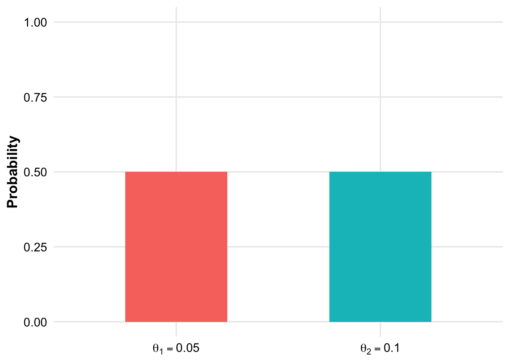
</details>


**After** collecting data, we have updated our prior beliefs about the defect rate:

<details open>
<summary>R codes are in the git repository</summary>

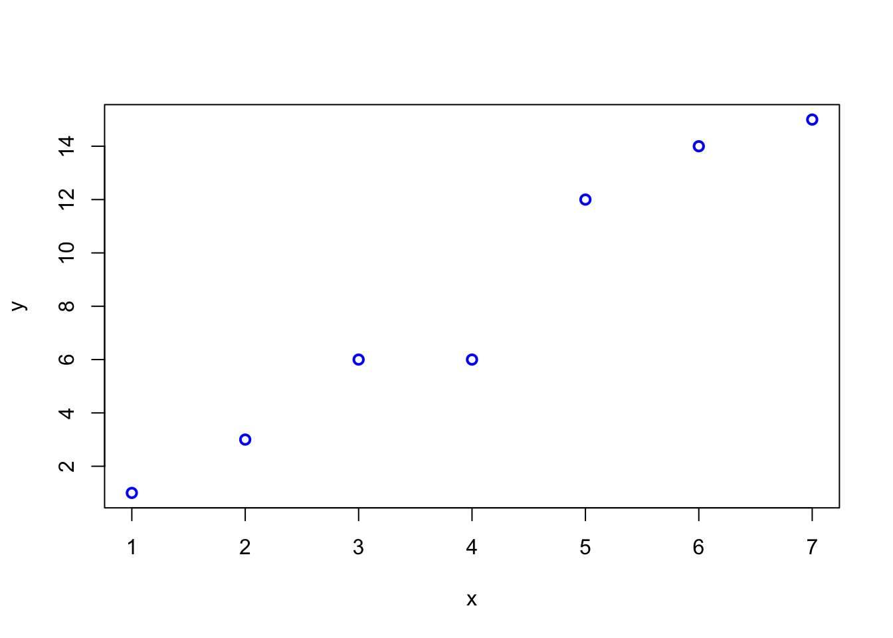
</details>

Let's assume, we know the manufacturer to be rather untrustworthy. Many inspections in the past
revealed higher defect rates than claimed. For simplicity, we still want to decide between the two 
defect rates. $0.05$ and $0.10$.

How does the calculation change if we assign a much higher probability to the defect rate of $0.10$?
See [Exercise 1](#exercise_defective_product_rate) for this.


### Example 2 - extending the defective products example {#example_defective_products_extended}

What if we do not want to limit ourselves to the two defect rates of 5% and 10%?
We now get creative and assign the following prior probability **distribution** to the defective rate $\theta$:

<details open>
<summary>R codes are in the git repository</summary>
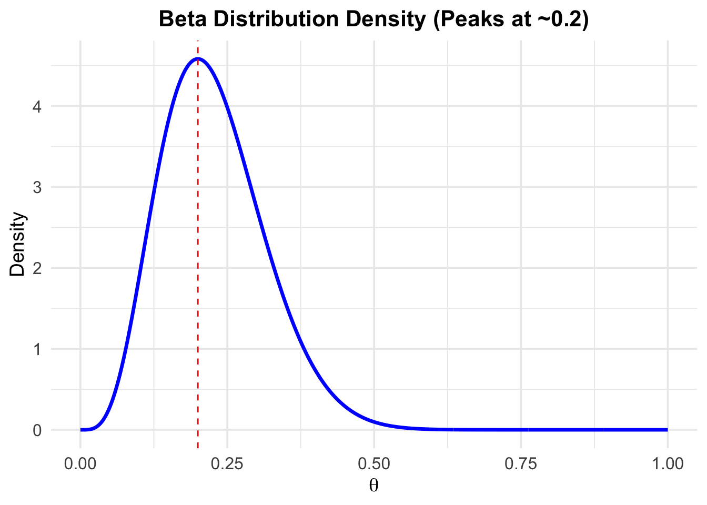

</details>

If we had to guess, we would say that the defect rate is most likely 20%.
And we are rather sure about this guess. The mode (highest prior probability) of the 
beta distribution is at 0.2. We are also pretty sure that the defect rate is not 0% or above, say, 50%.
This distribution is an expression of our **prior beliefs** about the defect rate.

Now, we **observe 11 defective items in a sample of 20**.
We expect as posterior distribution not a bar plot with two probabilities for the parameter values 
$\theta = 0.05$ and $\theta = 0.10$, but a **distribution** of probabilities for all possible defect rates (in the range of 0-1).
Btw. we could play the same game using a coin or the effectiveness or a therapy as example.

The only thing we need to do is to plug in the information into Bayes' theorem to get the posterior distribution.
The calculations would be complex by hand, so we just use R. We want to understand the concept, so calculating by hand
can be put off until later (if at all necessary for us.)

\[
\textit{p}(\theta \mid X = 3) = \frac{\textit{p}(X = 3 \mid \theta) \cdot \text{Beta}(\theta \mid \alpha, \beta)}{m(3)}
\]

- $\text{Beta}(\theta \mid \alpha, \beta)$ is the prior distribution (density) of the defect rate which captures our beliefs about the defect rate.

- $\textit{p}(X = 3 \mid \theta)$ is the likelihood of observing 3 defective items in a sample of 20 given a certain defect rate $\theta$.

- $m(3)$ is the marginal distribution of the data for $X = 3$ considering **all** possible defect rates between 0 and 1.

- $\textit{p}(\theta \mid X = 3)$ is the posterior density of the defect rate *given* the observed data.

Let's look at the resulting posterior distribution:

<details open>
<summary>R codes are in the git repository</summary>


</details>

As we can see, the posterior distribution has a new peak at $0.38$. If we had to guess
now, we would probably say that the defect rate is around 38%.
We have updated our beliefs about the defect rate based on the new data.
In the graph, there is also the observed defect rate of 55%. This observed rate (new data)
draws our prior beliefs towards the observed rate. 

- **The more data we observe**, the more the posterior distribution would be 
drawn towards the observed rate, because we would be surer due to the large sample size.

- **The stronger our prior beliefs** in a certain value (or range) of $\theta$, the less we are 
convinced by new data.

One really nice aspect of the Bayesian view is that we get a **full probability distribution** for 
the parameter of interest, given the prior beliefs and the observed data. 
We then can elegantly make all kinds of statements when looking at the posterior, like the following:

 - The probability that $\theta$ is between $0.30$ and $0.50$ is (area under the posterior) 
 approximately $0.80$:
<details open>
<summary>R codes are in the git repository</summary>
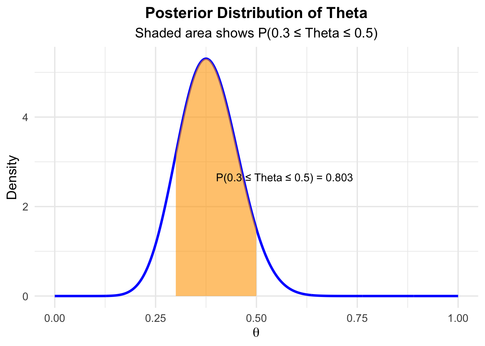
</details>

- The probability that $\theta$ is below $0.25$ is (area under the posterior):

<details open>
<summary>R codes are in the git repository</summary>
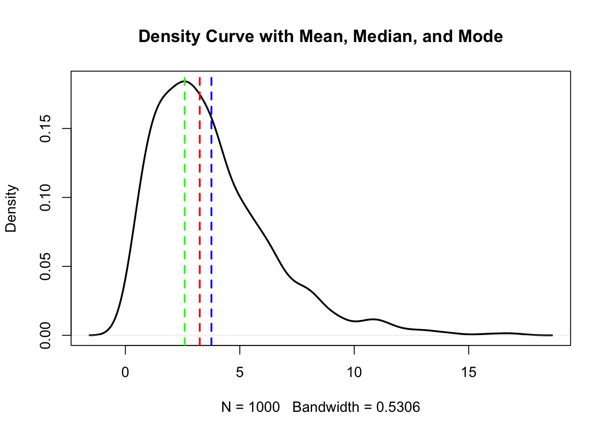
</details>

The previous two examples showcase how to **estimate a proportion** using prior knowledge 
and new data.
The fact, that we get a full distribution of the parameter of interest, 
is a key feature of Bayesian statistics and (as far as I know) not available
in frequentist statistics and Null Hypothesis Significance Testing (NHST), which we
will discuss in the next chapter.

## Highest Density Intervals (HDI)

Apart from taking the peak of the posterior distribution, 
another way to **summarize a posterior distribution** is by using 
the **highest density interval (HDI)**. 
The HDI identifies the most credible range of values in a distribution while 
covering a specified portion of the distribution, such as 93%. 
The key feature of the HDI is that every point 
inside the interval has a higher probability density than any point outside 
the interval, making it an effective summary of the most plausible values.

Here is an example for a 93% HDI for the posterior distribution of $\theta$: 

<details open>
<summary>R codes are in the git repository</summary>
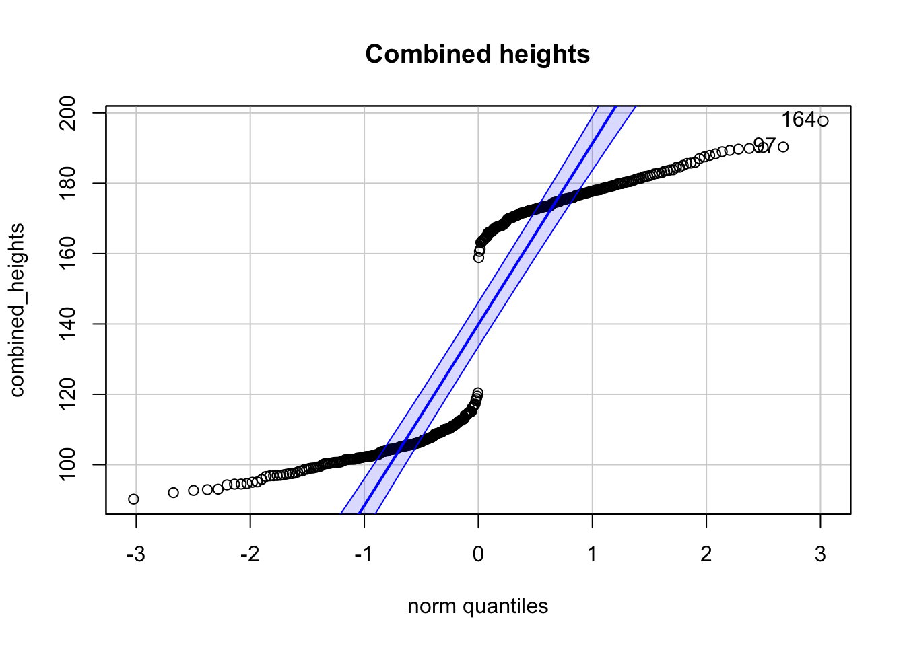
</details>

**Interpretation**: The 93% HDI for the posterior distribution of $\theta$ is $[0.25, 0.55]$.
With a probability of 93%, the defect rate is between 25% and 55%, given our prior 
beliefs and the observed data.

Note that the HDI does not necessarily have to be symmetric around the peak 
of the distribution. 

There could be, for instance, two peaks in the distribution, as you can see
[here](https://bookdown.org/content/3686/04_files/figure-html/unnamed-chunk-30-1.png) for instance.
In that case, the HDI would consist of two intervals. One could readily image
a real life case for such a distribution: 

Think of a group of people where the
measurement of interest is the 100 m sprint time. There could be two groups of people: 
The hobby runners and the professional athletes. The distribution of the sprint times would
probably be bimodal showing two peaks for the two groups.

There are other ways, one can construct credible intervals.
We could also use the quantiles of the posterior distribution to construct a credible interval.
If the distribution is symmetric, the quantiles are symmetric around the peak of the distribution
and the HDI is the same as the quantile-based credible interval.

A [credible interval](https://en.wikipedia.org/wiki/Credible_interval) 
is **not** the same as a 
[confidence interval](https://en.wikipedia.org/wiki/Confidence_interval) in frequentist statistics.
We will discuss this in the next chapter. 

Briefly, a **credible interval** is a range of values
for a parameter of interest that has a specified probability of containing the 
unobserved parameter.

A **confidence interval** is an interval which is expected to contain the **true, 
but unknown** parameter of interest in a certain percent of times (e.g., 92%), when 
[constructed **repeatedly** everytime a new sample is drawn](https://en.wikipedia.org/wiki/Confidence_interval#/media/File:Normal_distribution_50%25_CI_illustration.svg). 


## Bayesian $t$-test {#bayesian_t_test}

Above, we looked at some aspects of estimating a parameter (proportion) using Bayes' theorem.
We can answer all sorts of other questions using this paradigm. In classical statistics,
one often wants to know if two groups differ with respect to their true means. 
This answer is typically given by the famous [t-test](https://en.wikipedia.org/wiki/Student%27s_t-test) 
([small "t"](https://pure.manchester.ac.uk/ws/portalfiles/portal/78743532/studentt.pdf) please).
I encourage you to read the short [history](https://en.wikipedia.org/wiki/Student%27s_t-test#History) of the t-test.

For didactic reasons, we will look at the Baysian version of the t-test first.
We want to try to view statistics as more than just a 
[cookbook of recipes](https://www.methodenberatung.uzh.ch/de/datenanalyse_spss.html). 
Unfortunately, very often it is taught that way and the impression is given that statistics is 
just a set of tools to apply in a certain order. In my humble opinion, this is not the case. Statistics
and model building is a creative process and - if you want to go so far - an art form.
**Statistics is difficult and beautiful - in that order**.

Unfortunately, it is not completely trivial to apply the Bayesian t-test, as opposte to the frequentist t-test,
which constitutes one line of code in R.

We'll use the not anymore maintained R package [BEST](https://cran.r-project.org/web/packages/BEST/index.html)
for a nice illustration. Later, we will use more up-to-date packages like [brms](https://cran.r-project.org/web/packages/brms/index.html).

### Example - Bayesian t-test


``` r
(y1 <- c(-.5, 0, 1.2, 1.2, 1.2, 1.9, 2.4, 3) * 100)
```

```
## [1] -50   0 120 120 120 190 240 300
```

``` r
(y2 <- c(-1.2, -1.2, -.5, 0, 0, .5, 1.1, 1.9) * 100)
```

```
## [1] -120 -120  -50    0    0   50  110  190
```

``` r
length(y1)
```

```
## [1] 8
```

``` r
length(y2)
```

```
## [1] 8
```

``` r
data <- data.frame(y1,y2)
psych::describe(data)
```

```
##    vars n  mean     sd median trimmed    mad  min max range  skew kurtosis
## y1    1 8 130.0 116.00    120   130.0 140.85  -50 300   350 -0.13    -1.39
## y2    2 8   7.5 107.94      0     7.5 118.61 -120 190   310  0.29    -1.38
##       se
## y1 41.01
## y2 38.16
```

``` r
# Boxplot:
data.frame(y = c(y1, y2), group = c(rep(1, 8), rep(2, 8))) %>%
  ggplot(aes(x = factor(group), y = y)) +  # Use factor for discrete x-axis
  geom_boxplot() +                        # Add boxplot layer
  geom_jitter(width = 0.1)                # Add jitter for individual
```

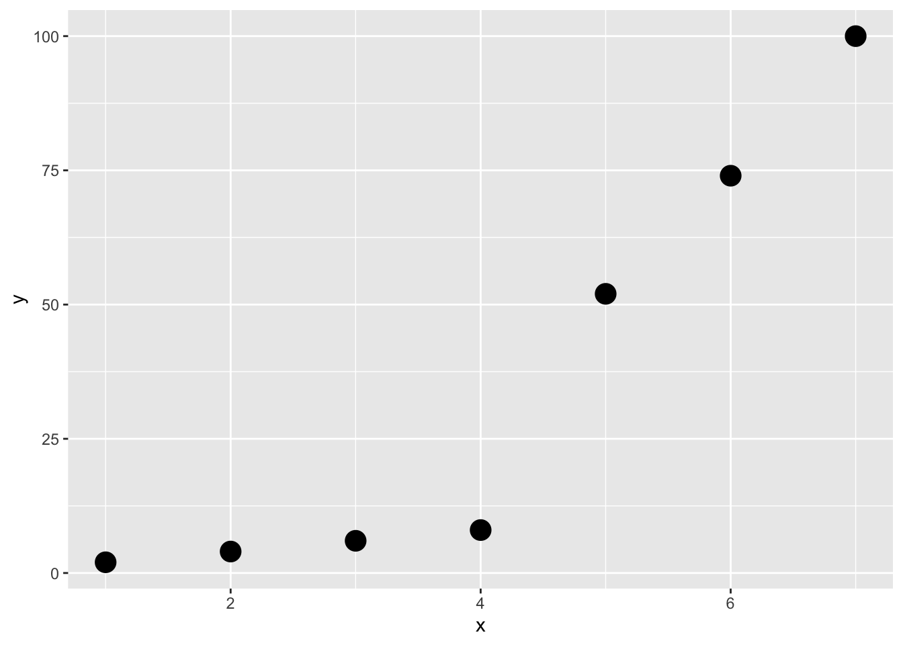

``` r
# -> Visually, there seems to be a difference between the two groups.
```

We work with a rather small sample size, 8 in each group. 
**We want to know if the two groups differ in their (unobserved) means**.
For this, we will apply the R function `BESTmcmc` from the package `BEST`.


``` r
set.seed(33443)
p_load(HDInterval, BEST, tictoc, psych, tidyverse)
# H_0: mue1 - mue2 = delta_0 
a <- 20 # ROPE (region of practical equivalence)
d_0 <- 0
BESTout <- BESTmcmc(y1, y2, verbose = TRUE)
```

```
## Waiting for parallel processing to complete...done.
```

``` r
plot(BESTout, which = "mean", compVal = d_0,
     ROPE = d_0 + c(-1, 1) * a, showCurve = FALSE, credMass = 0.93)
```

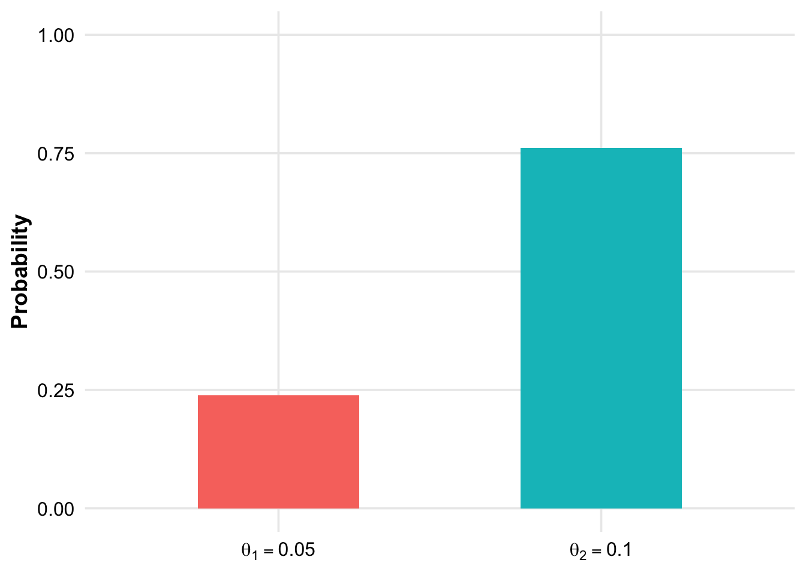

`BESTmcmc` is a function that uses a Markov Chain Monte Carlo (MCMC) 
algorithm to estimate the posterior distribution of the difference between the means of two groups.
We do not care about these details for now, but try to interpret what we see.

The plot shows the posterior distribution of the difference between the means of the two groups.

- With the parameter `which = "mean"`, we are interested in the **posterior distribution of 
difference of the means** ($\mu_1 - \mu_2$). We see a full probability distribution again.

- The parameter `compVal = d_0` is the value we want to compare the posterior distribution to. Here We
chose delta_0 = 0, which means that we want to know if the difference between the means is 
different from zero.

- The parameter `ROPE = d_0 + c(-1, 1) * a` ($= -20$ to $20$) defines the region of practical equivalence (ROPE).
In our case, we chose a = 20. This means that we consider differences between the means of the two groups
of $\pm 20$ as practically equivalent. In practice, you would choose a value that is meaningful for your
particular research question. For instance, in a planned experiment, we are interested in changes
on the Roland Morris Disability Questionnaire (RMDQ) of 2 points. 
We would then choose a value of 2 for the ROPE, since only a change beyond this value would be
clinically relevant for the patient. 

- The parameter `credMass = 0.93` is the probability mass to include in credible intervals, in this case 93%.

- The 93% HDI for the difference between the means is shown in the graph, hence given 
the prior information and the observed data, we can be 93% sure that the 
difference between the means is in this interval. The HDI changes everytime the code of this 
script is run, since it's simulation based.

We can do more:

``` r
summary(BESTout, ROPEm = d_0 + c(-1, 1) * a, compValm = 0,
        digits = 5, credMass = 0.93) # summary.BEST()
```

```
##              mean  median    mode HDI%    HDIlo  HDIup compVal %>compVal
## mu1       130.912 131.093 130.032   93   32.179 226.34                  
## mu2         6.165   6.044   8.552   93  -86.307  95.27                  
## muDiff    124.747 124.930 127.633   93  -12.579 253.96       0      95.6
## sigma1    139.851 128.738 112.246   93   66.206 226.88                  
## sigma2    130.271 119.659 106.155   93   60.742 211.44                  
## sigmaDiff   9.580   8.567   8.693   93 -121.407 135.97       0      56.4
## nu         34.408  25.825   9.516   93    1.228  83.92                  
## log10nu     1.380   1.412   1.484   93    0.657   2.06                  
## effSz       0.964   0.955   0.941   93   -0.085   2.00       0      95.6
##           ROPElow ROPEhigh %InROPE
## mu1                               
## mu2                               
## muDiff        -20       20    4.63
## sigma1                            
## sigma2                            
## sigmaDiff                         
## nu                                
## log10nu                           
## effSz
```

If you look at the row "muDiff" and the column "%>compVal". This is the percentage 
of the posterior distribution that is greater than 0. We can say, with a probability of 
~95%, the difference between the means is greater than 0. 

Would we conclude that the two groups differ in their means?
According to [Kruschke](https://nyu-cdsc.github.io/learningr/assets/kruschke_bayesian_in_R.pdf) (p.336): 

**"A parameter value is declared to be not credible, 
or rejected, if its entire ROPE lies outside the highest density interval 
(HDI) of the posterior distribution of that parameter."**

This is not the case here. We would not conclude, that the means between the groups differ.
One could argue, that this rule seems rather strict considering, that ~95% of the 
posterior distribution of the differences is greater than 0.

As opposed to the frequentist t-test, we can also **affirm the null hypothesis**, 
that the means in the two groups are equal. This is a nice feature of the Bayesian t-test.

**"A parameter value is declared to be accepted for practical purposes if that value’s 
ROPE completely contains the X% HDI of the posterior of that parameter."**

This is also not the case here. The 93% HDI lies outside the ROPE to a large part.

Note, "The decision rule for accepting the null value says merely that the most 
credible values are practically equivalent to the null value according to the 
chosen ROPE, not necessarily that the null value has high credibility."
([Kruschke](https://nyu-cdsc.github.io/learningr/assets/kruschke_bayesian_in_R.pdf), p.337)


We are above in the situation, that we cannot make a clear decision. 
The ROPE does not contain the 93% HDI, and the 93% HDI is not 
completely outside the ROPE.

**“When the HDI and ROPE overlap, with the ROPE not completely 
containing the HDI, then neither of the above decision rules is satisfied, 
and we withhold a decision. This means merely that the current data are insufficient to 
yield a clear decision one way or the other, according to the stated decision criteria."**
([Kruschke](https://nyu-cdsc.github.io/learningr/assets/kruschke_bayesian_in_R.pdf), p.337)"


What have we learned so far: 

- Estimating a proportion using Bayes' theorem [Example about the proportion of defective products](#example_defective_products)

- Using a whole continuous distribution as prior knowledge [Example about the proportion of defective products extended](#example_defective_products_extended)

- Analysis if two groups differ in their means or have the same mean [Example about the Bayesian t-test](#bayesian_t_test)

Latest in QM2, we will do Bayesian regression analysis using packages like `brms` from 
[Paul Bürkner](https://www.tu-dortmund.de/universitaet/neuberufene-professorinnen/prof-paul-christian-buerkner/) or 
`rethinking` from [Richard McElreath](https://www.eva.mpg.de/ecology/staff/richard-mcelreath/).

## Bayesian updating

The following is an animated example of Bayesian updating. 
The true probability for heads in a coin toss is $\theta = 0.77$.
We throw a coin 100 times and we start with a uniform prior distribution, i.e., 
every value between 0 and 1 is equally likely at the beginning.
Everytime a coin is tossed, the prior distribution is updated with the new data. 
The posterior distribution is the prior for the next coin toss.
One can see that we are converging to the "truth" (which is normally not known).

Code can be found [here.](https://github.com/jdegenfellner/Script_QM1_ZHAW/blob/main/R_codes_with_long_compute_time/posterior.R)


```
## Linking to ImageMagick 6.9.12.93
## Enabled features: cairo, fontconfig, freetype, heic, lcms, pango, raw, rsvg, webp
## Disabled features: fftw, ghostscript, x11
```

```
## # A tibble: 100 × 7
##    format width height colorspace matte filesize density
##    <chr>  <int>  <int> <chr>      <lgl>    <int> <chr>  
##  1 GIF      480    480 sRGB       TRUE         0 72x72  
##  2 GIF      480    480 sRGB       TRUE         0 72x72  
##  3 GIF      480    480 sRGB       TRUE         0 72x72  
##  4 GIF      480    480 sRGB       TRUE         0 72x72  
##  5 GIF      480    480 sRGB       TRUE         0 72x72  
##  6 GIF      480    480 sRGB       TRUE         0 72x72  
##  7 GIF      480    480 sRGB       TRUE         0 72x72  
##  8 GIF      480    480 sRGB       TRUE         0 72x72  
##  9 GIF      480    480 sRGB       TRUE         0 72x72  
## 10 GIF      480    480 sRGB       TRUE         0 72x72  
## # ℹ 90 more rows
```

<div class="figure">
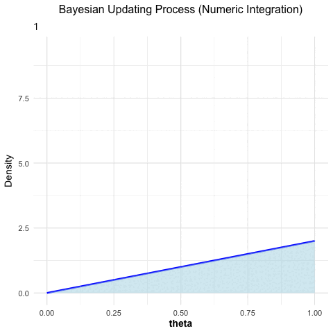
<p class="caption">(\#fig:testing)example caption</p>
</div>

This [video](https://www.youtube.com/watch?v=rUoJvogN7qQ&t=4s&ab_channel=CoreyChivers) illustrates the concept of Bayesian updating as well 
using two different starting points. The opinions seem to converge.


## More complex parameter spaces

Above we dealt with the rather simple case of one parameter ($\theta$), the proportion of defective products or the fairness of a coin.
Some of these cases can be solved analytically, like the coin toss example. One can calculate the shape of the posterior distribution
exactly. We are mainly interested in simulation-based results, since we are practitioners. 

In the Baysian t-test, we had two groups and the difference of their means. Behind the scenes there were already more than two parameters
estimated (see Figure 2 [here](https://jkkweb.sitehost.iu.edu/articles/Kruschke2013JEPG.pdf)). 
Here lies the computational bottleneck of Bayesian statistics. The more parameters we have, the more complex the parameter space becomes.
In order to estimate the posterior distribution, we have to sample from the parameter space by walking through intelligently. 
This can be computationally intensive.
The [animation](https://revolution-computing.typepad.com/.a/6a010534b1db25970b019aff4a7bbc970d-pi)
in [this article](https://www.r-bloggers.com/2013/09/an-animated-peek-into-the-workings-of-bayesian-statistics/) 
shows the walk through of the parameter space nicely for the case of a normal distribution with two parameters ($\mu$ and $\sigma$).

For statistical models with many parameters and observations, the computation can take a long time. Very often though, computational time
is not an issue and we can make use of the flexibility and intuitive interpretation of Bayesian statistics.

## Advantages/disadvantages of Bayesian statistics

### (Some) Advantages
- **Full probability distributions**: We get a full probability distribution for the parameter of interest.

- **Flexibility**: We can incorporate prior knowledge into our analysis.

- **Interpretability**: We can make statements about the probability of certain parameter values.

- **No p-values**: We do not need to rely on p-values and NHST (Null Hypothesis Significance Testing). 
John Kruschke points out many problems with 
NHST in his [book](https://nyu-cdsc.github.io/learningr/assets/kruschke_bayesian_in_R.pdf) and
 [article](https://psycnet.apa.org/record/2012-18082-001). It seems that for many practinioners, p-values are
 hard to understand and interpret correctly. There are many 
 [misconceptions about p-values](https://www.sciencedirect.com/science/article/abs/pii/S0037196308000620). 
 And one should definitely 
 [move away a dichotomous thinking of "significant" and "non-significant"](https://www.tandfonline.com/doi/full/10.1080/00031305.2019.1583913) results.

### (Some) Disadvantages
- **Computational complexity**: Calculating the posterior distribution can be computationally intensive. 
Even with modern computers and the latest packages, it can take a long time to get results. Classical statistical models
are often estimated within fractions of a second.

- **Barriers to entry**: Statistics courses and textbooks often focus on frequentist statistics, as well as many
sofware packages lean more towards frequentist statistics. This can make it difficult for newcomers to learn Bayesian statistics.
When publishing, many reviewers could be sceptical or unfamiliar with Bayesian statistics.

- **Subjectivity**: The choice of the prior distribution can be subjective. 
There is also the question which prior to choose.


## Exercises

Difficulty levels of exercises: 
**E**: easy, 
**M**: intermediate, 
**D**: difficult

## [E] Exercise 1 - defective product rate {#exercise_defective_product_rate}
Let's revisit [Example 1](#example_defective_products) and change the prior probabilites to
$\pi(0.05) = 0.1$ and $\pi(0.10) = 0.9$.

Calculate and plot the posterior probabilities for $\theta = 0.05$ and $\theta = 0.10$.

## [H] Exercise 2 - Bayesian updating
We want to check empirically that the **order of data collection does not influence the posterior distribution**.
We want to find out the probability $\theta$ of a therapy to work.
Since we have absolutely no idea, how effective the therapy is, let our prior distribution be a [uniform 
distribution](https://en.wikipedia.org/wiki/Continuous_uniform_distribution) between 0 and 1 
(this has to be argued for more rigorously in practice). Hence, 
every value between 0 and 1 is equally likely:

$\pi(\theta) = 1$ for $\theta \in [0,1]$.


``` r
# Load required libraries
library(ggplot2)

# Generate data for a uniform distribution
theta <- seq(0, 1, length.out = 100)  # Range of theta
density <- dunif(theta, min = 0, max = 1)  # Uniform density

# Create a data frame for ggplot
df <- data.frame(theta = theta, density = density)

# Plot the density function
ggplot(df, aes(x = theta, y = density)) +
  geom_line(color = "blue", linewidth = 1.2) +  # Density line
  geom_area(fill = "lightblue", alpha = 0.5) +  # Shaded area under the curve
  labs(
    title = "Prior: Uniform Distribution",
    x = expression(theta),
    y = "Density"
  ) +
  theme_minimal(base_size = 14) +
  theme(
    plot.title = element_text(face = "bold", size = 16, hjust = 0.5),
    axis.title = element_text(face = "bold")
  )
```

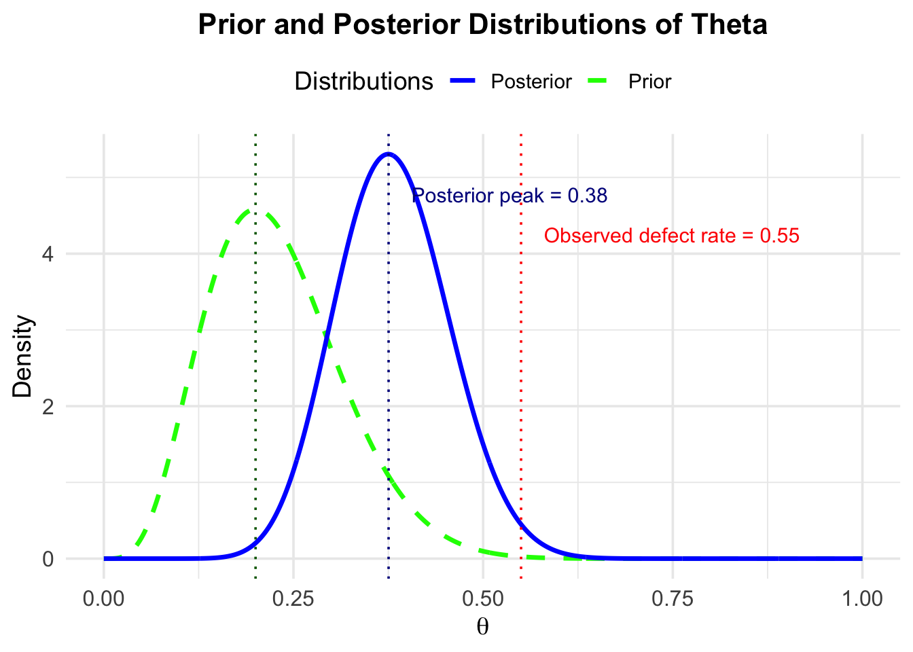

Notize, that the area under the curve is 1, since it is a probability density function. 
For example, $\mathbb{P}(\theta \in (0.25,0.75)) = 0.5$

- Experiment 1 one shows that the therapy works in 17 out of 50 cases.
- Experiment 2 shows that the therapy works in 23 out of 50 cases.

So we go from:

Prior $\rightarrow$ experiment 1 $\rightarrow$ posterior 1 $\rightarrow$ experiment 2 $\rightarrow$ posterior12.

Or

Prior $\rightarrow$ experiment 2 $\rightarrow$ posterior 2 $\rightarrow$ experiment 1 $\rightarrow$ posterior21.

- Show that posterior12 and posterior21 should be the same and draw both posterior distributions into one plot.

- [Optional] Show this result analytically.

## Solutions
Solutions for this chapter can be found [here](https://github.com/jdegenfellner/Script_QM1_ZHAW/tree/main/Solutions_to_Exercises/4_Bayes_Statistics).

<!--chapter:end:04-Bayes_statistics.Rmd-->

# Null Hypothesis Significance Testing (NHST)

Null Hypothesis Significance Testing (NHST) is a statistical method widely used in research, 
including health sciences, to evaluate whether observed data provide sufficient evidence **to refute** a specific hypothesis. 
It operates within a framework of probability and decision-making to address the following question:

Are the observed results likely to occur by chance alone if the null hypothesis is true?
If one decides that the observed results are unlikely to occur by chance alone, 
the null hypothesis is rejected in favor of an alternative hypothesis.

NHST is **not designed to "prove" hypotheses** but rather to provide evidence against the null hypothesis.
Underlying NHST is the idea of [falsifiability](https://en.wikipedia.org/wiki/Falsifiability). 
Sometimes one counter example is enough to reject a hypothesis like "all swans are white". 
Seeing one [black swan](https://en.wikipedia.org/wiki/Falsifiability#/media/File:Black_Swans.jpg), 
proves the hypothesis wrong.

**Key concepts**:

- **Null Hypothesis $H_0$**: This represents the assumption of some specific effect or no effect at all. 
For example, in a clinical trial comparing two treatments, might state that both treatments have the same effect. 
The alternative ist that one treatment is superior to the other.

- **Alternative Hypothesis $H_1$**: This is the opposing claim to $H_0$, the logical complement. 
Example: 
   - $H_0: \theta \le 0.4$
   - $H_1: \theta > 0.4$
   - $H_0$ states that the treatment effect is less than or equal to 0.4, while $H_1$ states that the population proportion is greater than 0.4. 
	

- **$p$-value**: The p-value quantifies the probability of obtaining results as extreme as (or more extreme than) 
the observed data, assuming that $H_0$ is true. 
A smaller $p$-value indicates stronger evidence against $H_0$. There are many [misconeptions about p-values](https://www.sciencedirect.com/science/article/abs/pii/S0037196308000620).

- **Significance level $\alpha$**: Researchers set a threshold to determine whether to reject $H_1$. 
If the $p$-value is smaller than $\alpha$, $H_0$ is rejected in favor of $H_1$.
Note, that **there is absolutely now special reason to use $\alpha = 0.05$ as a default value**.
To quote [Ronald Fisher](https://link.springer.com/chapter/10.1007/978-1-4612-4380-9_6):
"..., and it is convenient to take twice the standard error as the limit of 
significance; this is roughly equivalent to the corresponding limit P=0.05, ..."


**How NHST works**:

- Formulate Hypotheses: Define $H_0$ (e.g., “The new therapy has no effect”) 
  and $H_1$ (e.g., “The new therapy improves outcomes”).

- Collect data: Perform an experiment or study to gather relevant data.

- Calculate the test statistic: Compute a value based on the sample data that 
  reflects the difference or effect under investigation.
- Compute the $p$-Value: Determine the probability of observing the 
  test statistic (or more extreme values) if $H_0$ is true.
- Make a Decision: Compare the p-value to the significance level:
  - If $p < \alpha$: Reject $H_0$; evidence suggests $H_1$ is true.
  - If $p \ge \alpha$: Fail to reject $H_0$; insufficient evidence to support $H_1$.

**(Some) Limitations of NHST**: 

- **Focus on $p$-values with hard cut-offs**: Solely relying on p-values can lead to overinterpretation of
  results without considering practical significance.
	
-	**Dichotomous thinking**: The decision to “reject” or “fail to reject” $H_0$ 
  oversimplifies the complexity of real-world data. This binary thinking
  incentivizes researchers to [focus on statistical significance](https://www.tandfonline.com/doi/full/10.1080/00031305.2018.1447512) 
  rather than real relevance. It happened to me not only once that a colleague 
  looked at me with a sad facial expression announcing that the $p$-value was "not significant".
  This should be not an issue at all. The focus should be on doing useful analyses in the most
  rigorous way possible.
	
- **Sample size influence**: Large samples can make small, clinically irrelevant 
  differences statistically significant. Example: Given an arbitrarily small difference between means of two groups. There is 
  always a sample size that makes the difference "significant". See [Exercise 2](#exercise2_nhst).

- **[Publication bias](https://en.wikipedia.org/wiki/Publication_bias)**: Many journals tended to publish studies with "significant" results. "Not significant" results
  were often not published. This can lead to a distorted view of the literature.

- **[$p$-hacking](https://de.wikipedia.org/wiki/P-Hacking)**: In the pursuit for "significant" results 
(which results in publications, which results in tenure), it is natural to do everything to get them. 
  This can include data dredging, selective reporting, and other questionable practices.

See [Kruschke](https://jkkweb.sitehost.iu.edu/articles/Kruschke2013JEPG.pdf) for more limitations of NHST.

In practice, NHST should be accompanied by confidence intervals, 
effect size calculations, and a focus on clinical relevance to provide 
a more comprehensive understanding of the results.

This [Review of NHST](https://f1000research.com/articles/4-621/v3) or 
[this overview](https://en.wikipedia.org/wiki/Statistical_hypothesis_test) might be a good entry point.

This [video](https://www.youtube.com/watch?v=FZ2_hzMyJpY&ab_channel=VeryNormal) could also help to understand the basic concepts.


## Example in the literature

$p$-values are omnipresent in the scientific literature. There a rather few papers in our field that do not contain them. 
We **do not use $p$-values in in descriptive tables** 
(see [here](https://epitodate.com/the-balance-test-fallacy-why-you-shouldnt-put-p-values-in-table-1/) and 
[here](https://www.acpjournals.org/doi/10.7326/0003-4819-147-8-200710160-00010-w1)).

Here is an [example from the literature](https://www.tandfonline.com/doi/full/10.1080/09593980601023754#d1e100).
Table 2 lists studies and one column is the $p$-value. Note, that it is not good practice to present $p$-values 
(if one should use them at all) as dichotomy: $p < 0.05$. This statement does 
not allow to judge the strength of the evidence against the null hypothesis. Both, $p = 0.00000001$ and $p = 0.049$ would satisfy
the inequality.


## Binomial test

In the first chapter, we invented the 1000-researcher experiment. There, we have already encountered hypothesis tests in disguise.
If we would assume that the probability of a false positive is 0.04, 
we would "expect" 40 false positives. We asked, what is the probability of observing
137 or more. This is an example of a hypothesis test:

- $H_0: \theta \le 0.04$
- $H_1: \theta > 0.04$

Under $H_0$, what is the probabilty to see the oberved number of 
false positives (in our case, this is the test statistic) or more?

The answer was $p = 5.551115 \cdot 10^{-16}$.

A reasonable person would say, that this result did not happen by chance alone and 
therefore conclude, the true, but unknown false positive rate $\theta$ is larger than 0.04.

Formally, this is called a **(one-sided) [binomial test](https://en.wikipedia.org/wiki/Binomial_test)**.

Note, that **$H_1$ is the logical complement of $H_0$**.


``` r
# binomial test
binom.test(137, 1000, p = 0.04, alternative = "greater")
```

```
## 
## 	Exact binomial test
## 
## data:  137 and 1000
## number of successes = 137, number of trials = 1000, p-value < 2.2e-16
## alternative hypothesis: true probability of success is greater than 0.04
## 95 percent confidence interval:
##  0.1194241 1.0000000
## sample estimates:
## probability of success 
##                  0.137
```

The output in R tells us the following:

- data: 137 and 1000 successes oberved
- alternative hypothesis: true probability of success is greater than 0.04, which we assume afterwards.
- $p$-value$ < 2.2e-16$. This is value is smaller than the precision in R (`.Machine').
- 95 percent confidence interval: $0.1194241$ to $1.0000000$. 
The upper limit of $1$ occurs since we have a once-sided test.
- Sample estimates: Estimating the true (but unknown) proportion from the sample would just be: 
$\frac{137}{1000} = 0.137$

**Two-sided test**:

- $H_0: \theta = 0.04$
- $H_1: \theta \ne 0.04$

One could argue that this is bad style, since we should probably know the direction of the effect.


``` r
binom.test(137, 1000, p = 0.04, alternative = "two.sided")
```

```
## 
## 	Exact binomial test
## 
## data:  137 and 1000
## number of successes = 137, number of trials = 1000, p-value < 2.2e-16
## alternative hypothesis: true probability of success is not equal to 0.04
## 95 percent confidence interval:
##  0.1162817 0.1598810
## sample estimates:
## probability of success 
##                  0.137
```

- alternative = "two.sided", this indicates that we are interested in both directions (higher or lower than $0.04$).
With some experience, one would probably not test for lower when seeing the observed number of 137.
- 95 percent confidence interval: $0.1162817$ to $0.1598810$.

**Interpretation of this interval**: When drawing repeated samples, in 95% percent of the samples,
the so constructed interval (which will be different everytime) contains the true but unknown parameter.

Note, that the "Exact binomial test" was used. There where no approximations made. I would recommend always
using [exact tests](https://en.wikipedia.org/wiki/Exact_test) if available, since we are in the 21th century and computers are fast.

Again, **the $\alpha$ level of $0.05$ has nothing special (apart from convention) to it**. 
We can also use a $\alpha = 0.14$ level. In this case, we construct confidence intervals 
with a 86% confidence level.


``` r
binom.test(137, 1000, p = 0.04, alternative = "two.sided", conf.level = 0.86)
```

```
## 
## 	Exact binomial test
## 
## data:  137 and 1000
## number of successes = 137, number of trials = 1000, p-value < 2.2e-16
## alternative hypothesis: true probability of success is not equal to 0.04
## 86 percent confidence interval:
##  0.1211304 0.1542134
## sample estimates:
## probability of success 
##                  0.137
```

- confidence interval: $0.1211304$ to $0.1542134$. 

With **smaller coverage probability** (86 instead of 95), we get a **narrower interval**.
Trivially, a 100% confidence interval would be $0$ to $1$ and a 0% confidence interval would be $0.04$ to $0.04$ or any other 
specific value assuming that the true parameter can take any value from $0$ to $1$.

See also [Exercise 3](#exercise3_nhst).

**Comparison with Bayesian version** of estimating $\theta$:

- We cannot include a prior distribution for the paramater $\theta$.
- We cannot calculate the posterior distribution of $\theta$. 
Hence, we cannot make statements like "the probability that $\theta$ is larger than 0.04 is 0.9".
- Prior knowledge could probably be included in the form of the null hypothesis stating, for instance, that $\theta \le 0.2$. 
This could be based on previous studies or expert knowledge.


## Proportions test

If we are interested in comparing two proportions, 
we can use the [proportions test](https://www.rdocumentation.org/packages/stats/versions/3.6.2/topics/prop.test).

### One sample case

``` r
set.seed(443)
heads <- rbinom(1, size = 100,
prob = 0.5) # create a sample with known probability
prop.test(heads, 100,
conf.level = 0.94, p = 0.5) # continuity correction TRUE by default
```

```
## 
## 	1-sample proportions test with continuity correction
## 
## data:  heads out of 100, null probability 0.5
## X-squared = 0.25, df = 1, p-value = 0.6171
## alternative hypothesis: true p is not equal to 0.5
## 94 percent confidence interval:
##  0.3739955 0.5681618
## sample estimates:
##    p 
## 0.47
```

``` r
prop.test(heads, 100,
correct = FALSE, conf.level = 0.94, p = 0.5) # no continuity correction
```

```
## 
## 	1-sample proportions test without continuity correction
## 
## data:  heads out of 100, null probability 0.5
## X-squared = 0.36, df = 1, p-value = 0.5485
## alternative hypothesis: true p is not equal to 0.5
## 94 percent confidence interval:
##  0.3787665 0.5632834
## sample estimates:
##    p 
## 0.47
```

- correct = TRUE indicates the a correction ([Yates](https://en.wikipedia.org/wiki/Yates%27s_correction_for_continuity)) 
is used to make the test more accurate and consider the fact that the test statistic is in fact discrete.

- 94% confidence interval: $0.3739955$ to $0.5681618$.

- $\chi^2 = 0.25$. This is the value of the test statistic used in the test. 
Under the null hypothesis (in this case $H_0 = 0.5$), 
the test statistic follows a [$\chi^2$ distribution](https://en.wikipedia.org/wiki/Chi-squared_distribution).

See also [Exercise 4](#exercise4_nhst).

### More than one sample {#proportions_test_more_samples}

Example:


``` r
# Data from Fleiss (1981), p. 139.
# H0: The null hypothesis is that the four populations from which
#     the patients were drawn have the same true proportion of smokers.
# H1: The alternative is that this proportion is different in at
#     least one of the populations.

smokers  <- c(83, 90, 129, 70)
patients <- c(86, 93, 136, 82)
prop.test(smokers, patients)
```

```
## 
## 	4-sample test for equality of proportions without continuity correction
## 
## data:  smokers out of patients
## X-squared = 12.6, df = 3, p-value = 0.005585
## alternative hypothesis: two.sided
## sample estimates:
##    prop 1    prop 2    prop 3    prop 4 
## 0.9651163 0.9677419 0.9485294 0.8536585
```

- $p$-value $= 0.005585$. One would argue that this test statistic is unlikely to have come about by chance 
alone and reject the null hypothesis, that all proportions are equal.

- X-squared = 12.6, df = 3. The test statistic is distributed according to a $\chi^2$ distribution 
with 3 [degrees of freedom](https://en.wikipedia.org/wiki/Degrees_of_freedom_(statistics)).
See also [exercise 5](#exercise5_nhst). 
Degrees of freedom is the number of values in the final calculation of a statistic that are free to vary.

## (Classical) $t$-test
The [$t$-test](https://en.wikipedia.org/wiki/Student%27s_t-test) is one of the most 
famous classical statistical tests out there. 
Consider these links: [1](https://www.youtube.com/watch?v=pXuFeRCMTAo&ab_channel=VeryNormal)
[2](https://www.youtube.com/watch?v=pLNuDye_tq4&ab_channel=VeryNormal)
as starting point. 

With the $t$-test, we want to answer the question 

- if the true, but unobserved mean of a population is different from a 
specific value ([one sample $t$-test](https://en.wikipedia.org/wiki/Student%27s_t-test#One-sample_t-test)) or

- if the true, but unobserved means of two populations are different from each other ([two sample $t$-test](https://en.wikipedia.org/wiki/Student%27s_t-test#Two-sample_t-tests)).

Conveniently, R has a built-in function for these tests.


### One sample $t$-test
.......

### Two sample $t$-test
Let's jump right in and use our example from the previous chapter where we performed the Bayesian $t$-test:


``` r
(y1 <- c(-.5, 0, 1.2, 1.2, 1.2, 1.9, 2.4, 3) * 100)
```

```
## [1] -50   0 120 120 120 190 240 300
```

``` r
(y2 <- c(-1.2, -1.2, -.5, 0, 0, .5, 1.1, 1.9) * 100)
```

```
## [1] -120 -120  -50    0    0   50  110  190
```

``` r
length(y1)
```

```
## [1] 8
```

``` r
length(y2)
```

```
## [1] 8
```

``` r
data <- data.frame(y1, y2)
psych::describe(data)
```

```
##    vars n  mean     sd median trimmed    mad  min max range  skew kurtosis
## y1    1 8 130.0 116.00    120   130.0 140.85  -50 300   350 -0.13    -1.39
## y2    2 8   7.5 107.94      0     7.5 118.61 -120 190   310  0.29    -1.38
##       se
## y1 41.01
## y2 38.16
```

``` r
# Boxplot:
data.frame(y = c(y1, y2), group = c(rep(1, 8), rep(2, 8))) %>%
  ggplot(aes(x = factor(group), y = y)) +  # Use factor for discrete x-axis
  geom_boxplot() +                        # Add boxplot layer
  geom_jitter(width = 0.1)                # Add jitter for individual
```

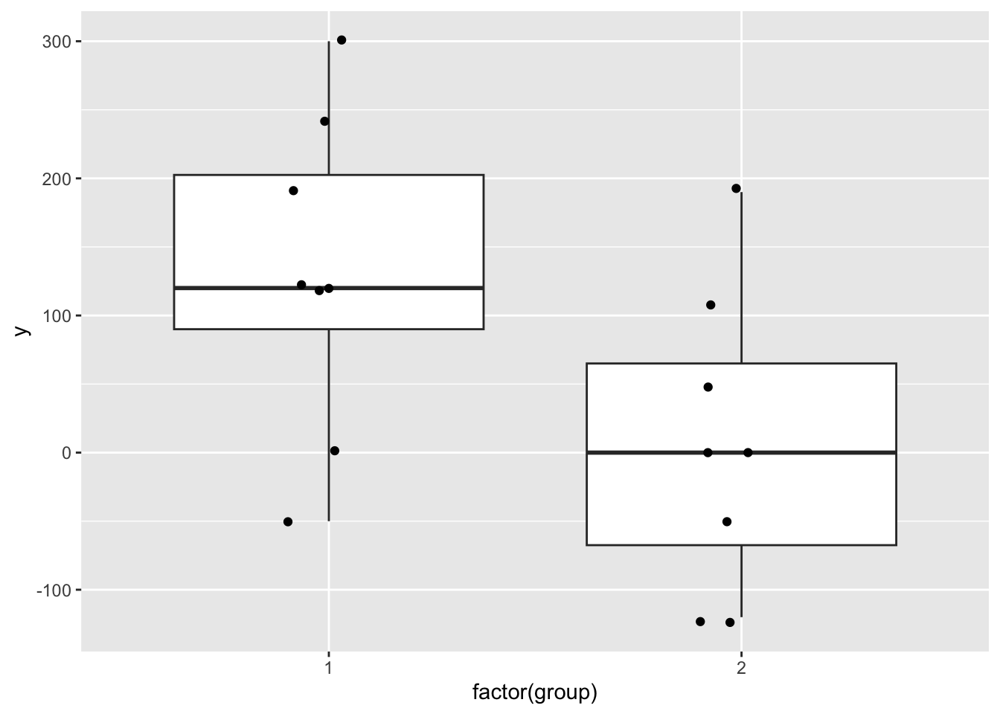

``` r
# -> Visually, there seems to be a difference between the two groups.

t.test(y1, y2, conf.level = 0.93)
```

```
## 
## 	Welch Two Sample t-test
## 
## data:  y1 and y2
## t = 2.1867, df = 13.928, p-value = 0.04634
## alternative hypothesis: true difference in means is not equal to 0
## 93 percent confidence interval:
##   12.55847 232.44153
## sample estimates:
## mean of x mean of y 
##     130.0       7.5
```

- The test statistic is a $t$-distribution with $13.928$ degrees of freedom.
- The value of the test statistic is $2.1867$.
- $H_0: \mu_1 = \mu_2$. The group means are equal.
- $H_1: \mu_1 \ne \mu_2$. The group means are different.
- $p$-value $= 0.04634$. In the classical framework, 
  this would be considered "significant" at the $\alpha = 0.05$ level 
  and one would reject the null hypothesis and accept the alternative hypothesis.
  **In the Baysian framework, we abstained from making a decision**.
- 93% confidence interval for the difference in means is rather wide: 
  $12.55847$ to $232.44153$.

  Let's try to visualize this. 
  
  **Under the assumption** that there is **no difference in means**,
  the [test statistic](https://en.wikipedia.org/wiki/Student%27s_t-test#Equal_or_unequal_sample_sizes,_unequal_variances_(sX1_%3E_2sX2_or_sX2_%3E_2sX1)) 
  
  $$ t = \frac{\bar{X}_1 - \bar{X}_1}{\sqrt{\frac{s_1^2}{n_1} + \frac{s_2^2}{n_2}}} $$
  
  would be distributed according to a $t$-distribution with 13.928 degrees of freedom.


``` r
# Load ggplot2
library(ggplot2)

# Define degrees of freedom
df <- 13.928

# Define the range for x and the critical t-values
x <- seq(-4, 4, length.out = 500)
critical_t <- 2.1867

# Create a data frame with x and corresponding density values
t_dist <- data.frame(
  x = x,
  density = dt(x, df)
)

# Plot the t-distribution with shaded tail areas
ggplot(t_dist, aes(x = x, y = density)) +
  # Add the main t-distribution curve
  geom_line(linewidth = 1, color = "blue") +
  # Add shaded areas below the curve outside the critical t-values
  geom_ribbon(
    data = subset(t_dist, x < -critical_t),
    aes(ymin = 0, ymax = density),
    fill = "red",
    alpha = 0.3
  ) +
  geom_ribbon(
    data = subset(t_dist, x > critical_t),
    aes(ymin = 0, ymax = density),
    fill = "red",
    alpha = 0.3
  ) +
  # Add vertical lines for the critical t-values
  geom_vline(xintercept = c(-critical_t, critical_t), 
          linetype = "dashed", color = "black") +
  # Annotate the critical t-values
  annotate("text", x = -critical_t, y = 0.05,
           label = paste0("-t = ", critical_t), angle = 90, vjust = -0.5) +
  annotate("text", x = critical_t, y = 0.05,
           label = paste0("t = ", critical_t), angle = 90, vjust = -0.5) +
  # Add labels and style
  labs(
    title = "t-Distribution with Shaded Critical Areas (Two-Sided Test)",
    subtitle = paste("Degrees of Freedom:", df),
    x = "t",
    y = "Density"
  ) +
  theme_minimal() +
  theme(
    plot.title = element_text(hjust = 0.5),  # Center the title
    plot.subtitle = element_text(hjust = 0.5)  # Center the subtitle
  )
```

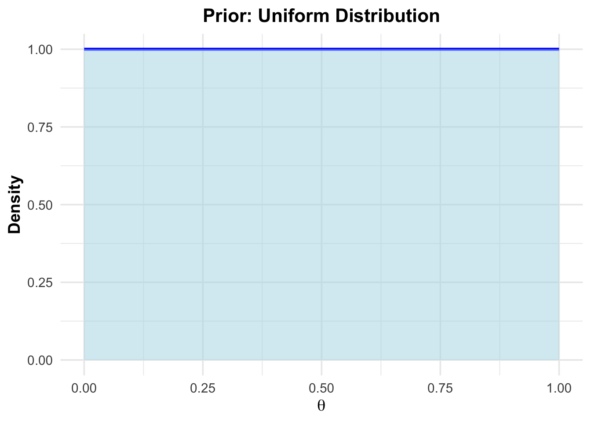

``` r
# p-value manually:
pt(-2.1867, df) * 2
```

```
## [1] 0.04633225
```

The plot shows the $t$-distribution. Marked in red are the areas where the test statistic 
takes the value we observed or "more extreme" values. With "more extreme" we mean values that are
further away from 0 in both directions since we conducted a two-sided test. The area under the curve
is the $p$-value. As you can see, the $p$-value is the sum of the two red areas and matches the output 
of the $t$-test function in R.


## Correlation test

In the chapter about descriptive statistics, we calculated the (Pearson) correlation coefficient 
to measure the strength of the **linear** relationship between two variables.

Often, the null hypothesis for the correlation coefficient is that there is no correlation between 
the two variables ($\rho=0$). One could argue that this is a rather baseless assumption. In reality,
the true correlation coefficient is probably not exactly 0 and one could argue more precicely a range
of plausible values for $\rho$ for the specific case at hand. Often, one can see an ocean of $p$-values
in the literature, where the correlation coefficient is tested against 0. This is often superfluous.
For example, if the sample size is $n=234$ and the sample correlation coefficient is $r = 0.76$, it 
is very unlikely that the true correlation coefficient is 0. One does not need a hypothesis test to 
know this (see [exercise 6](#exercise6_nhst)).

We can do a correlation test in R with the `cor.test` function. 
[This article](https://www.sthda.com/english/wiki/correlation-test-between-two-variables-in-r) is also helpful.
Maybe, let's take the part about the Shapiro-Wilk test not too seriously.

The test statistic(s) for the test(s) can be found [here](https://en.wikipedia.org/wiki/Pearson_correlation_coefficient#Inference).
If we really want to take the result of such a test seriously, we need to check the assumptions of the test.

## Type 1 and Type 2 errors
.......

## Simulations based approaches

Through the power of modern computers, we can simulate all kinds of hypothesis tests. 
We just assume that the null hypothesis is true and draw samples from the very distribution.
In the old times, computational ressources were scarce and one had to rely on 
[tables](https://digital.library.adelaide.edu.au/server/api/core/bitstreams/21f22d02-4a39-4650-8f09-71434ad02897/content)
that were precalculated. 

[This](https://github.com/jdegenfellner/ZHAW_Teaching/blob/main/Variability_of_Correlation_under_H_0.R)
shows you how the correlation coefficient behaves under the null hypothesis (that there is no correlation; $\rho = 0$).
This is a very useful tool to understand the behavior of a test statistic under the null hypothesis.
Of course, the probability that a correlation coefficient is exactly 0 is 0 since it's a continuous variable,
but in practice we are interested in "indistinguishable from 0" which is a small value. 
In the Bayesian framework from Kruschke, we defined a region of practical equivalence (ROPE) for this purpose.

We ask ourselves: What does my test statistic do *if* the null hypothesis is true?
Then try to simulate it. This helps to understand what constitutes a qualitatively different result 
(from the null hypothesis) considering variability in the data.

## Exercises

### Exercise 1 - frequentist confidence interval {#exercise1_nhst}

- Create 1000 random samples from a binomial distribution with $n = 100$ and $p = 0.38$.
- Calculate the 96% confidence interval for each sample using R.
- How often was the true parameter ($p = 0.38$) contained in the constructed interval?

### Exercise 2 - everything becomes "significant" {#exercise2_nhst}

Setting: two sample t-test. Assume there is a small difference between the means of two groups.
- Show via simulation that with increasing sample size, the $p$-value becomes smaller and 
smaller and will be "significant" at some point irresespective of how small the true mean 
difference is and how small the $\alpha-$ level is.

### Exercise 3 - binomial test {#exercise3_nhst}

- Create a sample from a binomial distribution with $n = 54$ and $p = 0.68$.
- Perform a two-sided binomial test with $H_0: p = 0.5$.
- Calculate the 90% confidence interval for the sample proportion.
- Calculate the p-value for the two-sided test by "hand" (using dbinom/pbinom in R).

### Exercise 4 - proportions test {#exercise4_nhst}

- Create a sample from a binomial distribution with $n = 100$ and $p = 0.5$.
- Perform a proportions test with $H_0: p = 0.5$ and interpret the results.
- Perform the proportions test with the whole range of possible proportions
  $H_0: p = 0.01 \cdots p = 0.99$ in steps of $0.01$. 
  And plot the p-values on the y-axis and 
  the assumed proportion on the x-axis. 
  This is called a [p-value function](https://www.tandfonline.com/doi/full/10.1080/00031305.2018.1556735#:~:text=The%20p%2Dvalue%20function%20provides,for%20the%20parameter%20of%20interest.).

### Exercise 5 - proportions test 2 {#exercise5_nhst}
- Use the data from the smokers proportions test [example above](#proportions_test_more_samples).
- Draw a $\chi^2$ distribution with 3 degrees of freedom and calculate the 
  probability of observing a value of 12.6 or larger.

### Exercise 6 - correlation coefficent {#exercise6_nhst}
- Create a sample of $234$ pairs of uncorrelated observations $(x_i,y_i)$. 
  $X_i$ and $Y_i$ are drawn from a normal distribution with mean 0 and standard deviation 1.
- Calculate the sample correlation coefficient $r$.
- Repeat this 1000 times.
- How often was the sample correlation coefficient larger than 0.76?

<!--chapter:end:05-NHST.Rmd-->


# References {-}


<!--chapter:end:07-references.Rmd-->

